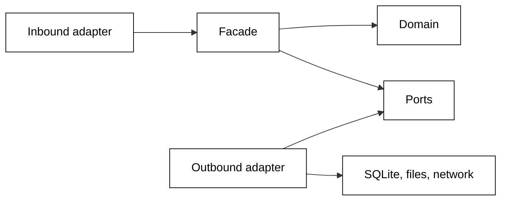

# Hexagonal Architecture in Beaver Nest

This page explains why Beaver Nest's application code is organized by bounded context and by hexagonal layer, and how the
pieces relate. The rule itself lives in the
[Hexagonal Architecture standard](../../repo-governance/development/quality/code/hexagonal-architecture.md); this page
never restates it.

## The Problem It Solves

Bnest is a small household service with a long life. One owner and several coding agents maintain it, and most
changes are reviewed against written standards rather than by someone holding the whole system in mind. In that
setting, a placement rule that only review enforces erodes quietly:

- a LiveView starts running SQL "just this once";
- a context reaches into another context's table because it is faster than adding a function;
- a test labelled "unit" starts writing real database files because the code under test opened one.

Each step is locally reasonable. Together they make every change riskier, because nobody can say from the structure
alone what a change could break.

## Two Questions, One Answer

Domain-Driven Design answers _which part of the system_ a piece of code belongs to: its **bounded context**, the
area with its own language, such as Family Chat, Identity or Scheduler. Hexagonal Architecture answers _which layer
inside that part_:

- the **domain**, which decides;
- the **ports**, which state what the context needs from the outside world;
- the **adapters**, which alone talk to SQLite, files, the network or other processes;
- the **facade**, which coordinates one use case at a time.

Asked together, the two questions place any piece of code. The rest of the design follows from one rule: source
dependencies point inward, toward the domain.

## Why Enforce It With the Compiler

A rule that fails a gate costs nothing to keep, and a rule that waits for a reviewer costs attention every time. Bnest
uses the [`boundary`](https://boundary.hexdocs.pm/Boundary.html) compiler, so a forbidden reference is a compiler
warning. The `typecheck` target already treats warnings as errors.

`boundary` sees calls between modules but not calls into Elixir's standard library. A small layering test therefore
covers the rest: it refuses `File`, `System` or `Port` outside an adapter, and a clock or a process inside the domain.

## Why In-Memory Adapters and Contract Suites

Once every effect sits behind a port, a use case can be tested with an in-memory adapter in place of the database. That
makes the unit layer fast and genuinely isolated. A fake that drifts from the real thing is worse than no fake, so each
stateful port has one contract suite that runs against both: the in-memory adapter at unit level, and the SQLite
adapter at integration level. The two cannot quietly disagree.

## Where to Look

- The canonical rule: the
  [Hexagonal Architecture standard](../../repo-governance/development/quality/code/hexagonal-architecture.md) and its
  modules.
- Bnest's contexts and how they depend on each other: the component view in the
  [backend architecture specification](../../specs/apps/bnest/app-be/architecture.md).
- How a stack applies it: the [Elixir](../../repo-governance/development/quality/stacks/elixir-standards.md) and
  [Phoenix LiveView](../../repo-governance/development/quality/stacks/phoenix-liveview-standards.md) standards.
