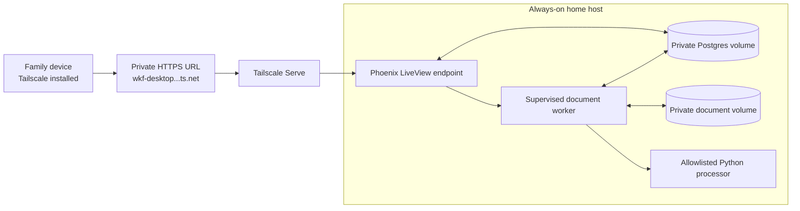
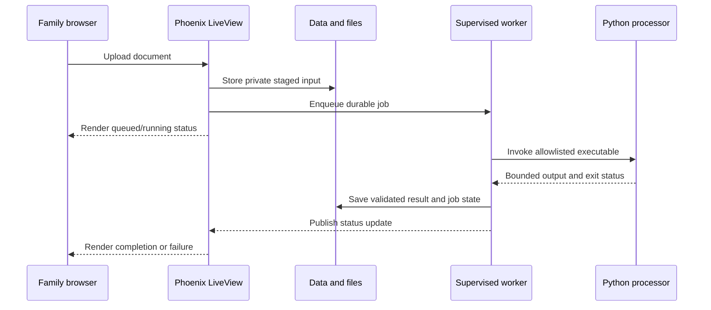

# Architecture

## System overview

## Responsibilities

| Component | Responsibility |
| --- | --- |
| Phoenix LiveView | HTML UI, real-time browser state, roles, application actions, and job status |
| Elixir/OTP supervisor | Starts and restarts recoverable application workers |
| Document worker | Claims jobs, invokes approved processor programs, validates output, and records result |
| Python processor | Performs a bounded document conversion, extraction, or analysis task |
| Postgres | Private relational data, users, permissions, document metadata, and job state |
| Private document volume | Original uploads, staging, and accepted processor output |
| Tailscale Serve | Private HTTPS endpoint and requester identity forwarding |

## Document-processing flow

## Security boundaries

- Phoenix listens only on localhost; Tailscale Serve is the only external route.
- Tailscale establishes network identity; Phoenix maps it to application roles and record-level permissions.
- The document worker accepts a fixed job schema, not a command from the browser.
- External programs use absolute executable paths and argument lists, never a shell command.
- Processors run with least privilege: restricted filesystem access, resource limits, no outbound network, and a dedicated staging/output area.
- Data volumes are outside the Git and Dropbox workspace.
