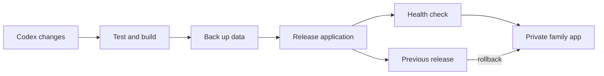

# Operations Plan

## Development-in-production model

The product has one always-available private service. Development should be rapid, but active family data is never used as an unprotected test fixture.



## Live updates and restarts

- Phoenix development reload is appropriate for an explicitly enabled development mode; it may reload browser pages when source changes.
- LiveView normally pushes application state and document progress to connected browsers without a full page refresh.
- The administrator UI may request a fixed, audited operation such as `restart_document_worker`.
- Restarting an application worker must not expose Docker, a shell, an unrestricted process launcher, or arbitrary command input.
- Database migrations are explicit release operations, never automatic side effects of a source-file save.

## Data protection

- Back up Postgres and private documents before every migration or release.
- Retain at least one known-good application release for rollback.
- Keep data volumes separate from source checkout and build artifacts.
- Record releases, restarts, and privileged operations in an audit log.

## Operational commands to define during implementation

```text
just dev
just test
just e2e
just document-test
just release
just rollback
just backup
just status
```
