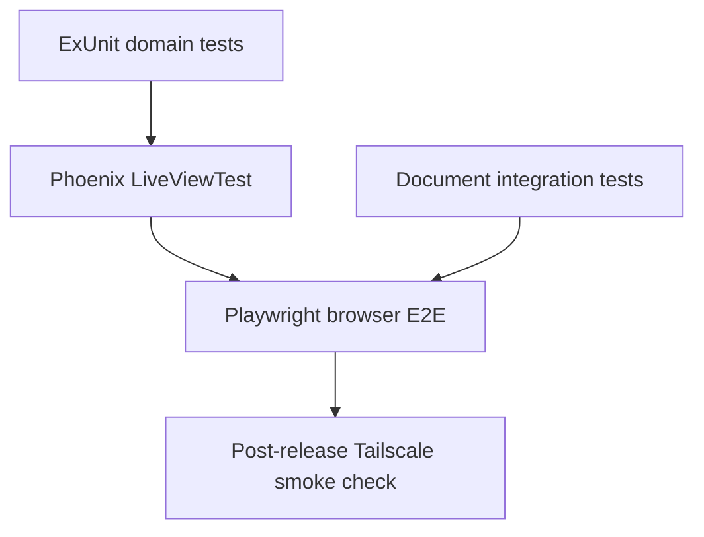

# Testing Strategy

## Principle

Use fast tests for most behavior and real-browser tests only where a browser is necessary. E2E coverage complements Phoenix LiveView tests; it does not replace them.

## Test layers

| Layer | Tool | Covers |
| --- | --- | --- |
| Domain | ExUnit | Authorisation, validation, job transitions, command arguments, and migrations |
| Live UI | `Phoenix.LiveViewTest` | Forms, events, navigation, roles, upload progress, and failure states |
| Document integration | ExUnit + real processor fixtures | Valid, corrupt, oversized, timed-out, and failed document-processing jobs |
| Browser E2E | Playwright | Real browser rendering, LiveView WebSocket behavior, reconnects, and critical user journeys |
| Release smoke | Playwright or HTTP health check | Read-only verification of the private production URL |

## Required Playwright journeys

- An authorised family user opens the application and establishes a live connection.
- A user uploads a supported document and sees processing progress and completion.
- A user cannot read or modify another user's private data.
- An administrator requests a document-worker restart and sees it become healthy again.
- A browser reconnects after an intentional worker or endpoint interruption.

## Test environments

- Unit, LiveView, document-integration, and browser tests use isolated databases and private fixture files.
- CI never points mutations at family production data.
- Production receives a read-only health/smoke check after a release.
