# Technical Design — Backup Integrity

This document answers how the plan is built. It does not re-argue whether to do it; [`brd.md`](brd.md) does that.

## Shape Choice

A single file, chosen by who reads it and what each reader must keep side by side, not by length: the file is long, and
length is only a review signal. Two readers have different jobs here.

- **The executor** reads front to back, in the order the plan is built: Facts, Hypotheses, Branch Selection, Design, UI
  Design, Specification Changes, the release clauses and File Impact.
- **The owner** is a distinct reader who does not read in that order and is asked for three confirmations. The owner
  review points are:
  1. the Phase 6 confirmation of the cause verdict V1 against [Branch Selection](#branch-selection) and the hypotheses
     table it rests on;
  2. the Phase 8 design review of the [UI Design](#ui-design): the comparison in
     [Selected Alternative, Comparison and Assets](#selected-alternative-comparison-and-assets) (D7), the
     [States and Real Copy](#states-and-real-copy) and the twelve embedded assets;
  3. the confirmation of the agent proposals (the plan proposes that authorizing execution confirms them): the decision
     tables in the [Decision Record](#decision-record-pre-write-gate) (G1 to G12, P1 to P6, D2 to D11) and the list in
     [Pending Owner Confirmation](#pending-owner-confirmation), kept apart from the owner-made records in
     [Owner Decisions of 2026-10-03](#owner-decisions-of-2026-10-03) and
     [Confirmed by the Owner](#confirmed-by-the-owner).

A directory would give those review points companions of their own, for example a UI design companion and a decisions
companion. The plan keeps one file because none of the three can be judged without the executor-facing sections it
governs. The UI Design embeds the assets beside the comparison that selects among them, and it cites decisions D4, D7,
D8 and D9 from Data and Behaviour, the comparison and Route and viewports, while the owner confirms the same decisions
in the tables. Branch Selection is the table V1 is confirmed against. Pending Owner Confirmation names, for every item,
where in this file it lives. Splitting would put each decision in a different file from the design or the branch it
governs and send the owner between them. Each review point has its own heading and anchor, and the plan
[`README.md`](README.md) links the UI design and the Pending Owner Confirmation list directly, so the owner reaches each
without reading the rest.

## Facts the Design Rests On

Each is read from this repository at `origin/main` (`cc2861669`), not assumed.

| Fact                                                                                                                                                                                                                                                                                                                                                                                                                                                                                                                                                                                                                                                                                                                                                                           | Source                                                                                                                                                                                                                                                 |
| ------------------------------------------------------------------------------------------------------------------------------------------------------------------------------------------------------------------------------------------------------------------------------------------------------------------------------------------------------------------------------------------------------------------------------------------------------------------------------------------------------------------------------------------------------------------------------------------------------------------------------------------------------------------------------------------------------------------------------------------------------------------------------ | ------------------------------------------------------------------------------------------------------------------------------------------------------------------------------------------------------------------------------------------------------ |
| `ScheduledBackupTask.execute/2` runs the backup, writes the receipt, calls `Scheduler.complete_run/4`, and only then `Backup.retain_owned/1`. A run is therefore `verified` only after its artifact was promoted and receipted.                                                                                                                                                                                                                                                                                                                                                                                                                                                                                                                                                | `apps/bnest-app/lib/bnest_app/backup/adapters/scheduled_backup_task.ex`                                                                                                                                                                                |
| `complete_run` stores `artifact_basename`, `artifact_sha256`, `artifact_bytes` and `finished_at` on the `bnest_schedule_runs` row. Nothing reads them again.                                                                                                                                                                                                                                                                                                                                                                                                                                                                                                                                                                                                                   | `apps/bnest-app/lib/bnest_app/scheduler/adapters/sqlite_schedule_store.ex`                                                                                                                                                                             |
| `Retention.retained_run_ids/1` groups owned receipts by the WIB date of `createdAt`, keeps the first (newest) receipt per date, and takes the seven latest dates. `retain_owned/1` deletes every owned pair not kept.                                                                                                                                                                                                                                                                                                                                                                                                                                                                                                                                                          | `apps/bnest-app/lib/bnest_app/backup/domain/retention.ex`, `backup.ex`                                                                                                                                                                                 |
| "Owned" means a valid receipt for the marker's destination ID, a regular artifact beside it, and a matching digest. Unreceipted files and other destinations are never candidates.                                                                                                                                                                                                                                                                                                                                                                                                                                                                                                                                                                                             | `Backup.owned_receipts/1`, `Receipt.valid?/2`                                                                                                                                                                                                          |
| Before 2026-10-02 a test could resolve the real `~/.config/bnest/backup.json` and so the production backup directory; guards landed in `c6f654ec8` (07:18 +0700) and `ca0e437e9` (09:12 +0700) on 2026-10-02.                                                                                                                                                                                                                                                                                                                                                                                                                                                                                                                                                                  | `/usr/bin/git log`, `apps/bnest-app/config/test.exs`                                                                                                                                                                                                   |
| The archived hexagonal plan's learnings record that read-only inspection found verified test artifacts with `bdd-` schedule keys and test-sized `.partial` files dating from 2026-09-18 in the production directory.                                                                                                                                                                                                                                                                                                                                                                                                                                                                                                                                                           | `plans/done/2026-10-03__ddd-hexagonal-adoption/learnings.md`, entry U11                                                                                                                                                                                |
| `Backup.restore/1` restores an artifact into a fresh function-owned marked root and returns redacted evidence. No Mix task or guide exposes it.                                                                                                                                                                                                                                                                                                                                                                                                                                                                                                                                                                                                                                | `backup.ex`, `apps/bnest-app/lib/mix/tasks/`                                                                                                                                                                                                           |
| `bnest_schedule_runs` has no destination column: a run row carries the slot, state, attempt, artifact basename, digest, bytes and times only. Only a receipt on disk names a destination.                                                                                                                                                                                                                                                                                                                                                                                                                                                                                                                                                                                      | `apps/bnest-app/priv/sqlite_repo/migrations/20260830000000_add_persistent_schedules.exs`, `sqlite_schedule_store.ex`                                                                                                                                   |
| A slot is claimed by `INSERT OR IGNORE` into `bnest_schedule_runs` under the primary key `(schedule_key, claim_key)` with `claim_key = "slot:" <> iso8601(slot)`, inside an immediate transaction that also advances `next_run_at`; an integration test and the driver behind a specification scenario assert that two coordinators claim one slot once, both in-process: two `Task.async_stream` workers in one VM, not two operating-system processes. The cross-process evidence is Phase 12's live ledger-row proof.                                                                                                                                                                                                                                                       | `sqlite_schedule_store.ex` (`claim_due/2`, `claim_schedule/2`), `policy.ex` (`claim/2`), `test/integration/bnest_app/scheduler/scheduler_test.exs`, `scheduled_backups.feature`, `test/integration/support/home_page_driver.ex` (`:reconcile_overlap`) |
| `FileConfigStore.pointer_path/0` returns `BNEST_STORAGE_CONFIG` before the application setting and the `~/.config/bnest/storage.json` default; `read/0` accepts a pointer only when it holds `schemaVersion` `1`, string `databaseDirectory` and `databaseFilename`, `phase` `flat_primary` or `sqlite_primary`, and string `migrationId`. `Storage.ensure_started!/0` starts `BnestApp.SqliteRepo` on `resolved_database_path/0`. The `bnest.storage.*` Mix tasks run `app.config` and start only `ecto_sql` and `exqlite`. The Scheduler process is started only by `BnestApp.Application` (`repository_children/0`), and `scheduler_automatic?` is set only in `config/test.exs`.                                                                                           | `apps/bnest-app/lib/bnest_app/storage/adapters/file_config_store.ex`, `sqlite_coordinator.ex`, `apps/bnest-app/lib/bnest_app/application.ex`, `apps/bnest-app/lib/mix/tasks/bnest.storage.*.ex`, `apps/bnest-app/config/test.exs`                      |
| `BnestAppWeb.AdminScheduleSettingsLive` serves `/admin/settings/schedules` inside the admin-only `:storage_admin` live session. It renders the schedule inventory (with a `Last result` of `Verified` read from the ledger), the daily-schedule form and the backup-folder form, and its `refresh/1` rescues and falls back so the page still renders when the store is not ready. It has no integrity state. Its styles reuse `schedule-row` and `settings-form-card` in `assets/css/app.css` (ink `#153f42`, paper `#fff9ed`, shadow `#80c5b8`, status borders `#e5633d` and `#029e73`, breakpoints at 52rem and 38rem). The browser harness `bnest-app-fe-e2e` drives three projects: `chromium` (desktop), `tablet-chromium` (768 × 1024) and `mobile-chromium` (Pixel 5). | `apps/bnest-app/lib/bnest_app_web/live/admin_schedule_settings_live.ex`, `apps/bnest-app/lib/bnest_app_web/router.ex`, `apps/bnest-app/assets/css/app.css`, `apps/bnest-app-fe-e2e/playwright.config.mts`                                              |

## Hypotheses and Discriminating Checks

The investigation does not presume a cause. The checks are read-only and each names what would eliminate its
hypothesis. Evidence is recorded as dates, counts and yes/no observations only (public-repository data safety: no
paths with identifiers, digests, destination IDs or run IDs).

**Analysis, not a finding.** Retention alone cannot easily explain the pattern. The runs of 25 to 29 September survive
while the two newer runs are gone, and the 2026-10-02 run survives. A seven-date window removes the _oldest_ dates, not
a contiguous middle block. Retention removes a newer run only if another owned receipt is newer within the same WIB date
(supersession), or its window was filled by receipts with later dates. That makes H1 and H3 interact: a test run that
wrote an owned pair into the production directory on the same WIB date would supersede the production pair, and its own
cleanup would then delete the test pair, leaving neither. The git history is consistent with that timing but does not
prove it: the two lost nights ran on WIB 1 and 2 October, the days of the hexagonal refactor, before the 2026-10-02
guards. This is a candidate mechanism to test, labelled **H3a**, not a conclusion.

A second pattern constrains the timing. Artifact names carry the run's UTC time, so the surviving pairs named 20260925
to 20260929 belong to WIB dates 26 September to 30 September, and the pair named 20261002 to WIB 3 October. With the
two lost nights (WIB 1 and 2 October) counted as retained dates, the 26 September pair would already be outside the
seven latest dates and would have been pruned by the 2026-10-02 run. It was not. That fits the lost pairs already being
absent when that run's retention ran, and does not fit them being pruned by it. The investigation must confirm this
against the ledger's WIB dates rather than rely on this reading of file names.

| ID  | Hypothesis                                                            | Predicts if true                                                                                                                                                                                                                                                           | Read-only check                                                                                                                                                                                                                                                                                                                                                                                                                                                             | Eliminated when                                                                                                                                                                                    |
| --- | --------------------------------------------------------------------- | -------------------------------------------------------------------------------------------------------------------------------------------------------------------------------------------------------------------------------------------------------------------------- | --------------------------------------------------------------------------------------------------------------------------------------------------------------------------------------------------------------------------------------------------------------------------------------------------------------------------------------------------------------------------------------------------------------------------------------------------------------------------- | -------------------------------------------------------------------------------------------------------------------------------------------------------------------------------------------------- |
| H1  | Production retention pruned them without any foreign writer           | The ledger shows only production-style runs on the lost WIB dates; no same-date newer owned receipt; the replay in scratch loses the lost nights                                                                                                                           | Reconstruct the receipt history from ledger rows (`finished_at`, WIB date) in scratch and replay the real `Retention` function; compare to disk                                                                                                                                                                                                                                                                                                                             | The replay keeps both nights under every reconstruction the ledger permits                                                                                                                         |
| H2  | Dropbox deleted, moved or conflicted them                             | The Dropbox event history shows a delete by a sync client at a time unrelated to any Bnest retention; or a conflicted copy or older version exists. **Not readable (OD-2, 2026-10-03): the owner has no Dropbox web access, so only the local signals below can show it.** | Local only: extended attributes and local Dropbox metadata of the folder and surviving files, and any conflicted-copy or placeholder files. The deleted-files list, the event history and the list of devices linked to the folder are unavailable                                                                                                                                                                                                                          | **Cannot be eliminated without the event history.** A local signal can confirm H2; the absence of one leaves H2 `unproven`, not eliminated                                                         |
| H3  | Another writer, or test pollution, removed them (including H3a above) | `bdd-` or otherwise non-production receipts exist for the lost WIB dates in the history; birth times of the twelve fixtures cluster on test days; the lost nights coincide with pre-guard test activity                                                                    | Birth and modification times of the surviving fixtures; git history of the guards; ledger rows with non-production `schedule_key`; the service logs and test-run logs for those days; search of the repository for writers of `bnest-prod-` names                                                                                                                                                                                                                           | No non-production receipt can have existed on those dates, and the timing predates no test activity                                                                                                |
| H4  | The artifacts were written somewhere else (a different destination)   | Surviving receipts carry a destination identity different from the current marker's; the logs show an override saved and later reverted; a copy of either basename exists on the host                                                                                      | Search the host, including Trash and the Dropbox cache, for the two basenames; read the saved override history in the service logs; compare the destination identity of each surviving receipt with the present marker's (print equality only). The host search is read R3 and the identity comparison is read R2 (see [Pending Owner Confirmation](#pending-owner-confirmation)). The ledger has no destination column, so it cannot attribute a lost run to a destination | A copy search and the logs find no copy and no override across the two slots. Surviving receipts matching the marker do not eliminate H4 for the lost runs, which only the search and logs can see |
| H5  | Something else, including a ledger row that is not what it seems      | Ledger bytes and names look unlike neighbouring real runs (for example identical sizes to the byte, repeated names, or `finished_at` outside the slot)                                                                                                                     | Compare each lost row to its neighbours: slot versus `finished_at`, attempt count, byte size progression, name timestamp versus slot                                                                                                                                                                                                                                                                                                                                        | The rows are indistinguishable from intact neighbours in every compared field                                                                                                                      |

### Branch Selection

Phase 3 records one verdict, the AI's entry V1, and the table selects which later phases run. Phases 4 and 5 start on V1
as recorded; the owner's confirmation of V1 is required before Phase 6 and before the Phase 12 release, not before
Phases 4 and 5 (agent proposal D11, pending owner confirmation), and a changed verdict reopens only the conditional
items it touches. The detector (Phase 5), the drill (Phase 7) and the Schedules-page label (Phases 8 to 10) run in every
branch. Hypotheses H1 to H5 are the five the matrix lists; H3a is a candidate mechanism inside H3.

| Verdict                                   | Cause-specific work (Phase 6)                                                                                                                                                                                                                                                                                                                  | Isolation regression (Phase 6)                                                       |
| ----------------------------------------- | ---------------------------------------------------------------------------------------------------------------------------------------------------------------------------------------------------------------------------------------------------------------------------------------------------------------------------------------------- | ------------------------------------------------------------------------------------ |
| C-TEST (H3, H3a or H1 with a test writer) | Pin the path that let a test reach production; fix any remaining one                                                                                                                                                                                                                                                                           | AC-BI-08 and AC-BI-09 apply                                                          |
| C-RET (H1 with production writers only)   | Correct retention (supersession must not delete the only verified run of a date; see Design)                                                                                                                                                                                                                                                   | AC-BI-08 applies; AC-BI-09 not applicable (test writers eliminated, per G7)          |
| C-DROPBOX (H2)                            | None in the repository; the owner acts on Dropbox settings; record in `learnings.md`. Reachable only when a local H2 signal (a conflicted copy, a placeholder, a Dropbox extended attribute) confirms H2, because the Dropbox event history is unavailable (OD-2). The off-Dropbox idea brief (OD-4) is created in Phase 6 under every verdict | Not applicable unless H3 also holds                                                  |
| C-DEST (H4)                               | Detector compares the destination identity of surviving receipts with the marker's and reports a mismatch (AC-BI-19); it cannot see lost runs; consider refusing a silent destination change                                                                                                                                                   | Not applicable                                                                       |
| C-LEDGER (H5)                             | Reproduce the completion-path defect the verdict names (AC-BI-10) and correct it; the detector is already delivered                                                                                                                                                                                                                            | Not applicable                                                                       |
| C-UNPROVEN (none settled)                 | None; the verdict states which observation would settle it (for H2: the folder's Dropbox event history around the two slots, which is unavailable under OD-2) and the plan completes detector, label and drill only                                                                                                                            | AC-BI-08 and AC-BI-09 apply as defence in depth only if the checks left H3 open (G7) |

A mixed verdict (two causes) runs the union of their phases.

**Likelihood of C-UNPROVEN (OD-2).** H2 cannot be eliminated without the Dropbox event history, which the owner cannot
provide (2026-10-03). If the investigation eliminates H1, H3, H4 and H5 and no local H2 signal appears, the verdict is
`C-UNPROVEN` with H2 open. That is the expected outcome in that case, not a failure of the investigation: the detector,
the page label and the drill are delivered either way, and the idea brief for an off-Dropbox second copy (OD-4) is the
plan's answer to a cause it cannot prove. If a repository-side hypothesis is confirmed, H2 stays open beside it and the
verdict is the union.

## Design

### Reconciliation (detector)

Pure rule plus two thin adapters, following the [hexagonal standard](../../../repo-governance/development/quality/code/hexagonal-architecture.md).

- **Domain.** `BnestApp.Backup.Domain.Reconciliation.classify/3` takes the verified ledger runs (run ID, scheduled
  slot, `finished_at`, artifact basename, digest, bytes), the owned artifacts present, and returns each run as
  `:present`, `:missing`, `:changed` or `:not_expected`. A run is `:not_expected` when retention would legitimately
  have removed it. That judgement reuses `Retention` (expose its WIB-date grouping as one public function rather than
  copying the rule), so the detector and retention share one window and one supersession rule: the expected set is the
  newest verified run of each of the seven latest WIB dates. **Which timestamp defines the date.** Retention takes the
  WIB date from the receipt's `createdAt`; the detector has no receipt for a lost run, so it takes it from the ledger's
  `finished_at`. They agree because `ScheduledBackupTask.execute/2` passes one `now` to both `Backup.record_receipt/4`
  (`createdAt`) and `Scheduler.complete_run/4` (`finished_at`); the slot is not used, since a slot of 16:59Z retried at
  17:01Z falls on a different WIB date. A unit test pins the divergence: a run whose slot and `finished_at` fall on
  different WIB dates is grouped by `finished_at`, the same date `Retention` assigns its receipt.
- **Facade.** `BnestApp.Backup.reconcile/2` reads present artifacts through the existing `ArtifactStore` port
  (`regular?/2`, `digest/2`, `size/2`). It never writes or removes. A digest is computed only for expected runs.
- **Scheduler read.** `BnestApp.Scheduler.verified_runs/1` is one new read on the `ScheduleStore` port with SQLite and
  in-memory adapters, covered by the existing contract suite. It does not alter state.
- **One wording function.** `Reconciliation` also owns the mapping from a result to its words. For every state in
  [States and Real Copy](#states-and-real-copy), including `checking` (a page-only state) and the empty ledger, it
  returns the label (`Backup files`), the summary, one problem line per problem run and an optional footer. The log, the
  telemetry metadata, the Mix task and the Schedules page render these parts, so no surface holds a second copy of the
  wording; the log and the Mix task join them as `Backup files: <summary>`. An empty set of expected runs yields the
  nothing-to-check state and never the all-present state.
- **Inbound adapters.** `mix bnest.backup.reconcile` prints a path-free report and exits `0` only when at least one
  expected run exists and every expected run is present. It exits non-zero when anything is `:missing` or `:changed`,
  when the ledger or destination cannot be read, and when the ledger holds no verified run to check: that empty case
  prints `Backup files: no verified backup to check yet`, prints no date and never says `present`, because an empty set
  of expected runs is vacuously all present and must not read as healthy (decision D10).
  It never starts the Scheduler, so a read against production cannot claim a slot, and it never opens the production
  database: it reads the ledger from a scratch copy (see **Scratch-copy read** below) and starts the repository against
  that copy. After each successful scheduled run, `ScheduledBackupTask` calls the same function inside a
  `rescue`, so a reconciliation failure can never fail the backup, and emits `[:bnest_app, :backup, :integrity]`
  telemetry plus one `Logger.error` line per problem run. Reconciliation therefore runs nightly with no new schedule
  row. A third inbound adapter, the Schedules page label (see [UI Design](#ui-design)), composes the same two reads and
  the same wording function when an administrator opens the page and again after a successful save; it holds no state of
  its own.
- **Limit, stated.** A log line and a telemetry event reach nobody who is not watching them. The owner decided on
  2026-10-03 (OD-3) to add the label on the Schedules & backups page, which reaches the administrator who opens that
  page. It still notifies nobody who does not open it, and no push or email notification is built; the design does not
  claim notification.

- **Scratch-copy read.** Opening the production SQLite file through Ecto may create or touch its `-shm` and `-wal`
  sidecars, which AC-BI-01 forbids. The task therefore copies the database file and its `-wal` (a plain file read)
  into a private scratch directory, repeats the copy, and accepts the pair only when both copies report the same number
  of verified backup runs and the same latest `finished_at` (a database and its WAL are copied non-atomically while the
  service writes); after two disagreeing attempts it exits non-zero with a path-free "ledger unstable" reason. Each copy
  keeps its `-wal` beside it under the copy's own name plus `-wal`, because SQLite finds a database's WAL by appending
  `-wal` to the database file name. The post-run reconciliation inside the live service uses the service's own
  repository and needs no copy. The production backup directory is read with plain file operations only.
- **Redirecting the repository to the copy.** The task reads the production database path first, with
  `Storage.database_path/0`, to know what to copy. It then writes a scratch storage pointer file in the scratch
  directory holding every key `FileConfigStore` requires of a valid pointer (`schemaVersion` `1`, `databaseDirectory`
  naming the scratch directory, `databaseFilename` naming the accepted copy, `phase` `sqlite_primary`, and a
  non-empty `migrationId`) and sets `BNEST_STORAGE_CONFIG` to that file, which `FileConfigStore.pointer_path/0` honours
  before every other setting. It follows the `bnest.storage.*` Mix task pattern: `Mix.Task.run("app.config")`,
  `Application.ensure_all_started(:ecto_sql)` and `(:exqlite)`, then `Storage.ensure_started!/0`, which opens
  `BnestApp.SqliteRepo` on `resolved_database_path/0`, now the copy. It does not run `app.start`: that starts
  `BnestApp.Application`, whose `repository_children/0` starts the Scheduler and the record store against the
  production `runtime_root`, and a Scheduler tick could claim a slot. As a second guard it sets
  `Application.put_env(:bnest_app, :scheduler_automatic?, false)` before starting anything, the key `config/test.exs`
  sets for the test environment, so a Scheduler started by mistake would not tick. An integration assertion that no
  `BnestApp.Scheduler` process is alive after the task returns (AC-BI-17) proves the first mechanism holds. The task
  removes the scratch directory, copies and pointer included, on exit. If the repository cannot be redirected to a copy
  this way, execution stops and reports it to the owner rather than opening the production file.

The output names a run by scheduled date and state only. It carries no path, digest, destination ID or run ID.

### Isolation Regression

The existing guards (`config/test.exs` per-run `backup_config_path` and `backup_repository_root`) are configuration and
are pinned only by a test of the configuration path. Phase 6 adds the missing pins, as the verdict requires:

1. A retention test with a foreign-destination receipt, an unreceipted artifact, a malformed receipt and eight owned
   dates, asserting AC-BI-08 including that a foreign receipt never changes which owned run is kept.
2. A test that the test environment's default destination resolves inside the per-run test root and that resolving the
   checkout's `data/backup` fails closed (AC-BI-09), using an isolated root and synthetic `test-user-` identities only.
3. If C-RET: a supersession test showing that a newer same-date owned receipt from a different `scheduleKey` family
   cannot remove the only production-keyed verified run of that date. The exact rule is chosen at the verdict and
   recorded as a decision then, because it depends on the mechanism the evidence shows.

### Restore Drill

`mix bnest.backup.restore_drill --artifact <basename>` is a thin inbound adapter over `Backup.restore/1`. It refuses any
target that is not a regular file inside the configured destination, never opens the live database, restores into the
root `restore/1` creates, and prints the redacted evidence plus the removal of that root. The task is built and proven
on a synthetic artifact in an isolated root; the owner runs it once on a real artifact. A how-to guide
(`docs/how-to-guides/restoring-a-bnest-backup.md`) states the steps and what "readable" means.

## UI Design

OD-3 (owner, 2026-10-03) added a rendered surface, so
[Plan UI Design](../../../repo-governance/conventions/plan-ui-design.md) applies and the
[exploratory and usability passes](../../../repo-governance/workflows/quality/exploratory-usability-review.md) are
**applicable** (they are no longer recorded as not applicable). Design comes before code. The twelve design assets,
their comparison and the selected alternative are produced in this plan (the owner's F1 resolution, carried out by D6)
and stored in [`assets/`](assets/README.md). Phase 8 reconciles their copy with the Phase 5 wording function and records the owner's
design review, Phase 9 specifies and builds the label, and Phase 10 inspects it at an exact origin. This section fixes
the inputs those phases work from; changing one is a recorded decision, not an implementation choice.

### User, Job and Surface

**User.** The administrator, who is the household operator, on a phone or a laptop.

**Job.** On the page that already says `Last result: Verified`, learn at a glance whether the retained backups are on
disk and, if they are not, which dates to worry about.

**Route and viewports.** `/admin/settings/schedules` only. No route, navigation entry or link changes. Supported
viewport classes are desktop, tablet and mobile, the three the `bnest-app-fe-e2e` projects drive: `chromium` (Desktop
Chrome, 1280 × 720), `tablet-chromium` (768 × 1024) and `mobile-chromium` (the Pixel 5 profile, 393 px wide). The assets
and the manual checks use 1440 × 900, 768 × 1024 and 393 × 851, with the 320 px reflow floor checked inside mobile. The
browser binding sets the viewport from each Examples row of AC-BI-23 (`page.setViewportSize`), so the 320 × 568 and
1440 × 900 rows run at their own width in every project; the project still supplies the browser profile (touch and
user agent), and the manual Phase 10 matrix remains the viewport-class proof (decision D9).

**The page today.** From `admin_schedule_settings_live.ex`: a breadcrumb, the `DAILY OPERATIONS` kicker, the title
`Schedules & backups`, the Family schedules group (drawn empty: `No family schedules are configured.`), the
Admin/system schedules group with two `schedule-row` articles (`Production database backup` and `Family chat push
delivery retention`), each a definition list of Cadence, Next run, State, Expiration and Last result, and then two
`settings-form-card` sections (`Production database backup` and `Backup folder`). The page's stylesheet resets heading
size and weight (Tailwind's preflight), so the headings render at body size; the hi-fi assets draw them that way and this
plan does not restyle them.

### States and Real Copy

The wording below is a draft of the real product copy, pending the Phase 5 function (the draft wording may stand until
then). The final wording is the one function Phase 5 builds for the log, the telemetry metadata, the Mix task and the
label (see **One wording function** under [Design](#reconciliation-detector)); Phase 8 replaces this draft with that
function's exact output and edits only the text of an asset whose copy differs. `N` counts the retained dates that have
an expected verified run (fewer than seven early on). The dates are fictional, like the assets'.

| State                              | When it shows                                                                       | Draft copy                                                                                                                                             |
| ---------------------------------- | ----------------------------------------------------------------------------------- | ------------------------------------------------------------------------------------------------------------------------------------------------------ |
| Checking                           | The disconnected render, while a check runs, and while a re-check after a save runs | `Backup files: checking`                                                                                                                               |
| All present                        | Every expected run is present                                                       | `Backup files: all N retained backups are present`                                                                                                     |
| Needs attention                    | At least one expected run is missing or changed                                     | `Backup files: 2 of N retained backups need attention`, then one line per problem, such as `2030-05-14: file missing` and `2030-05-16: file changed`   |
| Destination mismatch (C-DEST only) | A surviving receipt for a retained date names another destination                   | A problem line such as `2030-05-13: receipt names another destination`, and the footer `Runs lost without a surviving receipt cannot be seen this way` |
| Could not be checked               | Reconciliation raised, the ledger is unreadable or unstable, or the ceiling passed  | `Backup files: could not be checked. Run mix bnest.backup.reconcile on the host.`                                                                      |
| Nothing to check yet               | The ledger holds no verified backup run                                             | `Backup files: no verified backup to check yet`                                                                                                        |

In the selected `row` alternative `Backup files` is the item's term (`dt`) and the rest of each string is its
description (`dd`); the log and the Mix task print them joined with a colon. The nothing-to-check state is a designed
neutral state for the label; the Mix task reports the same words but exits non-zero (decision D10).

The date convention the page shows is a Phase 8 decision: either the ledger's slot date in UTC or the WIB date that
retention groups by. The page states which, and the choice is recorded here. The page shows the date the shared
function returns and never formats a second one. The assets draw the date as the function would return it for a
retained run; if the convention changes the dates' meaning, only their text changes.

### Data and Behaviour

- **Source.** The report is recomputed when the LiveView connects, and again after every successful `save_schedule` and
  `save_backup`, from `Scheduler.verified_runs/1` and `Backup.reconcile/2` over the service's own repository and the
  configured destination. The disconnected (first) render touches neither and shows the checking state. This is
  decision D4 (see [Decisions Recorded With the Expansion of 2026-10-03](#decisions-recorded-with-the-expansion-of-2026-10-03));
  the re-check is decision D8.
- **Re-check after a save.** A successful save returns the label to the checking state and starts a new check through
  the same function that the connected mount uses, superseding any check still in flight so only the newest result is
  shown. A failed save, which renders the existing error message, starts no check. The re-check reports what the
  configured destination holds at that moment; right after a save that changes the destination, retained dates whose
  artifacts live in the previous folder read as missing from the new one until its first verification runs. Whether to
  hold the label at checking until that verification finishes is not decided here (see
  [Pending Owner Confirmation](#pending-owner-confirmation)).
- **Off the render path, time-boxed inside the function.** The check runs in `assign_async/3`, which has no timeout of
  its own, so the five-second ceiling lives inside the async function: it runs the reconciliation in a task it owns and
  monitors, waits for the ceiling with `Task.yield/2`, and on no reply calls `Task.shutdown/2` so the work is
  cancelled rather than left reading files, then returns the could-not-be-checked result. A raise or exit of the task,
  an unreadable ledger or an unreachable destination yields the same result; the rest of the page, including both
  forms, renders regardless. A Dropbox online-only file may be slow to read, which the ceiling turns into a stated
  state rather than a hung page. Reading an online-only file can also make the sync client download (hydrate) it; Bnest
  writes nothing and the file's contents and modification time do not change, but the sync client's local copy may.
  This applies to the label, the post-run reconciliation and the Mix task alike.
- **Read-only, no stored state.** The label writes nothing, adds no table, flat file or cache, and needs no migration.
  It adds no route and no authorization path: the existing admin-only session guards it, and the check starts only after
  that guard passes.
- **One wording.** The label renders the structured result (date and state) of the same function that serves the log, the
  telemetry metadata and the Mix task, so the surfaces cannot disagree.
- **No private value.** Markup, attributes and logs carry no filesystem path, digest, destination identifier or run ID.

The label's states and transitions:

```mermaid
stateDiagram-v2
    accTitle: Integrity label states
    accDescr: The label starts as checking. A finished check moves it to all present, needs attention, nothing to check or could not be checked. A raise, an unreadable ledger or the ceiling also give could not be checked. A successful save returns every result state to checking.
    classDef default fill:#0173B2,stroke:#000000,color:#FFFFFF
    [*] --> Checking
    Checking --> AllPresent: all present
    Checking --> NeedsAttention: missing or changed
    Checking --> NothingToCheck: no verified run
    Checking --> CouldNotCheck: raise or ceiling
    AllPresent --> Checking: successful save
    NeedsAttention --> Checking: successful save
    NothingToCheck --> Checking: successful save
    CouldNotCheck --> Checking: successful save
    state "All present" as AllPresent
    state "Needs attention" as NeedsAttention
    state "Nothing to check yet" as NothingToCheck
    state "Could not be checked" as CouldNotCheck
```

The diagram's text equivalent: the label starts in checking; a finished check leaves it in exactly one of the four
result states; a successful save of the schedule or of the backup folder sends any result state back to checking. The
destination-mismatch presentation (C-DEST only) is a variant of needs attention, not a fifth result.

### Components, Tokens and Expectations

The hi-fi assets use only the app stylesheet's existing tokens, so no new token is introduced and no new contrast needs a Phase 8
measurement. Contrast was measured on 2026-10-04 with the WCAG 2.x relative-luminance formula; Phase 10 re-measures it
in the rendered page.

| Role                    | Token and value              | Measured contrast                               | Used for                                                          |
| ----------------------- | ---------------------------- | ----------------------------------------------- | ----------------------------------------------------------------- |
| Text and marker outline | ink `#153f42`                | 10.99:1 on paper `#fff9ed`                      | the summary, problem lines, term and marker outlines              |
| Surface                 | paper `#fff9ed`              | not applicable                                  | the card and the label surface                                    |
| Attention strip         | status border `#e5633d`      | 3.24:1 on paper (3:1 needed for a non-text cue) | left strip for needs attention, could not be checked and mismatch |
| Present strip           | status border `#029e73`      | 3.26:1 on paper                                 | left strip for all present                                        |
| Neutral strip           | `--bnest-ink-soft` `#205c5d` | 7.28:1 on paper                                 | left strip for checking and nothing to check yet                  |
| Page canvas             | `--bnest-canvas` `#d8f1ec`   | ink on canvas 9.72:1                            | the page behind the cards                                         |
| Card shadow             | `--bnest-lagoon` `#80c5b8`   | 1.89:1 on paper, decorative only                | the card's offset shadow; it carries no meaning                   |

Type and layout reuse the page: body `ui-sans-serif, system-ui, sans-serif` (`--bnest-body`); the term at 0.75rem,
weight 800, uppercase; the summary at 1rem bold; problem lines at 1rem regular with the state words bold; card radius
1rem, border 2px, padding 1.25rem; the status strip 0.4rem wide with 0.8rem padding; an 18 px marker and an 8 px gap;
the existing breakpoints at 52rem and 38rem. The item spans the three columns right of `Last result` above 52rem, takes
the second column from 38rem to 52rem, and stacks below 38rem.

| Component         | Built from                                                                    | Used for                                                             |
| ----------------- | ----------------------------------------------------------------------------- | -------------------------------------------------------------------- |
| Schedule item     | the `schedule-row` term and description pair                                  | the `Backup files` term and its description                          |
| Status strip      | the left-border pattern of `admin-settings-error` and `admin-settings-status` | the description, coloured per state                                  |
| State marker      | inline SVG shapes with `aria-hidden="true"`, ink outline on paper             | a non-colour cue repeated beside the summary                         |
| Problem line list | a plain list with no bullets, one item per `date: state`                      | each missing, changed or mismatched date                             |
| Result region     | the description wrapper carrying `aria-live="polite"`                         | announcing the change from checking to a result without moving focus |

| State                | Marker shape                  | Strip     | Words in the summary                                                |
| -------------------- | ----------------------------- | --------- | ------------------------------------------------------------------- |
| Checking             | dotted circle with three dots | neutral   | `checking`                                                          |
| All present          | circle with a check mark      | present   | `all N retained backups are present`                                |
| Needs attention      | triangle with an exclamation  | attention | `k of N retained backups need attention`                            |
| Could not be checked | square with a question mark   | attention | `could not be checked. Run mix bnest.backup.reconcile on the host.` |
| Nothing to check yet | circle with a dash            | neutral   | `no verified backup to check yet`                                   |
| Destination mismatch | diamond with opposed arrows   | attention | `k of N retained backups need attention` and a footer               |

Expectations, checked against the selected `row` alternative:

- **Keyboard and focus.** The selected design adds no tab stop and no disclosure, so the focus order of the existing
  controls is unchanged. A LiveView patch, including a re-check after a save, never moves focus.
- **Announcement.** The result region is polite; the change from checking to a result is announced without an
  interruption, and `role="alert"` is not used for a page-load state. The term `Backup files` names the region.
- **Colour.** Every state has a marker shape and words as well as a strip colour.
- **Error, empty and loading.** Could not be checked, nothing to check yet and checking are designed states, each with
  its own copy, marker and strip (see the state sheet in each hi-fi asset).
- **Reduced motion.** No state animates; the checking marker is static. If an animation is added later,
  `prefers-reduced-motion: reduce` removes it.
- **Responsive.** No horizontal scroll from 320 px; problem lines wrap and are never truncated; the label has no
  control, so no target-size rule applies to it, and the existing controls keep their 2.75rem minimum.

### Exploration

This plan followed the two fidelity stages of the convention for one representative task: the administrator opens
Schedules & backups and learns that two of seven retained dates need attention, with the same page frame and the same
fictional content in every asset. Stage one drew three distinct lo-fi alternatives on desktop, tablet and mobile (nine
assets); stage two drew hi-fi assets for the selected alternative only (three assets). The assets are accessible SVG
named `ui-<option>-<fidelity>-<device>.svg`, each with a unique `<title>` and `<desc>`.

| Option   | Placement                                                                                    | Desktop                                  | Tablet                             | Mobile                      |
| -------- | -------------------------------------------------------------------------------------------- | ---------------------------------------- | ---------------------------------- | --------------------------- |
| `row`    | A `Backup files` item inside the Production database backup row, after `Last result`         | Spans three columns beside `Last result` | Second column beside `Last result` | Stacked under `Last result` |
| `banner` | A page-level status banner between the title and the schedule groups, shown only when needed | Full content width                       | Full content width                 | Wraps to several lines      |
| `card`   | A `Backup integrity` card between the schedule groups and the forms, listing all seven dates | Three columns of dates                   | Two columns of dates               | One column of dates         |

No other product was studied for this label, so no artifact or interaction discipline is adopted and no visual choice is
rejected on that basis; the page's own components are the reference.

### Selected Alternative, Comparison and Assets

Selected: **`row`** (agent proposal D7, pending the owner's confirmation at the design review in Phase 8). Not selected: `banner` and `card`.

| Criterion           | `row` (selected)                                                                                                                                              | `banner` (not selected)                                                                                                                                                        | `card` (not selected)                                                                                                                 |
| ------------------- | ------------------------------------------------------------------------------------------------------------------------------------------------------------- | ------------------------------------------------------------------------------------------------------------------------------------------------------------------------------ | ------------------------------------------------------------------------------------------------------------------------------------- |
| Usability           | The claim `Last result: Verified` and its check read side by side; every state, including checking and nothing to check, gives positive assurance or a reason | Impossible to miss when it shows, but absent when all is well, so no assurance; checking and nothing-to-check have no natural home; shifts every schedule down when it appears | Room for every date and a clear reading-order stop, but the check sits apart from the `Last result` it checks; longest page on mobile |
| Accessibility       | A native term and description pair in the existing list; no new landmark, tab stop or disclosure; one polite region; wraps at 320 px                          | A status region that appears after load and shifts content while it is read; wraps to many lines on mobile                                                                     | Its own heading helps heading navigation; the dates reflow from three columns to one; one more section to traverse                    |
| Implementation cost | Lowest: one more `div` in the existing definition list and a column-span rule at the existing breakpoints                                                     | Medium: a new conditional component and the logic for when to stay silent                                                                                                      | Medium: new section markup, a column grid and styles                                                                                  |
| Product fit         | Matches AC-BI-21 (the Production database backup section carries the label), the Job and the page's own vocabulary                                            | Changes the top of the page for a fact about one schedule                                                                                                                      | Adds a section for one fact                                                                                                           |

**Rationale.** The administrator's question is "is the backup that says `Verified` really on disk?". `row` puts the
answer next to the claim, shows an answer in every state rather than only when something is wrong, and reuses the page's
definition list, so it has the lowest cost and the smallest surprise. `banner` fails the positive-assurance test and
shifts the page; `card` is sound but separates the check from the claim and lengthens the page for one fact.

**Trade-offs accepted for `row`.** The item shares a card with five other facts. A long problem list grows the row (at
most seven dates, wrapped and never truncated). The page below shifts when the result arrives, because the checking
state is one line and a problem list is several. The item has no heading of its own, so its term names it. The shared
wording function must return the term and the summary as separate parts (see **One wording function**).

#### Option `row`: selected, lo-fi

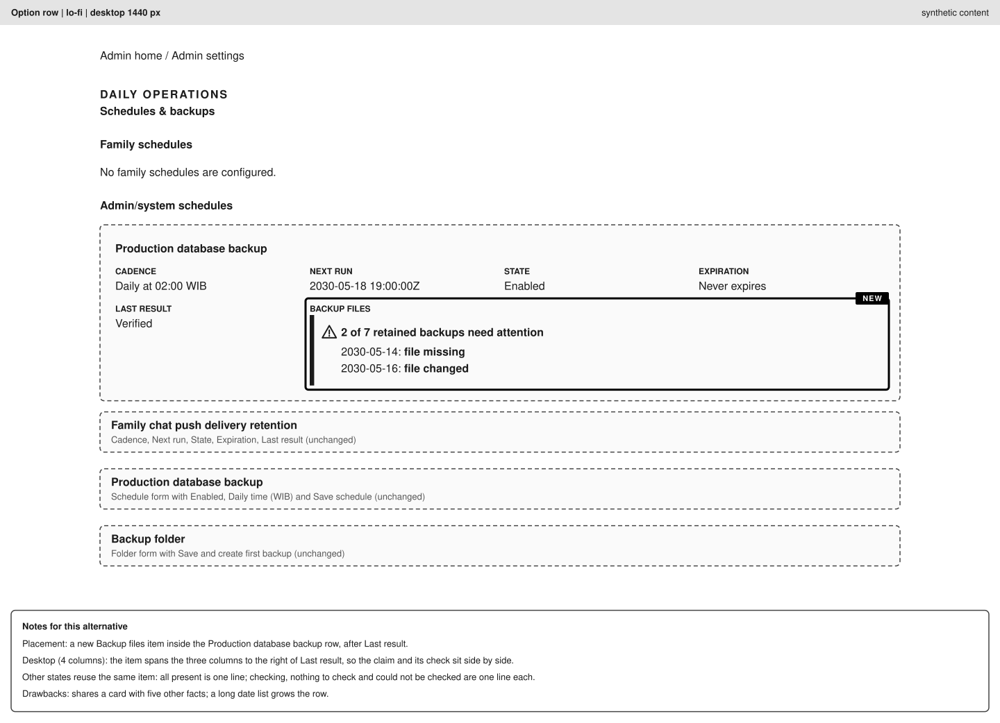

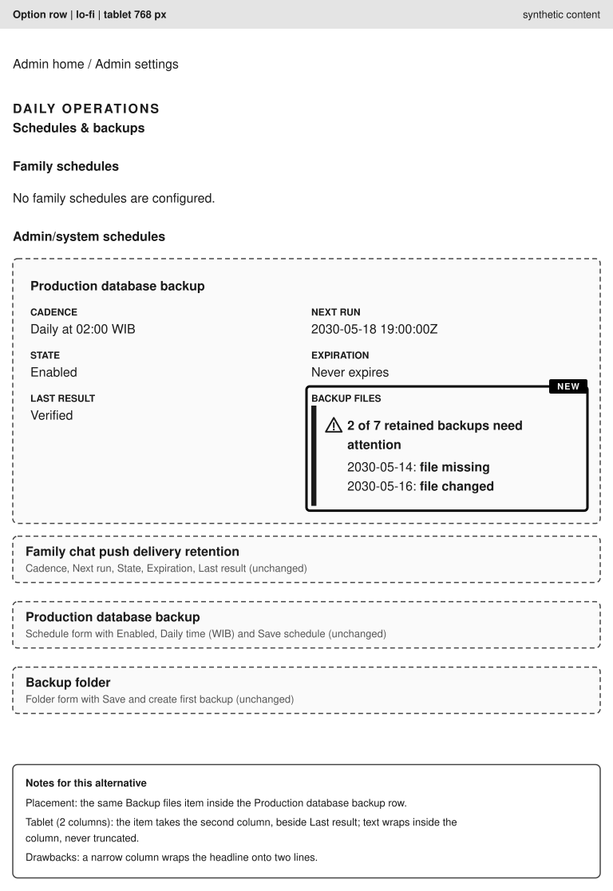

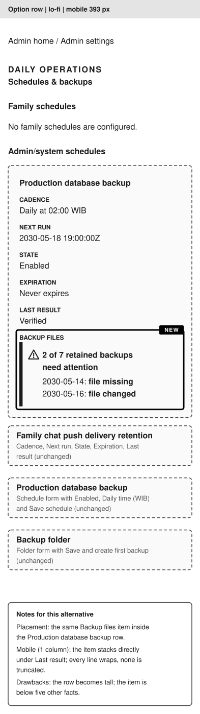

Text alternative: in each width the Production database backup row keeps its five facts, and a sixth item, `Backup files`,
reads `2 of 7 retained backups need attention` with the lines `2030-05-14: file missing` and `2030-05-16: file changed`.
It spans three columns on desktop, takes the second column on tablet and stacks on mobile.

#### Option `banner`: not selected, lo-fi

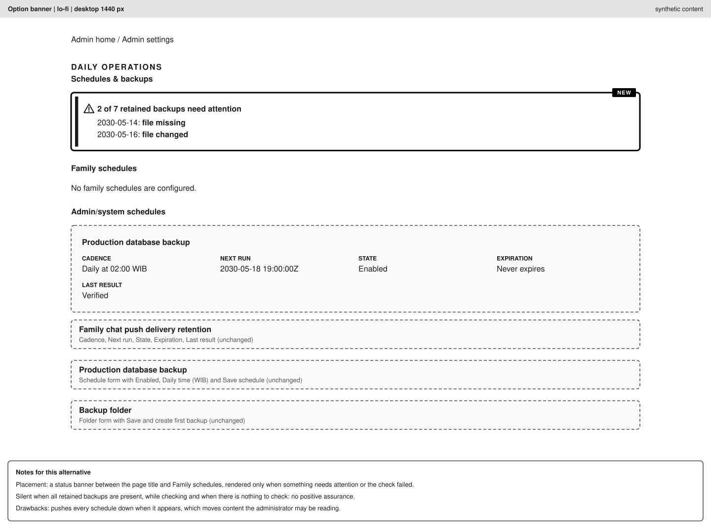

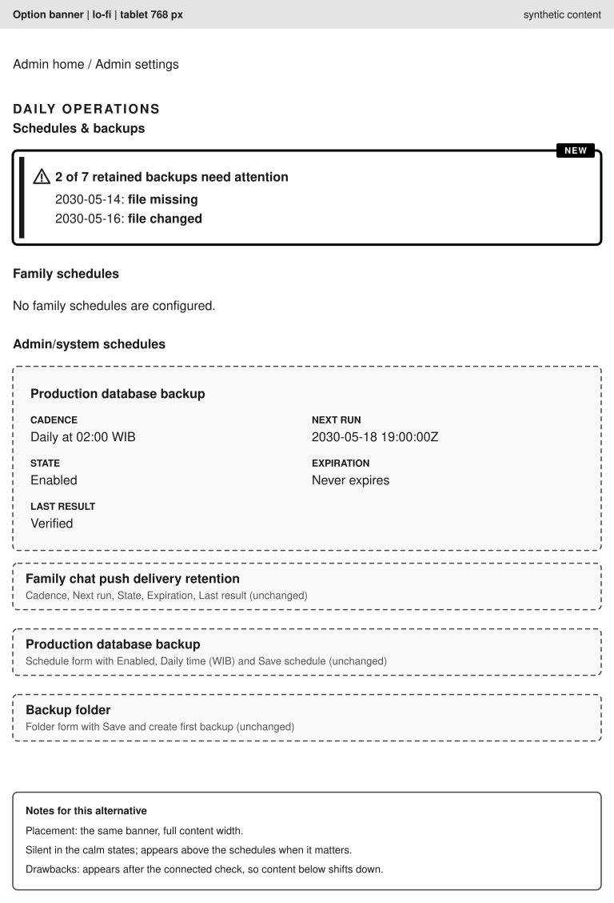

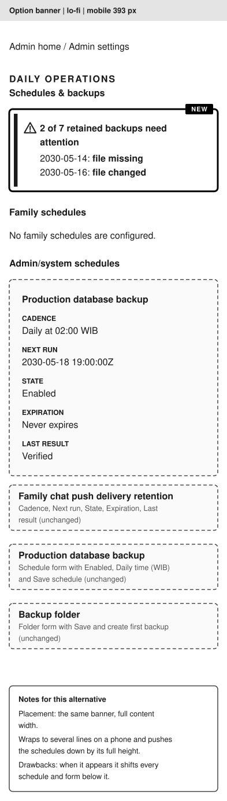

Text alternative: a banner between the title and Family schedules reads `2 of 7 retained backups need attention` with
the same two problem lines. It exists only when something needs attention, so in the calm states nothing shows.

#### Option `card`: not selected, lo-fi

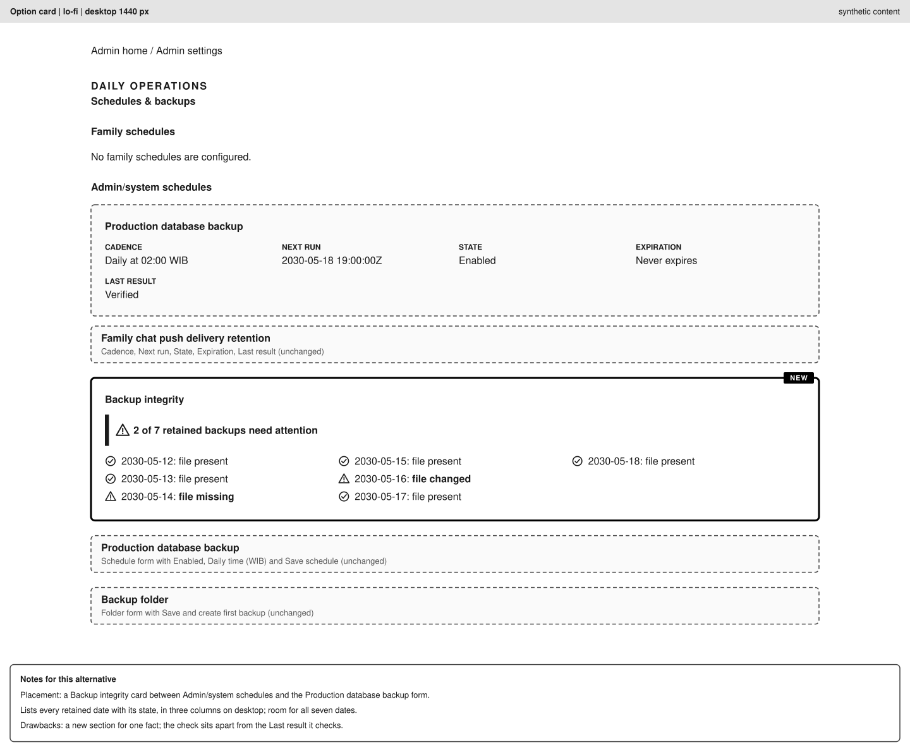

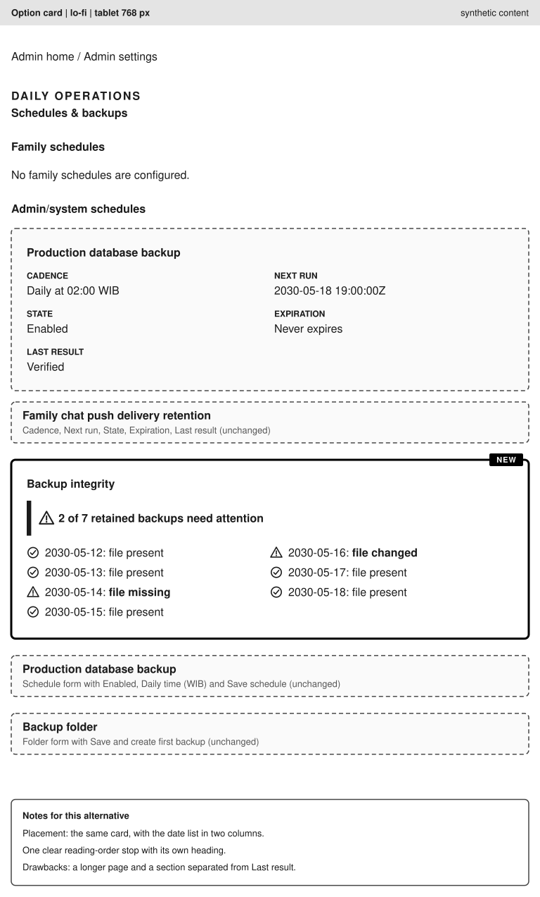

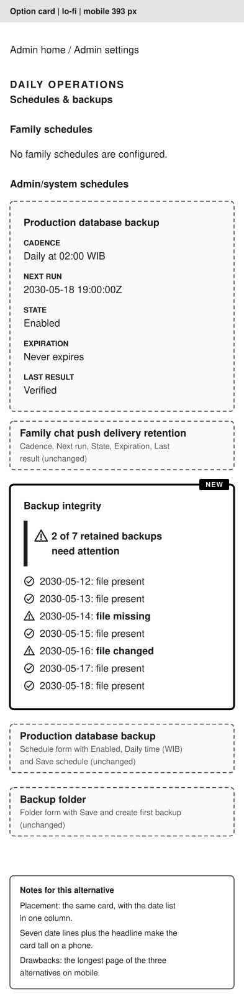

Text alternative: a `Backup integrity` card between Admin/system schedules and the first form reads
`2 of 7 retained backups need attention` and lists all seven retained dates, five as `file present`, `2030-05-14` as
`file missing` and `2030-05-16` as `file changed`, in three, two or one column.

#### Option `row`: selected, hi-fi

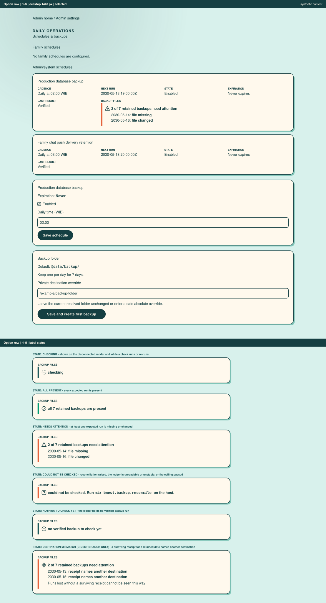

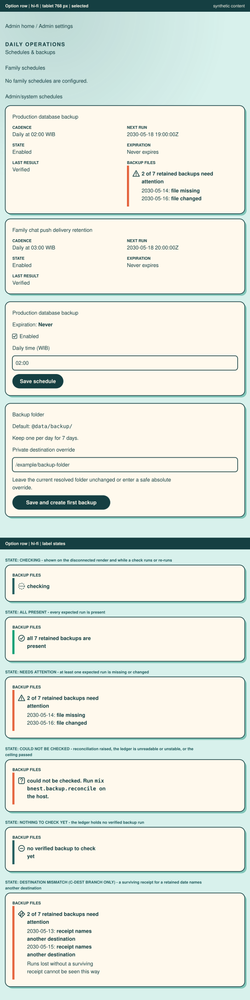

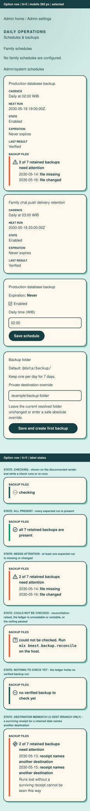

Text alternative: the hi-fi assets draw the whole page in its cream cards, teal ink and mint canvas. The `Backup files`
item carries a left strip, a warning triangle and the words `2 of 7 retained backups need attention` with the two problem
lines. Below the page, a sheet repeats the item at the same width in the checking, all present, needs attention, could
not be checked, nothing to check yet and destination mismatch states, each with its own marker shape and words.

### Review Passes

Applicable. Phase 10 runs the spec-aware exploratory pass first and records it under `## Exploratory findings` in
`learnings.md`, then a spec-blind usability pass delegated to a fresh agent context, recorded under
`## Usability findings`, across all three viewport classes at an isolated exact origin with synthetic `test-user-`
identities. Neither mutates shared or production state. On production, the owner's own look in Phase 13 will likely
show only the all-present state once the two lost nights have aged out of the seven latest dates (with the runs of WIB
2026-10-08 and 2026-10-09). Needs attention, could not be checked, nothing to check yet and checking are therefore
proved only at the isolated origin in Phase 10, never on production, and the Phase 13 record says so.

## Specification Changes

Per [specification maintenance](../../../repo-governance/development/specification-maintenance.md), before code:

| File                                                           | Change                                                                                                                                                                                                                                                                                                                                                                                                                                        |
| -------------------------------------------------------------- | --------------------------------------------------------------------------------------------------------------------------------------------------------------------------------------------------------------------------------------------------------------------------------------------------------------------------------------------------------------------------------------------------------------------------------------------- |
| `specs/apps/bnest/app-be/behaviours/scheduled_backups.feature` | New `Rule`s transcribing AC-BI-03, 04, 05, 06, 07, 11, 15, 16, 17, 18 and, per verdict, AC-BI-08, 09, 10, 19 (AC-BI-01, 02, 12, 13, 14 are process or release proofs with no Rule; AC-BI-21 to 23 are frontend criteria transcribed in the app-fe feature below), plus one Rule pinning the state-to-wording mapping of the task report (the contract is States and Real Copy), each tagged `@e2e-exempt` with the existing exemption wording |
| `specs/apps/bnest/app-be/architecture.md`                      | Component View: reconciliation in Backup, the Scheduler read, the two Mix tasks; Constraints: reconciliation never writes                                                                                                                                                                                                                                                                                                                     |
| `specs/apps/bnest/app-fe/behaviours/scheduled_backups.feature` | New Scenarios transcribing AC-BI-21, AC-BI-22, AC-BI-23 and, on C-DEST, the page scenario of AC-BI-19. The rendered ones are covered by `bnest-app-fe-e2e`; a scenario that needs a forced failure, a controlled slow store, an empty ledger or a filesystem comparison carries `@e2e-exempt` with an `Exemption(e2e)` comment naming its `bnest-app:test:integration` alternative                                                            |
| `specs/apps/bnest/app-fe/architecture.md`                      | Component View: the Schedules page integrity label and its off-render-path check; Constraints: the label is read-only and stores nothing; Behaviour Traceability: the new scenarios. Container View deliberately unchanged                                                                                                                                                                                                                    |
| `specs/apps/bnest/app-fe/behaviours/README.md`                 | Map line only if the file list changes                                                                                                                                                                                                                                                                                                                                                                                                        |
| `specs/apps/bnest/app-be/behaviours/README.md`                 | Map line only if the file list changes                                                                                                                                                                                                                                                                                                                                                                                                        |

Bindings go in `apps/bnest-app/test/behaviour/steps/scheduled_backup_steps.exs`. The frontend scenarios bind there too,
through `home_page_driver.ex` in the unit and integration layers, and in the browser harness through
`apps/bnest-app-fe-e2e/tests/steps/scheduled-backups.steps.ts` and `tests/support/scheduled-backups.ts`, with
`behaviour-coverage.json` following. A changed feature or adapter needs the
[Gherkin implementation review](../../../repo-governance/workflows/quality/gherkin-implementation-review.md).

## Active-Service Release Clauses

Code that runs inside the live Bnest service (the post-run reconciliation, the new Scheduler read) is an
active-service change under [live-service continuity](../../../repo-governance/development/live-service-continuity.md).
Phase 12 carries these clauses; none is optional.

- **Routing.** A candidate backend starts on a separate loopback port from a clean checkout of the release revision.
  The active backend is never stopped, and Tailscale is never repointed. Caddy's upstream is switched with a graceful
  reload per the [Caddy deployment workflow](../../../repo-governance/workflows/maintenance/development-caddy-deployment.md)
  and [Releasing Bnest](../../../docs/how-to-guides/releasing-bnest.md).
- **Responsiveness budget.** At least 12 baseline samples of the exact routed origin, then continuous sampling from
  preflight through drain: zero routed failures, p95 at most 500 ms, every sample at most 2 s. A 2xx alone is not proof.
- **Candidate and revision health.** Local HTTP, routed HTTPS and the candidate's reported revision pass before the
  switch; after it, both the loopback and routed origin report the release revision.
- **LiveView and WebSocket.** A connected client reconnects without a manual refresh; a bounded WebSocket drain keeps
  the previous backend until applicable checks pass.
- **Mixed-version safety.** The change adds a read query and no migration or schema change, and the page label stores
  nothing, so two versions can share the store. Both versions run the scheduler against it, which the slot claim already makes safe (decision G12): the
  claim is an idempotent single-winner insert, so a slot has exactly one ledger row and one runner across candidate
  and active backend. Phase 12 proves it. If a migration appears, the plan stops and re-plans.
- **Label on the live service.** The label runs only when an administrator opens the page or saves one of its forms,
  off the render path under a ceiling, so it adds nothing to the anonymous routed journey the responsiveness budget
  samples. Its rendered proof is Phase 10 at an isolated exact origin and, for production, the owner's own look in
  Phase 13: the executor holds no production administrator session and provisions no synthetic user there. Production
  will likely show only the all-present state at that look (the lost nights age out first), so the other states are
  proved at the isolated origin and are not claimed for production.
- **Drain and cleanup.** After the drain, stop every candidate, watcher and temporary proxy; keep only the active
  route and the explicitly retained rollback capacity.
- **Rollback trigger.** Any failed health check, any routed failure, a p95 above 500 ms or a sample above 2 s routes
  Caddy back to the previous healthy backend, re-proves the journey and budget, records a learning, and only then
  resumes.
- **Revision proof.** Commit and push are not deployment. Completion is reported only after the routed backend is shown
  to serve the intended revision.

## Test-Data and Production Rules

- Every test uses an isolated destination, an isolated repository root and `test-user-` identities. No test reads the
  production backup directory, `~/.config/bnest/*`, or the production database.
- The investigation is not a test. It reads production state read-only, with the owner's recorded approval (OD-1,
  approved 2026-10-03), and records no identifiers. The ledger is read from scratch copies of the database file and its `-wal` sidecar (a plain file
  read, so SQLite never opens the production file or creates or touches its `-shm`), taken twice and accepted only when
  both copies report the same verified-run count, queried `SELECT`-only with `-readonly`, or `immutable=1` when no
  `-wal` was copied. `mix bnest.backup.reconcile` does the same internally. The exact commands are in
  [`delivery.md`](delivery.md#investigation-commands-read-only).
- The label's tests use isolated destinations and ledgers seeded with synthetic runs under `test-user-` identities.
  Phase 10 drives an isolated, non-production origin; no browser session, screenshot or evidence touches the production
  origin or a real account.
- No step writes to the production backup directory or `~/.config/bnest/*` without a separate dated owner approval
  recorded in `delivery.md`. Removing the stale test fixtures from the production directory is such a write and is
  **not** in this plan unless the owner approves it.

## Decision Record (Pre-Write Gate)

This section is the single home of the plan's decision records (the pre-write gate G1 to G12 here, the post-write gate P1
to P6 below); [`learnings.md`](learnings.md) holds none. The gates ran inside the plan maker without an interactive
owner: the repository was inspected first (ledger evidence as supplied, the Backup and Scheduler code, `config/test.exs`,
the git history of the 2026-10-02 test guards, the archived hexagonal plan's U11 and S-1 entries, the plans and
lifecycle conventions), and every material branch was resolved to the recommended option.

**Provenance.** Every row states whether it is owner-made or an agent proposal pending owner confirmation. The decisions
the owner actually made are exactly these: OD-1 to OD-4 (2026-10-03, recorded in
[Owner Decisions of 2026-10-03](#owner-decisions-of-2026-10-03)); the reads R1 to R4 ("Setujui keempatnya", asked and
answered in the 2026-10-03 session, recorded in [Confirmed by the Owner](#confirmed-by-the-owner)); D1, dropping the
ledger destination comparison (2026-10-03); and the resolution of F1 of gate pass 4 by drawing the UI design assets in
the plan now (2026-10-04), which D6 carries out. Everything else is an agent proposal pending owner confirmation: the
gate resolutions G1 to G12 and P1 to P6 (where a G row cites OD-2 or OD-3, only that cited decision is the owner's), D2
to D5, and D6 to D11 apart from the F1 resolution. The plan proposes that authorizing execution confirms the pending
items unless the owner changes one, and that any change reopens the affected phase; the owner has not agreed to that
rule, so it is pending too. "Decision D4" or "decision D9" elsewhere in the plan points at a row here and says nothing
about who made it. [Pending Owner Confirmation](#pending-owner-confirmation) lists every item still awaiting
confirmation.

Resolved before any document was written. Each lists the options, the selected choice and the reason. Open-ended and
discussion alternatives were available at each and none was needed.

| ID  | Question                               | Options (exclusive)                                                                                               | Selected and why                                                                                                                                                                                                                                                                                                                                                                                                                                                                                                                                                                                                                                                                                                                                                                                                                                                                                                                                                                                                                                                                                                                                                                                                                                                                                                                                                                                                                                                                                                                                                                                                                                                                                                                                                                                                                                                                                              |
| --- | -------------------------------------- | ----------------------------------------------------------------------------------------------------------------- | ------------------------------------------------------------------------------------------------------------------------------------------------------------------------------------------------------------------------------------------------------------------------------------------------------------------------------------------------------------------------------------------------------------------------------------------------------------------------------------------------------------------------------------------------------------------------------------------------------------------------------------------------------------------------------------------------------------------------------------------------------------------------------------------------------------------------------------------------------------------------------------------------------------------------------------------------------------------------------------------------------------------------------------------------------------------------------------------------------------------------------------------------------------------------------------------------------------------------------------------------------------------------------------------------------------------------------------------------------------------------------------------------------------------------------------------------------------------------------------------------------------------------------------------------------------------------------------------------------------------------------------------------------------------------------------------------------------------------------------------------------------------------------------------------------------------------------------------------------------------------------------------------------------- |
| G1  | Plan shape                             | (a) bug-fix plan; (b) six-document plan                                                                           | **(b).** A bug-fix plan needs a known mechanism and one delivery unit; here the cause is unproven and three outcomes are independent units. The owner also asked for a plan with an investigation phase.                                                                                                                                                                                                                                                                                                                                                                                                                                                                                                                                                                                                                                                                                                                                                                                                                                                                                                                                                                                                                                                                                                                                                                                                                                                                                                                                                                                                                                                                                                                                                                                                                                                                                                      |
| G2  | Order of work                          | (a) investigate then change; (b) ship the detector first and investigate in parallel                              | **(a), with the detector independent of the verdict.** The detector is cause-independent but its design reuses retention, which the investigation may change; investigating first costs one phase.                                                                                                                                                                                                                                                                                                                                                                                                                                                                                                                                                                                                                                                                                                                                                                                                                                                                                                                                                                                                                                                                                                                                                                                                                                                                                                                                                                                                                                                                                                                                                                                                                                                                                                            |
| G3  | Detection mechanism                    | (a) Mix task only; (b) after every scheduled run plus the Mix task; (c) new scheduled task                        | **(b).** Gives nightly detection with no new schedule row (minimal sufficiency) and an on-demand check. (c) adds production schedule state for no extra signal.                                                                                                                                                                                                                                                                                                                                                                                                                                                                                                                                                                                                                                                                                                                                                                                                                                                                                                                                                                                                                                                                                                                                                                                                                                                                                                                                                                                                                                                                                                                                                                                                                                                                                                                                               |
| G4  | Verify-on-read versus reconciliation   | (a) check on each Schedules page render; (b) reconcile after runs and on demand                                   | **(b).** Verify-on-read hashes artifacts on a request path and needs a UI change; (b) does neither. **Amended 2026-10-03:** OD-3 adds the UI change, and D4 recomputes the report for the page label alone, off the render path; (b) remains the nightly and on-demand path.                                                                                                                                                                                                                                                                                                                                                                                                                                                                                                                                                                                                                                                                                                                                                                                                                                                                                                                                                                                                                                                                                                                                                                                                                                                                                                                                                                                                                                                                                                                                                                                                                                  |
| G5  | Alert surface                          | (a) log, telemetry and Mix task; (b) admin-page label; (c) push notification                                      | **(a) and (b) together, decided by the owner on 2026-10-03 (OD-3).** The admin-page label is added beside the log, telemetry and Mix task; (c) stays out because it adds notification scope the owner has not asked for.                                                                                                                                                                                                                                                                                                                                                                                                                                                                                                                                                                                                                                                                                                                                                                                                                                                                                                                                                                                                                                                                                                                                                                                                                                                                                                                                                                                                                                                                                                                                                                                                                                                                                      |
| G6  | Window rule for "expected present"     | (a) same function as retention; (b) a copied rule                                                                 | **(a).** One definition cannot drift.                                                                                                                                                                                                                                                                                                                                                                                                                                                                                                                                                                                                                                                                                                                                                                                                                                                                                                                                                                                                                                                                                                                                                                                                                                                                                                                                                                                                                                                                                                                                                                                                                                                                                                                                                                                                                                                                         |
| G7  | Regression-test scope                  | (a) all causes; (b) only when the verdict implicates the isolation or retention path                              | **(b), with AC-BI-08 and AC-BI-09 kept as cheap defence-in-depth in C-UNPROVEN only if H3 stays open.** Pinning a path the evidence exonerates is speculative work.                                                                                                                                                                                                                                                                                                                                                                                                                                                                                                                                                                                                                                                                                                                                                                                                                                                                                                                                                                                                                                                                                                                                                                                                                                                                                                                                                                                                                                                                                                                                                                                                                                                                                                                                           |
| G8  | Restore drill form                     | (a) manual steps only; (b) Mix task over `Backup.restore/1` plus a guide                                          | **(b).** `restore/1` exists and is tested; no entry point exposes it, and an unscripted drill cannot be repeated.                                                                                                                                                                                                                                                                                                                                                                                                                                                                                                                                                                                                                                                                                                                                                                                                                                                                                                                                                                                                                                                                                                                                                                                                                                                                                                                                                                                                                                                                                                                                                                                                                                                                                                                                                                                             |
| G9  | Who runs the drill                     | (a) AI against production; (b) owner                                                                              | **(b).** The test-data iron rule bars an agent from restoring production data; the AI builds and proves the task on a synthetic artifact.                                                                                                                                                                                                                                                                                                                                                                                                                                                                                                                                                                                                                                                                                                                                                                                                                                                                                                                                                                                                                                                                                                                                                                                                                                                                                                                                                                                                                                                                                                                                                                                                                                                                                                                                                                     |
| G10 | Removing stale test fixtures           | (a) in scope; (b) out of scope, owner decides                                                                     | **(b).** It writes in the production backup directory.                                                                                                                                                                                                                                                                                                                                                                                                                                                                                                                                                                                                                                                                                                                                                                                                                                                                                                                                                                                                                                                                                                                                                                                                                                                                                                                                                                                                                                                                                                                                                                                                                                                                                                                                                                                                                                                        |
| G11 | Recovering the two nights              | (a) in scope; (b) out of scope                                                                                    | **(b).** Only Dropbox version history could restore them, and the owner has no access to it (OD-2, 2026-10-03), so no restorable version is looked for here.                                                                                                                                                                                                                                                                                                                                                                                                                                                                                                                                                                                                                                                                                                                                                                                                                                                                                                                                                                                                                                                                                                                                                                                                                                                                                                                                                                                                                                                                                                                                                                                                                                                                                                                                                  |
| G12 | Concurrent schedulers across a release | (a) rely on the claim uniqueness of the store; (b) a runtime environment flag keeping a candidate's scheduler off | **(a), owner-visible; investigated 2026-10-03.** The slot claim is `INSERT OR IGNORE` on the primary key `(schedule_key, claim_key)` (`claim_key = "slot:<iso>"`) in an immediate transaction that also advances `next_run_at`, so a second scheduler finds the schedule not due and inserts nothing; lease recovery by either backend fences stale attempts through `active_attempt?/4` before promotion. The integration test (`scheduler_test.exs`, two coordinators claim one slot) and the driver behind the `scheduled_backups.feature` scenario "Claim a slot once and recover" assert single-winner in-process only: `Task.async_stream` workers in one VM, not two operating-system processes racing on the file. The cross-process evidence is Phase 12's live ledger-row proof (exactly one row per slot across candidate and active backend), which stops the plan for re-planning if it fails. Releases already ran candidates beside the active backend with the scheduler automatic and no flag (`scheduler_automatic?` is set only in `config/test.exs`): the family-chat-room release record (`plans/done/2026-09-20__family-chat-room/learnings.md`, "Phase 8 — Backup Restore Drill") records candidate boots of the compatibility and experience releases resolving the same production backup configuration and leaving claimed-attempt `.partial` files, and a scheduled backup whose `createdAt` matched the experience candidate's boot time. A flag was unworkable: the active old backend has no such flag, and removing it from the candidate at promotion would restart the now-active backend and break the reconnect budget. Residual effect, accepted: a candidate that wins the slot writes a normal backup of the same data to the same destination with the release revision's code, which already passed the release gates. No flag, no `runtime.exs` change, no AC-BI-20. |

### Decisions and Investigations Recorded After the First Pass

D1 is the owner's decision (2026-10-03). D2 and D3 are agent proposals pending owner confirmation.

| ID  | Decision                                                                                                                                                                                                                                                                                                                                     | Basis                                                                                                                                                  |
| --- | -------------------------------------------------------------------------------------------------------------------------------------------------------------------------------------------------------------------------------------------------------------------------------------------------------------------------------------------- | ------------------------------------------------------------------------------------------------------------------------------------------------------ |
| D1  | **Owner decision (2026-10-03): drop the ledger destination comparison.** H4 is discriminated by host search, logs and the destination identity of surviving receipts only. AC-BI-19 compares surviving receipts' destination identity with the marker's and states it cannot see lost runs. No schema change; Phase 12 stays "no migration". | `bnest_schedule_runs` has no destination column (`20260830000000_add_persistent_schedules.exs`, `sqlite_schedule_store.ex`).                           |
| D2  | **Agent proposal pending owner confirmation: concurrent schedulers are safe by the existing slot claim (G12 (a)); the flag and AC-BI-20 are removed.** Phase 12 proves exactly one ledger row per slot across candidate and active backend. Owner-visible: it changes the first draft's design.                                              | Code and test evidence in G12. If the Phase 12 proof fails, the plan stops and re-plans the handoff; it does not add a flag.                           |
| D3  | **Agent proposal pending owner confirmation: the reconcile task reads the ledger from a scratch copy**, never opening the production SQLite file (former AC-BI-01 contradiction). Chosen over amending the approval because it is feasible and keeps AC-BI-01 literal.                                                                       | The same plain-file-copy method as `LEDGER_COPY`; if the repository cannot be redirected to a copy, execution stops for the owner (Scratch-copy read). |

### Post-Write Gate (2026-10-03)

Run on the complete draft by the plan maker. It resolved what only became visible once the phases were ordered; P1 to P6
are agent resolutions pending owner confirmation, not owner decisions:

| ID  | Finding                                                                                                                                                                           | Resolution                                                                                                                         |
| --- | --------------------------------------------------------------------------------------------------------------------------------------------------------------------------------- | ---------------------------------------------------------------------------------------------------------------------------------- |
| P1  | The live detector can report the two lost nights only while they are among the seven latest WIB dates; that window closes for the first lost night with the run of WIB 2026-10-08 | AC-BI-14 is conditional on its Given; Phase 5 schedules an early dated run and Phase 13 the `Not applicable: aged out` disposition |
| P2  | AC-BI-08 and AC-BI-09 read as unconditional but Phase 6 makes them conditional                                                                                                    | Both headings marked conditional; the PRD preamble names the rule                                                                  |
| P3  | The earliest surviving pairs are pruned by later nightly runs, losing their file times as evidence                                                                                | Phase 1 captures them in the pre-state before Phase 2 depends on them                                                              |
| P4  | A restore drill by an agent would touch production data against the test-data iron rule                                                                                           | The AI builds and proves the task on a synthetic artifact; the owner runs it once (G9)                                             |
| P5  | A detector placed in the Backup facade must not know Scheduler runs, or it breaks the context boundary                                                                            | The Scheduler read is a separate port method; the inbound adapter composes the two; the architecture scan arbitrates               |
| P6  | The detector's alert reaches nobody who does not read logs                                                                                                                        | Stated as a limit in the design; OD-3 (decided 2026-10-03) adds the page label rather than the plan claiming notification          |

### Owner Decisions of 2026-10-03

The owner gave these four decisions in session on 2026-10-03. They replace the open questions OD-1 to OD-4 that the first
draft carried.

| ID   | Decision                                                                                                                                                                                                                                                                                                                                                                                                                   | Effect on the plan                                                                                                                                                                                                                                                                           |
| ---- | -------------------------------------------------------------------------------------------------------------------------------------------------------------------------------------------------------------------------------------------------------------------------------------------------------------------------------------------------------------------------------------------------------------------------- | -------------------------------------------------------------------------------------------------------------------------------------------------------------------------------------------------------------------------------------------------------------------------------------------- |
| OD-1 | **Approved (owner, 2026-10-03).** Read-only production reads in Phase 2: a scratch copy of the production database and its `-wal` sidecar that is then queried; the backup directory listing and file metadata; the ownership marker hash; the service logs; and the two read-only `mix bnest.backup.reconcile` runs against the scratch copy (Phase 5 and Phase 13). No write to `data/backup` or to `~/.config/bnest/*`. | Recorded as a dated approval line in the Phase 1 approval item, keeping its evidence form. Reads that the enumeration does not name literally are listed as R1 to R4; the owner confirmed all four on 2026-10-03 (see [Confirmed by the Owner](#confirmed-by-the-owner)).                    |
| OD-2 | **Dropbox web access is not available (owner, 2026-10-03).**                                                                                                                                                                                                                                                                                                                                                               | H2 can only be recorded unproven unless a local signal confirms it. The H2 row, the Phase 1 and Phase 2 items that needed the owner's Dropbox view, AC-BI-02, the Branch Selection rows for C-DROPBOX and C-UNPROVEN, and the Phase 3 verdict handling are updated.                          |
| OD-3 | **Alert surface: add an admin-page label (owner, 2026-10-03)**, in addition to the Mix task, the log and telemetry.                                                                                                                                                                                                                                                                                                        | G5 is superseded. The plan gains the UI Design section, Phases 8 to 10, AC-BI-21 to AC-BI-23 and a page scenario in AC-BI-19, File Impact and README entries, and the exploratory and usability passes become applicable. The plan quality gate record is reset and the gate must be re-run. |
| OD-4 | **Yes (owner, 2026-10-03): record an idea brief for an off-Dropbox second copy** once the cause is known, with no commitment to build it.                                                                                                                                                                                                                                                                                  | A Phase 3 delivery item creates `plans/ideas/q2-not-urgent-important/off-dropbox-backup-second-copy.md` and updates the ideas index. Building a second copy stays out of scope.                                                                                                              |

### Decisions Recorded With the Expansion of 2026-10-03

These follow from OD-3 and the schedule. D4 and D5 are agent proposals pending owner confirmation; the owner made
neither. The pre-write and post-write gates above ran on the draft before the expansion and are not re-run here; the
plan quality gate re-run in Phase 1 covers the expansion.

| ID  | Question                                  | Options (exclusive)                                                                                                                                                                                                                 | Selected and why                                                                                                                                                                                                                                                                                                                                                                                                                                                                                                                                                                                                                                                                                                                                                                     |
| --- | ----------------------------------------- | ----------------------------------------------------------------------------------------------------------------------------------------------------------------------------------------------------------------------------------- | ------------------------------------------------------------------------------------------------------------------------------------------------------------------------------------------------------------------------------------------------------------------------------------------------------------------------------------------------------------------------------------------------------------------------------------------------------------------------------------------------------------------------------------------------------------------------------------------------------------------------------------------------------------------------------------------------------------------------------------------------------------------------------------ |
| D4  | Where the label gets its data             | (a) recompute the report when the page connects, from the service's own repository and the destination, off the render path; (b) persist the nightly result in a new table or flat file; (c) hold the last nightly result in memory | **(a), an agent proposal derived from OD-3, pending owner confirmation.** (b) needs a migration or a new stored artifact, and the plan's mixed-version safety (D2, Phase 12) rests on there being no migration. (c) shows nothing after every restart and every release until the next slot a day later, which is exactly when the page would mislead. (a) adds no stored state and reuses the one function. It supersedes G4 for the label only: the nightly and Mix-task paths are unchanged. Residual, accepted: each visit recomputes up to seven digests (an administrator-only page), a Dropbox online-only file can be slow to read, and the five-second ceiling turns either into a stated could-not-be-checked state. Revisit only if artifact size makes the ceiling bite. |
| D5  | Where the UI work sits in the phase order | (a) before the detector; (b) after Phase 7, with one release shared; (c) a second release for the label                                                                                                                             | **(b), an agent proposal pending owner confirmation.** The two lost nights stay reportable only until the first run on WIB 2026-10-08 completes (P1), so Phases 1 to 5 are ordered first and none waits on design, label or review work. The label needs the Phase 5 reconciliation and the Phase 6 states. Design is a delivery phase rather than a plan-time artifact because the label's state set depends on the Phase 3 verdict and its wording on the Phase 5 function. One release serves the detector and the label, so the label adds no second cutover.                                                                                                                                                                                                                    |

### Decisions Recorded at Plan Quality Gate Pass 4 (2026-10-04)

Gate pass 4 returned `BLOCKED` on one High finding, F1 (the UI design assets were deferred to Phase 8, but the
convention requires them in the plan), with six further findings, F2 to F7. The one owner-made decision at this pass is the resolution of F1: the
UI design assets are drawn in the plan now (2026-10-04). D6 records how the plan carries it out; D6 to D11 are otherwise
agent proposals pending owner confirmation, and the owner made none of D7 to D11.

| ID  | Question                                        | Options (exclusive)                                                                                                                          | Selected and why                                                                                                                                                                                                                                                                                                                                                                                                                                                                                                                                                                                                                                                                                                                                                                                                                                                                                                                                                                                                                                                                                                                                                                                                                                                                                                                                                                                                                                                                                                                                                                                         |
| --- | ----------------------------------------------- | -------------------------------------------------------------------------------------------------------------------------------------------- | -------------------------------------------------------------------------------------------------------------------------------------------------------------------------------------------------------------------------------------------------------------------------------------------------------------------------------------------------------------------------------------------------------------------------------------------------------------------------------------------------------------------------------------------------------------------------------------------------------------------------------------------------------------------------------------------------------------------------------------------------------------------------------------------------------------------------------------------------------------------------------------------------------------------------------------------------------------------------------------------------------------------------------------------------------------------------------------------------------------------------------------------------------------------------------------------------------------------------------------------------------------------------------------------------------------------------------------------------------------------------------------------------------------------------------------------------------------------------------------------------------------------------------------------------------------------------------------------------------- |
| D6  | Where the UI design assets are produced         | (a) in this plan now: nine lo-fi and three hi-fi SVGs, the comparison and the selection; (b) in Phase 8 of execution, as the first draft had | **(a). Drawing the assets in the plan now is the owner's resolution of F1 (2026-10-04); the rest of this row is an agent proposal pending owner confirmation.** The convention requires the assets in the plan so the UI work is reviewable before implementation. Phase 8 is reduced to reconciling the copy with the Phase 5 function and recording the owner's design review; the draft copy may stand until that function exists.                                                                                                                                                                                                                                                                                                                                                                                                                                                                                                                                                                                                                                                                                                                                                                                                                                                                                                                                                                                                                                                                                                                                                                    |
| D7  | Which alternative the design selects            | (a) `row`; (b) `banner`; (c) `card`                                                                                                          | **(a) `row`, an agent proposal pending owner confirmation at the Phase 8 design review (`[HUMAN]`).** It puts the check beside the `Last result: Verified` claim it tests, gives an answer in every state, and costs least; the comparison is in [Selected Alternative, Comparison and Assets](#selected-alternative-comparison-and-assets). If the owner picks another, the three hi-fi assets for it are drawn before Phase 9.                                                                                                                                                                                                                                                                                                                                                                                                                                                                                                                                                                                                                                                                                                                                                                                                                                                                                                                                                                                                                                                                                                                                                                         |
| D8  | Whether the label re-checks after a save        | (a) re-run the check after every successful `save_schedule` and `save_backup`; (b) record stale-until-reconnect as an accepted limit         | **(a), an agent proposal pending owner confirmation (F4).** A label that stays stale after the administrator saves the schedule or the folder contradicts what was just saved. Residual to confirm: after a save that changes the destination the re-check reports the new folder, so dates held in the previous folder read as missing until the first verification runs; whether to hold the label at checking until then is open.                                                                                                                                                                                                                                                                                                                                                                                                                                                                                                                                                                                                                                                                                                                                                                                                                                                                                                                                                                                                                                                                                                                                                                     |
| D9  | How the rendered viewport rows are set          | (a) the browser binding sets the viewport from each Examples row; (b) mark the 320 and 1440 rows `@e2e-exempt` and manual-only               | **(a), an agent proposal pending owner confirmation (F6).** The projects default to 1280 × 720, 768 × 1024 and the Pixel 5 profile, so a row's width is set by the step, not assumed from the project. Phase 10's manual matrix remains the viewport-class proof.                                                                                                                                                                                                                                                                                                                                                                                                                                                                                                                                                                                                                                                                                                                                                                                                                                                                                                                                                                                                                                                                                                                                                                                                                                                                                                                                        |
| D10 | What the reconcile task does on an empty ledger | (a) exit 0, since every one of zero expected runs is present; (b) exit non-zero and print the nothing-to-check words                         | **(b), an agent proposal pending owner confirmation (F2).** An empty set is vacuously all present, but this plan exists because `verified` went unchecked; a task that checked nothing must not report health. The page shows the same state as a designed neutral state, not an error.                                                                                                                                                                                                                                                                                                                                                                                                                                                                                                                                                                                                                                                                                                                                                                                                                                                                                                                                                                                                                                                                                                                                                                                                                                                                                                                  |
| D11 | When the owner must confirm the verdict V1      | (a) before Phase 4; (b) before Phase 6 and the Phase 12 release only                                                                         | **(b), an agent proposal pending owner confirmation (F3); the fallback decision point of 2026-10-07T12:00Z that Phase 5 states, and the dated preconditions added at gate pass 5 (M2), are part of it.** Phases 4 and 5 do not depend on the verdict beyond the provisional conditional items, and the window closing with the run of 2026-10-07T19:00Z cannot wait for a review. The idea brief moves after Phase 5, and Phase 5 states the fallback if the window is at risk. The dated preconditions, which [`delivery.md`](delivery.md#dated-preconditions) states before Phase 1, are dates and not durations: execution authorized by 2026-10-06T19:00Z, the last slot before the next date, so that Phase 2 can start once that slot's ledger row is terminal; and Phase 2 finished by 2026-10-07T12:00Z. The dispositions recorded when a date is missed are `Detector not ready: Phase 2 table stands` when Phase 2 finished but the early live reconcile did not run; `Detector not ready: Phase 2 only` when Phase 2 had not finished at 2026-10-07T12:00Z, so Phase 2 continues and its table becomes the only record of the gap; and `Phase 2 not run by the slot` when Phase 2 had not started when the slot of 2026-10-07T19:00Z started, with AC-BI-14 `Not applicable: aged out` and each H3 observation that needed the file times of a pair that slot's retention removed before any pre-state captured them recorded `Unavailable: pruned before capture`. The authorization date is derived from the slot schedule, not chosen by the owner, and is confirmed with the rest of D11. |

### Pending Owner Confirmation

Nothing in the table below is confirmed, and every row is an agent proposal or an agent resolution, not an owner
decision. The owner-made decisions (OD-1 to OD-4, D1, the F1 resolution and the reads R1 to R4) are not listed here. The
plan proposes that authorizing execution confirms the recorded proposals unless the owner changes one; that rule is the
last row. The reads R1 to R4 are recorded as confirmed in the next section.

| Item                         | What awaits confirmation                                                                                                                                                                                                                                                                                                                                                              | Where it lives                                                                                                            |
| ---------------------------- | ------------------------------------------------------------------------------------------------------------------------------------------------------------------------------------------------------------------------------------------------------------------------------------------------------------------------------------------------------------------------------------- | ------------------------------------------------------------------------------------------------------------------------- |
| D2 and D3                    | The two proposals recorded after the first pass: concurrent schedulers safe by the existing claim, and the reconcile task reading the ledger from a scratch copy. D1, no ledger destination comparison, is the owner's decision and is not pending                                                                                                                                    | [Decisions and Investigations Recorded After the First Pass](#decisions-and-investigations-recorded-after-the-first-pass) |
| G1 to G12 and P1 to P6       | The gate resolutions the plan maker recorded without an interactive owner: plan shape, order of work, detection mechanism, verification approach, window rule, regression-test scope, restore-drill form and runner, fixture removal, recovery of the two nights, and the post-write resolutions. Where a G row cites OD-2 or OD-3, that cited decision is the owner's and is settled | Decision Record (Pre-Write Gate) and Post-Write Gate above                                                                |
| Residual effect of G12       | A candidate backend may win a nightly slot and write a normal backup of the same data with the release revision's code                                                                                                                                                                                                                                                                | G12 above                                                                                                                 |
| Drill `[HUMAN]` reason       | That the restore drill is `[HUMAN]` because the artifact holds household members' chat content, which the test-data iron rule withholds from an agent                                                                                                                                                                                                                                 | The Phase 13 drill item and G9                                                                                            |
| C-LEDGER path                | The branch that reproduces and corrects a completion-path defect if the verdict is a ledger anomaly                                                                                                                                                                                                                                                                                   | Branch Selection above and the Phase 6 C-LEDGER items                                                                     |
| D4                           | The source of the label's data (recompute on connect, no stored state)                                                                                                                                                                                                                                                                                                                | D4 above                                                                                                                  |
| D5                           | The UI work sits after Phase 7 and shares one release with the detector, with no second release for the label                                                                                                                                                                                                                                                                         | D5 above and the Phase 12 release                                                                                         |
| D6, beyond the F1 resolution | Phase 8 reduced to reconciling the copy with the Phase 5 function and recording the owner's design review, with the draft copy standing until that function exists. Drawing the assets in the plan now is the owner's resolution of F1 and is not pending                                                                                                                             | D6 above and the Phase 8 items                                                                                            |
| D7                           | The selected alternative, `row`, which the owner confirms or changes at the Phase 8 design review                                                                                                                                                                                                                                                                                     | D7 above and the Phase 8 `[HUMAN]` item                                                                                   |
| D8                           | The label re-checks after every successful `save_schedule` and `save_backup`, rather than staying stale until reconnect                                                                                                                                                                                                                                                               | D8 above and Data and Behaviour                                                                                           |
| D8 residual                  | After a save that changes the destination, the re-check reports dates held in the previous folder as missing until the first verification runs: accept, or hold the label at checking until then                                                                                                                                                                                      | D8 above and Data and Behaviour                                                                                           |
| D9                           | The browser binding sets the viewport from each Examples row of AC-BI-23, with no row exempted from the browser                                                                                                                                                                                                                                                                       | D9 above and AC-BI-23                                                                                                     |
| D10                          | The reconcile task exits non-zero on an empty ledger and prints the nothing-to-check words                                                                                                                                                                                                                                                                                            | D10 above and AC-BI-17                                                                                                    |
| D11                          | The owner's confirmation of the verdict V1 falls before Phase 6 and the Phase 12 release, not before Phases 4 and 5; the fallback decision point is 2026-10-07T12:00Z; the dated preconditions (execution authorized by 2026-10-06T19:00Z, Phase 2 finished by 2026-10-07T12:00Z); and the dispositions recorded when a date is missed                                                | D11 above, the [Dated Preconditions](delivery.md#dated-preconditions) before Phase 1 and the Phase 5 fallback paragraph   |
| Execution authorization rule | That authorizing execution confirms the recorded proposals unless the owner changes one, and that a change reopens the affected phase                                                                                                                                                                                                                                                 | Decision Record (Pre-Write Gate) provenance paragraph                                                                     |

### Confirmed by the Owner

**R1 to R4 (reads under OD-1): Approved (owner, 2026-10-03).** The four reads were put to the owner and answered in the
2026-10-03 session; the owner replied "Setujui keempatnya" ("Approve all four"). This plan records them as
`Confirmed 2026-10-03: R1`, `R2`, `R3` and `R4`. They are reads the OD-1 enumeration does not name literally:

- **R1.** Locating the database and the destination from the two documented configuration files, and listing
  `~/.config/bnest` for the AC-BI-01 baseline.
- **R2.** Reading the marker's and the surviving receipts' destination identity to compare equality (H4).
- **R3.** The host-wide search for the two lost basenames (Trash, the Dropbox cache, any prior destination).
- **R4.** The Phase 12 scratch-copy ledger read that proves one row per slot.

The Phase 1 approval item carries the same lines. The executor confirms them current before the first read.

## File Impact

`[E]` updated, `[N]` new, `[M]` moved, `[D]` deleted. Paths marked "if" apply only on the named branch.

- `[N]` `apps/bnest-app/lib/bnest_app/backup/domain/reconciliation.ex` (the classification, the structured date-and-state
  result, and the one wording function that the log, telemetry, Mix task and Schedules page label share)
- `[E]` `apps/bnest-app/lib/bnest_app/backup/domain/retention.ex` (expose the WIB-date grouping; if C-RET, the rule fix)
- `[E]` `apps/bnest-app/lib/bnest_app/backup.ex` (`reconcile/2`)
- `[E]` `apps/bnest-app/lib/bnest_app/scheduler.ex`, `scheduler/ports/schedule_store.ex`,
  `scheduler/adapters/sqlite_schedule_store.ex`, and the in-memory store under `test/unit/support/in_memory/`
  (`verified_runs/1`)
- `[E]` `apps/bnest-app/lib/bnest_app/backup/adapters/scheduled_backup_task.ex` (post-run reconciliation)
- `[N]` `apps/bnest-app/lib/mix/tasks/bnest.backup.reconcile.ex`
- `[N]` `apps/bnest-app/lib/mix/tasks/bnest.backup.restore_drill.ex`
- `[N]` `apps/bnest-app/test/unit/bnest_app/backup/reconciliation_test.exs` (pure classification, the WIB-date
  divergence case, the state-to-wording mapping including the empty ledger, and for C-DEST the destination mismatch)
- `[E]` `apps/bnest-app/test/unit/bnest_app/backup/backup_test.exs` (only pure `Backup.reconcile/2` logic over the
  in-memory store), `apps/bnest-app/test/integration/bnest_app/backup/backup_test.exs` (retention and isolation cases)
- `[E]` `apps/bnest-app/test/unit/bnest_app/scheduler/scheduler_facade_test.exs` and
  `in_memory_schedule_store_test.exs` (`verified_runs/1` through the facade and the in-memory adapter),
  `apps/bnest-app/test/integration/bnest_app/scheduler/sqlite_schedule_store_test.exs` (the same contract against
  SQLite) and `scheduler_test.exs` (the Phase 12 claim-uniqueness evidence stays here)
- `[E]` `apps/bnest-app/test/integration/bnest_app/backup/scheduled_backup_test.exs` (post-run reconciliation, telemetry,
  the raise guard)
- `[N]` `apps/bnest-app/test/integration/mix/tasks/bnest_backup_reconcile_test.exs` and
  `bnest_backup_restore_drill_test.exs` (real filesystem needed; AC-BI-17 including the empty-ledger exit, AC-BI-18)
- if AC-BI-09 applies: `[E]` `apps/bnest-app/test/unit/bnest_app/backup/config_test.exs`
- `[E]` `apps/bnest-app/test/behaviour/steps/scheduled_backup_steps.exs`
- `[E]` `specs/apps/bnest/app-be/behaviours/scheduled_backups.feature`, `specs/apps/bnest/app-be/architecture.md`
- `[N]` `docs/how-to-guides/restoring-a-bnest-backup.md`; `[E]` `docs/how-to-guides/README.md`
- `[E]` `apps/bnest-app/README.md` (project README: the two tasks and the Schedules page label)
- `[E]` `apps/bnest-app/lib/bnest_app_web/live/admin_schedule_settings_live.ex` (the label: `assign_async` on connect, the
  five-second time-box with `Task.yield` then `Task.shutdown` inside the async function, the could-not-be-checked
  fallback, and the re-check after `save_schedule` and `save_backup`) and `apps/bnest-app/assets/css/app.css` (label
  styles reusing the page's tokens)
- `[E]` `apps/bnest-app/test/integration/bnest_app_web/admin_settings_live_test.exs` (label cases: every state, the
  disconnected render, read-only, the ceiling and its cancellation, the re-check after a save, a non-administrator) and
  `apps/bnest-app/test/integration/support/seeds/schedules.ex` (a verified run with and without its artifact, in an
  isolated destination)
- `[E]` `apps/bnest-app/test/unit/support/home_page_driver.ex` and
  `apps/bnest-app/test/integration/support/home_page_driver.ex` (drivers for the new frontend scenarios)
- `[E]` `apps/bnest-app-fe-e2e/tests/steps/scheduled-backups.steps.ts`,
  `apps/bnest-app-fe-e2e/tests/support/scheduled-backups.ts` and `apps/bnest-app-fe-e2e/behaviour-coverage.json`
  (the rendered scenarios at three projects; the step sets the viewport from each Examples row, decision D9)
- `[E]` `specs/apps/bnest/app-fe/behaviours/scheduled_backups.feature` and `specs/apps/bnest/app-fe/architecture.md`;
  `[E]` `specs/apps/bnest/app-fe/behaviours/README.md` if the file list changes
- `[N]` the plan-level `assets/` directory, created with this plan under `plans/backlog/backup-integrity/assets/` (it
  moves with the folder to `plans/in-progress/backup-integrity/assets/` in Phase 1 and to `plans/done/` at archival):
  [`assets/README.md`](assets/README.md) and twelve SVGs, `ui-row-lofi-*.svg`, `ui-banner-lofi-*.svg` and
  `ui-card-lofi-*.svg`, each in `-desktop`, `-tablet` and `-mobile`, and `ui-row-hifi-desktop.svg`,
  `ui-row-hifi-tablet.svg` and `ui-row-hifi-mobile.svg` for the selected `row`; this plan's `README.md` links them and
  shows one selected preview. Phase 8 `[E]` edits only the text of an asset whose copy changes, and redraws the three
  hi-fi assets if the owner selects another alternative
- `[N]` `plans/ideas/q2-not-urgent-important/off-dropbox-backup-second-copy.md` (OD-4, created in Phase 6, after the detector);
  `[E]` `plans/ideas/q2-not-urgent-important/README.md` (its Ideas list and Directory Map)
- `[E]` `plans/ideas/q2-not-urgent-important/bnest-post-closure-follow-ups.md` (item 4 routed to this plan, then
  removed at archival)
- `[E]` `plans/backlog/README.md`, `plans/in-progress/README.md`, `plans/done/README.md` (the plan moves from backlog
  to in-progress at the start of execution and to done at archival)
- if C-TEST: `[E]` `apps/bnest-app/config/test.exs`, `apps/bnest-app/test/support/test_backup_destination.ex`
- if C-RET: `[E]` `apps/bnest-app/lib/bnest_app/backup/domain/retention.ex` and
  `repo-governance/conventions/runtime-flat-file-data.md` (if the rule restates "one newest pair per date")
- if C-LEDGER: `[E]` `apps/bnest-app/lib/bnest_app/backup/adapters/scheduled_backup_task.ex` or
  `apps/bnest-app/lib/bnest_app/scheduler/adapters/sqlite_schedule_store.ex`

## References

Repository-internal only; no web research applies because the work uses no external tool contract.

- `repo-governance/development/live-service-continuity.md`, `repo-governance/development/test-identities.md`
- `repo-governance/conventions/plan-ui-design.md` and
  `repo-governance/workflows/quality/exploratory-usability-review.md` (the UI Design section and Phases 8 to 10)
- `repo-governance/conventions/runtime-flat-file-data.md` (the retention rule this plan must keep true)
- `plans/done/2026-10-03__ddd-hexagonal-adoption/learnings.md`, entry U11 and the Archival Resolution
