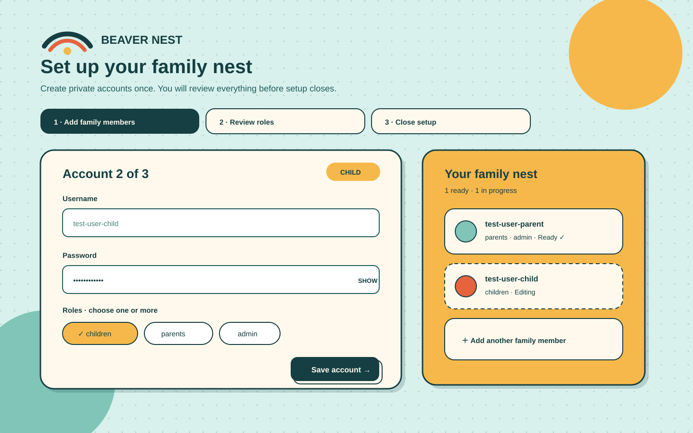

# Bnest Centralized Data

**Status:** Backlog  
**Created:** 2026-08-26  
**Scope:** Bnest application, browser-persisted state, and ignored local runtime data

## Context

Bnest currently has no authentication or server-side application data. Chat state stays in the current tab's `sessionStorage`; Sifat Allah progress and explicit light/dark theme preference stay in browser `localStorage`; `data/` contains only ignored placeholders. This plan introduces authenticated, centralized flat-file persistence without discarding the browser or filesystem data that already exists.

The canonical as-built system remains the [Bnest C4 architecture specification](../../../specs/apps/bnest/app/architecture.md). This proposal becomes authoritative only when implemented with its required specification updates.

## Scope

- Require one-time username/password setup, then login before any user with access can use Bnest.
- Classify each user with one or more of `children`, `parents`, and `admin` roles.
- Import existing Bnest browser snapshots after authentication, preserving immutable server source copies.
- Move current chat, Sifat Allah quiz/progress, and explicit theme state to centralized per-user records before removing accepted Bnest browser keys.
- Store live data beneath `data/prod/` and give every filesystem test a mirrored `data/test/runs/<run-id>/` root.
- Migrate legacy root-level runtime folders by copy, validation, and explicit archival—not destructive replacement.
- Establish backup, restore, and rollback evidence for every migration step.

## Approach Summary

Add an authenticated persistence boundary behind the existing LiveView and browser flows. Copy browser state into versioned, checksummed server records; after server read-back succeeds, remove only the accepted Bnest browser keys so final durable state is not client-side. Keep immutable envelopes and every legacy root-level runtime file intact; never delete them in this plan.

Production and test runs share one logical shape: `{data/prod | data/test/runs/<run-id>}/{general,apps/beaver-nest,system,users}`. The process receives exactly one resolved runtime root before startup, so test accounts cannot enter the production account index or family list.

## Selected UI Direction

**Nest Cards** is selected for the one-time account setup because it keeps family members and role assignments visible without turning setup into a dense administration screen.

See the [three-alternative, three-device comparison](tech-docs.md#design-decision-at-a-glance) and [asset index](assets/README.md) for all lo-fi and selected hi-fi designs.

## Dependencies

This plan depends on a resolved Bnest identity and session design, including one-time account bootstrap, username policy, password recovery, and a capability matrix for multi-role users.

It also deliberately changes the current runtime-data convention: `data/prod/` becomes the live root, `data/test/runs/<run-id>/` becomes the only filesystem-test root, and `apps/<app-name>/` owns application-shared data within either root. Existing root-level `data/{general,apps,system,users}/` content is a legacy migration source; it must not be deleted or silently repurposed. Phase 1 aligns the rule before introducing the layout.

## Plan Documents

- [BRD](brd.md) defines the business outcome and data-safety rationale.
- [PRD](prd.md) defines personas, login, migration, and persistence requirements.
- [Technical documentation](tech-docs.md) defines the proposed flat-file layout and migration mechanics.
- [UI design assets](assets/README.md) compare responsive lo-fi alternatives and the selected hi-fi direction.
- [Delivery plan](delivery.md) contains ordered execution and verification gates.
- [Learnings](learnings.md) records transient delivery observations awaiting disposition.

## Directory Map

- [Business requirements](brd.md) owns business goals, outcomes, and risks.
- [Delivery](delivery.md) owns ordered execution, migration gates, and rollback evidence.
- [Learnings](learnings.md) records temporary findings for later disposition.
- [Product requirements](prd.md) owns user-facing requirements and acceptance criteria.
- [Technical documentation](tech-docs.md) owns proposed architecture, data layout, and mechanics.
- [UI design assets](assets/README.md) owns wireframes, mockups, viewport evidence, and the design selection.
