# Technical Documentation

This document proposes a target for [Bnest Centralized Data](README.md). It is not an as-built architecture. Delivery must update the canonical [Bnest C4 model](../../../specs/apps/bnest/app/architecture.md) and executable Gherkin before production code changes.

## Reading Guide

Read this document in order: the architecture shows where data travels, the storage and migration sections explain how existing data is preserved, authentication explains who may access it, and testing proves the safety claims. A _schema_ is the written shape and version of stored JSON; a _manifest_ is the inventory of an import; a _checksum_ is a calculated value used to detect changed data; and an _atomic replace_ means a write becomes visible all at once rather than as a partial file.

## Proposed Architecture

Keep Phoenix LiveView as the public boundary. Add an authentication/session boundary and a server-side repository module that owns identity-derived paths, schema validation, atomic writes, import manifests, and backups. A server-verified session persists in its originating browser through reload/restart until logout or maintainer revocation; the same user may hold independent sessions in several browsers. The browser exports only known Bnest storage keys; it never receives arbitrary filesystem access.

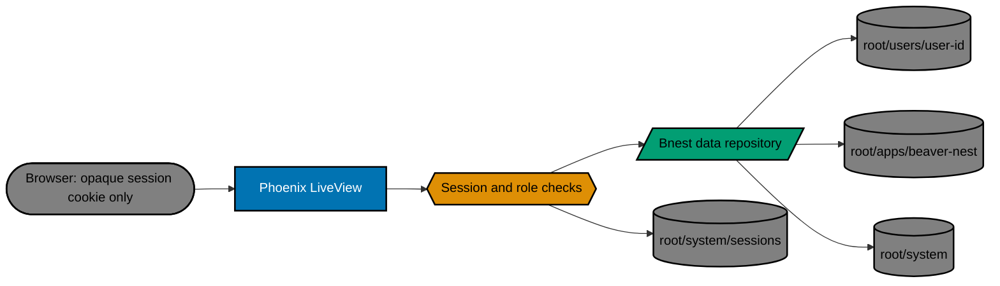

The repository boundary receives one `<runtime-root>` before startup: `data/prod/` for live Bnest or `data/test/runs/<run-id>/` for one filesystem test. It never switches roots while running. `<runtime-root>/system/` records manifests, hashes, account/password-hash verifiers, and server-owned sessions—not user payloads or plaintext passwords.

## Storage Layout and Ownership

| Location beneath `<runtime-root>/` | Owner                  | Permitted content                                                                                  |
| ---------------------------------- | ---------------------- | -------------------------------------------------------------------------------------------------- |
| `general/`                         | Repository/household   | Shared runtime data with no application owner.                                                     |
| `apps/beaver-nest/`                | Bnest application      | Bnest-wide configuration, shared application data, and copied legacy material.                     |
| `users/<user-id>/`                 | One authenticated user | Versioned user records, imported browser envelopes, and user-local migration receipts.             |
| `system/`                          | Repository/system      | Schema registry, manifests, hashes, username/account records, and sessions; no plaintext password. |

Production and test roots mirror this shape. Pure in-memory unit tests create neither root. Root-level `data/{general,apps,system,users}/` remains outside both active roots and is read only as legacy migration input.

Use UTF-8 JSON with explicit schema versions, canonical serialization for checksums, and write-to-temp then atomic replace. All paths are constructed from server-controlled constants and verified user IDs.

## Current Source Inventory and Import Boundary

This table is the migration allow-list. The import page may read only these named sources after the user logs in and confirms import; it must not enumerate browser storage or accept a browser-supplied path/key. The final inventory records a safe outcome for every row, including an absent key.

| Current source                                 | Current readers/writers and accepted form                                                                                                                                                                                                                                               | Proposed destination and compatibility behavior                                                                                                                                                                                                                                                                                                                            |
| ---------------------------------------------- | --------------------------------------------------------------------------------------------------------------------------------------------------------------------------------------------------------------------------------------------------------------------------------------- | -------------------------------------------------------------------------------------------------------------------------------------------------------------------------------------------------------------------------------------------------------------------------------------------------------------------------------------------------------------------------- |
| `sessionStorage["bnest.chat.v1"]`              | `assets/js/app.js` writes only completed chat snapshots and passes the JSON string as LiveView `chat` connect data. `ChatLive` accepts at most 500,000 bytes; `BnestApp.Chat` restores versions 1 and 2 containing a transcript, model, reasoning effort, and opaque Codex `thread_id`. | Copy the raw snapshot to `data/prod/users/<user-id>/imports/<import-id>.json`, validate a normalized user chat record, and read it through the normal chat flow. Only then delete `bnest.chat.v1`; the immutable server envelope and normalized record preserve it. Keep `thread_id` server-side; on resume failure retain the transcript and report a fresh conversation. |
| `localStorage["bnest.sifat-allah.v1"]`         | `assets/js/app.js` passes the JSON string as `sifat_allah` connect data. `SifatAllahLive` accepts at most 10,000 bytes; `BnestApp.SifatAllah` restores versions 1 and 2 for progress and the optional activity session.                                                                 | Copy the raw snapshot to an immutable import envelope, validate it, write normalized progress beneath `data/prod/users/<user-id>/sifat-allah/`, and read it back. Only then delete `bnest.sifat-allah.v1`; a browser that has not completed this flow keeps its source for import.                                                                                         |
| `localStorage["phx:theme"]`                    | `root.html.heex` reads and writes only `light` or `dark`; an absent key means the browser follows its system theme. No versioned server reader exists today.                                                                                                                            | Import an explicit `light` or `dark` value to `data/prod/users/<user-id>/preferences/theme.json`; record absent/system in the manifest without creating a preference file. After server read-back, delete `phx:theme`; the server returns the explicit preference or lets the browser use system theme.                                                                    |
| Root-level `data/{general,apps,system,users}/` | Existing ignored runtime locations; inventory must record every file's reader, writer, owner, format, and checksum without putting values in Git.                                                                                                                                       | Copy each source to its mapped `data/prod/` destination; keep Bnest legacy material under `data/prod/apps/beaver-nest/legacy/`. Preserve unknown/malformed files as opaque copies and leave every source unchanged.                                                                                                                                                        |

Browser import is an authenticated, user-confirmed copy operation. It treats every browser value as untrusted input, applies the current size and schema limits before normalization, and records an outcome without exposing payloads in logs or `delivery.md`.

## Final User Data and No-Downtime Cutover

The username identifies an account for login but never appears in a user-data path. `identity/file_store.ex` resolves the normalized username to a server-generated stable `<user-id>`; live user state then stays under `data/prod/users/<user-id>/`.

```text
data/prod/users/<user-id>/
├── imports/<import-id>.json          # Immutable raw browser source and acceptance evidence.
├── chat/current.json                 # Versioned transcript, selected model/reasoning, private resume state.
├── sifat-allah/progress.json         # Versioned learning progress and optional quiz/activity state.
└── preferences/theme.json            # Explicit light/dark preference; absent means system theme.
```

`chat/current.json` contains `schemaVersion`, `ownerId`, `sourceImportId`, transcript, selected model, reasoning effort, and any server-only Codex resume state. `sifat-allah/progress.json` contains `schemaVersion`, `ownerId`, `sourceImportId`, migrated progress, and optional activity/quiz state. Both are read and written by LiveView through `data_repository`; browser JavaScript no longer persistently writes their values after acceptance.

Cut over one browser safely: (1) keep the legacy key untouched; (2) create immutable envelope, backup, and manifest; (3) normalize and atomically write the user record; (4) re-read it through chat or Sifat Allah; (5) mark the manifest accepted; then (6) delete only the accepted Bnest browser keys. Any failed step leaves the source key and previous accepted server record intact. This permits a compatibility release and per-browser migration with no unavailable chat/quiz data. A browser that has not yet visited the new version cannot be cleared remotely; its retained key is a temporary import source, not final application persistence.

### Browser Persistence Boundary

After verified migration, the browser persistently holds only its opaque Bnest session cookie. That cookie identifies one server session; it does not contain a username, password, role, chat transcript, quiz/progress, theme, import payload, or filesystem path. The cookie is persistent across browser restart, `HttpOnly`, and secure for the internal deployment; JavaScript cannot read it. Username/password values exist only while the setup or login form is submitted and are not persisted in client storage. If a browser clears its own cookie, Bnest treats it as logged out and the user signs in again; the server-owned data remains intact.

## Schema Contract and Evolution

The repository owns the schema. The browser may submit a snapshot, but it never chooses a destination path, schema version, or migration action. Each accepted import is stored as a versioned envelope; its payload is preserved exactly until a separately validated normalizer can derive an application record.

```json
{
  "schemaVersion": 1,
  "recordType": "browser-import",
  "importId": "server-generated-id",
  "ownerId": "stable-server-user-id",
  "source": {
    "storageKey": "bnest.chat.v1",
    "sourceSchemaVersion": 1
  },
  "payload": { "capturedBrowserValue": "fixture-or-imported-value" },
  "integrity": {
    "sha256": "calculated-checksum",
    "capturedAt": "ISO-8601-timestamp"
  },
  "outcome": "accepted"
}
```

This is a public structural example, not a real record. `ownerId`, `importId`, checksum, timestamp, and payload values are placeholders. Real values stay in ignored runtime data and test fixtures use synthetic values only.

Store production schema versions and migration identifiers in `data/prod/system/schema-registry.json`. Store each live immutable import envelope under `data/prod/users/<user-id>/imports/<import-id>.json`; store any normalized application record separately, with its source import ID. Test runs use identical paths relative to their own root.

When a schema changes, add a new version instead of changing old files in place:

1. Write the old and new shape, field defaults, removed-field treatment, and compatibility window in the schema registry and affected C4/Gherkin.
2. Add a pure migration function from each supported old version to the new one. It reads a copy and writes a new versioned record; it never edits or deletes the old envelope.
3. Before running it, create a backup and manifest entry containing source path, source checksum, target version, and migration result.
4. Read the new record through the normal Bnest flow, validate its schema and checksum, then mark the manifest accepted. On failure, leave the old record active and retain the failure result for retry.
5. Keep readers for the compatibility window. Remove an old reader only in a later explicit archival plan after restore rehearsal proves the original can still be recovered.

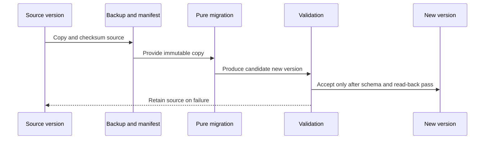

## Migration Mechanics

1. Inventory every `data/` file and the allow-listed browser keys `bnest.chat.v1`, `bnest.sifat-allah.v1`, and `phx:theme` without mutation. Record each source's reader, writer, accepted form/version, owner, destination, and safe outcome.
2. Create a dated, checksummed backup and system manifest before copying any record.
3. After login, import browser snapshots into a user-owned envelope containing the original key, raw payload, source schema, hash, import ID, and outcome. Keep the browser key untouched until the normalized server record passes read-back.
4. Copy every legacy root-level runtime entry to its mapped `data/prod/` location; put Bnest legacy material in versioned `data/prod/apps/beaver-nest/legacy/` storage and validate hashes before normalization.
5. Read the centralized representation back through the normal application flow before marking an import accepted, then delete only that accepted Bnest browser key. Never delete a root-level runtime source in this plan.
6. Keep immutable server envelopes, backups, manifests, and legacy root-level sources available. A browser that has not completed migration keeps its legacy key only until its own successful import; no browser is made unavailable during this compatibility period.

## Authentication and Authorization

Select and document a credential/bootstrap/recovery design before implementation. The minimum implementation boundary is server-verified session identity, password hashes rather than credentials in `data/`, logout, protected routes, and authorization checks at every repository operation. The current internal Tailscale deployment deliberately has no automatic session expiry; a later expiry policy requires an explicit plan/specification change.

Each successful login creates a server record for one opaque random session identifier and gives only that browser a persistent secure, HTTP-only cookie containing the identifier. Store a digest of the identifier, user ID, issue time, and revocation state; never store a plaintext credential in it. On reload or browser restart, the browser returns its cookie and the server validates its session record. A login from another browser creates a second record for the same user, rather than replacing the first. Logout revokes only the presented browser session. An all-session revocation action is a separate future capability and must be explicitly designed, authorized, and specified before it exists.

Store each live version-1 session record at `data/prod/system/sessions/<session-id>.json`; test records use the same relative path under their run root. `identity/session.ex` generates the opaque ID and is its only reader/writer. The record contains `schemaVersion`, identifier digest, `userId`, `issuedAt`, and nullable `revokedAt`; it has no automatic-expiry field. Atomic writes and one path lock prevent browser A logout from revoking browser B.

### One-Time Username and Password Setup

`login_live.ex` renders two mutually exclusive states. When the configured root has no `system/accounts/` records, it renders the initial setup UI: a maintainer enters the initial username, password, and role set for each account, including at least one `admin`. The password exists only long enough to derive its hash; no response, LiveView assign, log, fixture, or runtime record echoes it. Atomic bootstrap switches permanently to login and disables registration/setup routes for that root.

The maintainer must decide the allowed username character/length policy before implementation. `identity/file_store.ex` normalizes an accepted username, rejects duplicates, and writes `<runtime-root>/system/usernames/<normalized-username>.json` with the generated user ID. The linked `system/accounts/<user-id>.json` contains username metadata, roles, creation metadata, and encoded password verifier; user-data paths use only `<user-id>`.

`credential_verifier.ex` uses Argon2id and stores the encoded per-password salted hash with its algorithm parameters. It must use at least the current OWASP baseline of 19 MiB memory, two iterations, and one lane, then profile the chosen maintained Elixir implementation on the deployment hardware before accepting the setting. Verification compares through the library; SHA-256, reversible encryption, and homemade hash comparison are forbidden for passwords. [OWASP password-storage guidance](https://cheatsheetseries.owasp.org/cheatsheets/Password_Storage_Cheat_Sheet.html) supports this baseline.

Represent role assignments as a set per authenticated user, allowing any combination of `children`, `parents`, and `admin`. Keep role capability checks separate from ownership and sharing checks. Before delivery, define the capability matrix for each action and any parent-to-child sharing policy; default-deny cross-user access until that policy exists.

## Test Identity and Cleanup Boundary

No authentication, migration, browser, or manual-AI filesystem test may use `data/prod/` or a real browser profile. Each run creates `data/test/runs/<run-id>/`, mirrors the production subdirectories, writes its run marker, starts a dedicated Bnest process with that root, and opens an isolated browser profile/context. Test usernames use `test-user-<suite>-<run-id>` and payloads are generated fixtures. Pure in-memory unit tests create no root.

The test process reads its account index, family list, sessions, and user records only from `data/test/runs/<run-id>/`. Consequently, `test-user-...` accounts are visible only inside that run's UI and never in the production family list. The test aborts before bootstrap unless it proves the configured root; changing only the browser context is insufficient.

The shared helper resolves the candidate root before Bnest starts. It fails closed when the path equals or enters `data/prod/`, sits outside `data/test/runs/<run-id>/`, lacks the expected marker, or is shared. Two-user and two-browser tests generate separate IDs, directories, sessions, and contexts inside one marked run.

Cleanup runs after browsers and servers stop in `on_exit`/`finally`. It re-resolves the exact run root, revalidates its marker, and deletes only that directory. Failure fails the test. Scheduled maintenance may remove abandoned roots only below `data/test/runs/` after marker and retention validation; prefix, glob, or age alone never authorizes deletion.

### Read-only Production Schema Audit

Development may run `npm exec -- nx run bnest-app:schema:audit` against `data/prod/` to confirm the test mirror still represents production schemas. Its underlying Mix task opens known record patterns read-only and passes each record to the same schema validator used by the repository. It compares only public record type, schema version, field names, and value types with synthetic records under one marked test run. It never logs or returns filenames, user IDs, usernames, record counts, checksums, password verifiers, session material, chat, learning, preferences, or field values.

This audit is not a behavior test and never authenticates as a real user. It cannot write, lock for mutation, normalize, migrate, repair, or copy production data. A structural mismatch reports only the public record type/version and mismatch category; a developer updates the declared schema and synthetic fixture manually without seeing production payload in test output.

## UI Design Exploration

The planned interface serves the family maintainer who creates initial accounts and the returning family member who logs in or confirms import. The setup page's single job is to create usernames, passwords, and role sets—including at least one administrator—then review and close setup permanently. It must also explain login failure, import confirmation, migration progress/retry, and the transition to server-owned data in direct, non-technical copy.

[The UI asset gallery](assets/README.md) compares three alternatives at desktop 1440×900, tablet 768×1024, and mobile 375×812:

- **A — Nest Cards:** guided account cards with a visible family summary. It is friendly, makes multi-role accounts understandable, and collapses to one active card on mobile.
- **B — Household Ledger:** editable rows and persistent setup checks. It is efficient for administrators but dense on small screens and feels less like Bnest.
- **C — Front Door:** one progressive form with strong explanation. It has the lowest immediate cognitive load but hides the household overview until review.

### Design Decision at a Glance

| Alternative              | Decision     | Main reason                                                                                          |
| ------------------------ | ------------ | ---------------------------------------------------------------------------------------------------- |
| **A — Nest Cards**       | **Selected** | Keeps family members and multiple roles visible while matching Bnest's playful card language.        |
| **B — Household Ledger** | Not selected | Efficient for dense administration, but too heavy for family setup and especially cramped on mobile. |
| **C — Front Door**       | Not selected | Calm and focused, but hides the household overview until the final review.                           |

### Lo-fi Comparison

#### A — Nest Cards · Selected

| Desktop · 1440×900                                                                                               | Tablet · 768×1024                                                                                        | Mobile · 375×812                                                                                 |
| ---------------------------------------------------------------------------------------------------------------- | -------------------------------------------------------------------------------------------------------- | ------------------------------------------------------------------------------------------------ |
| 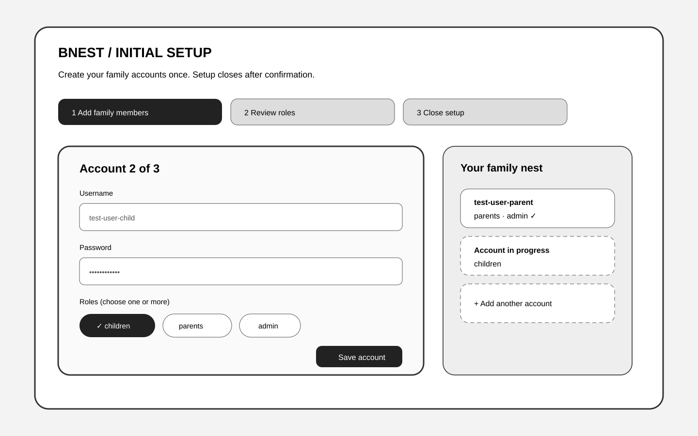 | 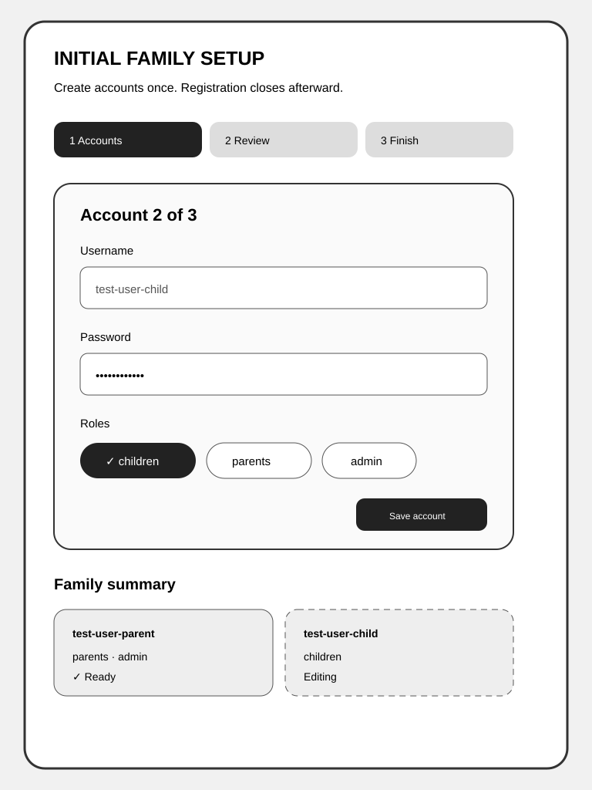 | 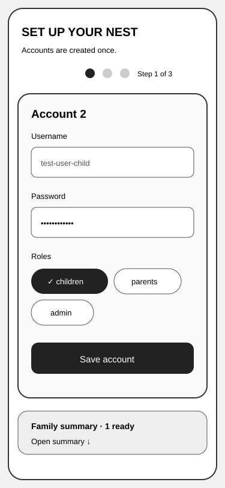 |

#### B — Household Ledger · Not selected

| Desktop · 1440×900                                                                                        | Tablet · 768×1024                                                                                           | Mobile · 375×812                                                                                          |
| --------------------------------------------------------------------------------------------------------- | ----------------------------------------------------------------------------------------------------------- | --------------------------------------------------------------------------------------------------------- |
| 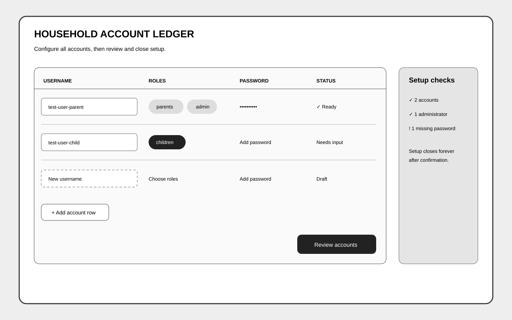 | 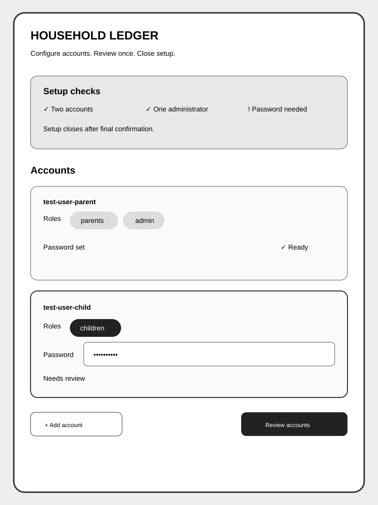 | 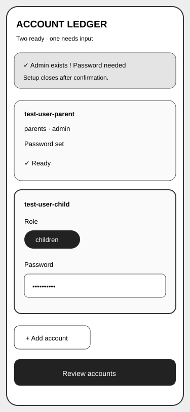 |

#### C — Front Door · Not selected

| Desktop · 1440×900                                                                                       | Tablet · 768×1024                                                                                 | Mobile · 375×812                                                                                 |
| -------------------------------------------------------------------------------------------------------- | ------------------------------------------------------------------------------------------------- | ------------------------------------------------------------------------------------------------ |
| 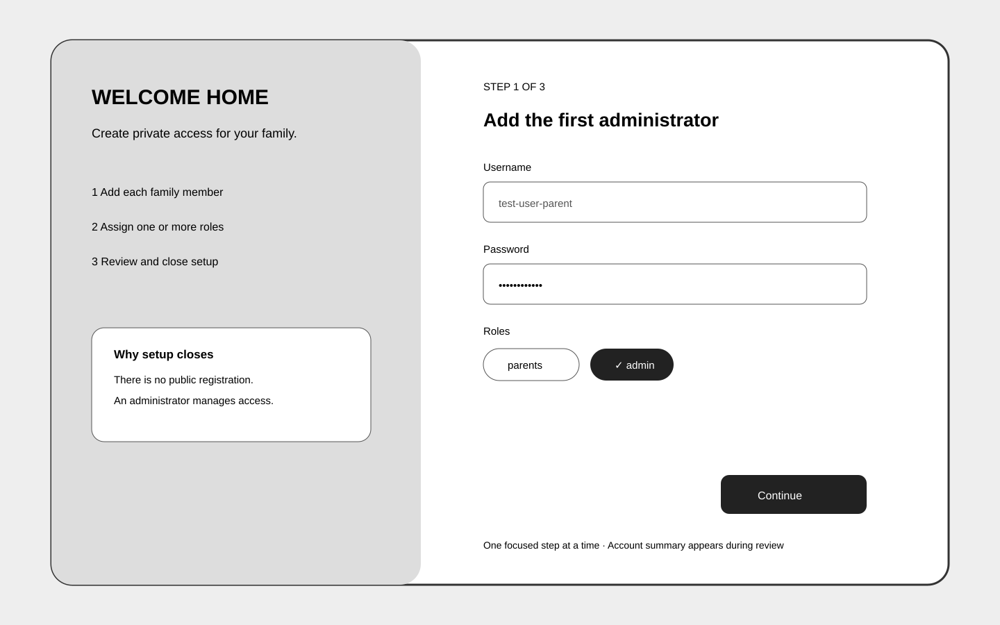 | 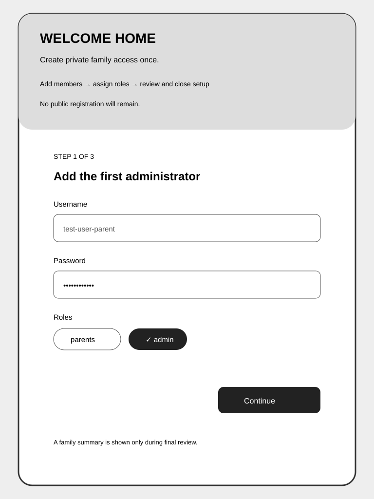 | 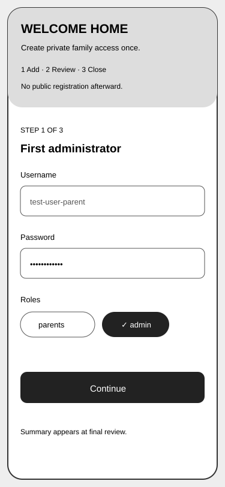 |

**Nest Cards is selected.** It best balances setup clarity, family context, accessibility, and product fit. The lo-fi comparison establishes information order without color; the selected hi-fi mockups then apply Bnest's existing deep-teal ink, mint canvas, warm paper, sun yellow, coral, lagoon teal, rounded cards, offset shadow, and nest-ring motif. The OSE Public comparison informed fixed viewports, indexing, and responsive evidence only; its portfolio palette, sidebar, and navigation were deliberately not adopted.

### Selected Hi-fi Direction · Nest Cards

| Desktop · 1440×900                                                                                                     | Tablet · 768×1024                                                                                         | Mobile · 375×812                                                                                             |
| ---------------------------------------------------------------------------------------------------------------------- | --------------------------------------------------------------------------------------------------------- | ------------------------------------------------------------------------------------------------------------ |
|  | 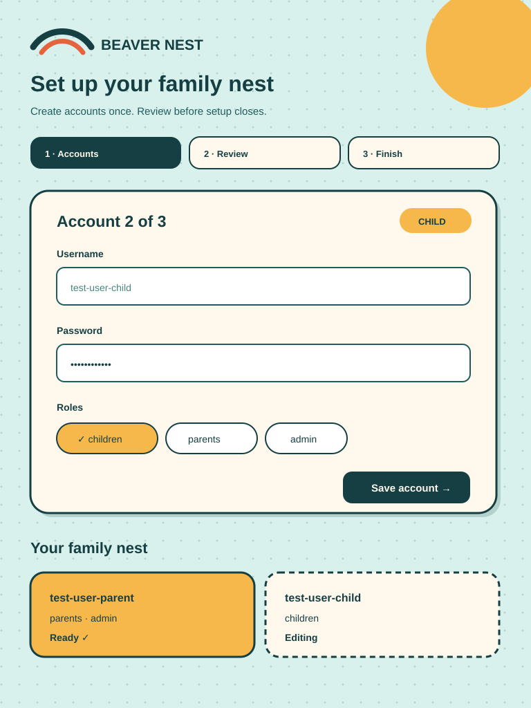 | 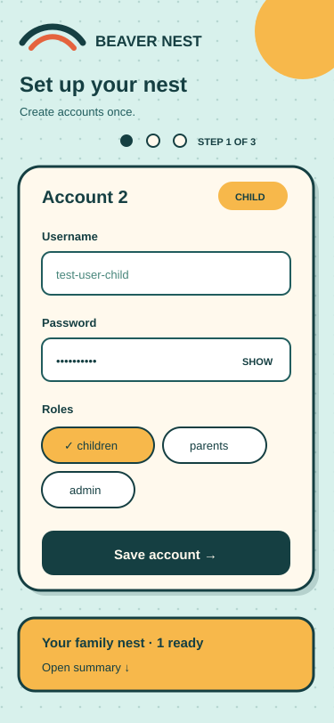 |

On desktop, the active form and persistent family summary sit side by side. Tablet keeps the form full-width and moves the summary into two cards below it. Mobile shows one account task at a time and collapses the summary behind a labeled disclosure. Shared components are the setup stepper, account form, role chips, family summary card, irreversible-action confirmation, login form, import confirmation, status alert, and retry panel.

Every field has a visible label, instructions and errors are programmatically associated, password reveal is a real labeled button, role selection has checked state beyond color, and focus remains visible. Error, empty, loading, success, retry, and irreversible-close states must not shift or erase entered non-password values unexpectedly. Animations honor reduced motion. Production implementation uses the selected option only; the alternatives remain decision evidence.

## Planned Specification Changes

Use this as the file-by-file checklist for future specification work. The canonical as-built files remain unchanged until implementation passes the listed bindings and tests.

### PRD-to-Specification Boundary

The Gherkin in [the PRD](prd.md#proposed-acceptance-criteria) accepts this plan; it is not a list to copy into `specs/`.

- **Selected canonical contracts:** one-time username/password setup, login, browser-local sessions, user isolation, multi-role authorization, confirmed browser import, retry-safe import, removal of accepted Bnest client persistence, and centralized chat/learning continuation. The exact target files and scenario-level deltas are below.
- **Plan-only acceptance outcomes:** AC-05's interrupted-migration recovery and AC-11's test-root safety are operational guarantees, not standalone product-language scenarios. User-visible retry remains in `centralized_data.feature`; [delivery.md](delivery.md#phase-3--browser-and-legacy-import) verifies backup/restore, while the safety-harness and verification tasks prove test isolation and cleanup.

### Gherkin

### `[E] specs/apps/bnest/app/behaviours/chat.feature`

```diff
- Given a visitor opens "/chat" and browser storage restores the same-tab snapshot
+ Given an authenticated user opens "/chat" and Bnest reads that user's centralized chat
+ And Bnest no longer persistently writes chat state in browser storage after accepted import

- Scenario: Reload preserves a completed conversation and Codex session
+ Scenario: Reload preserves a completed user-owned conversation and Codex session

- Then Clear Chat removes the browser snapshot
+ Then Clear Chat changes only that user's normalized chat and preserves the import envelope
```

<details>
<summary>Scenario scope: 11 chat interactions whose setup changes only</summary>

- **All listed scenarios preserve their interaction after the authenticated setup.**
  - **A visitor enters chat from the home page**
  - **A visitor opens a fresh chat**
  - **A visitor cannot send an empty message**
  - **A visitor cannot overlap Codex turns**
  - **A visitor sends a message with Shift+Enter**
  - **A visitor continues one page-scoped conversation**
  - **A visitor changes models within one Codex conversation**
  - **A visitor changes reasoning effort within one Codex conversation**
  - **A model change falls back from an unsupported reasoning effort**
  - **The Codex session cannot accept a message**
  - **Codex reports a failed turn**

</details>

- `= Preserve` **A visitor can install Beaver Nest as an app** remains public PWA behavior. The renamed reload scenario and updated Clear Chat scenario are already shown in the diff.
- `→ Bindings` `[E] apps/bnest-app/test/behaviour/steps/home_page_steps.exs`, `[E] apps/bnest-app/test/behaviour/driver.ex`, `[E] apps/bnest-app/test/behaviour/support/unit.exs`, `[E] apps/bnest-app/test/behaviour/support/integration.exs`, and `[E] apps/bnest-app-e2e/tests/steps/browser.steps.ts`; use the new shared login/import steps below.
- `✓ Proof` `bnest-app:test:coverage:behaviour`, then the focused chat E2E scenario.

### `[E] specs/apps/bnest/app/behaviours/sifat_allah.feature`

```diff
- Given a visitor opens "/apps/sifat-allah" and reload reads localStorage
+ Given an authenticated child opens "/apps/sifat-allah" and Bnest reads centralized progress
+ And Bnest no longer persistently writes learning/quiz state in browser storage after accepted import

- Then reset clears the browser's saved progress
+ Then reset changes only the authenticated child's normalized progress and preserves the import envelope
```

<details>
<summary>Scenario scope: 26 Sifat Allah scenarios whose setup changes only</summary>

- **All listed scenarios preserve their learning, quiz, review, swipe, reset, and browser-Back outcome after the authenticated setup.**
  - **A child opens the revision dashboard**
  - **A child learns a pair and keeps the progress after a reload**
  - **A child keeps saved progress during a live update**
  - **A child resets saved progress from the mission**
  - **A child learns the earliest pair that is not remembered yet**
  - **A quiz prioritizes individual questions that are not remembered yet**
  - **A quiz continues as reinforcement after every pair is remembered**
  - **A child swipes through a learning session**
  - **A child can return to the mission while learning**
  - **Browser Back returns a child from a quiz to the mission**
  - **A child receives kind feedback for a correct quiz answer**
  - **A quiz skips an individual question that is already learned**
  - **A quiz locks one answer and moves on automatically**
  - **A child sees correct answers in varied positions**
  - **A child keeps the current quiz question after a reload**
  - **A child swipes through quiz questions**
  - **A child practises the opposite attribute too**
  - **A child practises the meaning of an opposite attribute too**
  - **A child practises every relationship from the reverse direction too**
  - **A difficult pair is kept for another try**
  - **A child retests a difficult pair until it is correct**
  - **A child retests a pair that is already remembered**
  - **A child moves through remembered individual questions**
  - **Every answered question moves between the review queues immediately**
  - **A pair moves between remembered and difficult review**
  - **A child gets another difficult pair before repeating one**

</details>

- `= Specific changed scenarios` **A child learns a pair and keeps the progress after a reload**, **A child keeps saved progress during a live update**, and **A child keeps the current quiz question after a reload** prove centralized persistence.
- `→ Bindings` `[E] apps/bnest-app/test/behaviour/steps/home_page_steps.exs`, `[E] apps/bnest-app/test/behaviour/driver.ex`, `[E] apps/bnest-app/test/behaviour/support/unit.exs`, `[E] apps/bnest-app/test/behaviour/support/integration.exs`, and `[E] apps/bnest-app-e2e/tests/steps/sifat_allah.steps.ts`.
- `✓ Proof` `bnest-app:test:coverage:behaviour`, then the focused Sifat Allah E2E scenario.

### `[N] specs/apps/bnest/app/behaviours/authentication.feature`

```diff
+ Scenario: Unauthenticated visitor is redirected before protected Bnest access
+ Scenario: Initial setup creates username/password accounts once and closes registration
+ Scenario: Approved user logs in and logs out
+ Scenario: Login verifies a salted password hash without retaining plaintext
+ Scenario: Login persists across reload and browser restart until logout or revocation
+ Scenario: One user can use independent simultaneous browser sessions
+ Scenario: A multi-role user receives only approved capabilities
+ Scenario: One authenticated user cannot read or write another user's data
```

- `= Scenario contract` actor, browser session state, protected route/operation, action, and observable allow/deny result. Logout or browser-specific revocation affects only that session; the same user's other browser session remains usable.
- `→ Bindings` `[N] apps/bnest-app/test/behaviour/steps/authentication_steps.exs`, `[N] apps/bnest-app/test/unit/bnest_app/identity_test.exs`, `[N] apps/bnest-app/test/integration/bnest_app_web/authentication_test.exs`, and `[N] apps/bnest-app-e2e/tests/steps/authentication.steps.ts`.
- `✓ Proof` behavior coverage, unit/integration targets, and the named E2E scenario.

### `[N] specs/apps/bnest/app/behaviours/centralized_data.feature`

```diff
+ Scenario: Authenticated user imports each recognized browser source
+ Scenario: Absent system theme is recorded without creating a preference
+ Scenario: Unknown, malformed, or oversized browser input is rejected without source deletion
+ Scenario: Retrying an interrupted import does not duplicate accepted data
+ Scenario: Accepted browser import clears only Bnest persisted browser keys after server read-back
+ Scenario: Legacy root-level runtime data is copied before normalization
+ Scenario: Failed Codex-thread resume preserves transcript and starts a reported fresh conversation
```

- `= Scenario contract` source key, confirmation, result, source-preservation expectation, and recovery outcome.
- `→ Bindings` `[N] apps/bnest-app/test/behaviour/steps/centralized_data_steps.exs`, `[N] apps/bnest-app/test/unit/bnest_app/data_repository_test.exs`, `[N] apps/bnest-app/test/integration/bnest_app/centralized_data_test.exs`, and `[N] apps/bnest-app-e2e/tests/steps/centralized_data.steps.ts`.
- `✓ Proof` behavior coverage, unit/integration targets, then the named browser-import E2E scenario.

### C4

### `[E] specs/apps/bnest/app/architecture.md`

```diff
- Family member uses Bnest without authentication or server-side data
+ Approved authenticated user reaches Bnest through login/session and local runtime-data boundaries
+ Component view owns identity, per-browser session, authorization, import, repository, manifest, and backup responsibilities
+ Runtime repository resolves `data/prod/` once at production startup; tests substitute an isolated mirrored root
+ Session boundary reads one server-owned persistent session record per browser and leaves a sibling browser session independent
+ Browser boundary clears accepted Bnest persisted values only after server data is re-read; username/password bootstrap stays server-owned
```

- `= Preserve` independent Tailscale and Codex boundaries.

## File Impact

`[E]` update · `[N]` new · `[M]` moved · `[D]` deleted

### Application: runtime and interface

```text
apps/bnest-app/
├── [E] README.md                                              # Final auth, data, backup, and recovery guide.
├── [E] assets/css/app.css                                     # Accessible login, one-time setup, and migration-status UI.
├── [E] assets/js/app.js                                       # Confirmed import; remove only accepted Bnest browser keys.
├── [E] config/config.exs                                      # Data root and non-secret Argon2id/session defaults.
├── [E] config/test.exs                                        # Boot test processes against isolated roots and identity fixtures.
├── [E] mix.exs                                                 # Maintained Argon2id verifier dependency.
├── [E] mix.lock                                                # Locked, reviewed Argon2id dependency resolution.
├── [E] project.json                                            # Add the Nx `schema:audit` target around the read-only Mix task.
├── [E] lib/bnest_app/application.ex                           # Supervise identity and data boundaries.
├── [N] lib/bnest_app/identity.ex                              # Login, logout, current-user, and capabilities API.
├── [N] lib/bnest_app/identity/authorization.ex                # Multi-role and cross-user default deny.
├── [N] lib/bnest_app/identity/bootstrap.ex                    # Atomic one-time account setup and bootstrap state.
├── [N] lib/bnest_app/identity/credential_verifier.ex          # Argon2id password-hash and verification boundary.
├── [N] lib/bnest_app/identity/file_store.ex                   # Username index, account metadata, roles, password hash.
├── [N] lib/bnest_app/identity/session.ex                      # Persistent per-browser sessions; issue and revoke one session.
├── [N] lib/bnest_app/data_repository.ex                       # Server-owned data operations API.
├── [N] lib/bnest_app/data_repository/backup.ex                # Immutable pre-migration backup.
├── [N] lib/bnest_app/data_repository/import.ex                # Allow-list, idempotency, and outcome reporting.
├── [N] lib/bnest_app/data_repository/manifest.ex              # Source, checksum, retry, and restore record.
├── [N] lib/bnest_app/data_repository/schema.ex                # Envelope and normalized-record validation.
├── [N] lib/bnest_app/data_repository/store.ex                 # Paths, locks, atomic writes, and read-back.
├── [N] lib/mix/tasks/bnest.schema.audit.ex                     # Read-only structural prod/test schema comparison with safe output.
├── [E] lib/bnest_app_web/components/core_components.ex        # Accessible login, password, setup/import/recovery primitives.
├── [E] lib/bnest_app_web/components/layouts/root.html.heex    # Centralized explicit theme preference.
├── [E] lib/bnest_app_web/controllers/page_html/home.html.heex # Permitted entry points and accurate storage copy.
├── [E] lib/bnest_app_web/live/chat_live.ex                    # Central chat and resume-failure transcript safety.
├── [N] lib/bnest_app_web/live/login_live.ex                   # Login plus one-time username/password bootstrap; no registration UI later.
├── [E] lib/bnest_app_web/live/sifat_allah_live.ex             # Central learning state after import.
└── [E] lib/bnest_app_web/router.ex                            # Login routes and protected Bnest routes.
```

### Application: BDD, unit, and integration tests

```text
apps/bnest-app/
├── [N] test/support/test_identity.ex                           # Marked `data/test/runs/<run-id>` roots, synthetic users, exact cleanup.
├── [E] test/behaviour/driver.ex                                 # Authenticated user and migration operations.
├── [E] test/behaviour/steps/home_page_steps.exs                 # Updated protected-route bindings.
├── [N] test/behaviour/steps/authentication_steps.exs            # Bootstrap, hash login, persistent/two-browser, role/isolation bindings.
├── [N] test/behaviour/steps/centralized_data_steps.exs          # Import, retry, theme, and resume bindings.
├── [E] test/behaviour/support/integration.exs                   # Isolated identity/data integration resources.
├── [E] test/behaviour/support/unit.exs                          # Identity/data unit doubles.
├── [E] test/integration/bnest_app_web/chat_live_test.exs        # Protected chat and failed-resume behavior.
├── [N] test/integration/bnest_app_web/authentication_test.exs   # Setup UI, hash login, persistent/two-browser, logout/routes.
├── [N] test/integration/bnest_app/centralized_data_test.exs     # Import, manifest, retry, backup, restore.
├── [E] test/integration/bnest_app_web/sifat_allah_live_test.exs # Central learning and reset isolation.
├── [E] test/unit/bnest_app/chat_test.exs                        # Normalized transcript and failed resume.
├── [N] test/unit/bnest_app/data_repository_test.exs             # Paths, schemas, hashes, atomic writes.
├── [N] test/unit/bnest_app/identity_test.exs                    # Username, Argon2id verifier, bootstrap, sessions, roles/isolation.
└── [E] test/unit/bnest_app/sifat_allah_test.exs                 # Version-1/version-2 learning migration.
```

### Browser E2E bindings

```text
apps/bnest-app-e2e/
├── [E] README.md                             # Isolated data setup and journey coverage.
├── [E] playwright.config.mts                  # Unique data root/profile wiring and cleanup hooks.
├── [N] tests/support/test-user.ts             # `test-user-` factory, marker validation, and exact cleanup.
├── [N] tests/steps/authentication.steps.ts   # Setup/login UI, hash-safe errors, persistent/two-browser, roles/isolation.
├── [E] tests/steps/browser.steps.ts          # Protected chat and central continuation.
├── [N] tests/steps/centralized_data.steps.ts # Import, retry, theme, and failed resume.
└── [E] tests/steps/sifat_allah.steps.ts      # Protected centralized learning.
```

### Ignored runtime records

```text
[E] .gitignore                                                 # Track only approved prod/test placeholders; ignore every runtime record.

data/
├── prod/
│   ├── [N] general/.gitkeep                                      # Tracked production shared-data placeholder.
│   ├── [N] apps/beaver-nest/.gitkeep                             # Tracked production Bnest-data placeholder.
│   ├── [N] system/.gitkeep                                       # Tracked production operational-state placeholder.
│   ├── [N] users/.gitkeep                                        # Tracked production user-root placeholder.
│   ├── [N] general/<legacy-relative-path>                         # Verified copy; inventory supplies the exact private relative path.
│   ├── [N] apps/beaver-nest/legacy/<import-id>/source.json        # Immutable legacy source copy.
│   ├── [N] system/accounts/<user-id>.json                         # Username, roles, Argon2id hash; never plaintext password.
│   ├── [N] system/backups/<import-id>/source.json                 # Immutable pre-import backup.
│   ├── [N] system/manifests/<import-id>.json                      # Migration manifest and integrity hashes.
│   ├── [N] system/schema-registry.json                            # Supported schemas and migrations.
│   ├── [N] system/sessions/<session-id>.json                      # Persistent browser session record.
│   ├── [N] system/usernames/<normalized-username>.json            # Username-to-user-ID lookup.
│   ├── [N] users/<user-id>/chat/current.json                      # Normalized transcript and resume state.
│   ├── [N] users/<user-id>/imports/<import-id>.json               # Immutable raw browser envelope.
│   ├── [N] users/<user-id>/preferences/theme.json                 # Explicit light/dark preference.
│   └── [N] users/<user-id>/sifat-allah/progress.json              # Normalized progress and activity session.
└── test/
    └── runs/
        ├── [N] .gitkeep                                          # Tracked parent only; generated runs remain ignored.
        └── <run-id>/
            ├── [N] .bnest-test-run.json                          # Marker proving exact cleanup authority.
            ├── [N] apps/beaver-nest/legacy/<import-id>/source.json # Synthetic legacy migration source.
            ├── [N] system/accounts/<user-id>.json                # Synthetic `test-user-` account metadata.
            ├── [N] system/backups/<import-id>/source.json        # Synthetic pre-import backup.
            ├── [N] system/manifests/<import-id>.json             # Synthetic migration manifest.
            ├── [N] system/schema-registry.json                   # Test schema registry.
            ├── [N] system/sessions/<session-id>.json             # Isolated test-browser session.
            ├── [N] system/usernames/<normalized-username>.json   # Synthetic username index.
            ├── [N] users/<user-id>/chat/current.json             # Synthetic normalized transcript.
            ├── [N] users/<user-id>/imports/<import-id>.json      # Synthetic browser-import envelope.
            ├── [N] users/<user-id>/preferences/theme.json        # Synthetic theme preference.
            └── [N] users/<user-id>/sifat-allah/progress.json     # Synthetic learning/quiz state.
```

### Governance and specifications

```text
repo-governance/conventions/
└── [E] runtime-flat-file-data.md    # Application namespace and legacy-source rule.

specs/apps/bnest/app/
├── [E] architecture.md              # Auth, per-browser session, repository, manifest boundaries.
├── [E] README.md                    # Application map for new behavior.
└── behaviours/
    ├── [E] README.md                # Behavior map for new features.
    ├── [E] chat.feature             # Protected central chat behavior.
    ├── [E] sifat_allah.feature      # Protected central learning behavior.
    ├── [N] authentication.feature   # One-time setup, hash login, persistent browsers, roles/isolation.
    └── [N] centralized_data.feature # Import, post-read-back client cleanup, retry, theme, resume.
```

### Plan design evidence

```text
plans/backlogs/bnest-centralized-data/assets/
├── [N] README.md                              # Viewports, comparison, decision, gallery, and asset map.
├── [N] ui-front-door-lofi-desktop.svg         # Alternative C desktop wireframe.
├── [N] ui-front-door-lofi-mobile.svg          # Alternative C mobile wireframe.
├── [N] ui-front-door-lofi-tablet.svg          # Alternative C tablet wireframe.
├── [N] ui-household-ledger-lofi-desktop.svg   # Alternative B desktop wireframe.
├── [N] ui-household-ledger-lofi-mobile.svg    # Alternative B mobile wireframe.
├── [N] ui-household-ledger-lofi-tablet.svg    # Alternative B tablet wireframe.
├── [N] ui-nest-cards-hifi-desktop.svg         # Selected alternative desktop mockup.
├── [N] ui-nest-cards-hifi-mobile.svg          # Selected alternative mobile mockup.
├── [N] ui-nest-cards-hifi-tablet.svg          # Selected alternative tablet mockup.
├── [N] ui-nest-cards-lofi-desktop.svg         # Alternative A desktop wireframe.
├── [N] ui-nest-cards-lofi-mobile.svg          # Alternative A mobile wireframe.
└── [N] ui-nest-cards-lofi-tablet.svg          # Alternative A tablet wireframe.
```

Root-level `data/{general,apps,system,users}/` is deliberately absent from the changed tree: every entry remains a read-only migration source, so no source is updated, moved, or deleted. `<legacy-relative-path>` is the sole unknown production filename because Phase 1 must inventory private ignored content before mapping it; the manifest records its exact source and destination. Other placeholders are server-generated IDs, not globs. The test tree mirrors production by contract, uses only synthetic records, and disappears after exact-run cleanup.

## Testing and Rollback

- Unit-test root/path derivation, authorization, schemas, checksums, atomic replacement, idempotency, malformed snapshots, `data/prod/` rejection from tests, safe schema-audit projection, and exact cleanup.
- Integration-test isolated filesystem import, duplicate import, interrupted writes, restore, and legacy-copy validation without network access.
- E2E-test login gating and a browser containing the current storage keys using unique `test-user-` identities, marked data roots, and isolated browser profiles only.
- Run BDD completeness through `npm exec -- nx run bnest-app:test:coverage:behaviour` after adding or changing Bnest Gherkin. Run the affected `npm exec -- nx run bnest-app:test:unit` and `npm exec -- nx run bnest-app:test:integration` targets while implementing their respective layers.
- Before cutover, run `npm exec -- nx run bnest-app:test:quick`, then run the relevant isolated browser journey with `npm exec -- nx run bnest-app-e2e:test:e2e -- --grep "<affected Bnest scenario>"`. Keep the E2E target outside `test:quick` and use only synthetic fixtures.
- Before each migration stage, make a backup, record manifest and hashes, run the import, re-read central data, and rehearse restore.
- During development, use `npm exec -- nx run bnest-app:schema:audit` only for read-only structural comparison; keep all behavior tests on synthetic mirrored data.
- Roll back by disabling new writes and reading the retained source/last accepted record. Never delete source data to make a rollback appear clean.

### Manual AI Verification

Use Playwright MCP with a dedicated Bnest process booted against `data/test/runs/<run-id>/`, generated `test-user-<suite>-<run-id>` accounts, an isolated browser profile, and fixture browser storage—never `data/prod/` or a real profile. Confirm its family list contains only the run's synthetic accounts and the production family list remains unchanged. Complete setup, login, import, read-back, reload, simultaneous-browser logout, and cross-user denial. Close browsers/server before exact-root cleanup. Record tool, safe fixture name, result, and failure in `delivery.md`; never record cookies, passwords, private URLs, or payloads.

## Technical Risks

- Browser `sessionStorage` is tab-scoped and may disappear before import; communicate this and import from the browser while available.
- Authentication design remains a prerequisite, not an implementation detail.
- Flat files require process-safe atomicity and per-session path locks so concurrent browser logins and browser-local logout cannot affect another active session.
- Legacy data may not match a known schema; preserve it as an opaque envelope and report validation failure rather than coercing or discarding it.
