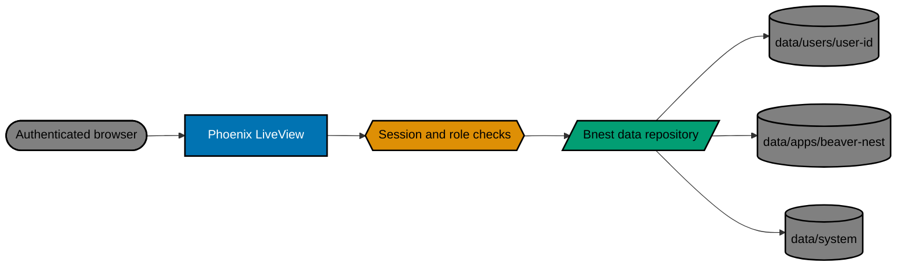
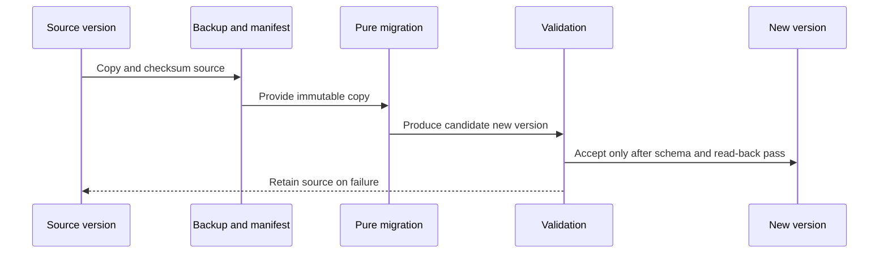

# Technical Documentation

This document proposes a target for [Bnest Centralized Data](README.md). It is not an as-built architecture. Delivery must update the canonical [Bnest C4 model](../../../specs/apps/bnest/app/architecture.md) and executable Gherkin before production code changes.

## Reading Guide

Read this document in order: the architecture shows where data travels, the storage and migration sections explain how existing data is preserved, authentication explains who may access it, and testing proves the safety claims. A _schema_ is the written shape and version of stored JSON; a _manifest_ is the inventory of an import; a _checksum_ is a calculated value used to detect changed data; and an _atomic replace_ means a write becomes visible all at once rather than as a partial file.

## Proposed Architecture

Keep Phoenix LiveView as the public boundary. Add an authentication/session boundary and a server-side repository module that owns identity-derived paths, schema validation, atomic writes, import manifests, and backups. The browser exports only known Bnest storage keys; it never receives arbitrary filesystem access.



`data/system/` is adjacent operational state only. It records manifests and hashes, not user payloads.

## Storage Layout and Ownership

| Location                 | Owner                  | Permitted content                                                                                    |
| ------------------------ | ---------------------- | ---------------------------------------------------------------------------------------------------- |
| `data/users/<user-id>/`  | One authenticated user | Versioned user records, imported browser envelopes, and user-local migration receipts.               |
| `data/apps/beaver-nest/` | Bnest application      | Bnest-wide configuration and shared application data; copied legacy `data/general/` source material. |
| `data/system/`           | Repository/system      | Schema registry, migration manifests, integrity hashes, and non-sensitive operational state.         |

The requested fourth layout position is `data/apps/`, which groups application namespaces. It has no unrelated payload of its own.

Use UTF-8 JSON with explicit schema versions, canonical serialization for checksums, and write-to-temp then atomic replace. All paths are constructed from server-controlled constants and verified user IDs.

## Schema Contract and Evolution

The repository owns the schema. The browser may submit a snapshot, but it never chooses a destination path, schema version, or migration action. Each accepted import is stored as a versioned envelope; its payload is preserved exactly until a separately validated normalizer can derive an application record.

```json
{
  "schemaVersion": 1,
  "recordType": "browser-import",
  "importId": "server-generated-id",
  "ownerId": "stable-server-user-id",
  "source": {
    "storageKey": "bnest.chat.v1",
    "sourceSchemaVersion": 1
  },
  "payload": { "capturedBrowserValue": "fixture-or-imported-value" },
  "integrity": {
    "sha256": "calculated-checksum",
    "capturedAt": "ISO-8601-timestamp"
  },
  "outcome": "accepted"
}
```

This is a public structural example, not a real record. `ownerId`, `importId`, checksum, timestamp, and payload values are placeholders. Real values stay in ignored runtime data and test fixtures use synthetic values only.

Store the current supported versions and migration identifiers in `data/system/schema-registry.json`. Store each immutable import envelope under `data/users/<user-id>/imports/<import-id>.json`; store any normalized application record separately, with its source import ID. This separation makes it possible to inspect or rebuild normalized data without overwriting the source import.

When a schema changes, add a new version instead of changing old files in place:

1. Write the old and new shape, field defaults, removed-field treatment, and compatibility window in the schema registry and affected C4/Gherkin.
2. Add a pure migration function from each supported old version to the new one. It reads a copy and writes a new versioned record; it never edits or deletes the old envelope.
3. Before running it, create a backup and manifest entry containing source path, source checksum, target version, and migration result.
4. Read the new record through the normal Bnest flow, validate its schema and checksum, then mark the manifest accepted. On failure, leave the old record active and retain the failure result for retry.
5. Keep readers for the compatibility window. Remove an old reader only in a later explicit archival plan after restore rehearsal proves the original can still be recovered.



## Migration Mechanics

1. Inventory existing `data/` files and recognized browser keys (`bnest.chat.v1`, `bnest.sifat-allah.v1`, and approved future keys) without mutation.
2. Create a dated, checksummed backup and system manifest before copying any record.
3. After login, import browser snapshots into a user-owned envelope containing the original key, raw payload, source schema, hash, import ID, and outcome. Keep the browser key untouched.
4. Copy legacy `data/general/` entries into versioned Bnest-owned legacy storage; validate hashes before creating normalized application records.
5. Read the centralized representation back through the normal application flow before marking an import accepted.
6. Keep the original browser and legacy sources available. Any archival or deletion requires a separate explicit decision, successful restore rehearsal, and a compatibility sunset plan.

## Authentication and Authorization

Select and document a credential/bootstrap/recovery design before implementation. The minimum implementation boundary is server-verified session identity, password hashes rather than credentials in `data/`, logout, session expiry, protected routes, and authorization checks at every repository operation.

Represent role assignments as a set per authenticated user, allowing any combination of `children`, `parents`, and `admin`. Keep role capability checks separate from ownership and sharing checks. Before delivery, define the capability matrix for each action and any parent-to-child sharing policy; default-deny cross-user access until that policy exists.

## File Impact

| Area                       | Expected change                                                                                         |
| -------------------------- | ------------------------------------------------------------------------------------------------------- |
| `specs/apps/bnest/app/`    | C4 and Gherkin for login, ownership, imports, persistence, failure, and recovery.                       |
| `apps/bnest-app/`          | Authentication, LiveView guards, data repository, schemas, browser import hooks, and migration tooling. |
| `apps/bnest-app-e2e/`      | Login and browser-import journeys with isolated test data.                                              |
| `data/`                    | Ignored placeholders for the new layout; runtime data remains untracked.                                |
| README and governance docs | Current storage, operation, privacy, backup, and recovery guidance.                                     |

## Testing and Rollback

- Unit-test path derivation, authorization, schemas, checksums, atomic replacement, idempotency, and malformed snapshots.
- Integration-test isolated filesystem import, duplicate import, interrupted writes, restore, and legacy-copy validation without network access.
- E2E-test login gating and a browser containing the current storage keys.
- Before each migration stage, make a backup, record manifest and hashes, run the import, re-read central data, and rehearse restore.
- Roll back by disabling new writes and reading the retained source/last accepted record. Never delete source data to make a rollback appear clean.

### Manual AI Verification

Use Playwright MCP with an isolated synthetic account and fixture browser storage, never a real user's browser or data. Log in, import the approved fixture, reload the application, confirm the imported chat and learning state remains available, log out, then verify another synthetic user cannot read it. Record the tool, fixture name, observed result, and any failure in `delivery.md`; do not record cookies, credentials, private URLs, or payload contents.

## Technical Risks

- Browser `sessionStorage` is tab-scoped and may disappear before import; communicate this and import from the browser while available.
- Authentication design remains a prerequisite, not an implementation detail.
- Flat files require process-safe atomicity and clear ownership if concurrent sessions are introduced.
- Legacy data may not match a known schema; preserve it as an opaque envelope and report validation failure rather than coercing or discarding it.
