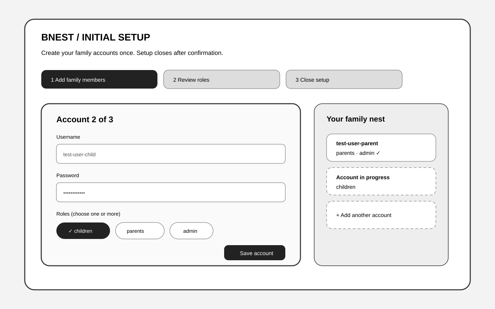
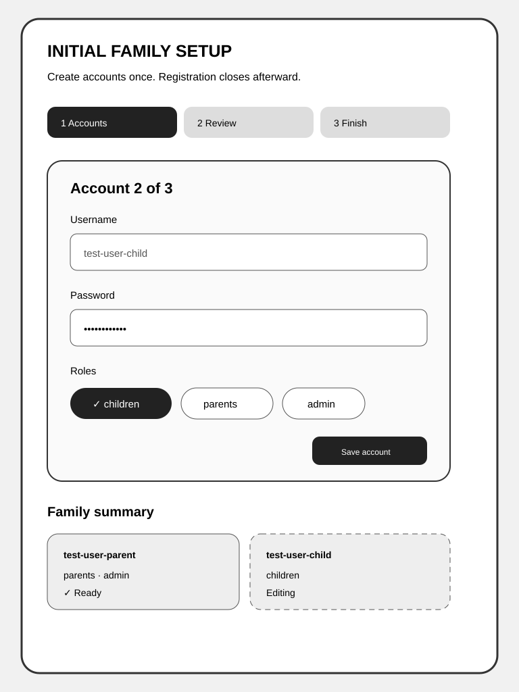
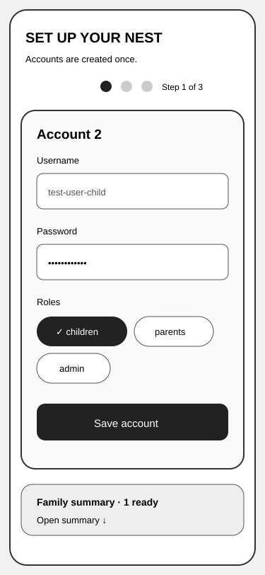
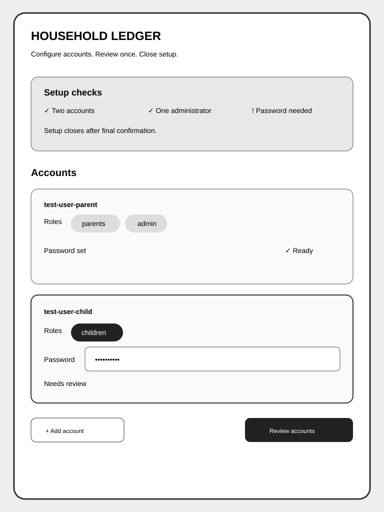
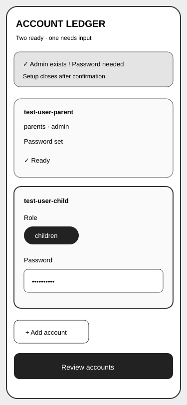
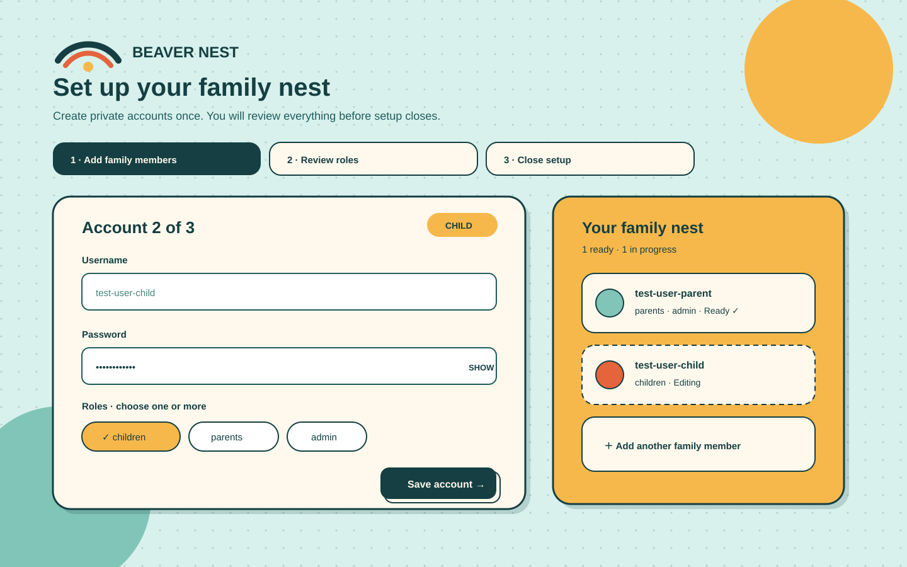
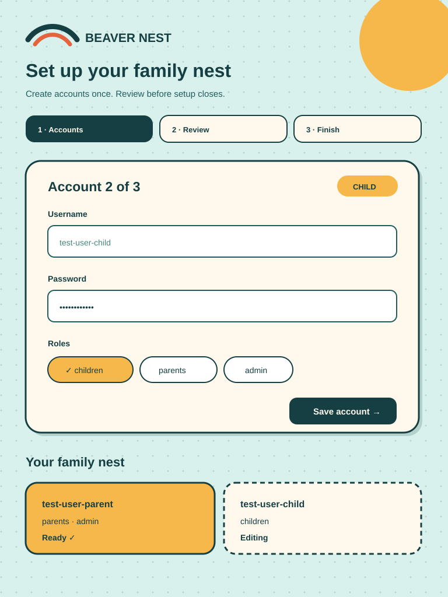
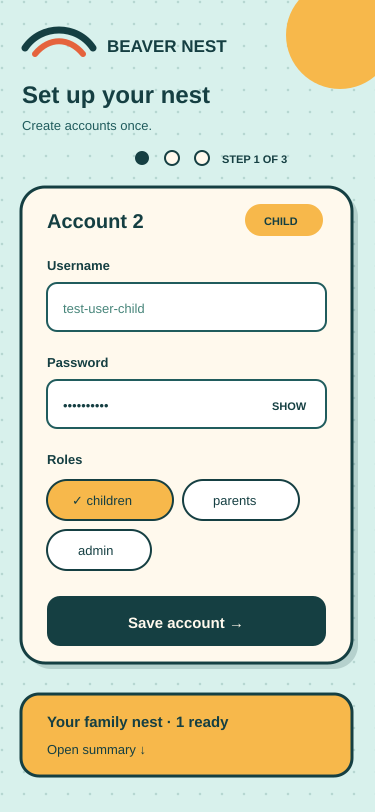

# UI Design Assets

These assets explore the one-time family account setup described by [the PRD](../../prd.md#proposed-acceptance-criteria). They are planning evidence, not production screens. All names and values are synthetic.

## Comparison Method

The study of OSE Public contributed its artifact discipline—not its visual design: fixed viewports, an indexed gallery, explicit responsive notes, and repeatable comparison. Bnest retains its own playful-workshop identity, existing palette, rounded cards, hard shadows, and nest motif.

The comparison uses desktop 1440×900, tablet 768×1024, and mobile 375×812. Every alternative shows the same job: create initial family accounts, assign roles, confirm at least one administrator, and close setup permanently.

## Lo-fi Alternatives

| Alternative              | Desktop                                                                                          | Tablet                                                                                              | Mobile                                                                                                 |
| ------------------------ | ------------------------------------------------------------------------------------------------ | --------------------------------------------------------------------------------------------------- | ------------------------------------------------------------------------------------------------------ |
| **A — Nest Cards**       |          |               |                  |
| **B — Household Ledger** |  |  |  |
| **C — Front Door**       |         |              |                 |

### Decision

**A — Nest Cards is selected.** It makes multiple family members and roles visible without the ledger's density, while keeping setup progress clearer than the Front Door's concealed steps. Its stacked-card composition fits Bnest's existing visual language and collapses naturally to one card per mobile step. The trade-off is more vertical space; desktop and tablet therefore retain a compact family summary beside the active form.

## Selected Hi-fi Direction

| Desktop                                                                                              | Tablet                                                                                        | Mobile                                                                                        |
| ---------------------------------------------------------------------------------------------------- | --------------------------------------------------------------------------------------------- | --------------------------------------------------------------------------------------------- |
|  |  |  |

The mockups use current Bnest tokens: deep teal ink, mint canvas, warm paper, sun yellow, coral, lagoon teal, rounded cards, and offset shadows. Text, icons, shape, and order carry meaning independently of color. Implementation must preserve visible focus, labeled password controls, inline error association, reduced motion, and a confirmation step that states setup cannot be reopened.

## Directory Map

- [Household Ledger desktop lo-fi](ui-household-ledger-lofi-desktop.svg) compares the dense administrator view.
- [Household Ledger mobile lo-fi](ui-household-ledger-lofi-mobile.svg) converts ledger rows to stacked cards.
- [Household Ledger tablet lo-fi](ui-household-ledger-lofi-tablet.svg) compares the responsive ledger.
- [Front Door desktop lo-fi](ui-front-door-lofi-desktop.svg) compares the focused progressive flow.
- [Front Door mobile lo-fi](ui-front-door-lofi-mobile.svg) compares the single-task mobile flow.
- [Front Door tablet lo-fi](ui-front-door-lofi-tablet.svg) compares the centered progressive flow.
- [Nest Cards desktop hi-fi](ui-nest-cards-hifi-desktop.svg) defines the selected desktop direction.
- [Nest Cards desktop lo-fi](ui-nest-cards-lofi-desktop.svg) explores the desktop card composition.
- [Nest Cards mobile hi-fi](ui-nest-cards-hifi-mobile.svg) defines the selected mobile direction.
- [Nest Cards mobile lo-fi](ui-nest-cards-lofi-mobile.svg) explores the mobile card flow.
- [Nest Cards tablet hi-fi](ui-nest-cards-hifi-tablet.svg) defines the selected tablet direction.
- [Nest Cards tablet lo-fi](ui-nest-cards-lofi-tablet.svg) explores the tablet card composition.
