# Migration Design

This companion to [technical documentation](README.md) defines how current browser and root-level runtime data reaches the [target contracts](data-contracts.md) without disappearing or becoming unavailable.

## Safety Invariants

- Copy before normalize; verify before switching the reader; never move or delete a legacy filesystem source in this plan.
- A browser key remains untouched until its immutable envelope, normalized server record, checksum, and normal product read-back all pass.
- An accepted server record is never replaced by a failed candidate.
- A stale browser revision never overwrites a newer accepted server record; the user refreshes before retrying.
- Every source receives one observable manifest outcome: absent, pending, accepted, retryable, or rejected.
- Retrying the same owner/source/checksum is idempotent.
- Logs, plan evidence, and committed fixtures never contain private payloads or identity-bearing production paths.

## Current Source Inventory

### Chat browser snapshot

- **Source:** `sessionStorage["bnest.chat.v1"]`; tab-scoped.
- **Current writer:** `apps/bnest-app/assets/js/app.js` stores completed snapshots.
- **Current reader:** `ChatLive` receives `chat` connect data; `BnestApp.Chat` accepts versions 1 and 2.
- **Limits:** connect payload at most 500,000 bytes; normalized limits remain those in [central chat](data-contracts.md#central-chat).
- **Owner:** the user who authenticates and explicitly confirms that browser's import.
- **Destination:** immutable `users/<user-id>/imports/<import-id>.json`, then `users/<user-id>/chat/current.json`.
- **Compatibility:** version 1 gets current default model/reasoning before version-2 validation; version 2 validates directly.
- **Disposition proof:** envelope checksum, accepted manifest, normal chat read-back, then absence of only this browser key.

### Sifat Allah browser snapshot

- **Source:** `localStorage["bnest.sifat-allah.v1"]`.
- **Current writer:** `apps/bnest-app/assets/js/app.js` stores progress and optional activity state.
- **Current reader:** `SifatAllahLive`; `BnestApp.SifatAllah` accepts versions 1 and 2.
- **Limits:** encoded value at most 10,000 bytes; IDs and counters follow the existing validator.
- **Owner:** the authenticated user confirming import.
- **Destination:** immutable import envelope, then `users/<user-id>/sifat-allah/progress.json`.
- **Compatibility:** existing pure version-1 restore produces version-2 progress; invalid optional activity state falls back to the dashboard without losing valid progress.
- **Disposition proof:** envelope checksum, accepted manifest, normal dashboard/quiz read-back, then absence of only this browser key.

### Explicit theme

- **Source:** `localStorage["phx:theme"]`.
- **Current writer/reader:** `root.html.heex` accepts only `light` or `dark`; absence means system theme.
- **Owner:** the authenticated user confirming import.
- **Destination:** `users/<user-id>/preferences/theme.json` for an explicit value; no file for system theme.
- **Compatibility:** reject any other value without changing client or server preference.
- **Disposition proof:** explicit preference read-back or manifest-recorded absence, followed by removal of only an accepted explicit key.

### Root-level runtime folders

- **Sources:** every ignored file below root-level `data/general/`, `data/apps/`, `data/system/`, and `data/users/`.
- **Current readers/writers:** unknown until Phase 1 code/reference inspection and private runtime inventory.
- **Owner:** determined per file as repository-shared, Bnest-shared, system, or one user; never guessed from payload values.
- **Destination:** the same relative namespace under `data/prod/`; Bnest legacy material without a safe normalized owner goes beneath `data/prod/apps/beaver-nest/legacy/<import-id>/`.
- **Compatibility:** known forms may normalize only after their opaque copy passes checksum; unknown/malformed forms remain opaque.
- **Disposition proof:** private inventory receipt, source/recovery-copy checksums, destination read-back, and unchanged source checksum.

Phase 1 records exact private source/destination paths outside Git. If ownership cannot be proven, the file stays only as a preserved legacy copy and the manifest reports `owner-unresolved`; implementation must not invent a user.

## Transition Stages

### 1. Expand

1. Add identity, repository, versioned readers, manifests, immutable recovery sources, and the `data/prod/` layout while old browser readers still work.
2. Start Bnest with one resolved runtime root and fail before supervision when it is invalid.
3. Add central writers behind an import/cutover state; do not remove browser writes yet.
4. Add read-only inventory for legacy root-level sources and produce no mutation.

**Checkpoint:** existing chat and Sifat Allah behavior still works; empty production roots bootstrap; test roots cannot resolve to production; every source has a reader, owner decision, destination, and failure outcome.

### 2. Migrate

For each confirmed browser source:

1. Read only the named key and validate its byte limit.
2. Generate `import-id`; calculate the exact source checksum.
3. Under the owner/source/checksum idempotency lock, write the immutable envelope that serves as browser recovery source and the pending manifest.
4. Parse through the existing source reader, normalize into the target contract, and atomically write a candidate without replacing a previous accepted record on failure.
5. Keep the browser key unchanged.

For each root-level source, copy exact bytes to its owner/application legacy recovery path and compare that checksum with the unchanged source. When its shape and destination are proven, normalize a separate candidate into the mapped production record and verify it through the normal reader. An unresolved source remains only in its original path plus the immutable application recovery path.

**Checkpoint:** repeated attempts do not duplicate accepted state; malformed/unknown inputs remain available; manifests explain every safe outcome without exposing payloads.

### 3. Verify and switch

1. Re-read the destination through the same `DataRepository.read` operation used by the LiveView.
2. Render the relevant chat, learning, or theme state in the normal authenticated product flow.
3. Compare schema, owner, source import ID, and checksum-derived evidence.
4. Atomically mark the manifest accepted.
5. Tell the browser to remove only the accepted Bnest key.
6. Confirm the key is absent and another non-Bnest key, when present in a synthetic test, remains unchanged.

**Checkpoint:** reload and browser restart continue from central data; a browser that has not imported still reads its untouched source; no accepted server record or legacy filesystem source disappeared.

### 4. Contract compatibility

After one browser accepts an import, JavaScript stops persistently writing that record type in that browser. Other browsers may retain their legacy keys until each completes its own import. The server keeps old version readers, envelopes, legacy recovery copies, manifests, and root-level sources for the entire plan.

Deleting envelopes, recovery copies, manifests, old readers, or root-level legacy folders is outside scope and requires a later explicitly authorized archival plan.

## Browser Import State Machine

```mermaid
stateDiagram-v2
  [*] --> SourceAbsent
  [*] --> AwaitingConfirmation: recognized key exists
  AwaitingConfirmation --> Preserved: user confirms; immutable envelope written
  Preserved --> CandidateWritten: source validates and atomic write succeeds
  CandidateWritten --> Accepted: normal product read-back succeeds
  Accepted --> ClientCleared: accepted key removed
  Preserved --> Retryable: parse or write/read-back fails
  CandidateWritten --> Retryable: read-back fails
  AwaitingConfirmation --> Rejected: unsupported or oversized
  Retryable --> Preserved: retry same idempotency identity
  SourceAbsent --> [*]
  ClientCleared --> [*]
  Rejected --> [*]
```

`Rejected` and `Retryable` preserve the browser key and previous accepted server record. `ClientCleared` is terminal only for that key in that browser.

## Failure and Recovery Matrix

| Failure point                          | Source state                         | Accepted destination                    | Manifest result                        | Next action                                              |
| -------------------------------------- | ------------------------------------ | --------------------------------------- | -------------------------------------- | -------------------------------------------------------- |
| Oversized/unknown browser input        | Untouched                            | Untouched                               | `rejected`                             | Correct source or leave it available.                    |
| Envelope/recovery-copy write fails     | Untouched                            | Untouched                               | No acceptance; safe write error        | Repair storage and retry.                                |
| Source parsing fails                   | Envelope and key retained            | Previous record retained                | `rejected` or `retryable` by category  | Keep opaque evidence; do not coerce.                     |
| Candidate write fails                  | Envelope and key retained            | Previous record retained                | `retryable`                            | Repair and retry same identity.                          |
| Normal read-back fails                 | Envelope and key retained            | Previous accepted reader remains active | `retryable`                            | Restore previous accepted record, diagnose candidate.    |
| Browser key removal fails              | Server record accepted; key retained | Accepted                                | `accepted` with cleanup pending        | Retry client cleanup; import remains idempotent.         |
| Second browser writes a stale revision | Source/envelope retained             | Newer accepted record retained          | `stale-revision`                       | Refresh that record, show conflict, retry intentionally. |
| Process stops mid-import               | Source retained                      | Previous accepted record retained       | pending/retryable after reconciliation | Inspect manifest and temp files, then resume safely.     |

Startup reconciliation may remove only repository-owned temporary files proven by manifest and naming rules. It never deletes an envelope, recovery copy, accepted record, browser key, or legacy source.

## Recovery Source and Restore

Before normalization, preserve exact bytes independently of the target parser: the browser envelope payload for a browser source, or an owner/application legacy copy for a filesystem source. A restore rehearsal uses only synthetic data:

1. Stop writes for the affected record.
2. Resolve the manifest and verify its recovery-source checksum.
3. Parse the recovery source through the source-version reader.
4. Produce a candidate at a temporary path; validate and re-read it.
5. Atomically replace only the failed target, preserving the current file as additional evidence.
6. Read the restored record through the normal product operation and record safe pass/fail evidence.

Live rollback requires maintainer authority. Stop new centralized writes first, then either keep reading the retained previous accepted record or restore from the manifest's verified recovery source. Never delete a source or rewrite a manifest to make rollback look successful.

## Test Isolation and Manual Proof

All automated and AI-operated migration tests use a unique marked `data/test/runs/<run-id>/`, generated `test-user-<suite>-<run-id>` accounts, synthetic browser payloads, and isolated browser contexts. They must prove successful, duplicate, malformed, interrupted, read-back-failed, stale-revision, and cleanup-pending outcomes.

Production may be inspected only through the structural [schema-audit projection](data-contracts.md#production-schema-audit-projection). It is not a migration rehearsal and may not authenticate, copy payloads, or mutate production.

Manual AI proof records the tool, synthetic fixture name, expected state transition, and result in [delivery](../delivery.md). It never records cookies, passwords, private URLs, concrete identity paths, or payloads.
