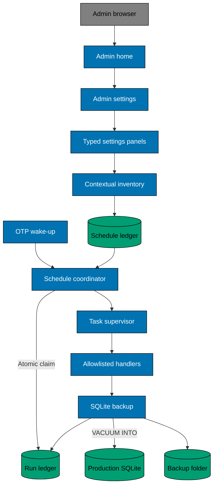
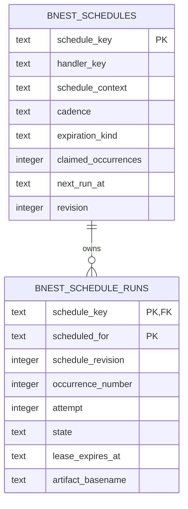
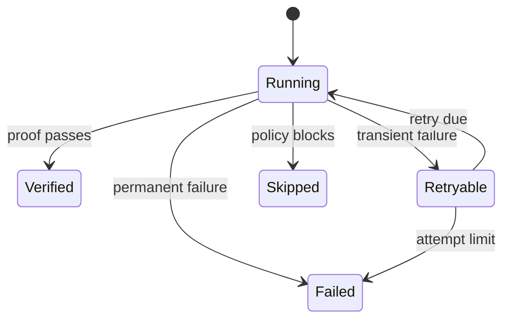
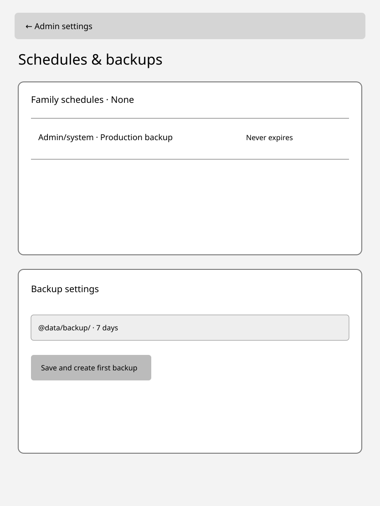
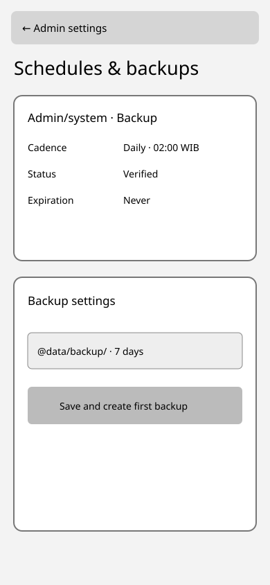
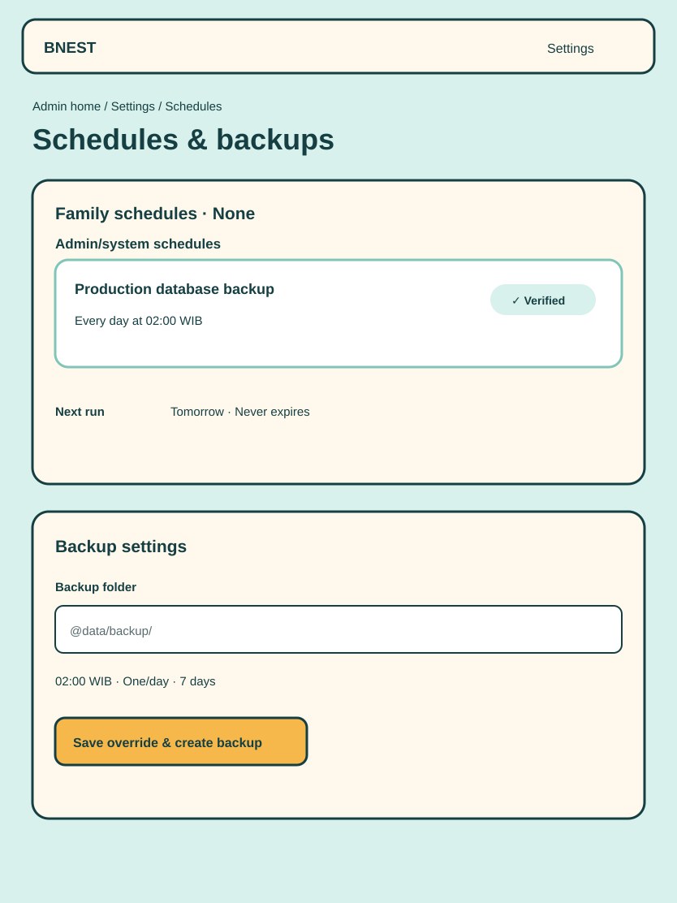
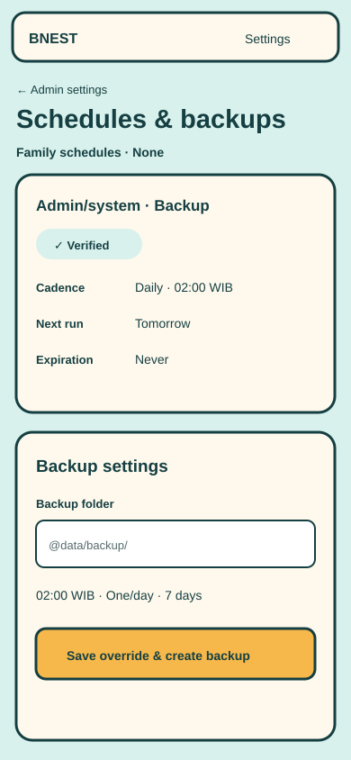

# Technical Design

## Current State

Bnest's authoritative production data is the SQLite database resolved by `BnestApp.Storage.Config`; retired repository flat files are not a backup source. Existing storage relocation already uses SQLite `VACUUM INTO` and logical proof, but there is no recurring backup process, durable schedule ledger, private backup-destination configuration, or application-owned schedule inventory.

The existing `/storage` route is server-side admin-only but there is no central inventory for admin-owned configuration. This plan adds `/admin/settings` and `/admin/settings/schedules` under the same authenticated `admin_only` pipeline. Admin home links to both the settings index and its schedules shortcut; non-admin users see neither.

## Requirements and Assumptions

- Back up only the authoritative production SQLite database; never copy retired flat files, WAL/SHM files, repository data, browser storage, Codex state, or credentials.
- Default `prod-sqlite-backup-daily` to `02:00 WIB (UTC+07:00)` and let an admin change its enabled state and daily WIB time.
- Default the destination to `@data/backup/`, meaning repository-root `data/backup/`, and let an admin choose a validated safe override.
- Keep at most one newest verified owned pair for each of the latest seven WIB calendar dates; preserve unknown files and every backup in a previous destination.
- Persist each schedule's `family` or `admin_system` context, claims, retries, and safe results in SQLite so restart and blue/green overlap cannot lose or duplicate a due run.
- Reuse one scheduler core for every allowlisted daily handler; do not build backup-specific scheduling machinery.
- Show persisted daily schedules in separate Family and Admin/system groups with next run, state, last result, and safe recovery guidance.
- Make every admin-editable configuration area discoverable through one code-declared Admin settings registry while preserving domain-owned validation and persistence.

## Decision

Use built-in Elixir/OTP supervision: a generic `GenServer` wakes on `Process.send_after/3`, SQLite is the scheduling source of truth, and a named `Task.Supervisor` runs allowlisted handlers from both contexts. Do not add Oban, Quantum, a cron parser, or a timezone package.

OTP is capable of the process lifecycle and execution needed here. A timer alone is not durable, so each wake-up atomically claims due work and advances its schedule in SQLite. The application reconciles overdue schedules and expired leases at startup. Schedule rows store a fixed UTC daily time and display offset; `02:00 WIB` is `19:00 UTC` on the preceding date, and WIB has no daylight-saving transition. IANA timezone support becomes a new decision only if schedules with offset transitions are required.

This is smaller than adopting a job framework for allowlisted daily workloads and follows the repository's [dependency-selection standard](../../../repo-governance/development/dependency-selection.md). Adding another daily handler reuses persistent contextual schedules, unique claims, bounded retry, missed-run recovery, no overlap, safe history, and supervised execution.

Use a code-owned `AdminConfig.Registry` to enumerate typed settings panels. The registry stores no values and accepts no dynamic modules. Each panel declares its key, label, admin authorization, owner module, editable fields, and safe summary in code; its domain performs reads, validation, and atomic save. The initial index registers existing **Data storage** as a link to its owner and **Schedules & backups** as the new panel. Schedule enabled/time and permitted expiry stay in SQLite. An optional destination override stays in private `backup.json`; seven-day retention is code-owned, not editable. Separate owner forms prevent a cross-store partial save.

### Scheduler Alternatives

| Option                                | Benefit                                                                        | Cost or gap                                                                                         | Decision                                    |
| ------------------------------------- | ------------------------------------------------------------------------------ | --------------------------------------------------------------------------------------------------- | ------------------------------------------- |
| OTP wake-up plus SQLite ledger        | Reuses the runtime and makes claims, history, context, and admin reads durable | Bnest owns a small daily-only coordinator                                                           | Selected for the approved scope             |
| Oban, Quantum, or another job package | Supplies broader scheduling features                                           | Adds dependencies and abstractions not needed by allowlisted daily jobs                             | Revisit only when scope triggers justify it |
| Host cron invoking Bnest              | Simple outside-process wake-up                                                 | Splits ownership and still needs in-app claims, context, history, configuration, and overlap safety | Rejected                                    |

## Architecture



`BnestApp.Application` starts the SQLite repo, `Task.Supervisor`, then the scheduler before the endpoint. The scheduler contains no backup business logic: it asks the store for due claims, resolves stored `handler_key` through a code allowlist, and supervises the task. Registry entries require a `family` or `admin_system` context. Production readiness checks schema and liveness, but a failed handler does not take the family application offline. Tests disable automatic ticking and inject a clock.

## Persistent Scheduling Model

Add an expand-only Ecto migration with these logical tables:

### Logical ERD



One schedule owns many historical run slots. The composite run key `(schedule_key, scheduled_for)` is the duplicate barrier; retries update that slot's attempt and state rather than creating another occurrence.

```sql
CREATE TABLE bnest_schedules (
  schedule_key TEXT PRIMARY KEY,
  label TEXT NOT NULL,
  handler_key TEXT NOT NULL,
  schedule_context TEXT NOT NULL CHECK
    (schedule_context IN ('family', 'admin_system')),
  cadence TEXT NOT NULL CHECK (cadence = 'daily'),
  daily_at_utc TEXT NOT NULL,
  display_timezone TEXT NOT NULL,
  enabled INTEGER NOT NULL CHECK (enabled IN (0, 1)),
  expiration_kind TEXT NOT NULL CHECK
    (expiration_kind IN ('never', 'at', 'after_occurrences')),
  expires_at TEXT,
  max_occurrences INTEGER CHECK
    (max_occurrences IS NULL OR max_occurrences > 0),
  claimed_occurrences INTEGER NOT NULL CHECK (claimed_occurrences >= 0),
  expired_at TEXT,
  next_run_at TEXT NOT NULL,
  revision INTEGER NOT NULL CHECK (revision >= 1),
  inserted_at TEXT NOT NULL,
  updated_at TEXT NOT NULL,
  CHECK (
    (expiration_kind = 'never' AND expires_at IS NULL AND max_occurrences IS NULL) OR
    (expiration_kind = 'at' AND expires_at IS NOT NULL AND max_occurrences IS NULL) OR
    (expiration_kind = 'after_occurrences' AND expires_at IS NULL AND max_occurrences IS NOT NULL)
  )
);

CREATE TABLE bnest_schedule_runs (
  schedule_key TEXT NOT NULL REFERENCES bnest_schedules(schedule_key),
  scheduled_for TEXT NOT NULL,
  schedule_revision INTEGER NOT NULL CHECK (schedule_revision >= 1),
  occurrence_number INTEGER NOT NULL CHECK (occurrence_number >= 1),
  attempt INTEGER NOT NULL CHECK (attempt >= 1),
  state TEXT NOT NULL CHECK (state IN
    ('running','retryable','verified','failed','skipped')),
  lease_expires_at TEXT,
  next_attempt_at TEXT,
  artifact_basename TEXT,
  artifact_sha256 TEXT,
  artifact_bytes INTEGER CHECK (artifact_bytes IS NULL OR artifact_bytes >= 0),
  failure_category TEXT,
  started_at TEXT NOT NULL,
  finished_at TEXT,
  PRIMARY KEY (schedule_key, scheduled_for)
);

CREATE INDEX bnest_schedules_due_idx
  ON bnest_schedules(enabled, expired_at, next_run_at);
CREATE INDEX bnest_schedules_context_idx
  ON bnest_schedules(schedule_context, label);
CREATE INDEX bnest_schedules_expiry_idx
  ON bnest_schedules(expired_at, expiration_kind, expires_at);
CREATE INDEX bnest_schedule_runs_retry_idx
  ON bnest_schedule_runs(state, next_attempt_at, lease_expires_at);
```

The release seeds `prod-sqlite-backup-daily` with handler `prod_sqlite_backup`, context `admin_system`, UTC time `19:00`, display timezone `WIB (UTC+07:00)`, expiration `never`, zero claimed occurrences, and revision `1`. Production backup's registry policy fixes expiration to `never` so protection cannot silently stop. Another schedule may expose `never`, an absolute `at` entered/displayed in WIB and stored in UTC, or positive `after_occurrences` through its typed admin panel.

There are no implicit schema defaults: migrations and store commands supply every value. The store validates strict `HH:MM`, UTC ISO 8601, known context/cadence/state/expiration values, compatible nullable expiration fields, positive limits/revisions/attempts, and allowlisted schedule/handler pairs. Executable module/function names never come from SQLite. A future daily schedule in either context adds a migration plus allowlist entry and reuses the same coordinator, supervisor, tables, claims, retries, expiry logic, and read models.

Context is classification plus a presentation boundary. The admin reader returns both contexts in separate groups. Any future family-facing reader must request only `family`; no public unscoped list exists. Context never grants access by itself.

Registry policy declares which schedule fields an admin may edit. Saving enabled state or daily time uses one immediate SQLite transaction, increments `revision`, and recomputes the next future occurrence without creating a retroactive run. Expiry editing is exposed only when the registry entry permits it. Handler, context, cadence kind, retry/lease policy, and executable code are always code-owned. Invalid or stale revisions change nothing and return a conflict-safe form error.

Every minute, and once at startup, the coordinator opens `Repo.transaction(mode: :immediate)` to serialize writers. It first expires absolute policies whose instant has arrived, without catch-up. It then finds due enabled, unexpired schedules or retryable/expired leases, inserts the unique run claim, increments `claimed_occurrences` once per slot, and advances `next_run_at` atomically. A final `after_occurrences` claim also sets `expired_at` but still dispatches that final run. Retry attempts reuse the occurrence number and never increment it.

When multiple days were missed, startup creates at most one latest-slot catch-up only if the schedule is still unexpired, then moves `next_run_at` forward; it never manufactures obsolete snapshots. A running lease prevents overlap. An expired lease becomes retryable, transient failures receive at most three attempts, and permanent/configuration failures become `failed` or `skipped`. An explicitly editable expired schedule can start a new revision only through a validated admin action that sets a new policy, resets the lifecycle occurrence counter, recomputes the next future run, and explicitly enables it; history remains in the run ledger.



Rows contain no absolute path, payload, or user identity. The down migration refuses while schedule/run records exist. Release manifests declare `bnest-persistent-schedules-v1`; managed release applies and verifies expansion before candidate startup, never at slot boot.

## Private Configuration and Artifacts

With no override, `BnestApp.Backup.Config` resolves `@data/backup/` to `<repo-root>/data/backup/`. This exact ignored runtime directory is the only repository-contained destination allowed. It exists under the Dropbox-synced repository so completed immutable snapshots sync, while the authoritative live SQLite database remains outside Dropbox.

An optional pointer at `~/.config/bnest/backup.json`, or test-only `BNEST_BACKUP_CONFIG`, is atomically written `0600` beneath a `0700` parent:

```json
{
  "schemaVersion": 1,
  "destinationDirectory": "<absolute-private-folder>"
}
```

The validator permits the exact resolved default or an absolute, existing or creatable, writable, non-symlinked override outside the repository, source database directory, storage configuration directory, and marked test roots. It creates a value-free `.bnest-backup-root.json` ownership marker. `.gitignore` excludes the whole runtime folder; release/readiness rejects a tracked marker or artifact. Unsupported permissions, overlap, any other repository path, or a changed marker blocks configuration. Changing the destination never moves or deletes old backups.

```text
<backup-folder>/
├── .bnest-backup-root.json
├── bnest-prod-<utc-timestamp>-<run-id>.sqlite3
└── bnest-prod-<utc-timestamp>-<run-id>.receipt.json
```

The receipt contains schema version, schedule/run identity, UTC time, source generation, artifact basename, SHA-256, byte size, and `quick_check` outcome. It contains no absolute path, record count, account identity, or payload. Artifacts are `0600`; temporary files use the same directory and `.partial` suffix.

## Backup Flow

1. The task reads the claimed schedule/run identity; the destination is never passed in logs or persisted run payloads.
2. It confirms `sqlite_primary` and production profile, reads the current private destination, and validates its marker.
3. It rejects insufficient free space using source size plus a bounded safety margin, creates an exact owned partial name, and runs `VACUUM INTO` through the authoritative repo. Raw file copy is forbidden.
4. It opens the candidate independently, runs `PRAGMA quick_check`, compares schema versions and value-free logical checksums through an extracted storage-proof module, then fsyncs and atomically renames the artifact.
5. It writes the receipt atomically and marks the run `verified`. It keeps the newest verified owned pair for each of the current and previous six WIB dates, removing older-date and superseded same-date owned pairs only after verification. Unknown, unowned partial, mismatched, or previous-folder files remain untouched.
6. Invalid destination policy or an ownership-marker mismatch records `skipped` with a safe category. Transient availability, capacity, or SQLite failures become retryable. A corrupt candidate is removed only by its exact owned partial path; the last verified backup remains.

Snapshot creation uses a destination-local `.partial` name, private permissions, fsync, verification, then atomic rename to the final `.sqlite3` name. Dropbox may observe a clearly partial transient file but never treats it as a final Bnest artifact; interrupted owned partials are reconciled by exact name. Bnest never opens a final backup for mutation.

The default works headlessly without an admin visit. Saving a valid override creates one idempotent setup claim so the new location is proved without waiting until the next day. Repeated submission cannot create concurrent backups.

## Restore and Recovery

Automated restore is out of scope. Delivery proves the newest verified artifact opens in an isolated marked test destination, passes integrity/schema checks, and serves normal repository reads. Operational recovery validates a selected artifact, then changes the storage pointer through existing relocation/recovery controls; it never overwrites the active database.

If a release stops mid-backup, startup reconciles the expired lease and retries. If the destination disappears, the application remains healthy, the run becomes retryable/failed, and the dashboard keeps the last verified result plus corrective guidance. Rollback uses the previous compatible release against the expanded schema and does not remove schedule tables or backup files.

## UI Design

The user is an authenticated admin entering **Admin settings**, then **Schedules & backups**. Real copy includes **Family schedules**, **Admin/system schedules**, **Production database backup**, **Enabled**, **Daily time (WIB)**, **Expiration: Never**, **Backup folder**, **Default: @data/backup/**, **Keep one per day for 7 days**, and **Save and create first backup**. States are setup required, queued, running, retrying, verified, failed, expired, disabled, and destination unavailable.

Admin home exposes **Admin settings** and a **Schedules & backups** shortcut. The settings index lists every code-declared area; the schedules section separates Family and Admin/system groups, shows expiry summaries, and provides independent forms for SQLite schedule fields and private backup fields. It links back to Admin settings and admin home. Direct navigation remains supported but is never required.

### Alternatives

- **A — Context ledger, selected:** family/admin-system groups plus one row per daily job and typed settings panels. It scales to more jobs and becomes stacked cards on mobile.
- **B — Seven-day timeline, not selected:** upcoming runs are visually clear, but history and recovery compete with calendar space.
- **C — Status cards, not selected:** easiest implementation, but multiple schedules lose comparison and next-run ordering.

| Alternative        | Usability                  | Accessibility               | Cost   | Product fit                    |
| ------------------ | -------------------------- | --------------------------- | ------ | ------------------------------ |
| Schedule ledger    | Fast comparison and detail | Table-to-list reading order | Medium | Selected for future daily jobs |
| Seven-day timeline | Strong upcoming-time view  | Dense at zoom/mobile        | High   | Too calendar-centric           |
| Status cards       | Clear with one job         | Repeated headings           | Low    | Weak when the registry grows   |

#### Lo-fi A — schedule ledger (selected)





#### Lo-fi B — seven-day timeline (not selected)


#### Lo-fi C — status cards (not selected)


#### Selected hi-fi — schedule ledger





The selected design reuses Bnest's Nest workshop tokens: ink `#153f42`, canvas `#d8f1ec`, paper `#fff9ed`, sunflower `#f7b84b`, coral `#e5633d`, and lagoon `#80c5b8`. Desktop uses contextual groups with a settings rail; tablet uses one column; mobile converts each row to a labeled card. No new font, color system, chart library, or animation is added.

Keyboard order is page heading, schedule detail control, folder field, then save. The selected row uses `aria-current`, status changes use `aria-live="polite"`, failures use `role="alert"`, and folder errors focus the summary. Status always pairs text and icon with color. Loading preserves navigation; focus survives LiveView patches; 200% zoom reflows without horizontal scrolling; reduced motion removes decorative transitions.

## Authorization and Privacy

`/admin/settings` and `/admin/settings/schedules` remain inside `[:browser, :authenticated_browser, :admin_only]`. The plug rejects non-admin and unauthenticated requests before LiveView mount and before registry, schedule, run-ledger, or config reads. Revoked sessions and users without a current server-side `admin` role receive the existing not-found response. Tests cover children, parents, mixed non-admin roles, revoked sessions, direct navigation, context grouping, and exclusion of `admin_system` rows from family-scoped readers.

Home renders both entry points only after resolving the current server-side admin role. This presentation rule is defense in depth; each destination route authorizes independently. The registry is code-owned and every submitted panel key and field is allowlisted before owner reads or writes.

Logs, telemetry, errors, and committed fixtures use schedule keys and safe categories only. The full configured path is rendered only to the authorized admin. No endpoint returns backup files for download.

## Testing Strategy

- **Unit — `bnest-app:test:unit`:** prove daily-time arithmetic, context/handler allowlists, expiry boundaries, occurrence counting, retry classification, receipt parsing, and retention selection with an injected clock and synthetic names.
- **Integration — `bnest-app:test:integration`:** use an isolated migrated SQLite database and marked temporary backup root to prove immediate claims, restart/catch-up, two-coordinator overlap, leases, `VACUUM INTO`, independent verification, atomic artifacts, and safe cleanup.
- **Behavior — `bnest-app:test:coverage:behaviour`:** bind every selected canonical scenario through both app adapters and the E2E compliance adapter; no step may be undefined or exempted.
- **E2E — `bnest-app-e2e:test:e2e`:** run only the affected exact-origin admin journey with unique `test-user-<run-id>` identities, connected LiveView/WebSocket, desktop/tablet/mobile viewports, reconnect, and non-admin direct-route denial.

Tests never read production records or expose configured paths or payloads. Each run records only value-free pass/fail, schedule keys, synthetic artifact basenames, and revision evidence. Its finalizer stops browsers and test servers, then removes only the exact validated marked SQLite and backup roots; cleanup failure fails the gate.

## Active-Service Rollout

Follow [live-service continuity](../../../repo-governance/development/live-service-continuity.md). Baseline the active Caddy route and SQLite readiness. Apply the compatible schema expansion, then build an independent candidate whose readiness proves schedule schema, coordinator liveness, and allowlist reconciliation. Promote through Caddy, prove intended revision plus connected LiveView/WebSocket recovery without refresh, drain five minutes, and retain the previous artifact until the first isolated scheduled-backup smoke succeeds. A scheduler, backup, or dashboard failure rolls the route back without changing Tailscale; backup files and expanded tables remain safe.

## Specification Changes

AC-01 through AC-11 become durable contracts because they change storage ownership, reusable scheduling, context/expiry policy, authorization, failure behavior, admin configuration, and UI. Rollout mechanics remain plan-level operational criteria proved in `delivery.md`.

### [E] `specs/apps/bnest/app/architecture.md`

```diff
+ System context: add the admin-to-settings relationship and preserve non-admin denial.
+ Container view: add OTP coordinator, task supervisor, schedule/run SQLite stores, and Dropbox-synced backup boundary.
+ Component view: add typed settings registry, context policy, allowlisted handlers, expiry claims, and backup proof flow.
+ SQLite remains the sole production backup source.
```

- = Preserve Caddy, authentication, user ownership, and SQLite authority.
- ✓ Proof: architecture map gate, candidate readiness, and routed admin journey.

### [N] `specs/apps/bnest/app/behaviours/scheduled_backups.feature`

```diff
+ Admin discovers typed settings and configures allowed backup parameters.
+ Non-admin cannot view settings, schedules, or backup details.
+ Persistent daily schedule produces one verified SQLite backup.
+ Restart catches up once and overlapping releases cannot duplicate a slot.
+ Date/time and occurrence policies expire without duplicate counts.
+ Failure preserves the last verified backup and reports safe recovery.
+ Dashboard separates family and admin/system schedules.
+ A second allowlisted handler reuses the same scheduler core.
```

No existing scenario changes because this is a new feature file.

<details>
<summary>New scenario inventory</summary>

- **Use the Dropbox-synced default:** an admin with no override resolves a backup and receives the verified `@data/backup/` result.
- **Save a safe override:** an admin submits a valid private folder and gets one atomic save plus one idempotent setup run.
- **Persist a daily schedule across restart:** a saved schedule restarts before due time and retains one future UTC slot.
- **Catch up only the latest missed slot:** startup after multiple missed days claims only the newest eligible occurrence.
- **Back up authoritative SQLite:** a claimed production run snapshots only the configured SQLite primary and verifies the candidate independently.
- **Claim a slot once and recover:** overlapping releases or an expired lease produce one slot identity, no overlap, and at most three attempts.
- **Show contextual daily schedules:** an admin enters from home and sees family and admin/system rows, safe state, and typed settings.
- **Deny schedule and configuration access:** an unauthenticated, revoked, or non-admin visitor receives not-found before any protected read.
- **Retain only owned verified artifacts:** a verified run keeps the current seven-WIB-day window and preserves every unowned or previous-folder file.
- **Reuse one scheduler across contexts:** a second allowlisted handler uses the shared claim, runner, ledger, and contextual inventory.
- **Discover typed admin configuration:** an admin sees every declared panel while each domain validates and commits independently.
- **Expire schedules deterministically:** date/time and occurrence policies block future claims without counting retries or suppressing the final occurrence.

</details>

- → Bindings: `apps/bnest-app/test/behaviour/steps/scheduled_backup_steps.exs`, `apps/bnest-app/test/behaviour/support/integration.exs`, `apps/bnest-app/test/behaviour/support/unit.exs`, `apps/bnest-app-e2e/tests/steps/scheduled-backups.steps.ts`, and `apps/bnest-app-e2e/tests/support/scheduled-backups.ts`.
- ✓ Proof: `bnest-app:test:coverage:behaviour`, isolated `bnest-app:test:integration`, `bnest-app-e2e:test:coverage:behaviour:e2e`, and focused exact-origin `bnest-app-e2e:test:e2e`.

## File Impact

```text
.gitignore                                                                  [E]
apps/bnest-app/config/test.exs                                             [E]
apps/bnest-app/lib/bnest_app/application.ex                               [E]
apps/bnest-app/lib/bnest_app/admin_config/registry.ex                     [N]
apps/bnest-app/lib/bnest_app/scheduler.ex                                 [N]
apps/bnest-app/lib/bnest_app/scheduler/registry.ex                        [N]
apps/bnest-app/lib/bnest_app/scheduler/policy.ex                          [N]
apps/bnest-app/lib/bnest_app/scheduler/store.ex                           [N]
apps/bnest-app/lib/bnest_app/scheduler/run.ex                             [N]
apps/bnest-app/lib/bnest_app/backup/config.ex                             [N]
apps/bnest-app/lib/bnest_app/backup/location.ex                           [N]
apps/bnest-app/lib/bnest_app/backup/receipt.ex                            [N]
apps/bnest-app/lib/bnest_app/backup/run.ex                                [N]
apps/bnest-app/lib/bnest_app/storage/proof.ex                             [N]
apps/bnest-app/lib/bnest_app/storage/relocation.ex                        [E]
apps/bnest-app/lib/bnest_app_web/controllers/health_controller.ex        [E]
apps/bnest-app/lib/bnest_app_web/live/admin_settings_live.ex              [N]
apps/bnest-app/lib/bnest_app_web/live/admin_schedule_settings_live.ex     [N]
apps/bnest-app/lib/bnest_app_web/router.ex                                [E]
apps/bnest-app/lib/bnest_app_web/controllers/page_html/home.html.heex     [E]
apps/bnest-app/priv/sqlite_repo/migrations/20260830000000_add_persistent_schedules.exs [N]
apps/bnest-app/tools/release.mjs                                          [E]
apps/bnest-app/tools/release.test.mjs                                     [E]
apps/bnest-app/README.md                                                   [E]
README.md                                                                  [E]
repo-governance/conventions/runtime-flat-file-data.md                     [E]
```

```text
apps/bnest-app/test/behaviour/steps/scheduled_backup_steps.exs            [N]
apps/bnest-app/test/behaviour/support/integration.exs                     [E]
apps/bnest-app/test/behaviour/support/unit.exs                            [E]
apps/bnest-app/test/unit/bnest_app/scheduler/policy_test.exs             [N]
apps/bnest-app/test/integration/bnest_app/scheduler_test.exs              [N]
apps/bnest-app/test/integration/bnest_app/scheduled_backup_test.exs       [N]
apps/bnest-app/test/integration/bnest_app_web/admin_settings_live_test.exs [N]
apps/bnest-app/test/integration/bnest_app_web/admin_schedule_settings_live_test.exs [N]
apps/bnest-app/test/integration/bnest_app_web/health_controller_test.exs  [E]
apps/bnest-app-e2e/README.md                                               [E]
apps/bnest-app-e2e/tests/steps/scheduled-backups.steps.ts                 [N]
apps/bnest-app-e2e/tests/support/scheduled-backups.ts                     [N]
specs/apps/bnest/app/architecture.md                                      [E]
specs/apps/bnest/app/behaviours/README.md                                 [E]
specs/apps/bnest/app/behaviours/scheduled_backups.feature                 [N]
```

```text
~/.config/bnest/backup.json                                               [N private]
<backup-folder>/.bnest-backup-root.json                                  [N private]
<backup-folder>/bnest-prod-<utc-timestamp>-<run-id>.sqlite3               [N private]
<backup-folder>/bnest-prod-<utc-timestamp>-<run-id>.receipt.json          [N private]
```

No dependency manifest or lockfile changes are planned.

## Primary References

- [Erlang process timers](https://www.erlang.org/doc/apps/erts/erlang.html#send_after/3) document process message timers and their process-local lifecycle.
- [Elixir `Task.Supervisor`](https://hexdocs.pm/elixir/Task.Supervisor.html) documents supervised task execution and non-linking task APIs.
- [Ecto SQLite transactions](https://hexdocs.pm/ecto_sqlite3/Ecto.Adapters.SQLite3.html#module-transaction-locking) document immediate transactions for serialized write claims.
- [SQLite `VACUUM INTO`](https://sqlite.org/lang_vacuum.html#vacuum_with_an_into_clause) documents consistent live snapshots and incomplete-output risk on interrupted execution.
