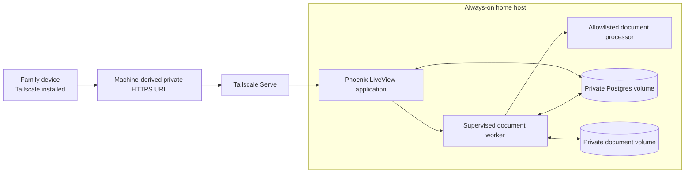
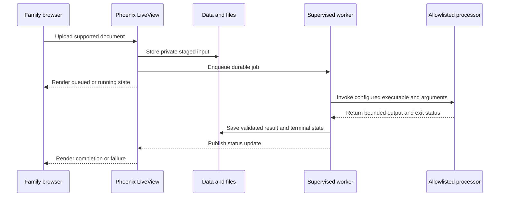
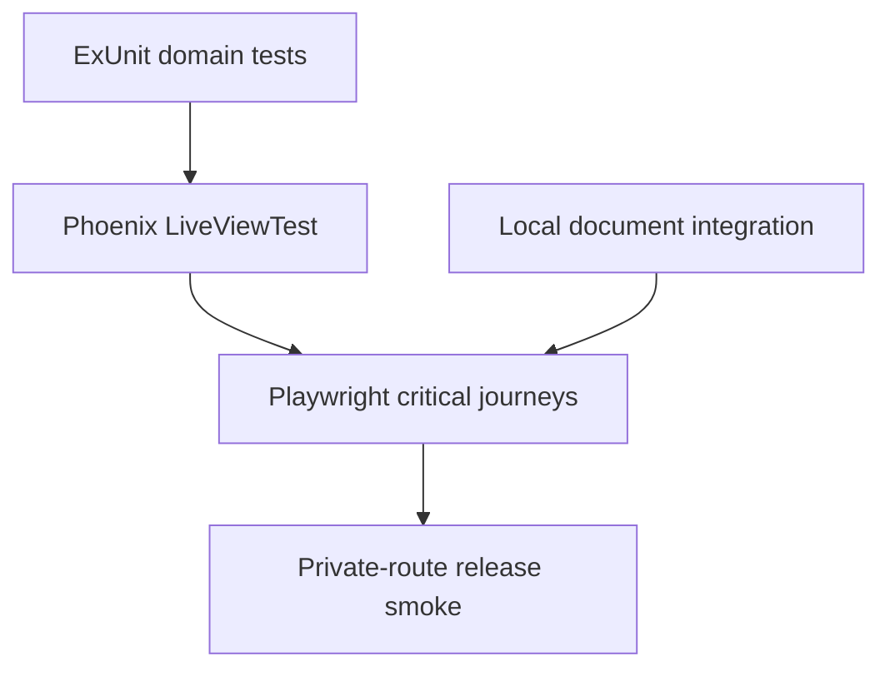

# Technical Documentation

This document proposes a target for the [family app foundation plan](README.md). It is not an as-built model. The canonical current system is the [Bnest C4 architecture specification](../../../specs/apps/bnest/app/architecture.md); implemented changes must update that specification.

## Architecture Goals

- Keep one Phoenix LiveView application rather than introducing a separate browser API client.
- Isolate durable document work from the web request lifecycle under OTP supervision.
- Keep live data, documents, and backups outside Git and the synchronized source workspace.
- Preserve the independent lifecycle of the loopback application and Tailscale Serve proxy.
- Expose only named administrative operations and allowlisted processor commands.

## Proposed System Overview

| Component               | Responsibility                                                                  |
| ----------------------- | ------------------------------------------------------------------------------- |
| Phoenix LiveView        | UI, requester identity, authorization, application actions, and live job status |
| OTP supervision         | Starts and recovers bounded application workers                                 |
| Document worker         | Claims jobs, invokes approved processors, validates output, and records state   |
| Processor               | Performs one configured conversion, extraction, or analysis task                |
| Postgres                | Users, permissions, shared records, document metadata, and job state            |
| Private document volume | Original uploads, staging, and accepted output                                  |
| Tailscale Serve         | Optional private HTTPS routing independent from Phoenix lifecycle               |

## Document Processing Flow

## Design Decisions

| Concern              | Proposed decision                       | Rationale                                                                      |
| -------------------- | --------------------------------------- | ------------------------------------------------------------------------------ |
| Application boundary | Phoenix LiveView                        | Retains one full-stack application and real-time UI updates.                   |
| Durable data         | Private Postgres volume                 | Supports relational ownership, permissions, jobs, and migrations.              |
| Documents            | Separate private volume                 | Keeps large and sensitive files outside source and relational storage.         |
| Processing           | Supervised worker invoking an allowlist | Separates failures and prevents browser-selected host commands.                |
| Private access       | Tailscale Serve                         | Avoids public exposure and preserves proxy independence.                       |
| Browser E2E          | Playwright                              | Exercises rendering, WebSockets, reconnects, permissions, and upload journeys. |

## Security and Data Boundaries

- Phoenix listens at the application endpoint; the private proxy remains the only remote route.
- Network identity may establish a requester signal, but Phoenix still owns roles and record permissions.
- External programs use absolute executable paths and argument lists, never shell command strings.
- Processors run with restricted filesystem access, resource limits, scoped staging and output, and no unnecessary outbound network.
- Database, document, and backup volumes remain outside the Git and Dropbox workspace.
- Interim flat-file state must follow the [runtime flat-file-data convention](../../../repo-governance/conventions/runtime-flat-file-data.md) and is not a substitute for planned durable storage.

## Testing Strategy

- Unit tests cover authorization, validation, job transitions, and processor argument construction.
- LiveView tests cover forms, events, navigation, roles, upload progress, and failures.
- Integration tests use isolated databases, files, and real safe processor fixtures without network access.
- Targeted E2E covers identity, persistence, document progress, permissions, reconnects, and recovery controls.
- Production receives only read-only health or smoke verification.

## File Impact

| Area                         | Expected responsibility                                                                     |
| ---------------------------- | ------------------------------------------------------------------------------------------- |
| `specs/apps/bnest/app/`      | Canonical C4, Gherkin behavior, and directory maps for every delivered slice                |
| `apps/bnest-app/`            | Domain rules, LiveViews, persistence, supervision, configuration, and project documentation |
| `apps/bnest-app-e2e/`        | Critical public-boundary browser adapters and journeys                                      |
| `data/` and external volumes | Ignored placeholders plus runtime-owned persistent data outside source control              |
| Root and project READMEs     | Current operation, privacy, storage, and verification guidance                              |

Resolve exact files per slice after re-reading current specifications and project structure; do not treat this table as authority to edit unrelated files.

## Dependencies and Technical Risks

- The identity source, authorization model, first schema, document limits, processor set, backup target, and host must be decided before dependent implementation.
- Migrations and backups must be exercised against isolated data before any production release.
- Worker retries must be idempotent or explicitly compensate partial output.
- Live progress must tolerate browser reconnects without duplicating jobs.

## Rollback

Each vertical slice must retain a known-good application release and a data-compatible rollback path. Back up data before migrations; prefer additive migrations until the new release is proven. Disable new entry points before reverting code when queued work or new data cannot safely be read by the previous release.
