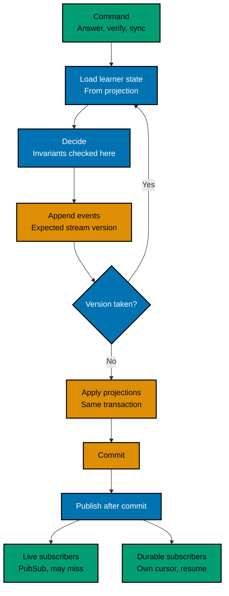

# Event Model

The learning engine is event sourced. `bnest_events` is the system of record for everything the engine knows — learner facts and content alike. Every `bnest_learning_*` table is a projection: a read model that can be dropped and rebuilt from the log without losing information.

The log is shared rather than learning-specific. It carries a `domain` column, and this plan delivers it as Bnest infrastructure with learning as its first and only writer. Other domains adopting it is out of scope here; leaving the door open is not.

This document owns the write path, the stream and concurrency contract, event versioning, projection rebuild, and delivery to subscribers. The tables themselves are in [the data model](02-data-model.md).

## What is authoritative

| Thing                                                           | Authority         | How it gets there                                             |
| --------------------------------------------------------------- | ----------------- | ------------------------------------------------------------- |
| Learner attempts, mastery, review schedule, coins, verification | `bnest_events`    | A command handler appends to the learner's stream             |
| Courses, topics, missions, and their ordering                   | `bnest_events`    | The sync reads the authored corpus and appends the difference |
| Everything else in a `bnest_learning_*` table                   | Nothing — derived | A projector applies events in `event_id` order                |

The authored corpus under `apps/bnest-app/priv/learning/` is **not** a source of truth. It is the input to a command, exactly as a learner's tap is the input to an answer command. `mix bnest.learning.sync` is a command handler: it reads the corpus, compares it with the projected content state, and appends only the events that represent a real difference. A sync that finds no difference appends nothing.

That distinction is what keeps Git review and event sourcing compatible. Content is still authored, reviewed, and shipped as files; the log still holds every fact the engine acts on.

## Streams

A stream is the unit of ordering and of concurrency control.

| Stream  | Domain     | Identifier          | Covers                                                                  |
| ------- | ---------- | ------------------- | ----------------------------------------------------------------------- |
| Learner | `learning` | `learner:<user_id>` | One child's attempts, mastery, coins, verification decisions about them |
| Content | `learning` | `content`           | Course, topic, and mission definition, ordering, and retirement         |

Learner is the right grain because every learner invariant is inside one learner: mastery is per learner and mission, coins are per learner, and "credit this mission's coins exactly once" spans missions within one learner. One stream per learner gives all of those a single serialization point. A per-mission stream would not, and a single global stream would serialize the whole household behind one writer.

Content is one stream because ordering within a course and retirement across topics need a consistent view; content changes are rare and arrive from one sync at a time.

A verification decision is appended to the **child's** stream, because it changes the child's state. The deciding parent is recorded in `actor_user_id`.

## Concurrency

Every append carries an expected `stream_version`. `UNIQUE (domain, stream_id, stream_version)` rejects the second writer, which retries by reloading and re-deciding. This replaces row locking and the `revision` column the projections previously carried.

## Projections are written in the same transaction

Projections are applied inside the transaction that appends the event, not by an asynchronous consumer. This is a deliberate departure from the usual event-sourcing diagram and it removes the one trade-off that would have damaged this product: eventual consistency between the log and the read model.

A child answers, and the same transaction appends `mission.attempted`, appends `mission.mastered` and `coins.earned` if the rule is satisfied, updates the progress, attempt, and ledger projections, and advances the projection checkpoint. On commit the child sees the outcome immediately, and a read after the write cannot observe stale state. On a single-node SQLite database this costs nothing; the pattern only needs to be asynchronous when the read model lives somewhere the write cannot reach.

Rebuild remains fully available: the projections carry no information the log lacks, so dropping and replaying them is always safe.

## Determinism

Replay must reproduce byte-identical projections, so projectors are pure functions of the event stream:

- Time comes from the event's `occurred_at`, never from the system clock.
- Order comes from `event_id`, never from a timestamp comparison.
- No randomness, no network call, no filesystem read, no lookup of anything outside the log.
- Derived identifiers are functions of the event: a ledger row's identifier is `evt:<event_id>`, and an attempt number is the count of prior attempt events in the stream.

An integration test asserts this directly: run a representative workload, checksum every projection table, drop and rebuild from the log, and compare. A projector that reads the wall clock fails that test.

## Event catalogue, version 1

Every name below is registered for the `learning` domain. The database checks the `domain.thing` shape; this registry is what makes a name legitimate.

This table is a proposal and dies with the plan. The durable list is `specs/apps/bnest/app/event-catalog.md`, the as-built catalogue for every domain that ever writes to `bnest_events`, and its authority is `BnestApp.EventLog.Registry`, which the append path validates against. A test compares the two in both directions, so an event added in code without a specification row fails, and a documented event with no registration fails too. See [the specification changes](06-specification-changes.md).

Content stream:

| Event                    | Payload                                                                                                 |
| ------------------------ | ------------------------------------------------------------------------------------------------------- |
| `course.defined`         | `course_id`, `title`, `summary`, `position`                                                             |
| `course.retired`         | `course_id`                                                                                             |
| `topic.defined`          | `topic_id`, `title`, `summary`, `sequencing`                                                            |
| `topic.retired`          | `topic_id`                                                                                              |
| `mission.defined`        | `mission_id`, `kind`, `title`, `payload`, `pass_rule`, `review_policy`, `coin_reward`, `content_sha256` |
| `mission.retired`        | `mission_id`                                                                                            |
| `course.topics.ordered`  | `course_id`, ordered `topic_ids`                                                                        |
| `topic.missions.ordered` | `topic_id`, ordered `mission_ids`                                                                       |

Learner stream:

| Event                    | Payload                                                                     |
| ------------------------ | --------------------------------------------------------------------------- |
| `mission.started`        | `mission_id`                                                                |
| `mission.attempted`      | `mission_id`, `outcome`, `answer`, `mission_sha256`, `correct_streak_after` |
| `mission.mastered`       | `mission_id`, `pass_rule`, `next_review_at`                                 |
| `mission.reviewed`       | `mission_id`, `correct`, `review_step_after`, `next_review_at`              |
| `progress.reset`         | `mission_id`                                                                |
| `coins.earned`           | `mission_id`, `amount`                                                      |
| `verification.requested` | `mission_id`, `attempt_no`                                                  |
| `verification.decided`   | `mission_id`, `attempt_no`, `approved`                                      |
| `progress.imported`      | `mission_id`, `state`, `source_version`                                     |

A `mission.defined` event carries the whole mission body. That is what lets replay reconstruct the exact content a learner saw at the time of an attempt, which is what makes the `mission_sha256` on an attempt meaningful rather than a checksum pointing at nothing.

`mission.attempted` carries the learner's answer. That is the only learner-supplied free value in the log, and it must never reach a log line, an error message, a PubSub payload, or plan evidence.

## Versioning and correction

Every event carries `event_version`. Stored events are never edited.

- **Additive change** — a new optional field. Handled by tolerant reading: unknown fields ignored, missing fields defaulted.
- **Breaking change** — bump `event_version` and register an **upcaster** that converts the older shape to the current one at read time. Upcasters chain, so projector code only ever handles the newest version.
- **Wrong facts** — a bug that wrote incorrect events leaves incorrect events. Fixing the code does not fix history. The correction is a **compensating event** appended later, never an edit and never a delete.
- **In-place rewrite of the log is prohibited.** The append-only triggers in the schema enforce this at the database level, not by convention.

This is the cost of the model that most often surprises people: replay rebuilds projections, not truth. If the log is wrong, replay faithfully reproduces the wrongness.

## Delivery to subscribers

After commit, the dispatcher publishes. There are two kinds of subscriber, and they have different guarantees.

**Live subscribers** — the learner's LiveView, the coin badge, the parent's pending queue. They subscribe to `learning:learner:<user_id>` or `learning:content` through `Phoenix.PubSub`. They may miss a message during a disconnect, which is harmless because they re-query on mount. No cursor.

**Durable subscribers** — anything whose work must not be lost, including future notification and coin-redemption work. Each has a row in `bnest_event_listeners` holding its `last_event_id`. It reads events after that identifier in order, one at a time, handles each, then advances its own cursor. A crash mid-event resumes on the same event, so delivery is at-least-once and handlers must be idempotent. A new subscriber can start at 0 and process the entire history.

No subscriber is required for correctness. Every invariant is settled before the transaction commits.

## Rebuild

`mix bnest.learning.rebuild_projections` truncates every learning projection, resets the learning projection cursors, and replays the `learning` domain's events from `event_id` 1 in one transaction. Rebuild is scoped by domain, so another domain's projections and cursors are untouched. It is the recovery path for a corrupted or mis-shaped read model and the mechanism that makes a projection change a code change rather than a data migration: to add a new read model, write a projector and rebuild.

Rebuild does not touch the log, and the log has no dependency on any projection — `bnest_events` carries no foreign key into a derived table.

## Rejected alternatives

**State-authoritative tables with a transactional outbox.** Lower cost and it keeps SQL constraints as real protection, but the log is then only a notification channel: it cannot rebuild state, so "replay it" is not available. Rejected because a rebuildable, complete history is the stated requirement.

**Asynchronous projections.** The textbook shape, and the reason event sourcing is usually described as eventually consistent. Rejected because a child must see the outcome of an answer immediately, and a single-node database makes the asynchrony unnecessary.

**Commanded with its EventStore adapter.** The established Elixir CQRS and event-sourcing framework, but its event store is PostgreSQL-backed and has no SQLite adapter, so adopting it means either running PostgreSQL on the household machine or implementing a custom `Commanded.EventStore.Adapter`. Both cost more than the small Ecto-backed store this plan needs, and adding a database server for one feature fails the [dependency-selection standard](../../../../repo-governance/development/dependency-selection.md).

**Command sourcing** — persisting the request rather than the decision. Rejected because replaying a command re-runs a decision, which is only reproducible if every input is captured; replaying an event reproduces a fact.

**Event sourcing for learner facts only, with content kept as file-authoritative state.** Considered and rejected in favour of one authority: two sources of truth means two rebuild stories and a boundary where "replay it" silently stops working.
