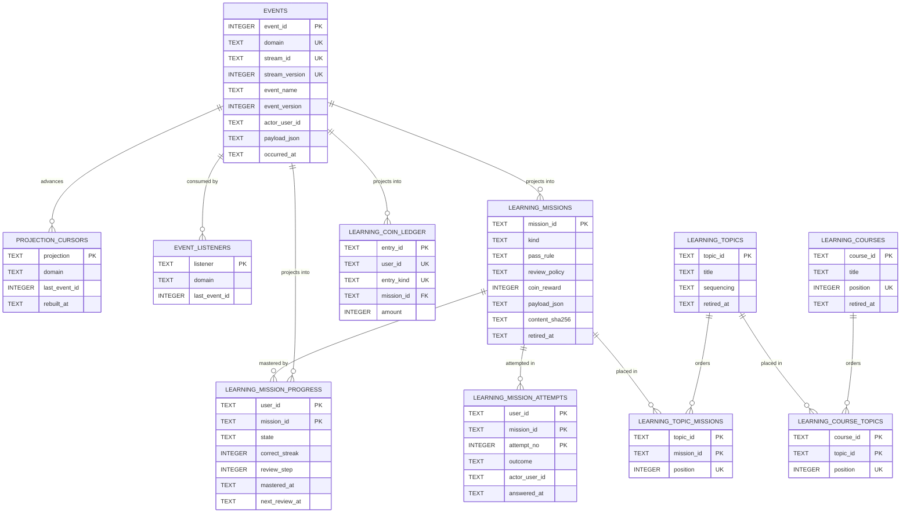

# Data Model

The learning tables live in the existing SQLite database beside `bnest_records`, `bnest_schedules`, and their siblings, and are created by one committed, guarded migration.

There are three kinds of table here, and the differences matter more than any individual column:

- **`bnest_events` is the system of record, and it is shared.** Append-only, immutable, ordered, and not owned by learning: it carries a `domain` column so other Bnest domains can append to the same log later without new infrastructure. This plan is the first writer and delivers the shared table, its cursors, and its dispatcher.
- **`bnest_projection_cursors` and `bnest_event_listeners` are shared bookkeeping.** They record how far each read model and each durable listener has consumed the log.
- **Everything named `bnest_learning_*` is a projection.** Derived, droppable, rebuildable by replaying the log. Their constraints assert that replay produced a sane result; they do not protect an invariant, because the invariant was already settled by the command handler before the append. The write path and that split are described in [the event model](01-event-model.md).

SQLite suits this shape: an append-only single-writer log with concurrent readers is exactly what WAL mode is good at, and SQLite serialising writes is a fit rather than a limit for a household-scale event log.

## Audit-column exemption

Every table this plan creates is exempt from the [database audit-columns convention](../../../../repo-governance/conventions/database-audit-columns.md), and the convention requires the exemption and its reason to be stated here and in each migration:

- **`bnest_events`** is an append-only log whose immutability is enforced by triggers. It records its own creation time and actor as `recorded_at` and `actor_user_id`, and can never be updated, so `updated_at` and `updated_by` would be permanently empty. It must not carry `deleted_at` or `deleted_by`: a soft-delete column on the system of record invites erasing exactly the history the design exists to keep. Correction is a compensating event.
- **Every `bnest_learning_*` table** is a projection rebuilt by replaying the log. Its rows have no lifetime of their own, so a `created_at` would report the last rebuild rather than the fact, which is fiction rather than audit. The actor and time already live on the event the row was projected from, reachable through the `event_id` recorded on an attempt.
- **`bnest_projection_cursors` and `bnest_event_listeners`** store only a consumer's position, so the convention's cursor exemption applies and `updated_at` is the only column they need.

No other table is introduced, so no table in this plan carries the six columns.

## Entity relationships



Note what the log is **not** connected to: `bnest_events` carries no foreign key into any projection. A source of truth cannot depend on a table that is dropped and rebuilt. The relationships drawn from it are projection relationships, not referential constraints.

Three things carry the important meaning. `UNIQUE (domain, stream_id, stream_version)` on the log is the concurrency control for every domain that uses it. `LEARNING_TOPIC_MISSIONS` is many-to-many with an ordered position, which is why the same mission can sit at position 3 of one topic and position 7 of another. `LEARNING_MISSION_PROGRESS` has a two-column key with no course or topic in it, which is what makes mastery global to the learner.

## Schema contract

Two committed migrations, both additive: they create only new tables and touch no existing one, so a previous revision that knows nothing about learning continues to run against the same database during a rolling release.

- `20260901000000_create_event_log.exs` creates the shared log and its cursors. It is domain-agnostic and deliberately contains nothing about learning.
- `20260901000100_create_learning_projections.exs` creates the learning projections.

### The shared log

```sql
CREATE TABLE bnest_events (
  event_id INTEGER PRIMARY KEY AUTOINCREMENT,
  domain TEXT NOT NULL CHECK (domain GLOB '[a-z][a-z0-9-]*'),
  stream_id TEXT NOT NULL CHECK (length(stream_id) BETWEEN 1 AND 160),
  stream_version INTEGER NOT NULL CHECK (stream_version >= 1),
  event_name TEXT NOT NULL CHECK (event_name GLOB '?*.?*'),
  event_version INTEGER NOT NULL CHECK (event_version >= 1),
  actor_user_id TEXT,
  payload_json TEXT NOT NULL CHECK (json_valid(payload_json)),
  occurred_at TEXT NOT NULL,
  recorded_at TEXT NOT NULL,
  UNIQUE (domain, stream_id, stream_version)
);

CREATE INDEX bnest_events_domain_idx
  ON bnest_events (domain, event_id);

CREATE INDEX bnest_events_stream_idx
  ON bnest_events (domain, stream_id, event_id);

CREATE TRIGGER bnest_events_no_update
  BEFORE UPDATE ON bnest_events
BEGIN
  SELECT RAISE(ABORT, 'bnest events are append-only');
END;

CREATE TRIGGER bnest_events_no_delete
  BEFORE DELETE ON bnest_events
BEGIN
  SELECT RAISE(ABORT, 'bnest events are append-only');
END;
```

`event_name` is checked for **shape only** — `domain.thing`, with content on both sides of the dot — and never against a list of allowed names. A list would put every domain's vocabulary in one `CHECK`, and widening a `CHECK` in SQLite means rebuilding the table. Rebuilding a table that is append-only by trigger, holds the system of record, and refuses to reverse once populated is not an operation this repository should ever need. The vocabulary is therefore owned by an Elixir registry per domain, validated on append, and covered by tests.

The two triggers are the point. Immutability is enforced by the database, so a defective projector, a careless migration, or an interactive session cannot rewrite history; correction is a compensating event or nothing.

`domain` is what makes this table reusable. Learning writes `domain = 'learning'` with `stream_id` values of `content` and `learner:<user_id>`; a later domain writes its own value and its own stream names without colliding, because uniqueness and both indexes are scoped by domain. Adopting the log in another domain is out of scope for this plan, which only has to leave the door open rather than walk through it.

### Cursors

```sql
CREATE TABLE bnest_projection_cursors (
  projection TEXT PRIMARY KEY,
  domain TEXT NOT NULL CHECK (domain GLOB '[a-z][a-z0-9-]*'),
  last_event_id INTEGER NOT NULL CHECK (last_event_id >= 0),
  rebuilt_at TEXT,
  updated_at TEXT NOT NULL
);

CREATE TABLE bnest_event_listeners (
  listener TEXT PRIMARY KEY,
  domain TEXT NOT NULL CHECK (domain GLOB '[a-z][a-z0-9-]*'),
  last_event_id INTEGER NOT NULL CHECK (last_event_id >= 0),
  updated_at TEXT NOT NULL
);
```

Both are shared bookkeeping, not learning tables. A projection or listener name is namespaced by its owner, for example `learning.mission_progress`, so two domains cannot claim the same cursor.

### Content projections

```sql
CREATE TABLE bnest_learning_courses (
  course_id TEXT PRIMARY KEY CHECK (course_id GLOB '[a-z0-9][a-z0-9-]*'),
  title TEXT NOT NULL CHECK (length(title) BETWEEN 1 AND 120),
  summary TEXT NOT NULL CHECK (length(summary) <= 480),
  position INTEGER NOT NULL CHECK (position >= 1),
  content_sha256 TEXT NOT NULL CHECK (length(content_sha256) = 64),
  retired_at TEXT,
  UNIQUE (position)
);

CREATE TABLE bnest_learning_topics (
  topic_id TEXT PRIMARY KEY CHECK (topic_id GLOB '[a-z0-9][a-z0-9-]*'),
  title TEXT NOT NULL CHECK (length(title) BETWEEN 1 AND 120),
  summary TEXT NOT NULL CHECK (length(summary) <= 480),
  sequencing TEXT NOT NULL CHECK (sequencing IN ('free', 'sequential')),
  content_sha256 TEXT NOT NULL CHECK (length(content_sha256) = 64),
  retired_at TEXT
);

CREATE TABLE bnest_learning_missions (
  mission_id TEXT PRIMARY KEY CHECK (mission_id GLOB '[a-z0-9][a-z0-9/-]*'),
  kind TEXT NOT NULL CHECK (kind IN
    ('reading', 'video', 'multiple_choice', 'short_text', 'flashcard', 'parent_check')),
  title TEXT NOT NULL CHECK (length(title) BETWEEN 1 AND 160),
  payload_json TEXT NOT NULL CHECK (json_valid(payload_json)),
  pass_rule TEXT NOT NULL CHECK (pass_rule IN
    ('acknowledge', 'first_correct', 'streak_two', 'streak_three', 'parent_verified')),
  review_policy TEXT NOT NULL CHECK (review_policy IN ('none', 'spaced')),
  coin_reward INTEGER NOT NULL CHECK (coin_reward BETWEEN 0 AND 100),
  content_sha256 TEXT NOT NULL CHECK (length(content_sha256) = 64),
  retired_at TEXT,
  CHECK (
    (kind IN ('reading', 'video') AND pass_rule = 'acknowledge') OR
    (kind IN ('multiple_choice', 'short_text', 'flashcard') AND
      pass_rule IN ('first_correct', 'streak_two', 'streak_three')) OR
    (kind = 'parent_check' AND pass_rule = 'parent_verified')
  ),
  CHECK (kind <> 'parent_check' OR review_policy = 'none')
);

CREATE TABLE bnest_learning_course_topics (
  course_id TEXT NOT NULL REFERENCES bnest_learning_courses(course_id),
  topic_id TEXT NOT NULL REFERENCES bnest_learning_topics(topic_id),
  position INTEGER NOT NULL CHECK (position >= 1),
  PRIMARY KEY (course_id, topic_id),
  UNIQUE (course_id, position)
);

CREATE TABLE bnest_learning_topic_missions (
  topic_id TEXT NOT NULL REFERENCES bnest_learning_topics(topic_id),
  mission_id TEXT NOT NULL REFERENCES bnest_learning_missions(mission_id),
  position INTEGER NOT NULL CHECK (position >= 1),
  PRIMARY KEY (topic_id, mission_id),
  UNIQUE (topic_id, position)
);
```

### Learner projections

```sql
CREATE TABLE bnest_learning_mission_progress (
  user_id TEXT NOT NULL,
  mission_id TEXT NOT NULL REFERENCES bnest_learning_missions(mission_id),
  state TEXT NOT NULL CHECK (state IN
    ('started', 'answered', 'awaiting_verification', 'mastered')),
  attempt_count INTEGER NOT NULL CHECK (attempt_count >= 0),
  correct_count INTEGER NOT NULL CHECK (correct_count >= 0),
  correct_streak INTEGER NOT NULL CHECK (correct_streak >= 0),
  review_step INTEGER NOT NULL CHECK (review_step BETWEEN 0 AND 6),
  first_seen_at TEXT NOT NULL,
  last_answered_at TEXT,
  mastered_at TEXT,
  next_review_at TEXT,
  PRIMARY KEY (user_id, mission_id),
  CHECK (correct_count <= attempt_count),
  CHECK ((state = 'mastered') = (mastered_at IS NOT NULL)),
  CHECK (next_review_at IS NULL OR mastered_at IS NOT NULL)
);

CREATE INDEX bnest_learning_review_due_idx
  ON bnest_learning_mission_progress (user_id, next_review_at)
  WHERE next_review_at IS NOT NULL;

CREATE INDEX bnest_learning_progress_state_idx
  ON bnest_learning_mission_progress (user_id, state);

CREATE TABLE bnest_learning_mission_attempts (
  user_id TEXT NOT NULL,
  mission_id TEXT NOT NULL REFERENCES bnest_learning_missions(mission_id),
  attempt_no INTEGER NOT NULL CHECK (attempt_no >= 1),
  event_id INTEGER NOT NULL,
  outcome TEXT NOT NULL CHECK (outcome IN
    ('correct', 'incorrect', 'acknowledged', 'pending_verification', 'verified', 'rejected')),
  answer_json TEXT CHECK (answer_json IS NULL OR json_valid(answer_json)),
  mission_sha256 TEXT NOT NULL CHECK (length(mission_sha256) = 64),
  actor_user_id TEXT,
  answered_at TEXT NOT NULL,
  decided_at TEXT,
  PRIMARY KEY (user_id, mission_id, attempt_no),
  CHECK ((actor_user_id IS NULL) = (decided_at IS NULL)),
  CHECK (actor_user_id IS NULL OR actor_user_id <> user_id),
  CHECK (outcome NOT IN ('verified', 'rejected') OR actor_user_id IS NOT NULL)
);

CREATE INDEX bnest_learning_pending_verification_idx
  ON bnest_learning_mission_attempts (outcome, answered_at)
  WHERE outcome = 'pending_verification';

CREATE TABLE bnest_learning_coin_ledger (
  entry_id TEXT PRIMARY KEY,
  user_id TEXT NOT NULL,
  entry_kind TEXT NOT NULL CHECK (entry_kind IN ('earned', 'spent')),
  amount INTEGER NOT NULL CHECK (amount > 0),
  mission_id TEXT REFERENCES bnest_learning_missions(mission_id),
  occurred_at TEXT NOT NULL,
  UNIQUE (user_id, entry_kind, mission_id),
  CHECK (entry_kind <> 'earned' OR mission_id IS NOT NULL)
);

CREATE INDEX bnest_learning_ledger_owner_idx
  ON bnest_learning_coin_ledger (user_id, entry_kind);
```

Projections carry no `inserted_at`, `updated_at`, or `revision`. Row lifetimes are meaningless in a table that is rebuilt, and concurrency now lives on the stream version, so those columns would only invite a writer to bypass the log.

Each migration's `down/0` drops its own tables in reverse dependency order. The learning migration drops only projections and is safe. The event-log migration raises before dropping anything if `bnest_events` holds any row: projections can be recreated, the log cannot.

## Field guide

### `bnest_events` — the shared system of record

- **`event_id`** — monotonic surrogate key from `INTEGER PRIMARY KEY AUTOINCREMENT`. It is the global order for replay and the value every cursor stores. `AUTOINCREMENT` guarantees identifiers are never reused after a delete, which matters even though deletion is blocked.
- **`domain`** — which part of Bnest the event belongs to. Learning writes `learning`; the column exists so another domain can share this table without a new one. It scopes uniqueness and both indexes.
- **`stream_id`** — the entity this event belongs to, named locally within its domain: `learner:<user_id>` or the single `content` stream. The unit of ordering and of optimistic concurrency. Because `domain` is a separate column, a stream name never needs a domain prefix and no reader parses it out of a string.
- **`stream_version`** — the event's position within its stream, starting at 1 and gapless. With `domain` and `stream_id` it forms the unique constraint that rejects a concurrent second writer. A command handler supplies the version it expects to write; a rejection means reload and re-decide.
- **`event_name`** — a `domain.thing` name such as `mission.mastered`. The database checks only that shape; the allowed vocabulary lives in an Elixir registry per domain and is validated on append. That split keeps a new domain from requiring a rebuild of the table holding the system of record.
- **`event_version`** — the shape version of this event's payload, starting at 1. Readers pass an event through the upcaster chain until it reaches the current shape. Stored events are never rewritten to a newer version.
- **`actor_user_id`** — who caused the event, which is not always who it is about. A parent's verification appends to the child's stream with the parent recorded here. Null for the content stream, where the actor is the sync.
- **`payload_json`** — the facts of the event, validated as JSON by SQLite and by the event contract on write. `mission.defined` carries a whole mission body, which is what lets replay reconstruct the exact content a learner saw. `mission.attempted` carries the learner's answer, the only free learner value in the database; it must never reach a log line, an error message, a PubSub payload, or plan evidence.
- **`occurred_at`** — when the fact happened, in ISO-8601 UTC. Projectors read time from here and never from the system clock, which is what makes replay deterministic. For an imported historical fact this is the import time, because the original time was never recorded.
- **`recorded_at`** — when the row was appended. It differs from `occurred_at` only for imports and backfills, and exists so that discrepancy is visible rather than hidden.

### `bnest_projection_cursors`

- **`projection`** — the projector's name, namespaced by its owner such as `learning.mission_progress`, one row per read model.
- **`domain`** — which domain owns this projection, so one domain's rebuild does not touch another's cursors.
- **`last_event_id`** — the last event applied to this projection. Advanced inside the same transaction as the projection write, so the checkpoint can never disagree with the rows.
- **`rebuilt_at`** — when this projection was last rebuilt from scratch. Null until a rebuild happens; useful evidence when diagnosing a read model, never used as logic.
- **`updated_at`** — last advance, for operational visibility only.

### `bnest_event_listeners`

- **`listener`** — a durable consumer's name, namespaced by its owner.
- **`domain`** — which domain owns this listener.
- **`last_event_id`** — the last event this consumer finished handling. It advances after the handler succeeds, so a crash mid-event resumes on the same event: delivery is at-least-once and handlers must be idempotent. A new subscriber starts at 0 to process the whole history.
- **`updated_at`** — last advance.

Live UI subscribers have no row here. They may miss messages while disconnected and re-query on mount, which is correct and deliberate.

### `bnest_learning_courses`, `_topics`, `_missions` — content projections

- **`course_id` / `topic_id` / `mission_id`** — the identifier carried by the defining event, taken from the corpus file path so the filesystem enforces uniqueness. A mission identifier is lowercase and slash-separated, so `missions/sifat-allah/wujud/wajib-meaning.json` is `sifat-allah/wujud/wajib-meaning`. It must never be reused for different content: a learner's mastery, coins, and attempt history all hang off it.
- **`title`**, **`summary`** — product copy in Bahasa Indonesia, from the latest defining event.
- **`position`** on a course — its order on `/learn`, unique across courses.
- **`sequencing`** — `sequential` offers missions in position order with the next opening when the previous is mastered; `free` allows any. Cross-topic prerequisites do not exist in this plan.
- **`kind`** — which renderer and answer contract applies. Fixed vocabulary; adding one is a schema change and a runner change together.
- **`payload_json`** — the kind-specific body. Shapes are in the corpus section below.
- **`pass_rule`** — what counts as mastery. `acknowledge` needs one confirmation; `first_correct` one correct answer; `streak_two` and `streak_three` that many consecutive correct answers; `parent_verified` an approving decision by another user. The table constraint keeps the rule compatible with the kind.
- **`review_policy`** — `spaced` enters the review schedule after mastery, `none` does not. `parent_check` is always `none`, because rescheduling would silently re-queue a parent.
- **`coin_reward`** — coins credited once at first mastery, 0 to 100. Zero means not coin-bearing. Changing it later does not adjust past balances: the ledger projects `coins.earned` events, which recorded the amount actually awarded.
- **`content_sha256`** — checksum of the defining event's content, copied onto each attempt so a historical attempt stays interpretable.
- **`retired_at`** — set by a retirement event when the item leaves the corpus. A retired item is hidden from trails, review, and next-mission selection; its progress and attempts stay readable. Cleared if a later defining event reinstates it.

### `bnest_learning_course_topics` and `bnest_learning_topic_missions`

- **`course_id` / `topic_id` / `mission_id`** — composite primary key and foreign keys, projected from the ordering events.
- **`position`** — order inside that parent, starting at 1 and unique within it. Positions are per placement, which is exactly why one mission can occupy different positions in different topics. Ordering never comes from the identifier.

### `bnest_learning_mission_progress`

- **`user_id`** — the learner, half of the primary key. There is deliberately no course or topic column: mastery is global to the learner and the mission.
- **`state`** — `started` once opened, `answered` after an attempt that did not master it, `awaiting_verification` while a `parent_check` submission is pending, `mastered` when the pass rule is satisfied. Constrained to move together with `mastered_at`.
- **`attempt_count`**, **`correct_count`** — lifetime counters projected from attempt events. Reporting values, never logic.
- **`correct_streak`** — consecutive correct answers, the counter the streak rules read. Reset to 0 by any incorrect answer, including during review.
- **`review_step`** — position on the interval ladder below, 0 through 6. An index, not a duration.
- **`first_seen_at`**, **`last_answered_at`**, **`mastered_at`**, **`next_review_at`** — all taken from event `occurred_at` values, never from the clock at projection time. `mastered_at` is set once; a later wrong review answer lowers `review_step` but does not un-master. `next_review_at` is null unless mastered, so an unmastered mission cannot leak into the review queue.

### `bnest_learning_mission_attempts`

- **`attempt_no`** — the count of prior attempt events in that learner's stream for that mission, so replay reproduces it exactly. With `user_id` and `mission_id` it forms the primary key.
- **`event_id`** — the log entry this row was projected from. It is the audit link back to the source of truth and the value to quote when diagnosing a read model.
- **`outcome`** — `correct` and `incorrect` for graded kinds, `acknowledged` for reading and video, `pending_verification` on submission, `verified` or `rejected` after a decision.
- **`answer_json`** — what the learner submitted, null for acknowledgements. Learner input; never log it.
- **`mission_sha256`** — the mission checksum at the time of the attempt, so an attempt recorded before a content edit stays interpretable against the `mission.defined` event that was current then.
- **`actor_user_id`** — the parent or admin who decided, constrained to differ from `user_id`. Paired with `decided_at` so neither exists alone. This constraint asserts the command handler's rule; the handler is what enforces it.
- **`answered_at`**, **`decided_at`** — from the respective events' `occurred_at`.

### `bnest_learning_coin_ledger`

- **`entry_id`** — `evt:<event_id>` of the `coins.earned` event that produced it. Deriving it from the event rather than generating it is what makes a rebuild produce byte-identical rows.
- **`user_id`**, **`amount`** — whose balance and how many coins, always positive. Direction comes from `entry_kind`, never from a negative amount, so a balance is `sum(earned) - sum(spent)`.
- **`entry_kind`** — `earned` or `spent`. This plan emits only `earned`; the vocabulary is wider on purpose, because widening a SQLite `CHECK` later would mean rebuilding a table. A test asserts no `spent` row exists while redemption remains unauthorized.
- **`mission_id`** — which mission paid, required for `earned`. The `UNIQUE (user_id, entry_kind, mission_id)` constraint asserts that replay produced exactly one credit per learner and mission; the command handler is what guarantees only one `coins.earned` event was ever appended. SQLite treats null as distinct in a unique index, so future spend entries are not limited to one per learner.
- **`occurred_at`** — the mastery time the credit belongs to, from the event.

## Review intervals

`review_step` indexes a fixed table rather than storing a duration, so the schedule can be tuned in one place. Because `next_review_at` is computed by the command handler and carried in the event, retuning the ladder changes future events only; replay reproduces the schedule that was actually applied.

| `review_step` | Next review after | Meaning                                                |
| ------------- | ----------------- | ------------------------------------------------------ |
| 0             | 1 day             | Just mastered, or recovered from a wrong review answer |
| 1             | 3 days            | Holding                                                |
| 2             | 7 days            | Holding                                                |
| 3             | 14 days           | Settling                                               |
| 4             | 30 days           | Settled                                                |
| 5             | 60 days           | Long-term                                              |
| 6             | 120 days          | Long-term, ceiling                                     |

## Authored corpus

Content is authored under `apps/bnest-app/priv/learning/`. These files are the **input to the sync command**, not a source of truth; the sync compares them with the projected content state and appends only real differences. The path is the identifier, so the filesystem enforces uniqueness and a rename is visible in review as a delete plus an add.

```text
apps/bnest-app/priv/learning/
  courses/<course_id>.json
  topics/<topic_id>.json
  missions/<segment>/<segment>/<name>.json
```

A course file lists its topics in order; a topic file lists its missions in order. Because a mission file is addressed by path rather than nested under a topic, listing the same mission in two topic files is ordinary content.

```json
{
  "title": "Sifat Wajib Allah",
  "summary": "Mengenal dan menghafal sifat wajib Allah beserta lawannya.",
  "sequencing": "sequential",
  "missions": ["sifat-allah/wujud/kenalan", "sifat-allah/wujud/wajib-meaning"]
}
```

Each mission file declares its kind, pass rule, review policy, coin reward, and a kind-specific payload:

| `kind`            | Required payload keys                                     | Answer contract                     |
| ----------------- | --------------------------------------------------------- | ----------------------------------- |
| `reading`         | `body_markdown`                                           | Acknowledgement only                |
| `video`           | `url`, `duration_seconds`                                 | Acknowledgement only                |
| `multiple_choice` | `question`, `choices` (2–6), `correct_index`              | Selected index                      |
| `short_text`      | `question`, `accepted`, `match` (`exact` or `normalized`) | Submitted string                    |
| `flashcard`       | `front`, `back`                                           | Learner self-rating, correct or not |
| `parent_check`    | `instruction`, `parent_prompt`                            | Submission, then a parent decision  |

The sync validates the whole corpus against this table before appending anything. An invalid corpus is rejected whole and appends no event, so a learner never meets a half-applied change and the log never records a fact that was never true.

Two rules keep the log clean. Corpus serialization is canonical and ordering is stable, so the same corpus always yields the same comparison. And a sync that finds no difference appends nothing — otherwise every deployment would rewrite the entire content history.

Sifat Allah's missions are generated rather than hand-written: `nx run bnest-app:learning:generate-sifat-allah` expands the existing 40-pair curriculum into committed corpus files, 40 introductions plus 240 questions. A test asserts that regenerating produces no diff, so the generator cannot drift from the corpus it produced.
