# UI Design

## User, job, and copy

The primary user is a child aged roughly eight to fourteen, on a phone or a tablet, with a small window of attention. The job is: open Bnest, know immediately what to do next, do it, feel that it counted, and stop at a natural point. The parent's job is different and rarer: see what is waiting for verification and decide.

Product copy is Bahasa Indonesia because the household speaks it and the current learning screen already does; the [language convention](../../../../repo-governance/conventions/language.md) allows another language when the product requires it. Every identifier, comment, specification, and document around that copy stays in English.

## Reference discipline

The requested feel is Duolingo-like — warm and moving rather than formal. Recording that reference honestly, as the [UI design convention](../../../../repo-governance/conventions/plan-ui-design.md) requires:

**Adopted, as interaction discipline:** one unit of work fills the screen; feedback lands immediately on answer rather than at the end; a visible path shows where the learner is and what is next; sessions are short and end at a clear boundary; the primary action is a single large target with one verb.

**Rejected, as product and visual choices:** any mascot, illustration style, or identity belonging to another product; hearts, lives, or any mechanic that ends a session as punishment; streak counters and streak-loss messaging, which convert a habit into guilt for a child; leaderboards or sibling comparison; and notification pressure. The coin economy in this plan only accumulates — nothing decays, expires, or is taken away.

## Alternatives

The same task and content is drawn three ways at desktop, tablet, and mobile: a multiple-choice mission mid-topic, with the learner two missions in.

### Alternative A — Focus (not selected)

One centred column: course bar, progress bar, question card, stacked choices, one primary action. Nothing else is on screen.

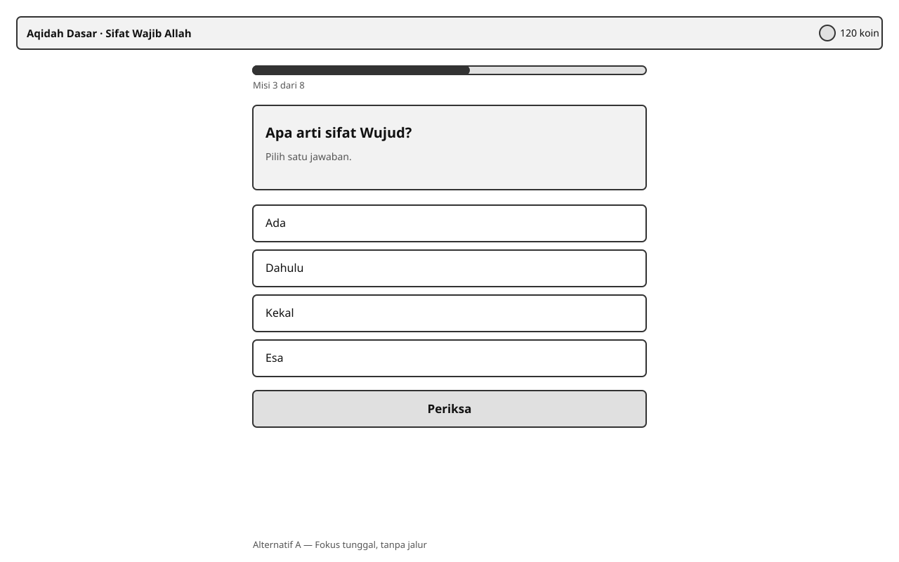
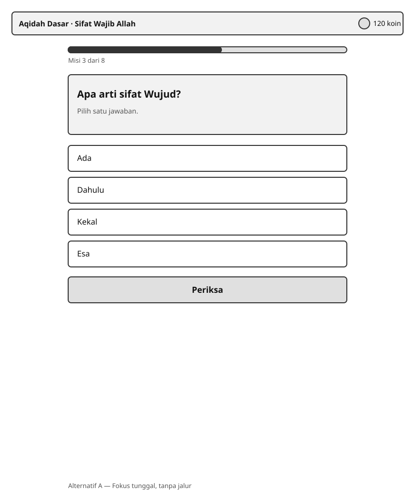
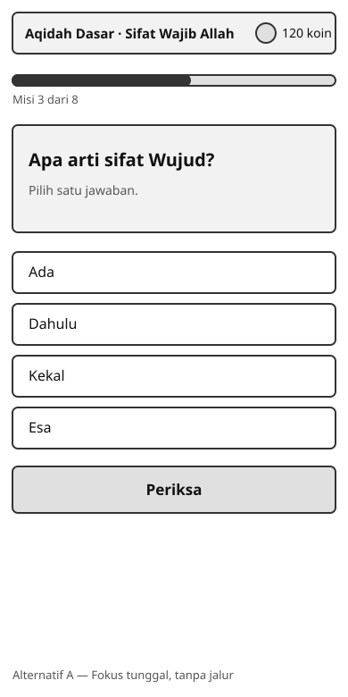

Identical at every size, which makes it the cheapest to build and the easiest to keep accessible. Its weakness is that the learner never sees the shape of the topic: progress is a bar with a number, so there is no sense of a journey and no way to look back at what was mastered. It also cannot express the pebble-trail behaviour the existing Sifat Allah corpus already asserts.

### Alternative B — Trail (selected)

A topic trail beside the mission: a vertical rail on desktop, a horizontal strip on tablet and mobile. Each node shows mastered, current, or upcoming through a marker shape and a check glyph, not colour alone. The mission itself keeps the focus treatment.

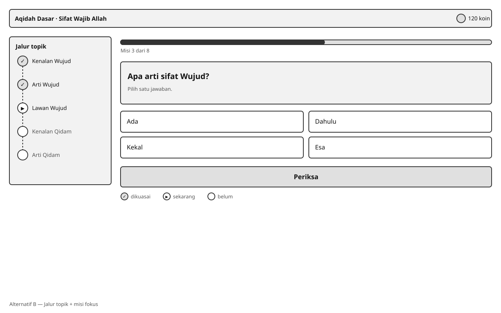
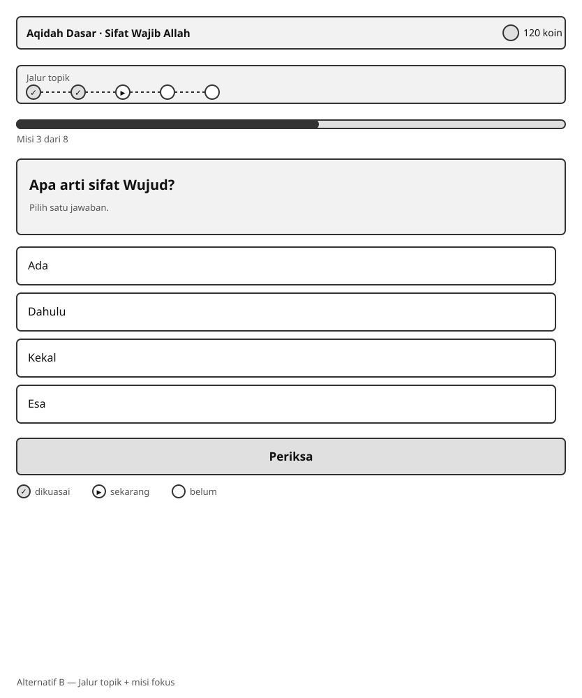
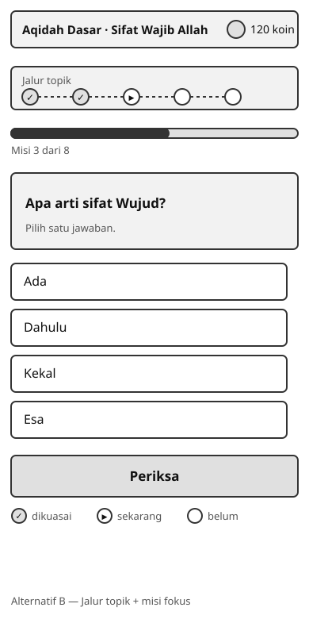

### Alternative C — Stack (not selected)

A swipeable deck of cards with peeking cards behind, choices inside the card, and progress and coins deferred until the session ends.

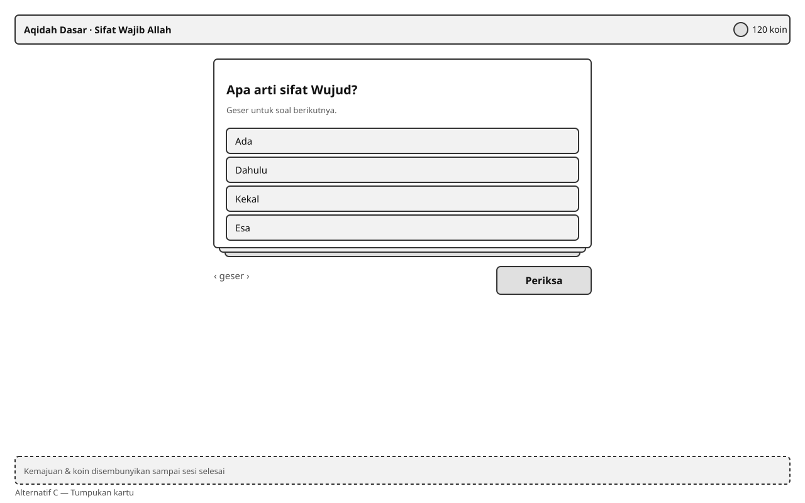
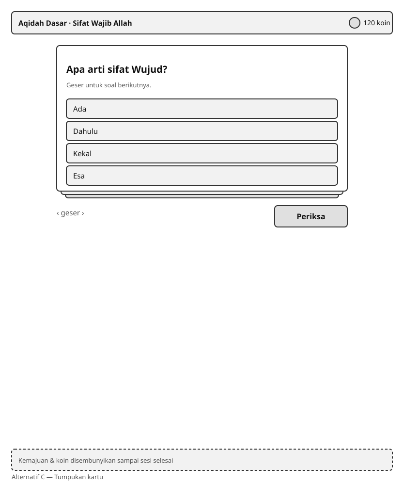
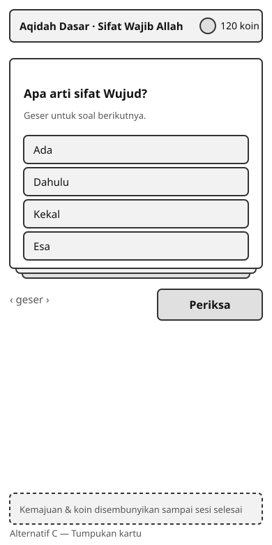

Playful and good on a phone, but it hides progress until the end, which removes the feedback the coin and mastery model depends on. Swipe as the primary navigation is also the hardest to make keyboard-equivalent and the easiest to trigger accidentally, and a deck implies a fixed session length that conflicts with a review queue whose size varies daily.

## Comparison and selection

| Criterion                       | A — Focus                          | B — Trail (selected)                              | C — Stack                                  |
| ------------------------------- | ---------------------------------- | ------------------------------------------------- | ------------------------------------------ |
| Usability: knowing what is next | Weak; a number only                | Strong; the path is visible                       | Weak; hidden until the end                 |
| Usability: sense of progress    | Weak                               | Strong                                            | Deferred                                   |
| Accessibility                   | Strongest; one column              | Strong; trail is a list with text and markers     | Weakest; swipe needs a keyboard equivalent |
| Implementation cost             | Lowest                             | Moderate; one extra responsive region             | Highest; gesture handling and animation    |
| Fit with the coin model         | Poor; nothing shows accumulation   | Good; coins sit beside the trail                  | Poor; reward arrives late                  |
| Fit with the Sifat Allah corpus | Cannot express the trail scenarios | Satisfies them                                    | Conflicts with Back-to-dashboard behaviour |
| Fit with review sessions        | Adequate                           | Good; a variable queue renders as a shorter trail | Poor; a deck implies a fixed length        |

**Alternative B is selected.** It is the only option that satisfies the existing Sifat Allah scenarios — the visible trail, Back returning to the mission dashboard, and questions moving between queues immediately — while keeping the focused single-mission treatment that makes the runner work on a phone. Its extra cost over A is one responsive region, which is a much smaller price than failing AC-10 and having to reinstate a bespoke screen.

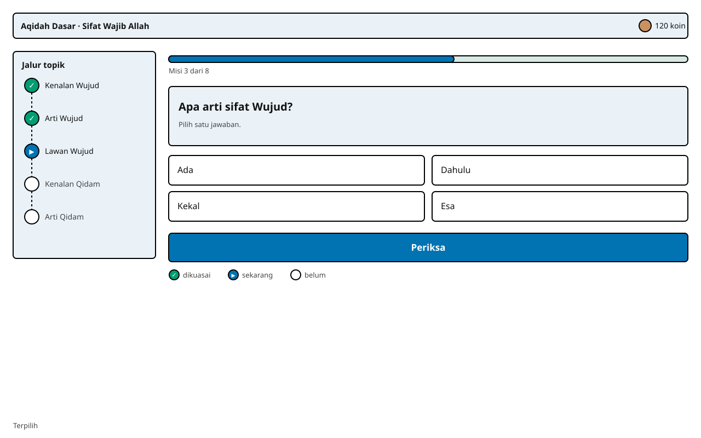
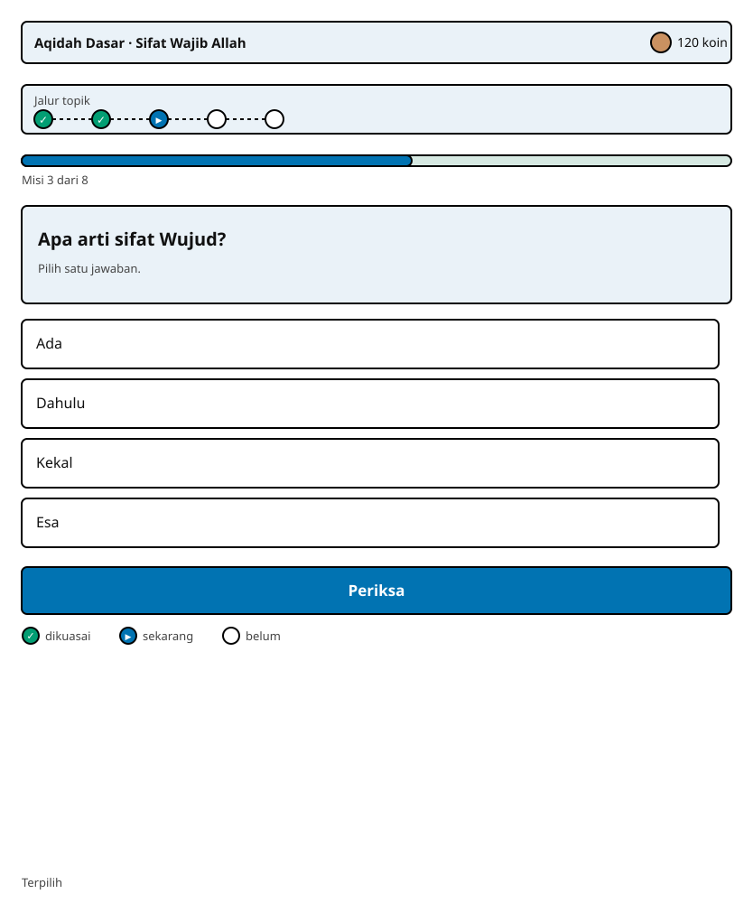
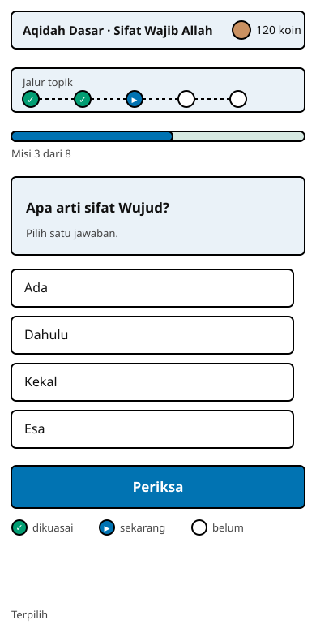

## Tokens and components

Colour comes from the existing DaisyUI theme already used by Bnest; this plan adds no palette. Roles are semantic: `primary` for the single action, `success` for mastered, `warning` for needs-another-try, `neutral` for upcoming. Every one of those roles is paired with a glyph and a text label, so removing colour loses nothing.

Type uses three sizes only: mission prompt, choice and body, and meta. Layout is fluid with no fixed pixel widths, matching the approach already used by `DataMigrationLive` and `StorageLive`; the trail moves from a side rail to a top strip through a container query rather than a device breakpoint, so it also behaves in a resized window.

Reusable components introduced: `LearningTrail` (ordered list of mission nodes with state markers), `MissionCard` (prompt plus kind-specific body), `ChoiceButton` (large target, locked state, outcome marker), `CoinBadge` (balance with a polite live region), and `PrimaryAction` (one verb per state). Six kind renderers plug into `MissionCard` and share nothing else, which is what keeps adding a seventh kind a contained change.

## States and behaviour

The runner is a single state machine: `loading`, `question`, `answered-correct`, `answered-incorrect`, `awaiting-parent`, `topic-complete`, `empty-review`, `error`.

- **Keyboard:** every choice is a real button in DOM order; digits 1–4 select a choice; Enter fires the primary action. Focus moves to the outcome message after an answer and to the next prompt after advancing, never trapped.
- **Focus:** a visible focus ring on every interactive element, never removed for aesthetics.
- **Answer lock and advance:** selecting an answer locks all choices immediately, shows the outcome in text and marker, and advances automatically after a short pause, preserving the behaviour the current corpus asserts. The pause is skippable by the primary action.
- **Error:** a failed submission keeps the learner's selection, uses an alert that takes focus, and offers **Coba lagi** without losing the mission.
- **Empty:** the review queue with nothing due renders a finished state with a way back to courses; it is never an error.
- **Loading:** skeleton regions with an `aria-busy` container; no spinner-only state.
- **Reduced motion:** under `prefers-reduced-motion`, trail movement and celebration collapse to an instant state change carrying the same text; nothing is conveyed only by the animation.
- **Live regions:** progress and coin changes announce politely; a blocking failure announces as an alert.
- **Responsive:** the trail is a side rail on desktop and a horizontal strip on tablet and mobile; the mission column never exceeds a comfortable measure; every target stays at least 44 by 44 CSS pixels; the layout reflows at 200% zoom without horizontal scrolling.

## Routes and viewport matrix

Manual verification covers this matrix at the exact served origin, on desktop, tablet, and mobile.

| Route                  | Who             | States to inspect                                                    |
| ---------------------- | --------------- | -------------------------------------------------------------------- |
| `/learn`               | Learner         | loading, list, empty, error                                          |
| `/learn/:course_id`    | Learner         | loading, trail, topic-complete, error                                |
| `/learn/m/:mission_id` | Learner         | all eight runner states                                              |
| `/learn/review`        | Learner         | loading, question, empty-review, error                               |
| `/learn/verify`        | Parent or admin | loading, pending-list, empty, decided, error, and denial for a child |

Implementation, test, specification, and asset paths for this UI are listed in [file impact](07-file-impact.md).
