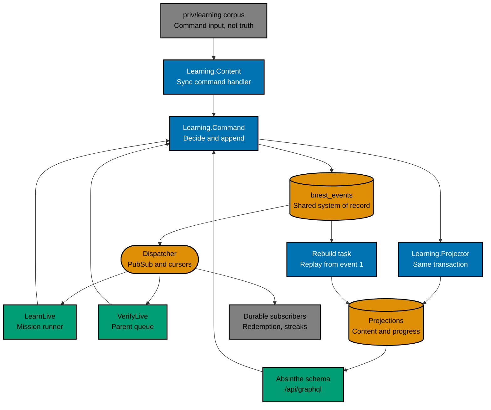

# Technical Design

This plan's technical set is split because four readers need different documents: someone reviewing the schema, someone consuming the API, someone building the screen, and someone executing the cutover. Read this entry point first; each companion owns one contract.

## Architecture

The engine is one new bounded context, `BnestApp.Learning`, on the existing `BnestApp.SqliteRepo`. It is event sourced: `bnest_events` is the system of record for learner facts and content alike, and every `bnest_learning_*` table is a projection that can be dropped and rebuilt from the log.

The log itself is shared Bnest infrastructure rather than a learning table. `BnestApp.EventLog` owns appending, cursors, and dispatch for any domain; learning is its first writer.

Every write takes the same path: a command handler loads the current state, decides, appends events to a stream with an expected version, and applies the projections in the same transaction. Nothing writes a projection without an event behind it, and nothing reads the log to serve a request.

## Selected Decisions

**The event log is the source of truth for everything the engine knows.** Learner facts and content both live in it, so there is exactly one authority, one rebuild story, and no boundary where "just replay it" silently stops working. The rejected alternative — state-authoritative tables with a transactional outbox — is cheaper and keeps SQL constraints as real protection, but its log cannot rebuild state. The accepted costs are stated plainly in [the event model](01-event-model.md): constraints on projections become assertions rather than protections, every event shape is permanent and needs versioning and upcasters from the first release, and a bug that writes a wrong event leaves a wrong event that only a compensating event can answer.

**Projections are written in the same transaction as the append.** This departs from the usual asynchronous diagram and removes the trade-off that would have damaged this product: a child must see whether an answer was right immediately, and a read after a write must not observe stale state. On a single-node SQLite database the asynchrony buys nothing.

**The authored corpus is a command input, not an authority.** Content is still written as reviewed files under `priv/learning/`, but the sync compares them with projected content state and appends the difference as events. Git review and event sourcing both survive, and a `mission.defined` event carries the whole mission body, so replay can reconstruct the exact content a learner saw at the time of an attempt.

**One stream per learner, plus one content stream.** Every learner invariant — mastery, streaks, and crediting a mission's coins exactly once — lives inside a single learner, so one stream per learner gives all of them one serialization point. `UNIQUE (stream_id, stream_version)` is the concurrency control; a rejected append means reload and re-decide. A per-mission stream could not hold the coin rule, and a single global stream would serialize the whole household.

**Progress is keyed by `(user_id, mission_id)` alone.** A mission is reusable across topics and courses, so any course or topic in the progress key would fragment one learner's mastery and make review repeat known work. The schema offers no column that would allow the mistake.

**The store is hand-written on Ecto rather than adopting Commanded.** Commanded is the established Elixir CQRS and event-sourcing framework, but its event store is PostgreSQL-backed with no SQLite adapter, so adopting it means running PostgreSQL on the household machine or writing a custom adapter. Both cost more than the small append-and-project store this plan needs. SQLite suits the shape: an append-only single-writer log with concurrent readers is what WAL mode does well.

**Sifat Allah is rebuilt as content, not preserved as code.** Its curriculum becomes generated corpus files and its screen is replaced by the generic runner. The accepted risk is experience regression, controlled by holding the generic runner to the existing behaviour corpus before the route is cut over.

## Live-Service Contract

Bnest is routed and always on. This plan changes the schema, adds a route, and replaces a live screen, so every phase applies [live-service continuity](../../../../repo-governance/development/live-service-continuity.md).

- The active backend is never stopped. Work is prepared on an independent candidate slot and promoted through Caddy.
- The candidate must prove its revision, readiness, and a connected LiveView journey at the exact origin before promotion.
- Routed responsiveness is sampled continuously from preflight through drain: zero failures, p95 at or below 500 ms, every sample at or below 2 seconds.
- **Responsiveness rollback trigger:** any routed failure, any single sample above 2 seconds, or a p95 above 500 ms across a rolling one-minute window triggers managed Caddy rollback to the last healthy backend.
- Mixed-version safety: the schema migration is additive only, the previous revision never reads a learning table, and the Sifat Allah record type stays readable until the contract phase, so both revisions can serve during the drain.
- LiveView and WebSocket clients reconnect without a manual refresh and keep the current mission; a bounded five-minute drain precedes retirement of the previous slot.
- After promotion, only the active route remains: the candidate slot, any temporary proxy, and any scratch runtime root are removed.

## Glossary

This plan uses the standard vocabulary of event sourcing rather than inventing local names, so the design maps directly onto the literature. Plain meanings, in the order you will meet them:

- **Event sourcing** — storing what happened as an ordered list of facts, and deriving every table you query from that list. The opposite of storing only the latest values.
- **Event** — one fact that already happened, written once and never changed. `mission.mastered` is an event; "please master this mission" is not.
- **Event log** — the table holding every event in order. Here `bnest_events`, shared across domains and partitioned by a `domain` column.
- **System of record** — the one place that decides what is true. Everything else can be thrown away and rebuilt from it. Here, the event log.
- **Stream** — one entity's slice of the log, in order, named within its domain. This plan has one stream per learner and one for content.
- **Domain** — which part of Bnest an event belongs to, so one shared log can serve several without collisions.
- **Stream version** — an event's position within its stream, counting from 1. Used to detect two writers racing.
- **Optimistic concurrency** — instead of locking a row, you say which version you expect to write; if someone got there first, your write is rejected and you retry. `UNIQUE (domain, stream_id, stream_version)` is what enforces it.
- **Command handler** — the code that loads current state, decides what should happen, and appends the resulting events. All the business rules live here.
- **Projection** — a table built by reading the log, kept only for querying. Also called a read model or materialized view. Progress, attempts, the coin ledger, and all the content tables are projections.
- **Projector** — the code that turns an event into projection rows.
- **Replay / rebuild** — dropping the projections and reading the log from the beginning to build them again. The recovery path when a read model is wrong.
- **Deterministic** — always produces the same result from the same input. Projectors must be deterministic, which is why they take time from the event and never from the clock.
- **Cursor** — a saved "I have handled everything up to here" marker, so work resumes in the right place after a restart.
- **Subscriber** — code that reacts to events after they are committed. A **live** subscriber may miss messages while disconnected; a **durable** subscriber keeps a cursor and never misses one.
- **Dispatcher** — the process that hands committed events to subscribers.
- **At-least-once** — a delivery guarantee: a subscriber will see every event, but may see one twice.
- **Idempotent** — safe to run twice with the same result. Required of every subscriber, because delivery is at-least-once.
- **Event version and upcaster** — stored events are never edited, so when an event's shape changes you bump its version and register an upcaster: a function that converts the old shape to the new one while reading.
- **Compensating event** — the only way to correct a wrong fact. You append a new event that reverses it; you never edit or delete the original.
- **Corpus** — a whole body of files treated as one unit, matching the repository's existing use of the word. The **learning corpus** under `priv/learning/` is validated and applied whole, so one bad mission rejects all of it; the **behaviour corpus** under `specs/` is the complete `.feature` collection.
- **Checksum (SHA-256)** — a short fingerprint of some content. Two identical bodies produce the same fingerprint, so a change is detectable without comparing the whole text.
- **Actor** — who caused an event, which is not always who it is about. A parent verifying a child's mission is the actor on the child's stream.

## Navigation

- [Event model](01-event-model.md) — streams, concurrency, event catalogue, versioning, rebuild, and delivery.
- [Data model](02-data-model.md) — ERD, exact DDL, field guide, and the authored corpus format.
- [GraphQL API](03-graphql-api.md) — schema, authorization, limits, dependency decision, and test strategy.
- [UI design](04-ui-design.md) — alternatives, selected direction, tokens, states, and accessibility.
- [Migration design](05-migration-design.md) — Sifat Allah inventory, conversion, authority cutover, and rollback.
- [Specification changes](06-specification-changes.md) — planned C4 and Gherkin deltas.
- [File impact](07-file-impact.md) — every expected path.

## Directory Map

- [`01-event-model.md`](01-event-model.md) — event-sourcing write path, catalogue, and rebuild contract.
- [`02-data-model.md`](02-data-model.md) — event log, projection schema, ERD, field guide, and corpus format.
- [`03-graphql-api.md`](03-graphql-api.md) — GraphQL boundary, authorization, and dependency decision.
- [`04-ui-design.md`](04-ui-design.md) — UI alternatives, selection, states, and accessibility.
- [`05-migration-design.md`](05-migration-design.md) — Sifat Allah data migration and authority cutover.
- [`06-specification-changes.md`](06-specification-changes.md) — planned specification deltas.
- [`07-file-impact.md`](07-file-impact.md) — exact code, test, specification, and configuration paths.
