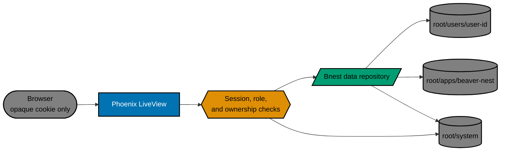
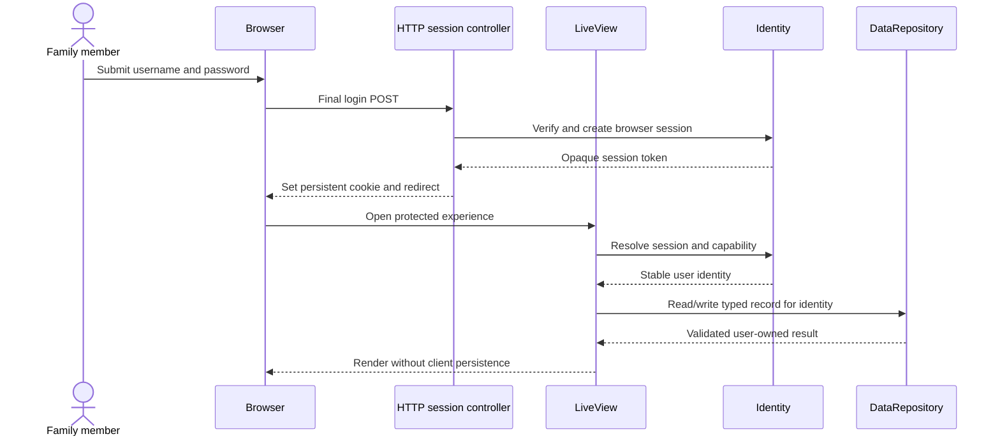

# Technical Documentation

This document is the technical entry point for [Bnest Centralized Data](../README.md). It records the selected design and implementation handoff. The [Bnest C4 model](../../../../specs/apps/bnest/app/architecture.md) and selected executable Gherkin now match the verified implementation, while live setup/import and final route promotion remain delivery gates rather than architecture claims.

## Directory Map

Read this overview first, then follow this reading order as needed:

- [Data contracts](data-contracts.md) defines every JSON record, validation rule, version, and compatibility boundary.
- [Migration design](migration-design.md) defines source inventory, no-downtime cutover, retry, recovery sources, restore, and rollback.
- [UI design](ui-design.md) compares the responsive alternatives and records the selected experience.
- [UI design assets](assets/README.md) indexes every lo-fi and selected hi-fi artifact.
- [Specification changes](specification-changes.md) records the selected durable C4/Gherkin changes, bindings, and proof.
- [File impact](file-impact.md) is the reconciled annotated implementation tree.

## Execution Handoff

[Delivery](../delivery.md) turns these decisions into ordered tasks and phase checkpoints.

A _runtime root_ is the one directory a Bnest process may read and write. A _manifest_ records what an import attempted. A _checksum_ detects changed bytes. An _atomic replace_ makes a complete new file visible at once instead of exposing a partial write.

## Decisions

| Area                    | Selected decision                                                                                                           |
| ----------------------- | --------------------------------------------------------------------------------------------------------------------------- |
| Availability            | Bnest is a 24/7 family service; Elixir/OTP provides supervision and process isolation, while deploys use a healthy backend. |
| Live data               | One startup-resolved `data/prod/` root.                                                                                     |
| Filesystem tests        | One marked `data/test/runs/<run-id>/` root and isolated browser profile per run.                                            |
| User identity           | Normalized username lookup resolves to a server-generated stable user ID; paths never contain usernames.                    |
| Passwords               | Argon2id encoded salted verifiers; plaintext exists only during form handling.                                              |
| Sessions                | Opaque persistent cookie per browser; server stores only the token digest and session metadata; no automatic expiry.        |
| Authorization           | Multi-role capability check plus record ownership; cross-user access defaults to deny.                                      |
| Bootstrap               | One setup transaction creates all initial accounts, including an admin, then closes setup permanently for that root.        |
| Later account lifecycle | Account creation, role edits, password reset, account disablement, and all-session revocation are explicitly out of scope.  |
| Browser data            | Import allow-listed Bnest keys, re-read server data, then delete only the accepted key.                                     |
| Legacy files            | Copy and verify; never move or delete root-level legacy sources in this plan.                                               |

## Implemented Architecture

Phoenix LiveView remains the public boundary. Authentication resolves the current user before application data is read. A server-side repository owns identity-derived paths, schema validation, path locks, atomic writes, imports, manifests, and recovery sources.



The process receives exactly one `<runtime-root>` before supervision starts. It cannot switch roots while running. Production uses `data/prod/`; a filesystem test uses its unique `data/test/runs/<run-id>/`. Pure in-memory unit tests create neither root.

## Component Responsibilities

| Boundary         | Owns                                                                                                 | Must not do                                                                    |
| ---------------- | ---------------------------------------------------------------------------------------------------- | ------------------------------------------------------------------------------ |
| `Identity`       | Bootstrap state, username lookup, credential verification, current session, roles, capabilities.     | Read or return user payloads.                                                  |
| `DataRepository` | User-derived paths, locks, schema validation, atomic writes, imports, manifests, recovery/read-back. | Accept a browser-selected path, user ID, or schema version.                    |
| LiveViews        | Render authorized state and submit typed operations to the two boundaries.                           | Open runtime files or trust client ownership claims.                           |
| Browser hook     | Read only known legacy keys during confirmed import and retain the session cookie.                   | Enumerate storage, retain final chat/quiz/theme state, or access server paths. |

`Identity` and `DataRepository` expose explicit operations rather than leaking file-store details:

```text
Identity.bootstrap(accounts)              -> ok | validation/conflict error
Identity.login(username, password)        -> session token | generic login error
Identity.current_user(session_token)      -> user | unauthenticated
Identity.logout(session_token)            -> ok
Identity.authorize(user, capability, owner_id) -> allow | deny

DataRepository.read(record_type, user)    -> record | missing | invalid
DataRepository.write(record_type, user, expected_revision, candidate) -> accepted record | stale | error
Import.browser(store, owner_id, source)   -> accepted | retryable | rejected
RecoverySource.normalize_browser(store, owner_id, import_id) -> typed recovery candidate | error
Backup.preserve(store, owner, import_id, bytes) -> immutable legacy copy | error
```

Every public error is safe and actionable. Detailed failures may name a public record type and failure category, but never a username, user ID, private path, password verifier, cookie, checksum, session value, or user payload.

## Implementation Reconciliation

- `browser_import.js` reads only the three named legacy keys after the authenticated migration screen requests them. A fresh authenticated chat or learning view ignores unconfirmed client state and creates its first central record only on a durable user action.
- Authenticated theme changes use `PUT /preferences/theme`; reload reads the user's central preference. Authenticated pages never recreate `phx:theme`, chat, or learning web-storage values.
- `chat_runner.mjs` reports `resume_failed` when a resumed Codex thread fails before `thread.started`. `PortSession` passes that event to `ChatLive`, which preserves every message, clears only the unavailable thread ID, and persists a readable transcript for a fresh thread.
- E2E scenarios create distinct `test-user-` identities even when device projects share one marked runtime root. Evidence resolves through the scenario user's paths instead of mutable aggregate counts.
- The execution inventory found no non-placeholder root-level runtime source. `Backup` remains tested and ready for a future proven source, but this plan created no production legacy copy.

## Authentication and Account Lifecycle

### Username and password

An initial username is trimmed and compared case-insensitively after ASCII lowercase normalization. It must contain 1–32 characters, start and end with a letter or digit, and otherwise use only lowercase letters, digits, `-`, `_`, or `.`. The original display form may be stored as metadata, but the normalized form is the unique lookup key. Duplicate normalized usernames fail before any account is written.

The internal setup form accepts every valid Unicode password without an application character-count rule and preserves it without silent trimming. It rejects an empty value and requires at least one letter, one number, and one punctuation mark, such as `_`; there are no other composition requirements. `credential_verifier.ex` uses maintained `argon2_elixir` 4.1.x and stores its encoded salted verifier. That library expresses memory as a power-of-two KiB value, so the selected parameters are 32 MiB (`m_cost: 15`), two iterations, and one lane: the smallest representable memory setting above OWASP's 19 MiB baseline. Benchmark this configuration through Nx and keep it below one second on deployment-equivalent hardware. Never use SHA-256, reversible encryption, or custom comparison for passwords.

### One-time setup

When no account or bootstrap journal exists, the setup UI collects all initial accounts and requires at least one `admin`. Draft passwords remain only in password inputs inside one standard final HTML form; JavaScript does not place them in storage or send them through incremental LiveView events. Review shows usernames and roles, never passwords. Final POST reaches `BootstrapController`, which passes the values directly to the hashing boundary and clears them from request-derived state after use.

One global lock writes a pending journal first, validates and writes the named account/index files, verifies their checksums, then atomically marks the journal closed. Startup completes or rolls back only files proven to belong to a matching pending attempt. A server validation failure returns safe non-password fields but empty password inputs. After closure, setup and public registration return not found; they never reopen merely because an account file is missing.

This plan deliberately provides no later account creation, password reset, role edit, disablement, or self-service recovery. A lost credential leaves that account unavailable until a later explicitly planned recovery capability; restoring a migration recovery source must not roll back unrelated data to recover a password. The UI must state this limitation before setup is closed.

### Persistent independent sessions

Each login generates at least 32 random bytes for that browser. The browser stores the encoded token only in a persistent `HttpOnly`, `SameSite=Lax` cookie. The server record has no time-based expiry; the cookie uses a far-future browser expiry because browsers cannot persist a session cookie across restarts without one. Browser clearing/eviction still logs the user out.

Only the one-time bootstrap transaction is serialized by the identity coordinator. Password verification, session creation, current-user lookup, and one-session logout run outside that coordinator against immutable account records and path-scoped repository operations, so one Argon2 calculation cannot block an already authenticated request or an unrelated browser login.

Production Mix configuration sets `Secure`; the routed development service sets the same flag explicitly with `BNEST_COOKIE_SECURE=true` because TLS terminates at the HTTPS tailnet proxy. Isolated localhost tests disable `Secure` only in test configuration. If a later deployment adds HTTPS redirects based on forwarded headers, it must trust those headers only from the proxy, following [Plug's HTTPS guidance](https://hexdocs.pm/plug/https.html).

The SHA-256 digest of the token is both the lookup key and `<session-record-id>`; the raw token never appears in a filename or runtime record. A login from another browser creates another record. Logout revokes only the presented digest and broadcasts a session-specific disconnect so every tab using that browser session stops. HTTP plugs and LiveView `on_mount` both validate sessions, and every data-changing event authorizes again; this follows [Phoenix LiveView's security model](https://hexdocs.pm/phoenix_live_view/security-model.html). There is no server-side automatic expiry in this internal deployment.

### Authorization

Roles are a set containing any combination of `children`, `parents`, and `admin`. This plan's capability matrix is intentionally narrow:

| Capability                 | children | parents | admin | Ownership requirement                   |
| -------------------------- | -------: | ------: | ----: | --------------------------------------- |
| Use chat                   |      yes |     yes |   yes | Current user's record only.             |
| Use Sifat Allah            |      yes |     yes |   yes | Current user's record only.             |
| Read/write theme           |      yes |     yes |   yes | Current user's record only.             |
| Confirm own browser import |      yes |     yes |   yes | Destination must be current user.       |
| View own import status     |      yes |     yes |   yes | Current user's manifests only.          |
| Bootstrap accounts         |       no |      no |    no | Available only before bootstrap closes. |
| Read/write another user    |       no |      no |    no | No sharing policy in this plan.         |

Multiple roles union only the listed capabilities; they never bypass ownership. A parent-to-child sharing policy is out of scope.

Roles are retained for future policy but intentionally grant the same self-owned product capabilities in this plan. This avoids inventing cross-user privileges merely to make the labels behave differently.

## Concurrent Browser Writes

Every mutable user record carries a non-negative `revision`. A read returns that revision; a write under the per-path lock succeeds only when `expected_revision` matches, then increments it by one. A stale browser receives a conflict, keeps the newer server record untouched, and must refresh before retrying. This plan does not silently merge transcripts, quiz answers, or preferences and never uses last-write-wins.

Two browsers may remain logged in and read the same user's data. They may write different record types concurrently. When they edit the same record, only the first matching revision commits; the other gets a visible safe refresh message. This is the plan's no-loss boundary for simultaneous browsers.

## Main Runtime Flow



Import adds a confirmed compatibility step between login and the normal read. The exact state machine and failure behaviour live in [migration design](migration-design.md).

## Test and Safety Boundaries

No authentication, migration, browser, or manual-AI filesystem test may use `data/prod/`, a real identity, or a real browser profile. Each run proves its marked root before bootstrap, creates only `test-user-<suite>-<run-id>` accounts and synthetic payloads, then stops browser/server processes before exact-root cleanup.

Development may run `bnest-app:schema:audit` against production only for read-only structural comparison. It reports public record type, version, field names, and value types—never identity, path, count, hash, credential/session material, or payload—and cannot authenticate, write, migrate, repair, or produce fixtures. See [data contracts](data-contracts.md#production-schema-audit-projection) for the comparison shape.

## Verification and Rollback

- Unit tests prove validation, authorization, digest/session handling, paths, locks, atomic replacement, idempotency, and safe error projection.
- Integration tests use isolated roots for bootstrap, import, retry, recovery-source restore, and cleanup.
- Behaviour coverage binds every selected Gherkin scenario in each applicable adapter.
- Focused E2E journeys prove setup closure, login persistence, two-browser independence, import/read-back/client cleanup, and cross-user denial.
- Manual AI verification uses a marked test root, isolated profiles, synthetic fixtures, and the selected three viewports.
- Changed setup/login/import/chat/learning/theme states receive accessibility-tree, keyboard, reflow, contrast, and light/dark checks; affected Lighthouse accessibility must pass.
- Rollback stops new writes and reads the retained source or last accepted record. It never deletes a source to make recovery appear clean.

Exact targets, evidence, and checkpoints live in [delivery](../delivery.md).

## Technical Risks

- `sessionStorage` is tab-scoped and may disappear before import; migration must happen while that tab still has the source.
- Initial setup has no password reset in this plan; the irreversible-close warning and explicit maintainer acceptance are required.
- Flat files need one consistent lock owner plus atomic replacement so simultaneous LiveViews cannot lose accepted writes.
- Unknown or malformed legacy data must remain opaque and retryable rather than being coerced or discarded.
- A later multi-node deployment would invalidate process-local locking and needs a separate storage/coordination design.
