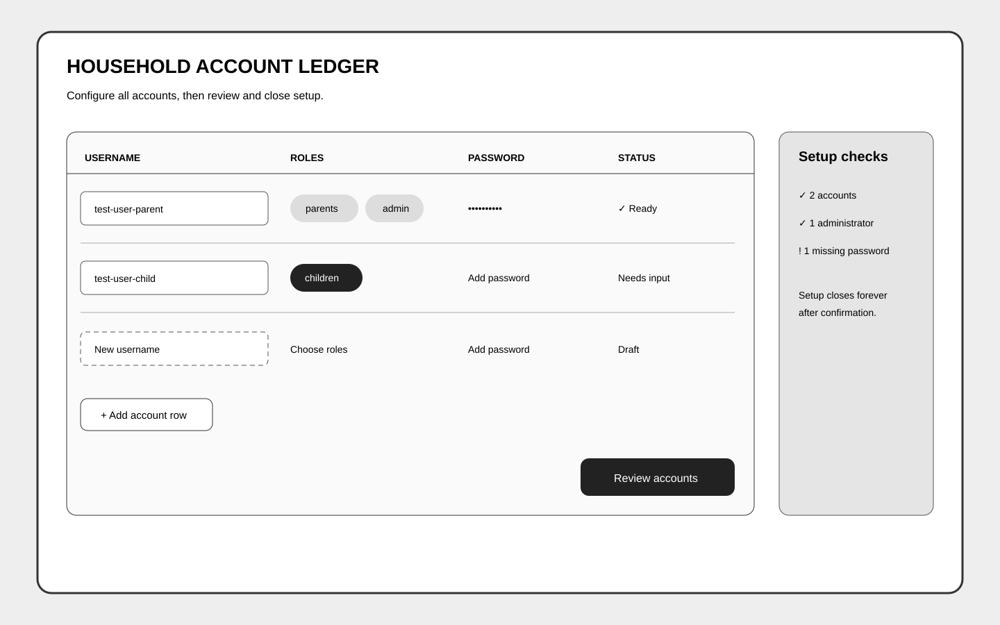
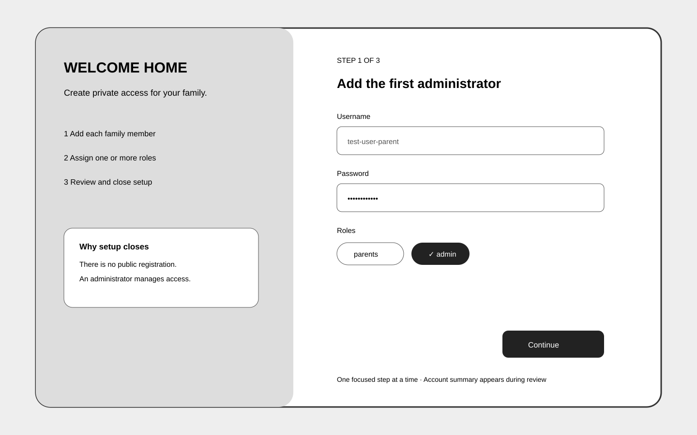
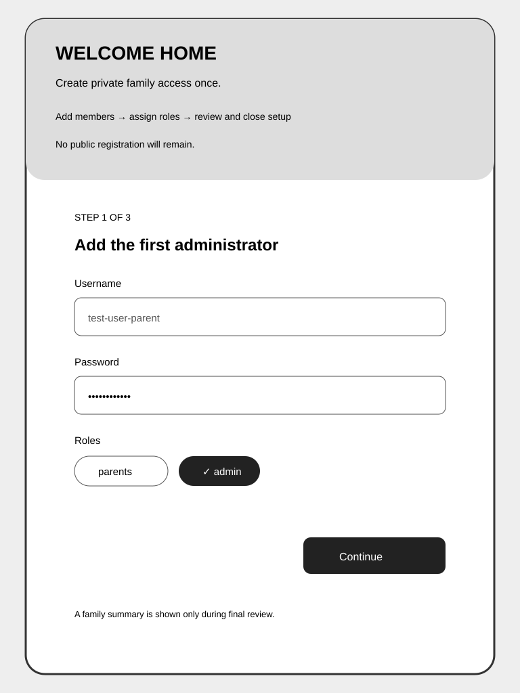
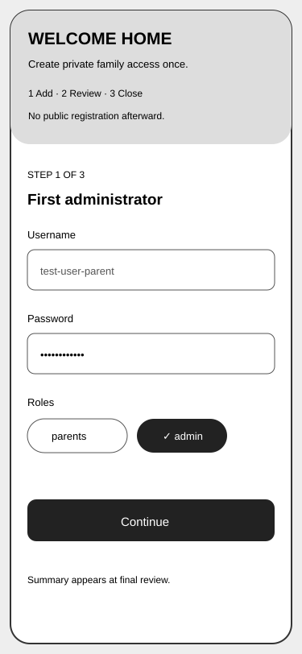

# UI Design

This companion to [technical documentation](README.md) records the interface exploration for one-time account setup, login, and import status. [The asset gallery](assets/README.md) owns viewport metadata and the complete asset index.

## Users and Jobs

- **Initial maintainer:** create every initial username/password/role account, review the family, understand the lack of password reset, and close setup once.
- **Returning family member:** log in without learning storage concepts.
- **Importing family member:** understand which browser data was found, confirm its copy, see progress/retry, and continue only after server read-back.

The interface must cover empty, editing, validation error, submitting, success, retryable failure, stale-record conflict, rejected source, and irreversible-close states. Passwords disappear after submission; other valid entered values remain when validation fails.

## Alternatives and Decision

| Alternative              | Decision     | Strength                                                                           | Trade-off                                         |
| ------------------------ | ------------ | ---------------------------------------------------------------------------------- | ------------------------------------------------- |
| **A — Nest Cards**       | **Selected** | Keeps family members and multiple roles visible in Bnest's friendly card language. | More page structure than one progressive form.    |
| **B — Household Ledger** | Not selected | Efficient dense administration and persistent checklist.                           | Cramped on mobile and visually too institutional. |
| **C — Front Door**       | Not selected | Lowest immediate cognitive load.                                                   | Hides the household overview until final review.  |

### A — Nest Cards · Selected lo-fi

| Desktop · 1440×900                                                                                               | Tablet · 768×1024                                                                                        | Mobile · 375×812                                                                                 |
| ---------------------------------------------------------------------------------------------------------------- | -------------------------------------------------------------------------------------------------------- | ------------------------------------------------------------------------------------------------ |
|  |  |  |

### B — Household Ledger · Not selected lo-fi

| Desktop · 1440×900                                                                                        | Tablet · 768×1024                                                                                           | Mobile · 375×812                                                                                          |
| --------------------------------------------------------------------------------------------------------- | ----------------------------------------------------------------------------------------------------------- | --------------------------------------------------------------------------------------------------------- |
|  |  |  |

### C — Front Door · Not selected lo-fi

| Desktop · 1440×900                                                                                       | Tablet · 768×1024                                                                                 | Mobile · 375×812                                                                                 |
| -------------------------------------------------------------------------------------------------------- | ------------------------------------------------------------------------------------------------- | ------------------------------------------------------------------------------------------------ |
|  |  |  |

Nest Cards best balances setup clarity, family context, accessibility, and product fit. The lo-fi comparison establishes information order without color. The OSE Public study informed fixed viewports, indexing, and responsive evidence only; its portfolio palette, sidebar, and navigation were deliberately not adopted.

## Selected Hi-fi Direction

| Desktop · 1440×900                                                                                                     | Tablet · 768×1024                                                                                         | Mobile · 375×812                                                                                             |
| ---------------------------------------------------------------------------------------------------------------------- | --------------------------------------------------------------------------------------------------------- | ------------------------------------------------------------------------------------------------------------ |
|  |  |  |

The direction uses Bnest's existing deep-teal ink, mint canvas, warm paper, sun yellow, coral, lagoon teal, rounded cards, offset shadow, and nest-ring motif. The implementation keeps the Nest Cards hierarchy but uses one responsive page instead of a multi-step client state machine: each account card is simultaneously editable and reviewable, passwords never move between steps, and the irreversible confirmation stays beside the final submit. This is the selected minimal variant of the hi-fi direction.

## Screens and Components

### One-time setup

1. Explain that setup creates all initial accounts once and later account/password management is unavailable in this plan.
2. Add accounts inside one final HTML form using username, password, password confirmation, and multi-role selection; incremental UI state never sends or stores passwords.
3. Keep every account as a visible editable card; added cards can be removed before final submission, while the required first administrator card remains.
4. Require at least one admin and resolve duplicate normalized usernames inline.
5. Review usernames and roles directly in their cards; password and confirmation inputs remain masked and are never echoed elsewhere.
6. Require an explicit irreversible-close confirmation before the one final bootstrap POST.

### Login

Show username, masked password, submit state, and one generic invalid-credentials message. Do not reveal whether a username exists. Successful login returns to the originally requested safe internal route; an invalid return path goes home.

### Import and migration status

After login, show only recognized sources found in that browser. For each source, explain what will be copied, that the source remains until read-back, and the final client-cleanup behavior. Status cards distinguish `ready`, `copying`, `verifying`, `accepted`, `retryable`, and `rejected` using icon, text, and color. Retry never asks the user to re-enter data.

Shared implementation surfaces are account cards, role checkboxes, add/remove controls, irreversible confirmation, login form, source confirmation cards, status alerts, and retry actions.

A stale-record alert says another browser saved a newer version, keeps that server version untouched, and offers **Refresh latest**. It never promises an automatic merge or silently resubmits the stale change.

## Accessibility and Responsive Contract

- Every field has a visible label; descriptions and errors are programmatically associated.
- Password and confirmation fields use native masked controls, password-manager autocomplete, and distinct visible labels.
- Role chips expose checked state beyond color; status uses icon and text beyond color.
- Keyboard order follows visual order and visible focus is never clipped by card shadows.
- Error, loading, success, retry, and irreversible states use live-region semantics only when an announcement is useful.
- Reduced-motion preference disables decorative transitions and auto-scrolling.
- Zoom and narrow layout do not require horizontal page scrolling; long usernames wrap without hiding roles/actions.
- Validation preserves non-password inputs; password fields clear after a failed server submission.
- Production implements only Nest Cards. Rejected alternatives remain decision evidence, not hidden implementation variants.

## Implementation and Proof Routes

Exact application, test, specification, and asset paths live in [File Impact](file-impact.md). [Delivery](../delivery.md) compares the implementation at all three selected viewports and verifies setup, login, import, retry, and irreversible-close states with synthetic users only. Browser proof covered labels, password clearing, add/remove controls, keyboard order, focus, no horizontal overflow, light/dark themes, and color contrast; affected Lighthouse accessibility reached 100.
