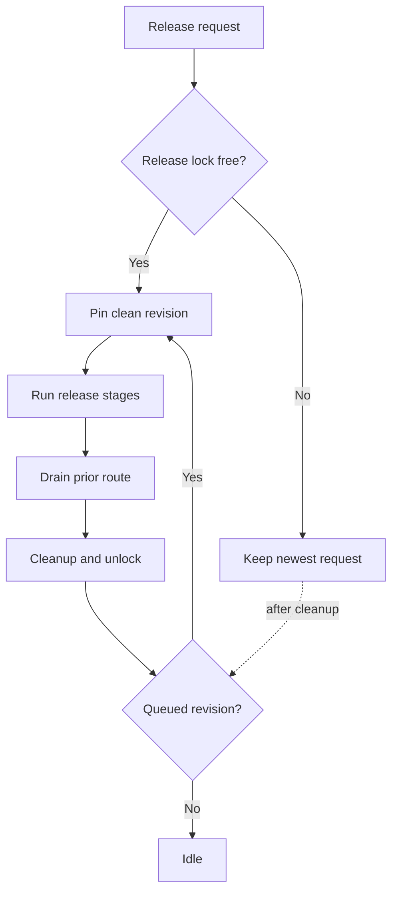
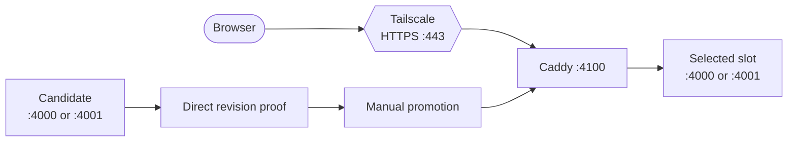
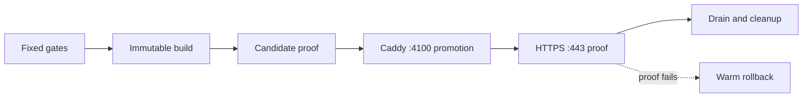
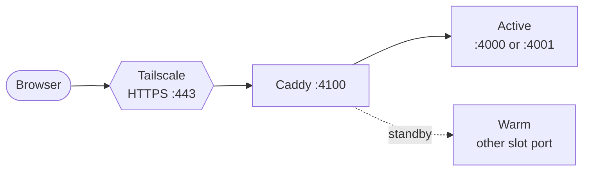
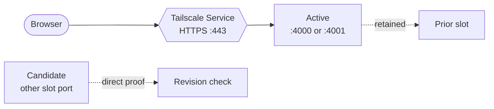
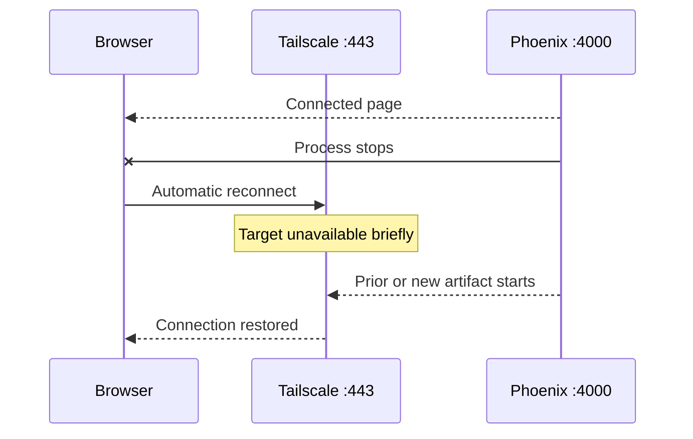
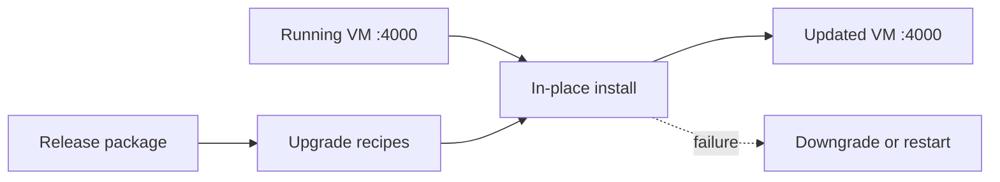
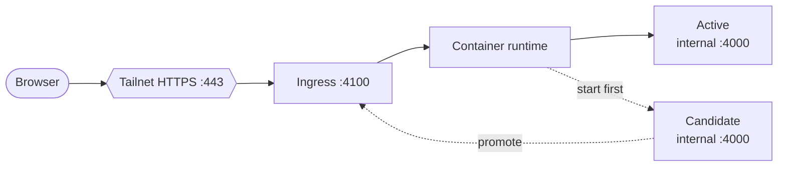

# Release Alternatives

This companion compares every operating model against the shared constraints. Read the [technical decision guide](README.md) first for current evidence and recommendation.

## Possible Alternatives

The alternatives share one acceptance bar: fixed pre-artifact gates, an immutable revision, exact-origin routed proof, automatic page recovery without lost progress, deterministic rollback, and bounded cleanup. Resource statements combine structural estimates with the completed Alternative B CPU, RSS, disk, descriptor, and duration measurements.

| ID  | Operating model                        | Normal Phoenix VMs | Release overlap      | Stable listener           | Current verdict                              |
| --- | -------------------------------------- | ------------------ | -------------------- | ------------------------- | -------------------------------------------- |
| A   | Manual ephemeral blue/green            | 1                  | 2 Phoenix VMs        | Caddy                     | Safe baseline, but too many operator steps   |
| B   | Composed ephemeral blue/green          | 1                  | 2 Phoenix VMs        | Caddy                     | Recommended                                  |
| C   | Permanently warm blue/green            | 2                  | 2 Phoenix VMs        | Caddy                     | Reject unless startup delay becomes material |
| D   | Tailscale Service with ephemeral slots | 1                  | 2 Phoenix VMs        | Tailscale Service         | Conditional no-Caddy investigation           |
| E   | Device Serve with one restarted slot   | 1                  | No overlap           | Tailscale Serve           | Conditional lowest-resource fallback         |
| F   | In-place OTP hot upgrade               | 1                  | No second VM         | Phoenix through Tailscale | Reject without exceptional evidence          |
| G   | Container-managed rolling replacement  | 1                  | Usually 2 containers | Added runtime/router      | Reject without a separate container need     |

### Port Contract

These are loopback ports unless explicitly described as Tailnet-facing. The application never terminates public HTTPS itself. Development leases `4020`–`4029` and fails closed on collision; routine releases do not start a development server.

| Port          | Owner and purpose                                                              | Status                            |
| ------------- | ------------------------------------------------------------------------------ | --------------------------------- |
| `443`         | Tailscale HTTPS used by family browsers and exact-origin routed proof          | Current for every alternative     |
| `2019`        | Caddy admin API; never a browser or Phoenix port                               | Current in A–C only               |
| `4000`        | Blue production slot, or the fixed sole Phoenix slot                           | Current                           |
| `4001`        | Green production slot during blue/green operation                              | Current                           |
| `4002`        | Phoenix test-environment default when a test starts the endpoint               | Current                           |
| `4010`–`4019` | Leased Playwright/E2E origins; the managed release gate owns base `4010`       | Implemented                       |
| `4020`–`4029` | Explicitly leased code-reloading Bnest development servers; closed when unused | Implemented                       |
| `4100`        | Stable loopback handoff owned by Caddy or a future container ingress           | Current for Caddy; proposed for G |

| Alternative | Exact production path                                                          | Candidate or rolling port                                               | Development and tests                                       |
| ----------- | ------------------------------------------------------------------------------ | ----------------------------------------------------------------------- | ----------------------------------------------------------- |
| A, B, C     | Tailnet `:443` → Caddy `127.0.0.1:4100` → blue `:4000` or green `:4001`        | The non-routed slot uses the other of `4000`/`4001`                     | Dev `:4020`–`:4029`; test `:4002`; release E2E `:4010`      |
| D           | Tailscale Service `:443` → selected `127.0.0.1:4000` or `:4001`                | The inactive slot uses the other port and is checked directly           | Dev `:4020`–`:4029`; test `:4002`; release E2E `:4010`      |
| E, F        | Tailscale Serve `:443` → fixed `127.0.0.1:4000`                                | None; the same listener restarts or upgrades in place                   | Dev `:4020`–`:4029`; test `:4002`; release E2E `:4010`      |
| G           | Tailnet `:443` → runtime ingress `127.0.0.1:4100` → container-internal `:4000` | Old and new containers both use internal `:4000` in separate namespaces | Host dev `:4020`–`:4029`; test `:4002`; release E2E `:4010` |

Preflight must assert exclusive ownership of every port the chosen option will mutate. It may tolerate the expected active owner, but an unexpected listener on `4000`, `4001`, `4010`, or `4100` stops before build or process changes. Bnest development and non-release E2E processes acquire one machine-local lease for their explicit pool port and release it on cleanup; they never scan-and-bind or reuse another listener. Other projects remain outside Bnest's pool, and any collision still fails closed. Tests must use their declared isolated origin and never reuse production, development, or another test listener.

### Resource Expectation Model

The deterministic comparison combines safe process snapshots and completed Alternative B evidence with measured symbols: `P` is one healthy Phoenix VM at representative load, `C` is Caddy, `R` is a container runtime plus local ingress, `B` is the peak build/test workload, `A` is one immutable artifact or image, and `W` is bounded worktree/build scratch. Tailscale and the operating system are common to every option and excluded from deltas.

| Alternative | Expected steady RSS/process shape      | Expected release peak                   | Retained release disk                        | Main capacity concern                                                        |
| ----------- | -------------------------------------- | --------------------------------------- | -------------------------------------------- | ---------------------------------------------------------------------------- |
| A           | `P + C`; one Phoenix and Caddy         | `2P + C + B`                            | `2A + W` until cleanup                       | Manual cleanup can extend overlap or scratch retention                       |
| B           | `P + C`; one Phoenix and Caddy         | `2P + C + B`                            | Two verified artifacts; `W` removed          | Same peak as A, but overlap and cleanup are bounded automatically            |
| C           | `2P + C`; two Phoenix VMs always       | `2P + C + B`                            | Two verified artifacts plus `W` during build | Double app memory, files, connections, and background work at steady state   |
| D           | `P`; one Phoenix, no Caddy delta       | `2P + B`                                | Two verified artifacts; `W` removed          | Saves `C`, but still needs temporary app overlap and Service control state   |
| E           | `P`; one Phoenix                       | `P + B`; old and new VMs are sequential | Two verified artifacts; `W` removed          | Lowest process count, but outage and rollback duration become the constraint |
| F           | `P`; one Phoenix                       | `P + U`, where `U` is upgrade staging   | Current/prior packages plus upgrade recipes  | Low process count, highest per-release engineering and state-transition risk |
| G           | `P + R`; one app container and runtime | `2P + R + B`                            | Two images/layers plus bounded build cache   | Runtime, image store, ingress, and temporary duplicate container             |

Phase 1 records `P`, `C`, artifact size, build peak, free memory, swap activity, CPU saturation, file descriptors, and disk before selecting an option. Alternative G must additionally measure `R`; F must measure `U`. A choice fails if the measured release peak causes swap pressure, health latency, dropped WebSockets, or unbounded disk growth. The absolute ranges below are conservative admission estimates, not acceptance measurements; Phase 1 confirms or replaces them.

#### Absolute planning estimates

A 2026-08-27 read-only sample of this 32 GiB, 12-core host observed one routed Phoenix release at 75–76 MiB RSS and 0.03–0.11 CPU cores, Caddy at 57 MiB and 0–0.09 cores, and Tailscale at 42 MiB and approximately 0 cores across five one-second samples. These are safe aggregate observations, not load tests. The service planning load is 5–10 family users across 1–3 groups, with at most 10 connected browsers and 3 simultaneous future group/game sessions. Planning ranges below add substantial headroom for those connections, garbage collection, compilation, Playwright browsers, and variance.

| Alternative                 | Steady RAM    | Steady CPU     | Full release peak RAM | Full release peak CPU | Release disk allowance                              |
| --------------------------- | ------------- | -------------- | --------------------- | --------------------- | --------------------------------------------------- |
| A — manual Caddy slots      | 0.3–0.5 GiB   | 0.2–0.5 cores  | 4–5 GiB               | 3–4 capped cores      | 6–7 GiB; may grow if manual cleanup is missed       |
| B — composed Caddy slots    | 0.3–0.5 GiB   | 0.2–0.5 cores  | 4–5 GiB               | 3–4 capped cores      | 6–7 GiB peak; under 1 GiB after cleanup             |
| C — permanently warm slots  | 0.45–0.75 GiB | 0.4–0.8 cores  | 4–5 GiB               | 3–4 capped cores      | 6–7 GiB peak; under 1 GiB after cleanup             |
| D — Tailscale Service slots | 0.2–0.4 GiB   | 0.15–0.4 cores | 4–5 GiB               | 3–4 capped cores      | 6–7 GiB peak; under 1 GiB after cleanup             |
| E — one restarted slot      | 0.2–0.4 GiB   | 0.15–0.4 cores | 3.5–4.5 GiB           | 3–4 capped cores      | 6–7 GiB peak; under 1 GiB after cleanup             |
| F — OTP hot upgrade         | 0.2–0.4 GiB   | 0.15–0.4 cores | 3.75–4.75 GiB         | 3–4 capped cores      | 6–7 GiB including prior packages and recipes        |
| G — container rollout       | 1.5–2.5 GiB   | 0.5–1.5 cores  | 6–8 GiB               | 4–6 capped cores      | 15–20 GiB for VM/runtime, images, layers, and cache |

The A–F release peak assumes sequential Nx gates with one Playwright worker, a four-core scheduler budget, up to 4 GiB RAM and 6 GiB scratch for build/test, at most two 250 MiB verified artifacts, and no concurrent unrelated build burst. G includes a conservative Docker Desktop/VM allowance because macOS containers require more than the visible application process. The steady range includes the 10-user/3-group connection envelope but excludes future database memory, separate Codex/model subprocesses, user-upload growth, and browser devices; those workloads add their own measured budgets.

For A–F, the planning floor is 8 GiB RAM, 4 CPU cores, and 10 GiB free release disk; 16 GiB, 8 cores, and 20 GiB free are recommended so gates do not contend with the active service. G should not be selected below 16 GiB RAM, 8 cores, and 25 GiB free, with 32 GiB, 12 cores, and 40 GiB free preferred. Any observed value above a range expands the budget or rejects the alternative rather than forcing the process into the estimate.

The completed Alternative B release took 440 seconds, including its five-minute drain. Across 437 aggregate samples it retained 12.80 GiB minimum available memory and 95.95 GiB minimum free disk, used 7.37 of 12 CPU cores at p95 across all host workloads, peaked at 274.03 MiB combined routed/candidate service RSS, kept Caddy health at 7.79 ms p95 with zero failures, and recorded 28 swap-ins without approaching the 4 GiB pressure floor. Direct overlap measurement found 55 active-Phoenix, 54 candidate-Phoenix, and 12 Caddy file descriptors. These absolute host results validate B's admission envelope for this run with 5–10 concurrent development workloads; they do not convert unrelated host CPU or memory into Bnest consumption.

#### Coexistence with 5–10 development workloads

The host is expected to run five to ten development workloads from multiple projects. On the present 32 GiB/12-core host, Bnest reserves at release admission: 5 GiB RAM and 4 cores for A–F (`8 GiB`/`6 cores` for G), 4 GiB RAM and 2 cores as host/active-service safety headroom, and 10 GiB free disk (`25 GiB` for G). The remaining approximate pool is 23 GiB/6 cores before a Bnest release and 18 GiB/4 cores during A–F release work, shared by development processes. At ten active developments this is only about 1.8 GiB and 0.4 continuously available core per workload during release, so simultaneous heavy builds cannot be assumed safe.

Admission waits when available memory is below 9 GiB for A–F or 12 GiB for G, free disk is below the alternative's allowance plus 3 GiB safety margin, swap-in is active, or the host cannot leave four logical cores outside the release budget. The transaction never stops, renices, or reconfigures user-owned development work. Instead it remains queued, coalesces superseded release requests, and reports `capacity-deferred`. Gates run sequentially with bounded schedulers and one browser worker; active-route health is checked between heavy stages. The successful run validates these admission thresholds. Final overlap proof interprets swap-in with the measured memory floor, as defined by the [release contract](release-contract.md#deterministic-release-constraints), rather than treating an isolated macOS counter as pressure.

For the daily cadence, evidence also reports `overlapMinutesPerRelease`, `releasesPerDay`, and `overlapDutyCycle = sum(overlapMinutes) / 1440`. Ephemeral B always uses no more second-Phoenix resource-hours than warm C; when releases queue faster than drain/cleanup can finish, B serializes and coalesces revisions instead of creating a third process or overlapping release transactions.

### Test Impact by Alternative

All options retain the fixed quick, integration, behavior, repository, and isolated E2E gates in the [release contract](release-contract.md#exact-pre-artifact-manifest). The rows below are additional option-specific proof, not replacements.

| Alternative | Additional deterministic tests and evidence                                                                                                                                                                                                                                                  |
| ----------- | -------------------------------------------------------------------------------------------------------------------------------------------------------------------------------------------------------------------------------------------------------------------------------------------- |
| A           | Unit-test each deployment primitive and port refusal; rehearse the manual order, warm/cold rollback, Caddy reload, WebSocket drain, and exact-origin recovery. Manual composition remains an unautomated risk.                                                                               |
| B           | Unit-test every state transition, fail injection, idempotent retry, structured result, retention, and cleanup; integration-test fake process/filesystem edges plus persisted busy-state recovery; E2E-test completed- and in-progress-turn reconnect, warm rollback, and preserved progress. |
| C           | Add long-lived dual-slot drift, duplicate background-job, shared-writer, revision, immediate route reversal, and steady-state resource-soak tests. Both slots must stay compatible continuously.                                                                                             |
| D           | On an approved disposable Tailscale Service, test drain, target change, advertisement, access policy, identity headers, existing WebSockets, new-connection gap, revision proof, and reverse target change. CI-only mocks cannot qualify the control plane.                                  |
| E           | Fault-test slow/failed startup, occupied `:4000`, the no-backend window, reconnect backoff, unsent input, partial output, duplicate submissions, and automatic prior-artifact restart at the measured worst-case duration.                                                                   |
| F           | For every supported adjacent version pair, test `.appup`/`.relup` generation, process `code_change`, upgrade, downgrade, interrupted install, dependency changes, and mandatory emulator restart. The matrix grows with every release edge.                                                  |
| G           | Test image digest/reproducibility, health-gated start-first rollout, ingress routing, volume permissions, runtime restart, resource limits, drain, rollback, image retention, and exact cleanup on a disposable container host.                                                              |

Database and current flat-file migration tests are specified separately in [migration design](migration-design.md#verification-matrix).

### Daily Release Cadence

Exactly one host-wide release transaction may own build promotion, migration, route, drain, or cleanup state at a time. A machine-local lock records only safe revision/state metadata. A second request queues behind the owner; if several unreleased revisions accumulate, automation may release the newest clean `main` revision and mark intermediate revisions superseded, but it never changes the revision inside a running transaction.

The next release cannot activate until the previous route is resolved, rollback capacity is known, the bounded drain finishes, cleanup succeeds, and only active/prior verified artifacts remain. Failed cleanup blocks subsequent mutation rather than accumulating slots, worktrees, logs, or artifacts. Fixed pre-artifact gates run for every released revision; deterministic Nx cache may be reused only after inputs/outputs are proven, while active health, migration lock/state, port ownership, Tailnet, WebSocket, and routed proof always execute uncached.

Build and tests must run at a priority/concurrency that leaves the active route healthy. Health latency, memory/swap pressure, or WebSocket degradation pauses before artifact or candidate work. Qualification includes at least three serialized synthetic releases—including one queued newer revision, one rollback, and one migration no-op—while 10 synthetic clients across 3 groups remain connected. It proves no resource, port, lock, process, artifact, connection, or state leakage across repeated daily operation.

### WebSocket Impact by Alternative

| Alternative | Connected-session and future multiplayer consequence                                                                                                                                                                                  |
| ----------- | ------------------------------------------------------------------------------------------------------------------------------------------------------------------------------------------------------------------------------------- |
| A           | Existing sockets may drain on the prior slot while new or reconnected sockets reach the promoted slot. Manual retirement must wait for bounded proof; shared authoritative state and cross-version event compatibility are mandatory. |
| B           | Same network behavior as A, but the transaction automatically runs multi-browser reconnect/catch-up proof before retirement and rolls back on sequence, state, or duplicate-action failure.                                           |
| C           | Sessions can remain on either warm slot for long periods. Protocol and data compatibility are continuously required, and a bounded policy must prevent stale sockets from keeping an obsolete revision indefinitely.                  |
| D           | Tailscale Service drain may preserve existing connections while pausing new ones; target-change behavior is unproven. Multi-browser tests must cover one retained socket and one reconnecting socket before this option qualifies.    |
| E           | Every socket loses its backend during stop/start. All active games must resume from authoritative state within the measured interruption window; this is the strongest reconnect and thundering-herd burden.                          |
| F           | A soft upgrade may retain sockets but can change code under stateful processes; emulator upgrades disconnect all sockets. Version-pair tests must prove process-state conversion and external session recovery.                       |
| G           | Start-first containers behave like blue/green slots, but ingress drain and container termination must be configured and tested. Game state cannot live only in a container filesystem or process.                                     |

### Alternative A — Manual Ephemeral Blue/Green Through Caddy

**Shape:** This is the current repository mechanism shown in [current condition](README.md#current-condition). Tailscale terminates private HTTPS, Caddy owns the stable loopback listener, and exactly one blue or green Phoenix slot is routed in normal operation.

**Release and recovery:** The maintainer separately runs build, prepare, promote, routed proof, retire, and cleanup commands. The candidate is revision-checked before promotion. Before retirement, rollback re-promotes the prepared previous slot; after retirement, recovery must re-prepare its retained artifact. Caddy delays forced WebSocket closure, but the application must still reconstruct page state when a connection eventually moves.

**Resources and burden:** One Phoenix VM and Caddy are permanent; a second Phoenix VM exists only for candidate proof and drain. The weakness is operational composition: a maintainer or AI can omit proof, retire too early, or leave the candidate/worktree behind even though each primitive is guarded.

**Decision:** Keep as the baseline and recovery reference. Do not select it as the final operator interface because routine correctness still depends on remembering an ordered checklist.

### Alternative B — Composed Ephemeral Blue/Green Through Caddy

**Shape:** The network and process topology is identical to Alternative A. One deterministic transaction owns the lifecycle illustrated in [the recommended state machine](README.md#recommendation-and-ranking).

**Release and recovery:** The transaction fixes one clean `main` revision, runs the manifest, creates the artifact, prepares the inactive slot, proves it directly, promotes Caddy, proves the exact routed origin, drains, retires, and cleans. A candidate failure leaves the route untouched. A routed-proof failure automatically performs warm rollback. Later recovery re-prepares the one retained prior artifact for cold rollback.

**Resources and burden:** Steady-state resource use is unchanged from A. Temporary overlap is deliberately bounded by candidate startup, proof, and the drain deadline. The new cost is a small, tested orchestration layer rather than another runtime platform.

**Qualification:** It passes only when the transaction cannot build after a failed gate, retire before routed proof, retain more than the bounded artifacts, or report success while cleanup is unresolved. Browser evidence must show automatic reconnect and progress preservation, not merely HTTP health.

**Decision:** Recommended. It preserves the implemented continuity boundary while reducing routine operation to one deterministic command and one bounded result.

### Alternative C — Permanently Warm Blue/Green Through Caddy

**Release and recovery:** Both Phoenix slots run continuously. Promotion changes only the Caddy route, and rollback can immediately reverse it because the prior slot never stopped.

**Resources and burden:** Startup is removed from the release window, but the host pays for two complete application supervision trees, open files, connections, and background work at all times. Shared-runtime compatibility is continuously relevant rather than bounded to a release.

**Qualification:** Consider only if Phase 1 proves candidate startup makes the bounded overlap unsafe or recovery objectives cannot be met after retiring the prior process, and if measured steady-state capacity comfortably supports two VMs.

**Decision:** Not recommended under the stated resource objective.

### Alternative D — Tailscale Service With Ephemeral Slots

**Shape:** Replace Caddy and ordinary device Serve with a named Tailscale Service whose local target is the active Phoenix port. Keep blue/green slots so the candidate can still start and pass direct revision checks before any target change.

**Release and recovery:** The proposed sequence is prepare candidate, drain the Service host, change the target, advertise, prove the exact origin, then retire the prior slot. The documented drain stops new connections and lets existing ones close, but documentation does not establish a bounded same-host target swap while those connections remain attached. Rollback would drain, restore the prior target, advertise, and prove it.

**Resources and burden:** One Phoenix VM is normal and two overlap during release, with no Caddy process. In exchange, the host needs a named Service, tag-based identity, approval policy, configuration ownership, and new rollback tooling. This is not a drop-in edit of the current device Serve target.

**Qualification:** A disposable exact-origin experiment must prove target-change atomicity or a bounded connection gap, behavior of existing WebSockets, automatic LiveView recovery, unchanged access controls/identity headers, revision proof, and deterministic reversal. If changing the target terminates drained streams or leaves new connections unserved beyond the accepted window, this option fails.

**Decision:** Conditional second choice only if measured Caddy cost is material and the additional Tailscale Service control-plane requirements are acceptable.

### Alternative E — Device Serve With One Restarted Phoenix Slot

**Shape:** Tailscale Serve continues pointing to one fixed Phoenix port. The release stops the active VM and starts the new artifact on that same port; there is no candidate process or routing promotion.

**Release and recovery:** Pre-artifact proof is possible, but artifact readiness cannot be proven on the production port before the old process stops. If startup or routed proof fails, the system stops the failed process and starts the prior artifact. During either transition there is no application backend.

**Resources and burden:** This is the smallest steady-state and release-time process set: Tailscale plus one Phoenix VM. Its simplicity transfers risk to browser recovery and cold-start reliability because rollback is another interruption rather than a route reversal.

**Qualification:** Every affected open page must survive the measured worst-case start and rollback windows, reconnect without reload, restore route/input/partial output/progress, and avoid duplicate writes. The prior artifact and configuration must be locally ready, and failed startup must trigger bounded automatic recovery without AI diagnosis.

**Decision:** Conditional lowest-resource fallback. Do not select while page-state recovery or worst-case restart duration is unproven.

### Alternative F — In-Place OTP Hot Upgrade

**Shape:** Keep one running Phoenix VM and load a new release into it using version-specific OTP release handling. This is not a normal `mix release` capability: changed applications need `.appup` instructions, the release needs `.relup`, and stateful processes need compatible code-change behavior.

**Release and recovery:** Each adjacent version pair needs tested upgrade and downgrade paths. Some dependency changes require application restarts; changes to ERTS or core OTP applications restart the emulator, so the browser recovery contract remains necessary. A bad state transformation can affect the only running VM before rollback begins.

**Resources and burden:** Runtime process count is minimal, but authoring, review, fixtures, version-pair testing, and failure diagnosis are the largest of the alternatives. The path also makes releases less uniform because required instructions vary with each code change.

**Qualification:** It would need automated generation plus human-reviewable recipes, exhaustive upgrade/downgrade tests for every stateful process and supported version edge, and a separate restart path for runtime upgrades—all with less failure surface than Alternative B.

**Decision:** Not recommended. It conflicts with deterministic, low-token operation unless measurements prove both proxy-based overlap and single-slot recovery impossible.

### Alternative G — Container-Managed Rolling Replacement

**Shape:** Package each immutable release as a container and add a local container runtime or single-node orchestrator to start, health-check, route, and roll back replicas. Tailscale still needs a stable target, so this does not automatically remove the routing problem.

**Release and recovery:** A start-first update can overlap old and new containers and reverse to the prior image. The design must still prove application readiness, exact revision, WebSocket behavior, shared-data compatibility, routed page recovery, drain, and cleanup. A one-replica stop-first policy degrades to Alternative E.

**Resources and burden:** Normal operation can use one application container, but a daemon, image store, networking, configuration, and lifecycle policy are added; rollout normally duplicates the application temporarily. Resource limits are available but do not remove the need to measure host capacity.

**Qualification:** Adopt only if containers solve another demonstrated host-management problem—such as required isolation or already-standard image operations—and their measured total cost and recovery behavior beat the existing release/LaunchAgent path.

**Decision:** Not recommended for release simplification alone because it recreates the existing slot lifecycle behind more infrastructure.
