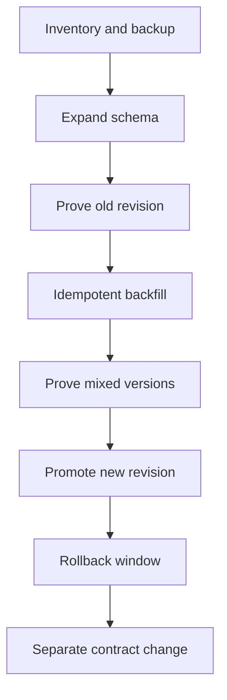

# Data and Schema Migration Design

## Purpose and Boundary

This companion applies the repository's [plan-migration workflow](../../../../repo-governance/conventions/plan-migrations.md) to each release alternative. It defines how releases must handle Bnest's current flat-file data and possible future database/schema migrations. No database engine, database port, schema, or migration is selected by this plan. A later plan that changes a concrete schema must add exact old/new shapes and a `data-contracts.md` under this directory.

Current blue/green slots share one machine-local flat-file runtime root. Its versioned readers, writers, and locks must remain compatible while two revisions overlap. A future database remains machine-local or otherwise explicitly approved, and its connection string, credentials, hostname, port, user data, and backup location stay outside Git.

## Common Migration Contract

Application release and data migration are separate state machines joined by declared compatibility. The release may call an idempotent migration stage, but starting two Phoenix slots or containers must never run migrations twice.

Every selected alternative follows these rules:

1. **Inventory:** Identify every source, schema version, reader, writer, owner, backup/restore path, and migration lock without recording private values.
2. **Expand:** Add only backward-compatible tables, columns, indexes, record versions, or readers. The currently routed revision must remain healthy if this step succeeds only partially.
3. **Migrate:** Run one checksum-identified, lock-protected, idempotent migration or resumable backfill. Application startup and readiness never acquire ownership implicitly.
4. **Verify:** Prove old and new readers/writers against the expanded state, including simultaneous writers for overlapping alternatives. Unknown or malformed flat-file records remain preserved and reported.
5. **Promote:** Route the new revision only after its declared schema range matches the observed state. Routed proof includes representative reads and writes through an isolated test identity.
6. **Rollback:** Prefer application rollback without a down migration. The prior artifact must understand the expanded schema and migrated records for the whole rollback window.
7. **Contract:** Remove old fields, tables, record versions, or indexes only in a later explicitly authorized change after the old process is retired, the rollback window is closed, restore is rehearsed, and no retained artifact depends on them.

Transactional DDL is used when the future database supports the required operation, but the design never assumes all DDL is transactional. Long index builds and backfills must be bounded, observable, resumable, and scheduled so they do not starve the active application. A migration failure stops release mutation, preserves the active route, and returns the exact safe retry or restore transition.

## Deterministic Migration Evidence

When a release declares migrations, its artifact carries a manifest with a migration-set identifier and checksum, the compatible schema-version range for revision N and rollback revision N−1, whether a backfill is required, and whether contract work remains deferred. Runtime results add the observed before/after schema versions, lock outcome, applied identifiers, verification identifiers, duration, and final state. They never include SQL text containing values, connection details, record contents, or credentials.

The release result accepts these migration states: `not-required`, `expanded`, `backfill-pending`, `verified`, or `failed`. `backfill-pending` permits promotion only when both revisions are explicitly compatible with partial progress and routed behaviour does not depend on completion. A missing manifest, checksum mismatch, unknown applied migration, unavailable lock, or incompatible rollback revision fails before candidate promotion.

## Alternative-Specific Handling

| Alternative                      | Migration owner and ordering                                                                                                                    | Mixed-version requirement                                                              | Rollback behaviour                                                                                         | Assessment                                                                                    |
| -------------------------------- | ----------------------------------------------------------------------------------------------------------------------------------------------- | -------------------------------------------------------------------------------------- | ---------------------------------------------------------------------------------------------------------- | --------------------------------------------------------------------------------------------- |
| A — manual Caddy blue/green      | The operator runs backup, expand, migration, compatibility proof, candidate, and promotion as separate commands.                                | Required while old and new slots overlap and through the rollback window.              | Re-promote N−1 against the expanded schema; contract remains deferred.                                     | Technically safe if followed exactly, but manual omission/order risk is highest.              |
| B — composed Caddy blue/green    | One transaction verifies the manifest, takes the migration lock, expands/backfills, proves N−1, prepares N, and records deferred contract work. | Required and automatically checked before promotion.                                   | Warm or cold application rollback without down migration; the result retains migration state.              | Recommended because one state machine owns ordering and evidence.                             |
| C — permanently warm slots       | A single external coordinator migrates; neither warm slot runs migrations on startup.                                                           | Required continuously because both revisions and their background workers remain live. | Route reversal is fast, but contract cannot occur until both slots are upgraded or the old one is retired. | Largest compatibility window and strongest duplicate-writer/background-job burden.            |
| D — Tailscale Service blue/green | Same migration transaction as B, completed before Service drain/target change.                                                                  | Required during slot overlap and Service rollback window.                              | Restore the prior target while N−1 reads the expanded schema; never reverse schema during a target change. | Data behaviour matches B; Tailscale control-plane proof is additional.                        |
| E — one restarted slot           | Expand and prove N−1 while it is still serving, then stop/start N. Exclusive migrations occur only in the measured interruption window.         | Still required for artifact rollback, even without simultaneous VMs.                   | Stop failed N and restart N−1 against the expanded schema.                                                 | Can avoid simultaneous writers, but an exclusive/long migration may violate the outage limit. |
| F — OTP hot upgrade              | Run database/flat-file migration as a separate locked operation; do not hide external data mutation inside `code_change`.                       | Required across old/new code loaded in one VM and any emulator restart fallback.       | Version-pair downgrade plus data compatibility; destructive reversal requires restore.                     | Coordination between process state, code versions, and database state is the most complex.    |
| G — container rollout            | One explicit migration job with a global lock runs before start-first rollout; application replicas never migrate on boot.                      | Required while old/new containers overlap and for image rollback.                      | Roll back the image against expanded schema; retain the migration job result and prior image.              | Familiar migration-job shape, but adds runtime/volume/network ownership.                      |

No alternative makes destructive schema changes safe merely by having no simultaneous application processes. The retained rollback artifact is itself an old reader/writer, so E and F need backward compatibility just as A–D and G do.

## Current Flat-File Application

Until a database exists, the same lifecycle applies to versioned JSON records and directory layouts:

- **Expand:** ship readers for old and new record versions before writing the new version.
- **Migrate:** copy or rewrite through a checksum-addressed, idempotent manifest while preserving immutable recovery input.
- **Verify:** read the result through normal domain and routed product flows; test concurrent locked writes when two revisions overlap.
- **Contract:** retain the old reader and recovery source until a later approved cleanup proves no rollback or unknown record needs them.

Slots and containers share the same runtime root; they do not receive per-slot copies that can diverge. Alternative E avoids simultaneous writers during restart but still needs locks against background migration work. Alternative F must coordinate file-format changes with both old and new loaded code.

## Future Database Boundary

The future database listener and connection pool are independent from application ports in the [port contract](alternatives.md#port-contract). This plan reserves no database port. A database must bind according to its own security plan, and release preflight checks connectivity and schema identity without printing the address or credentials.

For resource planning only, a future single-host database for 5–10 users and 1–3 groups receives an initial 0.5–1 GiB RAM, 0.25–1 CPU core, and 10 GiB disk allowance plus separately measured records, indexes, backups, and growth. Each Phoenix slot starts with at most five database connections unless adapter measurements require more; overlapping A–D and G therefore allow at most ten application connections during release, while E/F use five. These are provisional caps, not a database selection or configuration change, and the later database plan must replace them with engine-specific measurements.

Candidate proof must not mutate household records. It uses a transaction that is rolled back, a marked isolated schema/database, or another approved isolation mechanism proven equivalent to production schema behaviour. Read-only production checks may verify schema version and health; they do not inspect user rows. If the selected database cannot provide safe isolation on the same host, authenticated candidate proof remains blocked rather than using real data.

## Verification Matrix

Every concrete migration adds Gherkin first, failing bindings/adapters, and Nx red evidence before implementation. The minimum deterministic matrix is:

| Case                 | Required proof                                                                                          |
| -------------------- | ------------------------------------------------------------------------------------------------------- |
| Expand compatibility | N−1 reads and writes safely after expand; N reads old and expanded records.                             |
| Idempotent retry     | Re-running the same migration identifier makes no duplicate or conflicting change.                      |
| Lock exclusion       | Two coordinators cannot apply the set concurrently; the loser exits safely.                             |
| Partial backfill     | Interruption resumes from recorded progress without loss or duplication.                                |
| Mixed writers        | N−1 and N preserve invariants while overlap is allowed.                                                 |
| Application rollback | N−1 serves representative flows after N wrote the expanded format.                                      |
| Restore rehearsal    | Verified backup or immutable flat-file source restores into an isolated destination.                    |
| Contract guard       | Contract refuses while N−1 is routed, running, or eligible for rollback.                                |
| Privacy boundary     | Fixtures use synthetic identities and isolated data; evidence contains no records or connection values. |

Database-adapter integration tests run locally against an isolated disposable instance through Nx. Release-orchestration unit tests fake the database process and fault every migration transition. Exact-origin E2E proves the application behaviour before and after expand/migrate/promotion, while live production-origin checks remain read-only and anonymous unless separately authorized.

## Recovery and Stop Conditions

If inventory, backup, lock, expand, backfill, compatibility, or restore proof is missing, the release stops before promotion. If expand succeeds but later proof fails, keep the healthy old route, record the schema as safely expanded, and retry or restore according to the manifest; do not improvise a down migration. If routed proof fails after promotion, roll the application route back first, verify N−1 against the expanded state, and leave contract work blocked.

Unknown schema versions, unknown migration identifiers, corrupted flat-file manifests, or a database ahead of both artifacts are blocking states. The operator or AI may gather safe diagnostics but cannot coerce, delete, or mark them complete.
