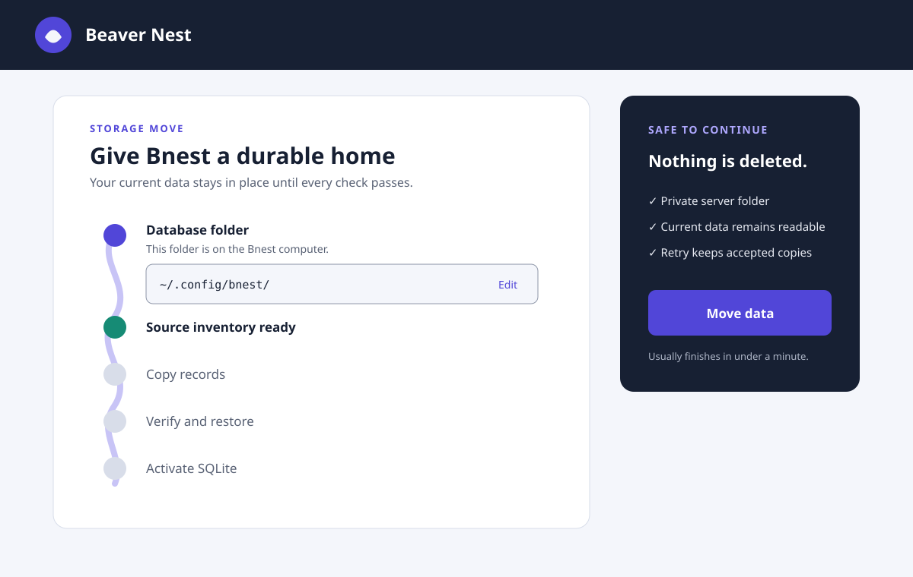

# Bnest SQLite Storage

**Status:** Completed

**Created:** 2026-08-29

**Started:** 2026-08-29

**Execution started:** 2026-08-29

**Completed:** 2026-08-29

**Scope:** Bnest storage configuration, reproducible SQLite schema, flat-file backfill, and active-service cutover

## Context

Bnest currently persists accounts, sessions, import records, chat, Sifat Allah progress, and theme preferences as versioned JSON below one `data/prod/`-shaped runtime root. Flat files were an intentional interim store. This plan moves every supported Bnest record into one machine-local SQLite database while preserving the current repository facade, immutable recovery evidence, browser behavior, and blue/green continuity.

The managed migrator uses `~/.config/bnest/` without requiring anyone to visit the storage UI; the path resolves on the server to the service account's home directory and the fixed database filename is `bnest.sqlite3`. Before migration starts, an administrator may optionally open the storage UI to replace that default with another valid server-local folder. Existing installations can also use that screen to review progress and safe outcomes.

## Scope

- Add a versioned, deterministic SQLite DDL migration file and an idempotent flat-file backfill adapter shared by the UI and a headless Nx task.
- Make the default-path migration headless; keep setup/admin UI optional for a pre-migration custom folder and status review.
- Migrate all current system and user-owned record types, not only chat and learning data.
- Make SQLite authoritative automatically in the same managed run after source inventory, checksummed copy, normal read-back, restore rehearsal, and parity proof pass; require no UI confirmation.
- Keep the flat-file reader and compatible mirror only until separately gated flat-file retirement work can run immediately after this plan completes.
- Integrate the migration with release manifests, the host migration lock, Caddy rollout, revision proof, and LiveView/WebSocket reconnect.

## Non-goals

- Cloud or networked databases, multi-host replication, public registration, account-management features, or arbitrary SQL access.
- A general database browser or file picker with access to client-device paths.
- Deleting legacy flat files or removing their reader inside this migration plan; explicitly authorized retirement work owns that later destructive contraction. Moving an initialized database also remains out of scope.
- Redesigning chat, Sifat Allah, theme, or browser-import product flows.

## Approach

1. Expand the repository behind its existing facade with SQLite and storage coordination while flat files remain authoritative.
2. Let managed release/headless tooling resolve the default directory and run the versioned DDL; an authorized UI may persist a custom directory before that transition.
3. Inventory and backfill supported records in deterministic path order with per-item checksums and resumable outcomes.
4. Verify domain reads, isolated restore, and parity, then atomically activate SQLite in the same headless run without waiting for UI.
5. Promote through Caddy, prove routed revision and LiveView reconnect, drain and clean up, then unblock the separate exact-source retirement work.

## Dependencies

- Existing typed repository schemas and facade under `apps/bnest-app/lib/bnest_app/data_repository/`.
- Existing managed release, Caddy, and migration-manifest boundaries.
- A reviewed SQLite Ecto adapter and its locked transitive dependencies.
- A writable, private server-local directory owned by the Bnest service account.

## Navigation

- [Business requirements](brd.md)
- [Product requirements](prd.md)
- [Technical design](tech-docs.md)
- [Delivery checklist](delivery.md)
- [Learnings](learnings.md)
- [UI assets](assets/README.md)
- Prior art: [centralized flat-file delivery](../../done/2026-08-26__bnest-centralized-data/README.md) and [release migration contract](../../done/2026-08-27__single-machine-release-simplification/tech-docs/migration-design.md)

## Directory Map

- [`assets/`](assets/README.md) — required lo-fi alternatives and selected hi-fi responsive design.
- [`brd.md`](brd.md) — business goals, roles, outcomes, boundaries, and risks.
- [`delivery.md`](delivery.md) — ordered implementation, verification, rollout, and reconciliation tasks.
- [`learnings.md`](learnings.md) — safe observations and follow-up routing during execution.
- [`prd.md`](prd.md) — personas, stories, and plan-level acceptance criteria.
- [`tech-docs.md`](tech-docs.md) — architecture, data contracts, migration, UI, specifications, and file impact.
