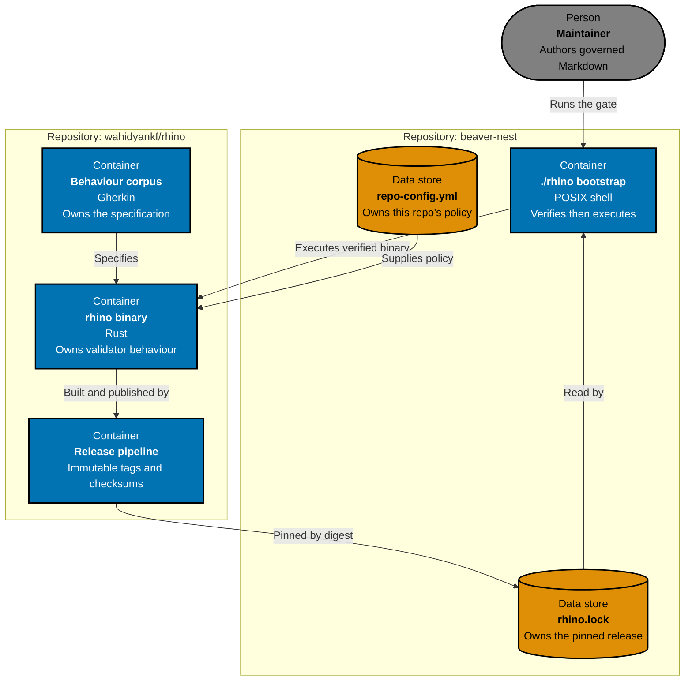

# Technical Design

This plan changes four repositories and adds a contract between them. The technical set is split along that boundary: what RHINO becomes, what the contract between tool and repository is, and what BeaverNest does to adopt it and retire what it replaces.

Read [`01-rhino-repository.md`](01-rhino-repository.md) first for the upstream design, then [`02-configuration-contract.md`](02-configuration-contract.md) for the schema that both sides depend on, then [`03-beaver-nest-cutover.md`](03-beaver-nest-cutover.md) for this repository's change, then [`04-sibling-consumers.md`](04-sibling-consumers.md) for the two sibling repositories adopting alongside it, and [`05-benchmarks.md`](05-benchmarks.md) for how the change is measured.

## Boundary

The arrow that matters is `config -->|Supplies policy| crate`. Today that arrow does not exist: the policy is compiled into `Governance.fs` and `HarnessContract.fs`. Every other change in this plan follows from introducing it.

## Decisions

| Decision                     | Choice                                                                                           | Why not the alternative                                                                                                                                                                                                                                                                                                                                                                                                                                                                                                                                                         |
| ---------------------------- | ------------------------------------------------------------------------------------------------ | ------------------------------------------------------------------------------------------------------------------------------------------------------------------------------------------------------------------------------------------------------------------------------------------------------------------------------------------------------------------------------------------------------------------------------------------------------------------------------------------------------------------------------------------------------------------------------- |
| Language                     | Rust                                                                                             | Two reasons. **Size:** every consumer downloads and caches this artifact per platform, so a small executable is a product requirement, not an aesthetic; a .NET self-contained publish or a Go build both ship materially more bytes for the same behaviour. **Type safety:** Badakmini's correctness rests on exhaustively matched discriminated unions, and Rust's enums with exhaustive `match` and no null are the closest equivalent, so the port preserves the property rather than trading it away. Rust also removes the .NET SDK from this repository's prerequisites. |
| Distribution                 | Pinned release archives with a POSIX bootstrap                                                   | Matches the proven HIPPO consumer. `cargo install` would need a Rust toolchain in every consumer and pins a crate version, not a verified artifact.                                                                                                                                                                                                                                                                                                                                                                                                                             |
| Scope of v0.1.0              | All five validators, configuration-driven                                                        | A partial port leaves this repository running two validators and two toolchains, and defers the hard question — generalizing harness parity — past the point where it is cheap to answer.                                                                                                                                                                                                                                                                                                                                                                                       |
| Policy location              | Consumer's `repo-config.yml`                                                                     | A tool released to five repositories cannot hold one repository's constants. This is a boundary requirement, not speculative generality.                                                                                                                                                                                                                                                                                                                                                                                                                                        |
| Schema and command alignment | Follow `ose-public`'s `rhino-cli` where surfaces already agree                                   | Both projects carry the RHINO name and an overlapping command surface. A third dialect guarantees a reconciliation cost later.                                                                                                                                                                                                                                                                                                                                                                                                                                                  |
| Behaviour proof              | Shared Gherkin corpus at unit, integration, and process levels                                   | A full differential run was considered and declined; see the residual risk and the one numeric exception in [the cutover design](03-beaver-nest-cutover.md).                                                                                                                                                                                                                                                                                                                                                                                                                    |
| Exit codes                   | `0` clean, `1` findings, `2` invocation or configuration error                                   | Badakmini's existing contract, which every rule and harness already depends on. HIPPO's `73`/`75`/`78` are process-guard semantics and are deliberately not adopted.                                                                                                                                                                                                                                                                                                                                                                                                            |
| Design philosophy            | Unix: one job per leaf, quiet when clean, composable output                                      | A multi-validator binary is only defensible if each leaf behaves like a small tool. See the philosophy section in [the upstream design](01-rhino-repository.md).                                                                                                                                                                                                                                                                                                                                                                                                                |
| Proof that it paid           | Before-and-after measurement of the gate and the whole distribution path, with gating thresholds | A rewrite justified by "Rust is faster and smaller" should produce a number. Baselines are taken before any change, because both retired validators stop existing at cutover. See [the benchmark design](05-benchmarks.md).                                                                                                                                                                                                                                                                                                                                                     |
| Consumers in this plan       | All four: rhino, BeaverNest, HIPPO, grind-in-public                                              | Two already run a validator of their own — BeaverNest's in F#, grind-in-public's independently in Go. Generalizing against four real trees, two of them retirement cutovers, is what makes the tool generic rather than BeaverNest's validator with a configuration file bolted on.                                                                                                                                                                                                                                                                                             |
| Harness parity command       | Top-level `harness parity validate`, with all harnesses declared in the roster                   | Parity is about harnesses, not documents, so it does not belong under `governance`; and hard-coding the three harnesses — as both retiring validators do — is the exact assumption that stops the tool serving a fourth repository.                                                                                                                                                                                                                                                                                                                                             |
| First consumer               | RHINO itself, before BeaverNest                                                                  | Generalization is a claim until a second repository tests it. RHINO's own tree has no `repo-governance/`, no `plans/`, and no harness roster, so it breaks BeaverNest-shaped assumptions while the schema is still soft — and it keeps doing so in CI afterwards.                                                                                                                                                                                                                                                                                                               |
| Retirement timing            | Same plan as adoption                                                                            | Two validators enforcing one contract is the failure mode this plan exists to remove.                                                                                                                                                                                                                                                                                                                                                                                                                                                                                           |

## Specification Changes

The Badakmini C4 model at `specs/apps/badakmini/cli/architecture.md` and its behaviour corpus described a system that will no longer exist in this repository. Both move upstream and are rewritten there for the Rust containers and the configuration boundary. BeaverNest gains `specs/tools/rhino-consumer/`, mirroring the existing [HIPPO consumer specification](../../../../specs/tools/hippo-consumer/README.md), which owns only the bootstrap's observable behaviour. Follow the [plan specification-change convention](../../../../repo-governance/conventions/plan-specification-changes.md) and [specification maintenance](../../../../repo-governance/development/specification-maintenance.md).

## Continuity

This plan changes no BeaverNest application code, storage, route, or deployment, so no Caddy candidate, promotion, or drain is required. [Live-service continuity](../../../../repo-governance/development/live-service-continuity.md) still applies as a guard: baseline the routed origin's health and revision before work starts, confirm both are unchanged at the final checkpoint, and stop the line if either degrades. Every compute-bearing command runs through the pinned `./hippo` guard per [resource-aware development](../../../../repo-governance/development/resource-aware-development.md).

## Directory Map

- [`01-rhino-repository.md`](01-rhino-repository.md) — upstream crate architecture, dependency decisions, test adapters, and the release pipeline.
- [`02-configuration-contract.md`](02-configuration-contract.md) — the `repo-config.yml` schema, its record model, its field guide, and the migration of hard-coded constants into it.
- [`03-beaver-nest-cutover.md`](03-beaver-nest-cutover.md) — bootstrap, lock, Nx and hook wiring, authority cutover, retirement, and file impact.
- [`04-sibling-consumers.md`](04-sibling-consumers.md) — the four target trees, the three command dialects being unified, HIPPO's additive adoption, grind-in-public's cutover, their file impact, per-repository propagation, mutual pinning, and rollout order.
- [`05-benchmarks.md`](05-benchmarks.md) — what is measured before and after, the method that keeps a cross-language comparison fair, and the thresholds that gate the plan.
