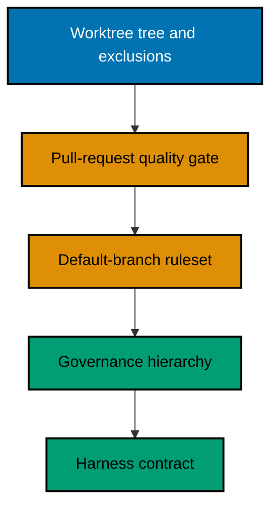
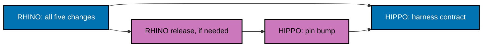

# Technical Design

Two repositories receive the same five changes, in an order chosen so that a defect in the earliest one cannot strand the latest. This document holds the decisions and the sequencing; each companion holds one change.

## Decisions

| Decision                   | Choice                                                                                         | Why                                                                                                                                                                                     |
| -------------------------- | ---------------------------------------------------------------------------------------------- | --------------------------------------------------------------------------------------------------------------------------------------------------------------------------------------- |
| Governance shape           | Full restructure: hierarchy per repository, instruction file becomes a link index              | A flat file cannot express precedence, and precedence is what makes a governance tree usable instead of decorative.                                                                     |
| Adoption method            | Explicit matrix, one recorded verdict per source document                                      | Roughly a third of the source corpus describes a service neither repository is. A tree containing dead rules trains its readers to skim it.                                             |
| Drift between three copies | Accepted, and stated in each tree; convergence only on the machine-checked layer               | The alternative is a fourth released product to keep prose in sync. Wording may diverge; `repo-config.yml` and RHINO cannot.                                                            |
| Pull-request gate          | One new workflow as the sole required check, absorbing the existing one, which is then deleted | Mirroring the hooks alone would be weaker than what already runs. Two workflows would mean two places to edit when a hook changes.                                                      |
| HIPPO guard in CI          | Not used; local hooks keep it                                                                  | The guard arbitrates contention on one shared workstation. A dedicated ephemeral runner has none, so it could only add a download, a checksum, and an impossible exit-`75`.             |
| HIPPO guarding HIPPO       | Never; recorded as a governed exception in HIPPO's own tree                                    | Already stated in RHINO's `pre-push` hook. A reader who knows the family rule must find its exception where they look for the rule.                                                     |
| Harness capability server  | None declared in either repository                                                             | RHINO's schema makes `required-mcp` optional and says a repository with harnesses may have none. Neither CLI uses Nx, so the only server this family declares is irrelevant here.       |
| Canonical roster           | Authored per repository, not ported                                                            | All seven canonical skills here are Nx skills and one of two agents is Nx Cloud CI. Porting them would produce a parity contract over content nobody can run.                           |
| Plans lifecycle            | Not adopted in either repository                                                               | Six documents per plan is disproportionate for two single-maintainer CLIs. Planning continues where this plan lives.                                                                    |
| Repository order           | RHINO first, then HIPPO                                                                        | RHINO validates itself from a source build and can prove a configuration shape without a release. HIPPO can only validate through its pinned binary, so a RHINO defect would strand it. |
| Worktree and branch name   | `worktrees/repo-rules-adoption/` on `worktree/repo-rules-adoption` in all three repositories   | One name answers "is this repository mid-adoption, and where" from any of the three checkouts.                                                                                          |
| Ruleset bypass             | None, for any actor including the owner                                                        | A bypass that exists gets used, and the rule stops being machine-enforced. The accepted cost is that a broken gate makes `main` unwritable until a pull request repairs it.             |

## Sequencing

Within each repository the order is forced twice. The gate must have reported a check name on a real pull request before a ruleset can require that name, and the worktree tree must exist before later work can be authored the way this plan requires it to be authored.

Across repositories, RHINO completes all five before HIPPO begins its harness contract; HIPPO's earlier phases may overlap, because nothing in them depends on a RHINO answer.

The conditional path is dormant unless RHINO refuses a shape this plan needs; see the risk register in [the business requirements](../brd.md).

## What Each Companion Covers

- [The governance restructure](01-governance-restructure.md) holds the adoption matrix, the per-repository hierarchy, the rule inventory method, and the `repo-config.yml` changes for word budget, mapped trees, and Mermaid palette.
- [The harness contract](02-harness-contract.md) holds the canonical roster, the adapter contracts for three harnesses without a capability server, the prohibition lists, and the open questions to settle against the binary rather than the documentation.
- [The worktree and integration design](03-worktrees-and-integration.md) holds the in-repository worktree tree, the exclusion set for every scanner, hook changes, and the integration path itself.
- [The gate and ruleset design](04-pr-gate-and-ruleset.md) holds the per-repository job inventory, the aggregate check, the retirement of `ci.yml`, and the ruleset configuration and its proof.

## Directory Map

- [`01-governance-restructure.md`](01-governance-restructure.md) — the adoption matrix, the hierarchy, and the documentation configuration changes.
- [`02-harness-contract.md`](02-harness-contract.md) — canonical skills and agent, three adapter sets, prohibitions, and open schema questions.
- [`03-worktrees-and-integration.md`](03-worktrees-and-integration.md) — the worktree tree, scanner exclusions, hooks, and the integration path.
- [`04-pr-gate-and-ruleset.md`](04-pr-gate-and-ruleset.md) — the pull-request quality gate per repository and the default-branch ruleset.
