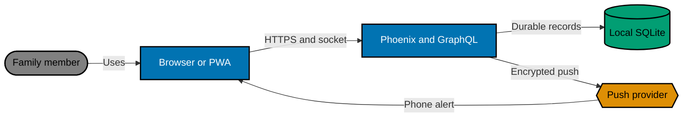
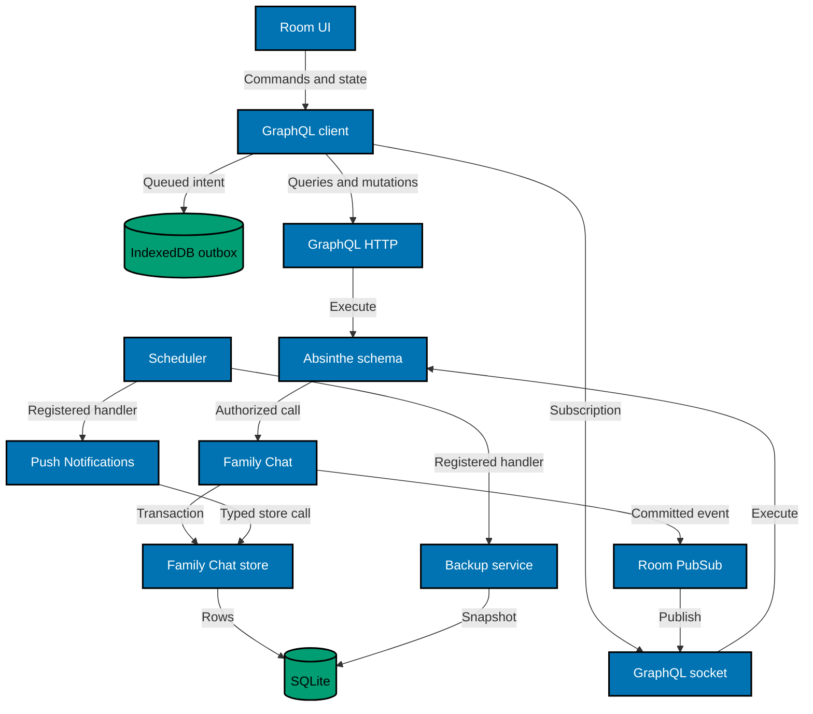

# Architecture and Data Flow

This companion owns system boundaries and end-to-end flow. The exact public protocol is in
[GraphQL API, Authentication, and Errors](008-graphql-api-authentication-and-errors.md); backup and cutover procedures are
in [Backup, Capacity, Restore, and Release](009-backup-capacity-restore-and-release.md).

## Current State

Bn​est is one Phoenix/LiveView application behind loopback Caddy and Tailscale Serve. It owns identity, SQLite, a
persistent Scheduler, whole-database backup, Phoenix PubSub, and a PWA service worker. It has no family-to-family domain,
GraphQL endpoint, GraphQL socket, IndexedDB outbox, or Web Push dispatcher. Current public UI commands use LiveView.

## Requirements and Operating Envelope

- One household deployment, one room in v1, approximately 200 messages/day baseline and 2,000/day stress case.
- Up to eight subscribed devices in the planning model; sender exclusion leaves at most seven delivery rows per normal
  user message. The schema does not encode this as a hard limit.
- Message bodies are at most 4,000 graphemes and 16 KiB after newline normalization.
- Query/subscription authorization is per operation and room, not inferred from a previously rendered page.
- Bnest remains a 24/7 single-host service. All migrations are additive, all new schedules are dormant through overlap,
  and a client must recover across slot replacement without refresh.
- Blue and green releases remain independent BEAM nodes with `RELEASE_DISTRIBUTION=none`; Phoenix PubSub and Absinthe
  registries are slot-local. Caddy promotion, socket reconnect, and SQLite catch-up—not cross-slot PubSub—bridge release
  overlap.
- Routed service budgets are zero failed probes, p95 no greater than 500 ms, and each sample no greater than two seconds
  during backup and release proof. These are acceptance budgets, not promises that every GraphQL operation takes 500 ms.
- V1 optimizes for correctness and recoverability at household scale. It deliberately avoids presence, typing, unread
  counters, fan-out caches, broker infrastructure, and committed-history browser storage.

## Target Context



SQLite and catch-up queries are the only history authority. Absinthe subscriptions and Web Push are post-commit delivery
paths. IndexedDB holds only unacknowledged client commands; it never becomes a transcript cache.

## Component View



## Owned Components

### `BnestApp.FamilyChat`

Owns room authorization, validation, message idempotency, keyset pagination, recipient selection, and internal
`post_system_message/…`. It accepts server-resolved sender identity. The internal system operation requires
`sender_kind = system`, stable producer ID, and display snapshot; it is absent from the public GraphQL mutation type.

### `BnestApp.FamilyChat.Store`

Owns SQL for rooms, messages, subscriptions, and push deliveries. Typed functions are the only access path. Scheduler,
GraphQL transport, browser code, and release tooling do not issue family-chat SQL.

### `BnestAppWeb.GraphQL`

The Absinthe schema, resolvers, middleware, HTTP plug, and socket expose the public contract. Resolver context derives the
current user and session digest from server-side session state. Every resolver reauthorizes the requested room. The
socket never trusts a user ID, role, room permission, or session identity supplied as a connection parameter.

### Browser GraphQL client

The Phoenix-rendered shell starts a browser module that owns HTTP operations, the Phoenix/Absinthe socket, subscription
lifecycle, IndexedDB outbox, FIFO draining, backoff, catch-up, scroll anchoring, and accessible status projection. It
does not send chat commands as LiveView events. Server-rendered navigation and authentication may remain Phoenix.

### `BnestApp.PushNotifications`

Owns subscription validation, message fan-out, delivery dispatch, and delivery-record retention. Its registered
retention handler calls this service; only the service reaches typed store operations.

### `BnestApp.Backup`

Owns capacity preflight, a dedicated SQLite connection, cancellable `VACUUM INTO`, independent integrity proof, atomic
rename, receipt, and seven-WIB-date artifact retention. The registered scheduler handler delegates to this service.

## Public GraphQL Contract

HTTP endpoint: `POST /api/graphql`. Subscription endpoint: `/api/graphql/socket` using the Phoenix socket transport.
GraphiQL is available only outside production.

| Operation                                                | Kind         | Contract                                                 |
| -------------------------------------------------------- | ------------ | -------------------------------------------------------- |
| `familyChatRooms`                                        | query        | Authorized rooms; one result in v1                       |
| `familyChatRoom(slug)`                                   | query        | One authorized room or typed not-found error             |
| `familyChatMessages(roomSlug, beforeId, afterId, limit)` | query        | One cursor at most; default/max 50                       |
| `sendFamilyChatMessage(roomSlug, clientMessageId, body)` | mutation     | Atomic message/outbox commit; idempotent original result |
| `webPushConfiguration`                                   | query        | Public key and supported/unavailable state only          |
| `currentWebPushSubscription`                             | query        | Current session binding without secrets in logs          |
| `upsertWebPushSubscription(input)`                       | mutation     | Validated per-session subscription                       |
| `disableCurrentWebPushSubscription`                      | mutation     | Disables current session binding                         |
| `familyChatMessageCommitted(roomSlug)`                   | subscription | Authorized post-commit room event                        |

HTTP mutations require the authenticated session cookie plus the existing CSRF contract. Queries and subscriptions
also require authentication and room authorization. GraphQL errors use stable safe codes such as `UNAUTHENTICATED`,
`FORBIDDEN`, `ROOM_NOT_FOUND`, and `VALIDATION_FAILED`; internal errors reveal no values.

Absinthe supervision uses the code-owned fixed `pool_size: 8` identically in every runnable slot. Absinthe warns
that differing inferred pool sizes across instances can make cross-node delivery unreliable. The schema publishes only
after commit and uses room ID as the internal topic.

### Schema shape

The implementation may organize modules differently, but the public schema shape is fixed:

```graphql
enum FamilyChatSenderKind {
  USER
  SYSTEM
}

type FamilyChatRoom {
  id: ID!
  slug: String!
  name: String!
  roomKind: String!
  memberPostingEnabled: Boolean!
}

type FamilyChatMessage {
  id: ID!
  roomSlug: String!
  senderKind: FamilyChatSenderKind!
  senderId: String!
  senderDisplayName: String!
  body: String!
  committedAt: DateTime!
}

type FamilyChatMessageConnection {
  nodes: [FamilyChatMessage!]!
  hasOlder: Boolean!
  hasNewer: Boolean!
}

type WebPushConfiguration {
  available: Boolean!
  applicationServerKey: String
  unavailableReason: String
}

type WebPushSubscriptionState {
  enabled: Boolean!
  expirationTime: DateTime
}

input WebPushSubscriptionInput {
  endpoint: String!
  expirationTime: DateTime
  p256dh: String!
  auth: String!
}

type Query {
  familyChatRooms: [FamilyChatRoom!]!
  familyChatRoom(slug: String!): FamilyChatRoom
  familyChatMessages(
    roomSlug: String!
    beforeId: ID
    afterId: ID
    limit: Int = 50
  ): FamilyChatMessageConnection!
  webPushConfiguration: WebPushConfiguration!
  currentWebPushSubscription: WebPushSubscriptionState!
}

type Mutation {
  sendFamilyChatMessage(
    roomSlug: String!
    clientMessageId: ID!
    body: String!
  ): FamilyChatMessage!
  upsertWebPushSubscription(
    input: WebPushSubscriptionInput!
  ): WebPushSubscriptionState!
  disableCurrentWebPushSubscription: WebPushSubscriptionState!
}

type Subscription {
  familyChatMessageCommitted(roomSlug: String!): FamilyChatMessage!
}
```

`senderId` is public within the authenticated household because it is required as a stable rendered identity; it is not
an authorization input. The schema never exposes message idempotency keys, session digests, subscription endpoints/keys,
delivery rows, internal room IDs as authorization proof, or audit actors.

### Envelope and error contract

- Successful operations use HTTP 200 with `data` and no material `errors` entry.
- A malformed JSON/request envelope returns HTTP 400; an envelope above 64 KiB returns 413; an unsupported content type
  returns 415; and an unsupported method returns 405. These transport failures do not enter GraphQL execution. Family
  Chat has no upload operation, so the endpoint does not accept multipart GraphQL bodies.
- GraphQL syntax/schema validation and resolver errors return HTTP 200 with the GraphQL envelope. A missing or invalid
  CSRF token is the sole authentication-pipeline exception: it returns HTTP 403 before GraphQL execution. This boundary
  does not use HTTP 401.
- Resolver/transport failures add `errors[].extensions.code` from the allowlist `CSRF_REJECTED`, `UNAUTHENTICATED`,
  `FORBIDDEN`, `ROOM_NOT_FOUND`, `VALIDATION_FAILED`, `CONFLICT`, or `INTERNAL`.
- Validation errors may include a safe field name and stable reason code. They never echo the rejected body, endpoint,
  key, cookie, session, or private origin.
- An idempotent retry is a success with the original message in `data`, not a conflict.
- Mutation success means the SQLite transaction committed. Subscription publication failure cannot turn that success
  into a mutation error after commit.

### HTTP and socket authentication

The HTTP pipeline accepts same-origin POST only, fetches the current user from the signed HTTP-only session, and requires
the existing CSRF header for every cookie-authenticated GraphQL POST. This uniform rule is simpler than parsing the
document before protection and necessarily covers every mutation. A missing/invalid token returns HTTP 403 JSON with
`data: null` and safe `CSRF_REJECTED`; it never enters resolver execution. With a valid transport envelope, resolver
authentication errors use HTTP 200 GraphQL `errors` and `UNAUTHENTICATED`.

The browser opens `/api/graphql/socket` with same-origin credentials. The socket connect callback reads the Phoenix
session from the connection, resolves identity server-side, and calls `Absinthe.Phoenix.Socket.put_options/2` with the
authenticated context. Client connection params may carry protocol metadata but never a trusted user/session/role.
Session revocation or expiry closes/rejects the socket and causes the browser outbox to pause.

### Resolver behavior

- `familyChatRooms` returns only authorized active rooms, ordered by ID; v1 returns the single seed.
- `familyChatRoom` returns `null` plus `ROOM_NOT_FOUND` for a missing/unauthorized slug without disclosing whether an
  inaccessible room exists.
- `familyChatMessages` validates one cursor, parses IDs as positive integers, enforces limit, authorizes the room, and
  maps store rows without widening fields.
- `sendFamilyChatMessage` resolves current user, calls the atomic domain operation, and maps new or existing commit
  identically.
- Push resolvers bind only the current session digest; no mutation accepts user ID or digest.
- Subscription configuration authorizes the room before returning its topic. Publication payload is re-resolved through
  the subscriber context when needed; no global context deduplication is enabled unless the selected fields are proven
  identical for every authorized user.

## Supervision and Process Ordering

Start order is SQLite repository, Phoenix PubSub, endpoint/socket infrastructure, eight-pool Absinthe subscription
supervisor, push task supervisor/dispatcher, Scheduler task supervisor/Scheduler. Readiness becomes true only after the
schema objects, room seed, subscription supervisor, registered handlers, and required push configuration are valid.

The domain publishes after the transaction returns. A dispatcher leases rows independently. Scheduler jobs run under
their existing task supervisor and report completion through Scheduler-owned APIs. A failing optional push provider does
not make GraphQL or room readiness false; missing production VAPID configuration does because the release declares push
part of the enabled capability.

## Message and Reconnect Flow

1. The browser creates one UUID and writes the normalized body plus user/room namespace to IndexedDB before sending.
2. When active and eligible, it marks the record **Sending** and calls `sendFamilyChatMessage`.
3. One SQLite transaction inserts or finds the message and, only for a new user message, inserts recipient delivery rows.
4. Commit returns the server message. The browser deduplicates by server ID, removes the queue record, and shows **Sent**.
5. The server publishes `familyChatMessageCommitted` after commit. Push dispatch remains independent.
6. On connection replacement, the browser establishes the subscription first, queries every message after its last
   committed server ID until fewer than 50 return, deduplicates, and only then drains eligible queue records FIFO.

This ordering closes both races: a commit between query and subscribe is observed by the subscription, and a commit
seen through both paths is rendered once by server ID.

## Scheduler and Release Boundaries

The mandatory directions are:

```text
Scheduler → registered retention handler → Push Notifications service → Family Chat store → SQLite
Scheduler → registered backup handler → Backup service → SQLite
```

The compatibility release adds schema, rooms, GraphQL, socket, services, handlers, and a dormant UI behind a disabled
feature flag. The generated Caddy `reverse_proxy` configuration must omit a nonzero `stream_close_delay`. When promotion
reloads that configuration, Caddy closes WebSocket streams owned by the unloaded prior config, while all new handshakes
route to the candidate. The client pauses its queue, reconnects, subscribes, catches up from SQLite, and resumes without
a page refresh. The prior Phoenix slot remains healthy and warm for the five-minute rollback observation, then retires.
After that drain, the compatibility revision becomes the rollback floor. The experience release repeats the same
cutover while enabling navigation and the browser client without breaking the schema.

The global Caddy `grace_period 5m` and the release observation window do not authorize `stream_close_delay 5m`: the
former bounds HTTP-server shutdown during config changes or process stop, while the latter keeps the prior application
slot rollback-ready. Neither overrides the reverse-proxy stream policy. Holding an old GraphQL socket for five minutes
would isolate it on the wrong local PubSub and is forbidden.

Push retention is enabled only when all runnable slots know its handler. Backup schedule convergence to 18:00 UTC occurs
through the public Scheduler service only after compatible code is active. Neither release adapter uses SQL shortcuts.

## Trust and Failure Boundaries

- SQLite commit is acknowledgement; subscription and push publication never make an uncommitted message visible.
- Network/5xx failures retry. Validation, forbidden, and missing-room responses stop. Authentication expiry pauses.
- `navigator.onLine` only accelerates a retry; observed request results remain authoritative.
- Logout disables the server subscription and clears the current user namespace from IndexedDB before identity cookies
  are reported cleared. A failure remains explicit and cannot silently transfer queued intent to another user.
- The service worker caches only static assets. It never caches authenticated HTML, GraphQL, transcript, outbox, or push
  payload data.
- Health and evidence expose only booleans, counts, durations, revision, and categorized outcomes.

## Growth and Revisit Points

- Automatic room creation may add room kinds and membership rows, but must preserve slug-based GraphQL routing and
  resolver authorization. It must not reinterpret room ID 1 or reuse the system-message browser boundary.
- Blue/green overlap deliberately avoids distributed PubSub: Caddy reload evacuates sockets to the one routed slot.
  Active-active application nodes, sticky traffic across multiple routed nodes, or any requirement to preserve sockets
  across config reload requires a separate distributed PubSub topology and load plan; fixed Absinthe pool size alone is
  not a clustering design.
- Higher message/device volume may require delivery partitioning or backup strategy review. The trigger is measured
  queue/backup pressure against the stated budgets, not speculative scale.
- If Exqlite exposes the incremental Backup API with acceptable proof, a later ADR may compare it with `VACUUM INTO`.
