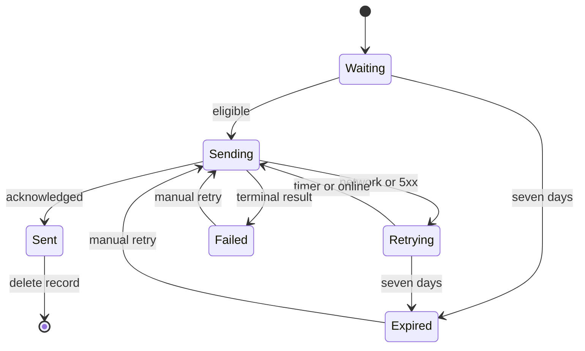

# Realtime, Pagination, and Consistency

## Ordering and Pages

`family_chat_messages.id` is the only order. Every query resolves the authorized room by slug and uses a strict ID range.

- No cursor: query newest 51 descending, use row 51 only for `hasOlder`, return at most 50 ascending.
- `beforeId`: query IDs below the cursor, newest 51 descending, return at most 50 ascending.
- `afterId`: query IDs above the cursor ascending, return at most 50 and continue until fewer than 50 return.
- Supplying both cursors is a GraphQL input error. Limit defaults to 50, accepts only 1–50, and rejects values outside
  that range with `VALIDATION_FAILED`; the server never silently clamps a caller-supplied value.

The browser deduplicates by server message ID across initial query, catch-up query, subscription, and mutation result.
Client time, subscription arrival, and rendered timestamp never reorder messages.

### Connection response invariants

- `nodes` is always ascending by server ID even though the store may query descending for the latest/before window.
- `hasOlder` is true only when the 51st lower-ID row exists; no `COUNT(*)` is required.
- `hasNewer` is true only when an `afterId` page has another row beyond the returned 50. The catch-up loop follows it
  until false.
- A cursor not belonging to the room is still treated as an integer boundary, not as evidence that the message exists;
  authorization never leaks cross-room membership.
- Deleted-message filtering does not exist because message deletion does not exist.

## Subscription Contract

`familyChatMessageCommitted(roomSlug)` authorizes the room when the subscription starts and publishes only after the
SQLite transaction commits. The payload contains server ID, room identity, sender kind, stable sender ID, display
snapshot, body, and commit time. It contains no subscription secret, session value, delivery state, or internal error.

The internal PubSub topic uses the resolved room ID. Every application slot configures the same explicit Absinthe
subscription pool size, but production slots remain independent and do not exchange PubSub events. Subscription
transport is lossy by design: network gaps and Caddy cutover gaps are repaired by the durable `afterId` query.

## Reconnect Algorithm

1. Pause queue draining and retain the current draft.
2. Recreate the authenticated socket from server-side session identity.
3. Establish `familyChatMessageCommitted` for the current room.
4. Query after the highest committed server ID, repeating 50-row pages to exhaustion.
5. Merge subscription and query results by server ID and restore near-bottom/read-anchor behavior.
6. Drain eligible outbox records FIFO for the same user and room.

Subscribing before catch-up is mandatory. If the socket cannot subscribe, catch-up may show durable history but queue
draining remains paused until realtime setup succeeds or the client enters its categorized retry state.

The browser implements one serialized coordinator per open room. A monotonically increasing connection generation
invalidates callbacks from replaced sockets. Only the current generation may merge a subscription payload, advance the
last committed ID, or begin a drain. Multiple `online`, visibility, and socket-open signals coalesce into one reconcile
promise rather than creating parallel drains.

```text
reconcile(generation):
  assert authenticated identity matches outbox namespace
  pause drain
  await subscribe(roomSlug, generation)
  cursor = highest committed server ID held in memory
  repeat:
    page = queryMessages(afterId: cursor, limit: 50)
    merge page nodes by server ID
    cursor = max(cursor, page node IDs)
  until page.hasNewer is false
  if generation is still current:
    drain FIFO one record at a time
```

The highest committed ID is derived only from server messages currently held by the running client. It is not persisted
as history in IndexedDB. After a full app reopen with no history, the initial no-cursor query establishes a window, the
subscription closes the current race, and queued commands then drain. Permanent older history remains available through
`beforeId` pages.

## Outbox State Machine



Visible copy is exact:

| Internal state                   | Visible status             | Behavior                                                     |
| -------------------------------- | -------------------------- | ------------------------------------------------------------ |
| queued without usable connection | **Waiting for connection** | Persisted; no request                                        |
| request in flight                | **Sending**                | Same UUID; one in-flight record per FIFO drain               |
| retry timer                      | **Retrying in …**          | Countdown is advisory; actual request outcome controls state |
| acknowledged                     | **Sent**                   | Merge by server ID, then delete queue record                 |
| terminal or expired              | **Couldn’t send**          | Manual retry/discard; no automatic request                   |

The UI may stop showing **Sent** after a short presentation interval, but acknowledgement and deletion happen first.

## Retry Policy

Automatic waits after retryable failures are 1, 2, 4, 8, 16, and 32 seconds, then at most 60 seconds. Add bounded
jitter without exceeding 60 seconds; tests inject the random source and clock. `online` makes the next record immediately
eligible, while `navigator.onLine` alone never marks a send successful. An actual failed request returns to backoff.

The exact delay formula is `min(baseDelay × jitterFactor, 60_000 ms)`, where base delays are
`[1_000, 2_000, 4_000, 8_000, 16_000, 32_000, 60_000]` and `jitterFactor` is uniformly injected in `[0.8, 1.2]`.
Clamping happens after jitter, so no wait exceeds 60 seconds. The persisted `nextAttemptAt` prevents reload from resetting
the timer; an actual `online` event may set it to now. Manual Retry also sets it to now but preserves the UUID.

| Outcome                                               | Automatic action                                                                     |
| ----------------------------------------------------- | ------------------------------------------------------------------------------------ |
| Network, timeout, GraphQL transport failure, HTTP 5xx | Retry with backoff                                                                   |
| GraphQL validation, forbidden, room not found         | Stop as **Couldn’t send**                                                            |
| Authentication expiry                                 | Pause the user namespace until that same identity reauthenticates                    |
| Seven-day age                                         | Stop; manual retry creates an explicit new eligibility decision while retaining UUID |
| Queue at 100 records                                  | Reject new local insert and explain remediation                                      |

Only an active app drains. No service worker Background Sync registration exists.

### FIFO and concurrency

- Sort by persisted creation time, then UUID as a deterministic tie-breaker.
- Send one record at a time per user/room. A second tab may observe the same IndexedDB record, so each attempted request
  remains server-idempotent; `BroadcastChannel` may reduce duplicate attempts but is not correctness authority.
- A successful response is merged before deletion. If deletion fails after acknowledgement, the retained record retries
  the same UUID and the server returns the same message.
- A response for a record discarded while in flight is still merged if committed, because server acknowledgement is
  authoritative; discard only prevents future attempts before acknowledgement.
- Editing a failed/expired body is a new composer submission and receives a new UUID. Retrying the unchanged record keeps
  its UUID.

### Status precedence

The visible status is derived in this order: acknowledged server mapping → in-memory current request → terminal/expired
record → future `nextAttemptAt` → unavailable connection → eligible waiting. A late network error cannot replace **Sent**
after a successful response from the current generation. A stale generation cannot change any status.

## Scroll and Live Arrival

- Opening renders the latest 50 with the newest at the bottom.
- Prepending an older page preserves the first visible message by measured height/anchor adjustment.
- Within 80 CSS pixels of the bottom, a new commit follows into view.
- Away from the bottom, position remains stable and **New messages below** appears.
- Historical inserts are not announced as new messages; new commits and local status changes receive concise live-region
  announcements without moving focus.

## Failure and Release Continuity

- Mutation timeout after server commit is safe because retry uses the same idempotency key and returns the old message.
- A subscription gap is safe because catch-up queries SQLite.
- An IndexedDB write failure prevents send and shows a local storage error; the browser never sends intent it could not
  persist first.
- A browser database deletion loses only unacknowledged client intent, never committed history.
- Caddy promotion reloads a reverse-proxy config with no nonzero `stream_close_delay`, so sockets attached to the prior
  config close immediately instead of remaining isolated on prior-slot PubSub. New handshakes route only to the promoted
  slot. The browser acknowledges its replacement subscription within ten seconds, catches up, and drains without
  `location.reload()`; the prior slot may remain process-warm for rollback without retaining routed sockets.

## Race Catalogue and Resolution

| Race                                                                                       | Required resolution                                                                         |
| ------------------------------------------------------------------------------------------ | ------------------------------------------------------------------------------------------- |
| Commit occurs after catch-up query but before subscription                                 | Impossible by subscribe-first ordering; event arrives                                       |
| Same commit appears in query and subscription                                              | Merge by server ID                                                                          |
| Mutation response is lost after commit                                                     | Retry same UUID; receive original message                                                   |
| Two tabs send the same queued UUID                                                         | Database uniqueness returns one message                                                     |
| Subscription event arrives while prepending history                                        | Merge by ID; preserve pre-prepend anchor                                                    |
| Old socket reports after reconnect                                                         | Generation check ignores it                                                                 |
| Logout begins during request                                                               | Pause/abort client work; server session/authorization decides; never rebind record          |
| Auth expires during backoff                                                                | Namespace pauses; no retry under login page or another account                              |
| Release drains during two queued sends                                                     | Current request may resolve/retry idempotently; new generation catches up then resumes FIFO |
| Commit lands after Caddy closes the old socket but before new subscription acknowledgement | Subscribe on promoted slot, catch up by server ID, render once                              |
| Prior slot stays warm during five-minute proof                                             | It receives no new routed handshake and needs no cross-slot PubSub                          |
| IndexedDB quota fails before insert                                                        | No request is issued; draft remains in composer                                             |

## Browser Lifecycle Triggers

- Initial authenticated shell mount opens the database and begins reconcile.
- Socket close/error pauses drain and schedules reconnect with the same bounded policy.
- `online` and foreground visibility request reconcile; repeated signals coalesce.
- `offline` marks connection unavailable but does not cancel a request that may already have reached the server.
- Page unload performs no best-effort send and makes no durability claim; persisted records are recovered on reopen.
- Successful logout clears the namespace and closes socket/database handles. Failed logout preserves authenticated state
  and blocks cross-user continuation until cleanup completes.

## Test Matrix

Use isolated marked roots and `test-user-` identities for empty, 50, 51, 100, 101, and 125-message histories; sparse
IDs; commits between subscribe/query; duplicate subscription/query results; mutation timeout after commit; two queued
records; offline reload; online hint followed by failure; every retry class; seven-day expiry; queue limit; auth expiry;
logout; Caddy config reload with the old socket open; a commit inside the cutover gap; replacement subscription within
ten seconds; and compatibility-to-experience cutover. Cleanup runs in `finally`/`on_exit` and its failure fails the gate.
