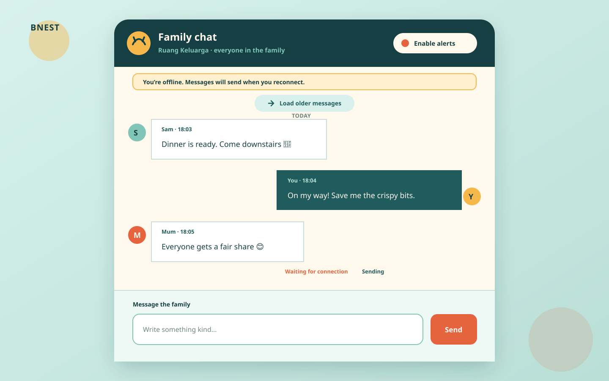
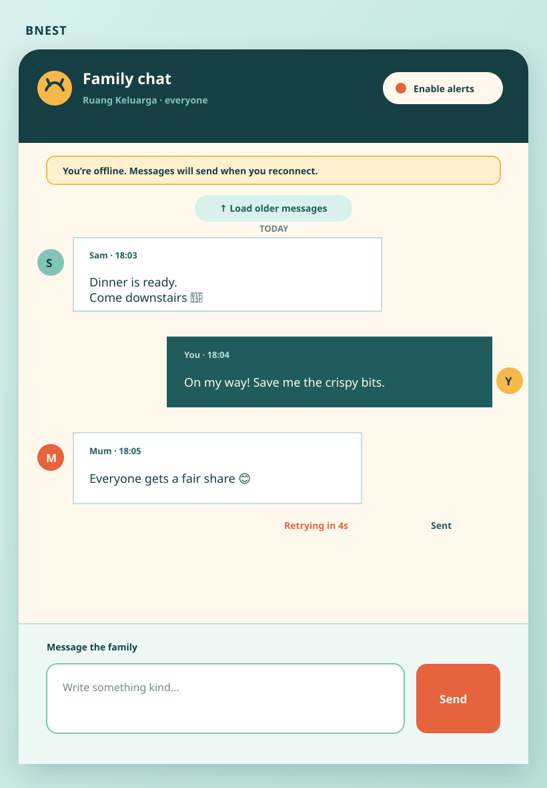

# UI Design

## User and Job

An authenticated family member, including a child, opens **Ruang Keluarga**, recognizes who said what, sends a short
message, understands whether it has reached the server, and moves upward for history. Notification setup is secondary.

The selected visual language remains Beaver Nest's warm workshop: ink outlines, paper surfaces, lagoon framing, sun for
primary actions, and coral for attention. It avoids both a workplace-chat clone and the controls of the existing Codex
chat.

## Product Copy

- Home: **Family chat** / **Talk with everyone at home**
- Page and room: **Family chat** / **Ruang Keluarga**
- Empty: **Start the family conversation.** / **Messages from everyone at home will appear here.**
- Offline banner: **You’re offline. Messages will send when you reconnect.**
- Composer: **Message the family** / **Write a message** / **Send**
- Local delivery: **Waiting for connection**, **Sending**, **Retrying in …**, **Sent**, **Couldn’t send**
- History: **Beginning of family chat**, **Load older messages**, **New messages below**
- Terminal action: **Retry** / **Discard**
- Validation: **Write a message first.** / **Keep messages under 4,000 characters.**

## Selected Direction

**Family hearth** remains selected: one centered conversation panel, compact room identity, notification control,
chronological message area, and anchored composer. The previous channel-rail alternative is rejected because v1 has no
switcher; the message-ledger alternative is rejected because its dense metadata works against a child-friendly room.

```text
+--------------------------------------+
| Family chat        Enable alerts     |
| Ruang Keluarga                       |
| You’re offline. Messages will send…  |
| Sam  Dinner is ready                 |
|                    On my way!        |
|                    Retrying in 4s    |
|--------------------------------------|
| Message the family             Send  |
+--------------------------------------+
```





The nine lo-fi artifacts remain planning evidence for the original alternatives. Their labels are updated from channel
to room where they describe the selected product; rejected channel-rail artifacts remain explicitly historical.

## Status Presentation

- Pending local messages are visually distinct but occupy the same chronological surface near the composer.
- A pending row keys by client message UUID. On acknowledgement it is replaced/merged with the server ID, never appended
  as a second bubble.
- **Waiting for connection** accompanies offline persistence.
- **Sending** appears only while a request is in flight.
- **Retrying in …** exposes the next eligible retry without promising network availability.
- **Sent** confirms acknowledgement and may fade after a short interval.
- **Couldn’t send** persists with Retry and Discard; expiry and terminal GraphQL errors explain why automatic retry ended.
- The offline banner reflects observed connectivity but does not override request failures or claim successful delivery.

### UI state matrix

| Room state            | Transcript                                                | Composer                             | Status/action                             |
| --------------------- | --------------------------------------------------------- | ------------------------------------ | ----------------------------------------- |
| Booting               | Stable empty frame with loading status                    | Disabled until identity/outbox ready | Polite **Loading family chat**            |
| Online and empty      | Invitation copy                                           | Enabled                              | No fake messages                          |
| Online and populated  | Latest committed page                                     | Enabled                              | Per-message committed metadata            |
| Offline               | Existing in-memory committed rows plus local pending rows | Enabled while queue <100             | Persistent offline banner                 |
| IndexedDB unavailable | Existing committed rows                                   | Draft retained; send disabled        | Alert explains local storage failure      |
| Queue full            | Existing plus 100 pending rows                            | Draft retained; new send disabled    | Retry/discard guidance                    |
| Reconnecting          | Existing rows remain                                      | New intent may queue                 | One reconnect status; no transcript reset |
| Catching up           | Merge later committed IDs                                 | Drain paused                         | Polite catch-up status                    |
| Auth expired          | Existing screen is obscured/redirected per auth policy    | Disabled                             | Queue paused; login required              |
| Terminal send         | Failed local row remains                                  | Enabled if capacity permits          | **Couldn't send**, Retry, Discard         |
| Expired send          | Expired local row remains                                 | Enabled if capacity permits          | Manual retry/discard and age explanation  |

The UI never renders an optimistic row that cannot first be persisted. Local rows use their UUID as DOM identity and a
`data-delivery-state` value; committed rows use server ID. On acknowledgement, reconciliation replaces the local identity
without visual duplication and preserves its chronological local position until the authoritative order merge completes.

## Responsive Behavior

### Desktop — 1280×800 and wider

Center one panel at maximum 48rem. Header identity and notification control share a row. The offline banner sits below
the header. Message bubbles stay below 78% width; status text aligns with its bubble. Composer is textarea plus fixed
button.

### Tablet — 768×1024

Use 1rem outer gutters. Notification control may wrap below identity. Banner and status text wrap without hiding action
buttons. Composer remains two-column while 44×44 CSS-pixel targets fit.

### Mobile — 393×852 down to 320 CSS pixels

Use an edge-to-edge room, sticky compact header, banner, and safe-area composer. Below 360 CSS pixels, stack textarea and
Send. Pending controls remain reachable without horizontal scrolling or covering **New messages below**.

## Interaction

- Desktop Enter sends; Shift+Enter inserts a newline; IME composition never sends.
- Mobile relies on the visible Send button.
- The browser persists to IndexedDB before issuing GraphQL. Failure to persist leaves the draft in the composer and sends
  nothing.
- A successful acknowledgement clears the local queue record and draft only for that UUID.
- Reopening as the same user restores eligible pending rows. Logout removes them; another user never sees them.
- History prepend preserves the reading anchor. New commits auto-follow only within 80 CSS pixels of the bottom.
- Notification permission starts only from **Enable notifications**.
- Reduced-motion removes nonessential entrances and status fades.

## Accessibility

- `<main>` contains a labelled room region, `role="log"` transcript, connection status, notification settings, and form.
- Pending status belongs to its message via accessible description; color and alignment are supplementary.
- Connectivity, queue, history, validation, and new-message updates use concise polite/alert semantics without stealing
  focus. Historical catch-up rows are not announced as new conversation.
- Focus order is home, notifications, history fallback, new-message control, queued-message actions, composer, Send.
- Targets are at least 44×44 CSS pixels. Visible focus, contrast, 200% zoom, text enlargement, reduced motion, keyboard,
  and screen-reader announcements are checked at all viewports.

The offline banner is a status, not an alert on every `online` hint. A first transition to offline is announced once;
retry countdown ticks are not announced every second. Announce **Retrying soon** when the state starts and announce the
result. **Couldn't send** is an alert tied to the affected message. Retry and Discard have accessible names that include a
non-sensitive positional description, not the message body. Discard requires confirmation when it would irreversibly
remove the only local copy.

History loading uses a busy state on the history control, not the entire transcript. The log's accessible name includes
**Ruang Keluarga**. Sender kind and display name are present as text; system messages include a visible **System** label.
Timestamps use semantic `<time datetime="...">` with localized visible text.

## Visual Verification Matrix

Manual inspection covers empty, populated, offline, reconnecting, loading older, new-below, queue-full, retrying,
terminal, expired, notification blocked/enabled, and long multiline/4,000-grapheme boundary states at 1280×800,
768×1024, 393×852, 320 CSS-pixel width, and 200% zoom. It checks light/dark tokens, safe-area insets, software keyboard,
long display names, system labels, no horizontal page scroll, message/status association, sticky header/composer, and
that banners/actions do not obscure transcript content.

## Implementation and Proof Paths

The Phoenix shell route is implemented in `apps/bnest-app/lib/bnest_app_web/controllers/family_chat_controller.ex` and
`apps/bnest-app/lib/bnest_app_web/controllers/family_chat_html/room.html.heex`. Browser behavior is owned by
`apps/bnest-app/assets/js/family_chat/`; CSS remains in `apps/bnest-app/assets/css/app.css`.

Frontend behavior lives under `specs/apps/bnest/app-fe/behaviours/` and receives Vitest unit bindings plus
`bnest-app-fe-e2e` browser proof. Delivery also requires spec-aware exploratory and structurally spec-blind usability
passes at the exact routed origin. Static SVGs and automated geometry do not replace manual inspection.
