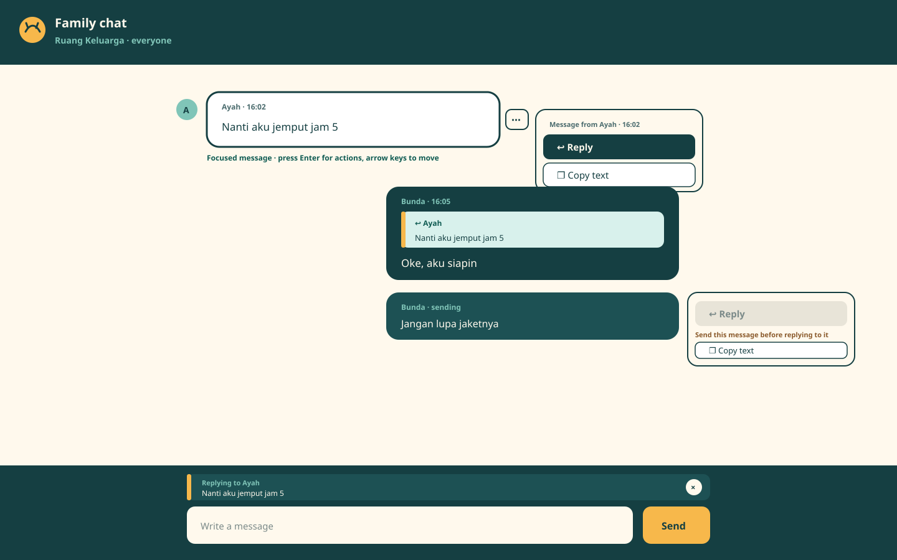

# Family Chat Message Reply

## Status

**Executed and released, 2026-09-22. Archived 2026-09-23.** Six documents are complete, both planning decision
gates have been run, and the [plan quality gate](../../../repo-governance/workflows/plan-quality-gate.md) returned
`PASS` at the pre-execution checkpoint with five findings recorded and repaired — all three records are in
[`learnings.md`](learnings.md). Execution was separately authorized and is recorded in
[`delivery.md`](delivery.md), which carries the execution status and six of the eight accepted gaps; the other two
are acceptance criteria and sit in [`prd.md`](prd.md). The execution check returned `BLOCKED` seven times and was
never satisfied; the archival move was made by authority decision over that verdict, on the ground that the
remaining findings are defects in the plan's own retrospective prose rather than in its execution evidence. All
seven verdicts and the decision that closed them are in [`learnings.md`](learnings.md), the last as D16.

## Outcome

A family member can point one message in **Ruang Keluarga** at another. Holding a message on a phone, right-clicking
it on a laptop, or focusing it and pressing Enter opens one action menu offering **Reply** and **Copy text**.
Choosing Reply puts the selected message, quoted, above the composer; sending carries the link permanently. Every
reader sees the quote inside the reply and can activate it to jump back to the original.

The full comparison of three alternatives at three widths is in [UI Design](tech-docs/003-ui-design.md).

## Context

Ruang Keluarga is one flat chronological room. When two conversations overlap, the link between a question and its
answer lives only in the sender's head. Every messaging product the household already uses solves this the same way,
and the household's expectation is set by WhatsApp's hold-then-Reply specifically.

Two properties of the existing room make this cheaper here than it is elsewhere. `family_chat_messages` is
append-only by database trigger — rows can never be edited or deleted — so a reply link can never point at something
that changed or vanished. And the room has no per-message interaction of any kind yet, so the first one built sets
the affordance every later per-message action inherits.

## Scope Boundary

**Included.** The per-message action menu with Reply and Copy text, reachable by touch, mouse, and keyboard; the
composer reply strip; an additive `reply_to_message_id` column; the `replyToMessageId` mutation argument and the
`replyTo` quote field; quote rendering on every arrival path; bounded jump-to-original with highlight; offline
queuing of replies; roving-focus keyboard navigation of the history; twelve design assets; specification, C4, and
documentation updates; and a two-stage no-downtime release.

**Excluded.** Threaded views, reply counts, "replied to you" notification variants, swipe-to-reply, quoting a text
fragment, forwarding, reactions, edit, delete, mentions, cross-room replies, and retiring the new feature flag after
the rollback window.

## Locked Decisions

| Decision                 | Selected contract                                                                                               |
| ------------------------ | --------------------------------------------------------------------------------------------------------------- |
| Storage                  | One nullable self-reference `reply_to_message_id`; no snapshot, no second table                                 |
| Quote payload            | `replyTo { id senderKind senderDisplayName bodyPreview }`, preview truncated on the server to 160 graphemes     |
| Quoted sender name       | Live-resolved at read time, exactly as the message's own sender name already is                                 |
| Invoke gestures          | One menu, four triggers: 500 ms hold, context menu, hover control, and Enter on the focused message             |
| Menu contents            | `Reply` and `Copy text`                                                                                         |
| Reply target eligibility | Committed messages only; unsent rows offer Copy text with Reply disabled and its reason stated                  |
| Offline                  | Replies queue in the existing IndexedDB outbox with their target; `DB_VERSION` unchanged                        |
| Nesting                  | Flat, one level, made unrepresentable by a separate quote type rather than enforced by convention               |
| Jump                     | Scroll and highlight if loaded; otherwise at most five older pages, then a stated refusal                       |
| Notifications            | Unchanged — a reply notifies exactly as an ordinary message does                                                |
| Release                  | Compatibility release (field answerable everywhere, flag off), then experience release (same revision, flag on) |

Every one of these was resolved at the pre-write gate, with the alternatives and the reasoning recorded in
[`learnings.md`](learnings.md).

## Approach

Specifications first, then the database, then the API, then the send path, then the interface, then proof, then two
releases. Each code item is a separate RED, GREEN, and REFACTOR checkbox naming its exact test path and command.
Each phase ends with a blocking checkpoint. Archival items follow every substantive phase rather than being mixed
into them.

## Dependencies and Authority

- Bnest identity, authoritative SQLite, loopback Caddy, Tailscale HTTPS, and the PWA shell are unchanged.
- Absinthe owns GraphQL execution and subscriptions. **Corrected 2026-09-22:** this line previously read "No
  dependency is added, upgraded, or removed by this plan." One was — `happy-dom`, a development dependency the
  frontend unit layer needs to prove DOM behaviour without a browser. The decision and its rejected
  alternatives are recorded in `learnings.md`; the authority statement was not corrected at the time.
- SQLite remains the only authority for committed history. The quote is derived from it at read time; IndexedDB and
  the subscription remain delivery and recovery mechanisms.
- The `family_chat_messages` immutability and permanence triggers are load-bearing for this design. A future plan
  that relaxes them inherits the obligation to define tombstone rendering, stated in
  [Data Model](tech-docs/001-data-model-and-migration.md).
- `bnest-app` remains the production owner; boundary-specific specifications stay under `specs/apps/bnest/app-be/`
  and `specs/apps/bnest/app-fe/`.

## Reading Order

1. [Business Requirements](brd.md) — why this is worth doing.
2. [Product Requirements](prd.md) — what must be observably true, as fourteen labelled acceptance criteria.
3. [Technical Documentation](tech-docs/README.md) — how the data, API, interface, proof, and release fit together.
4. [Delivery](delivery.md) — the exact implementation and proof sequence.
5. [Learnings](learnings.md) — the decision records from both gates, and the execution log.

## Directory Map

- [`assets/`](assets/README.md) — the twelve responsive design artifacts and their asset map.
- [`brd.md`](brd.md) — business need, people served, outcomes, rules, non-goals, risks, and measures.
- [`delivery.md`](delivery.md) — ordered TDD, release, evidence, recovery, and cleanup checklist.
- [`learnings.md`](learnings.md) — decision records and the execution log.
- [`prd.md`](prd.md) — personas, user stories, acceptance criteria, product scope, and product risks.
- [`tech-docs/`](tech-docs/README.md) — the six ordered technical contracts.
