# UI Design

## User, Job, and States

**User.** A family member in Ruang Keluarga, on a phone by default and on a laptop often enough that the laptop cannot
be an afterthought.

**Job.** Point one message at another, see which one is pointed at while typing, and, when reading, find the message a
reply answers.

**States this design must carry.** Message idle; message focused; message held or hovered with its actions control
shown; action menu open; Reply unavailable because the message has not committed; composer with a reply strip;
composer without one; a reply rendered with its quote; a quote being activated; the jump target highlighted; the jump
refused because the target is out of reach; reduced motion; offline.

## Three Alternatives

All three were drawn for the same task and the same content — Bunda replying to Ayah, with the action menu open on
Ayah's message — at 1440 × 900, 834 × 1112, and 393 × 852.

### Alternative A — Quote card (selected)

The quote is a bordered, tinted card with an accent bar, sitting above the reply text inside the same bubble, and the
card itself is a button that jumps to the original. Actions open as one menu: anchored beside the message on pointer
widths, raised from the bottom edge as a sheet on mobile.

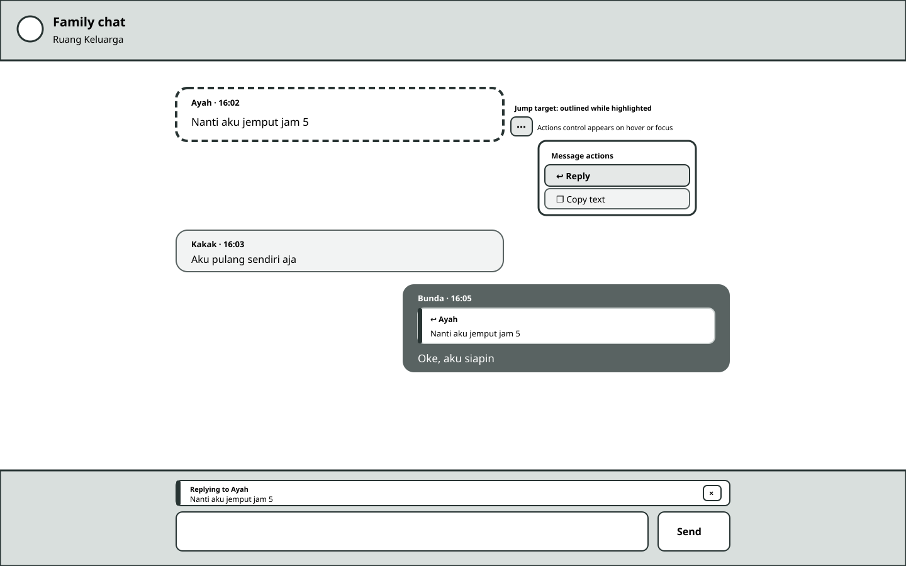

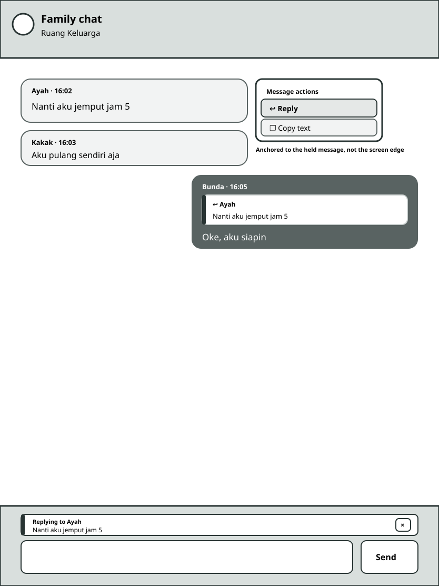

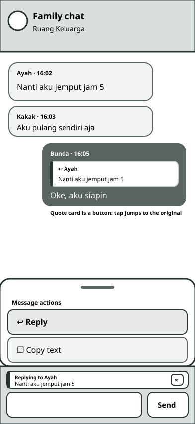

### Alternative B — Inline prefix (not selected)

The quote is one condensed line above the reply text, with no card and no accent bar. Actions appear as a small
floating toolbar over the message.

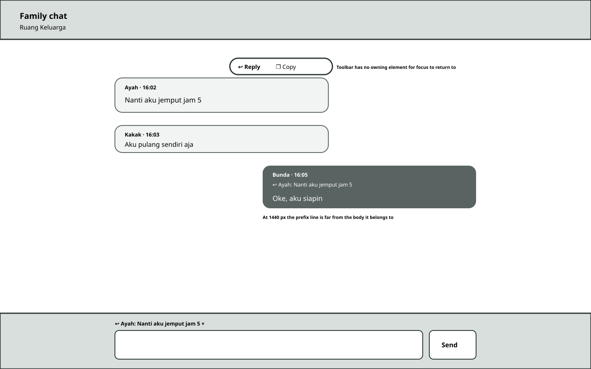

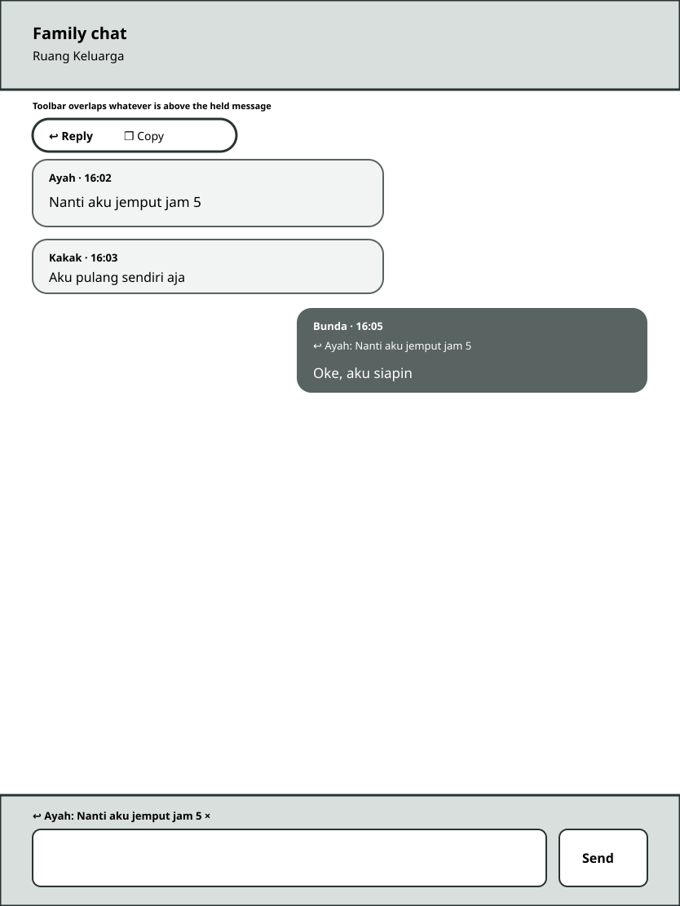

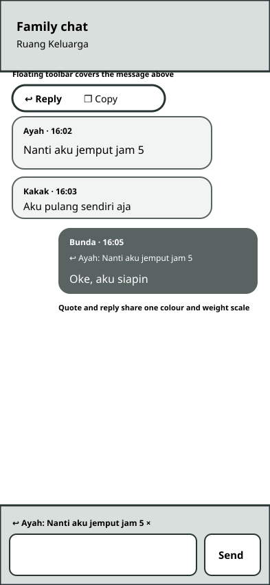

### Alternative C — Thread rail (not selected)

Replies are indented beneath the message they answer, joined by a connector rail, with a collapse control and, on
desktop, a thread list panel.

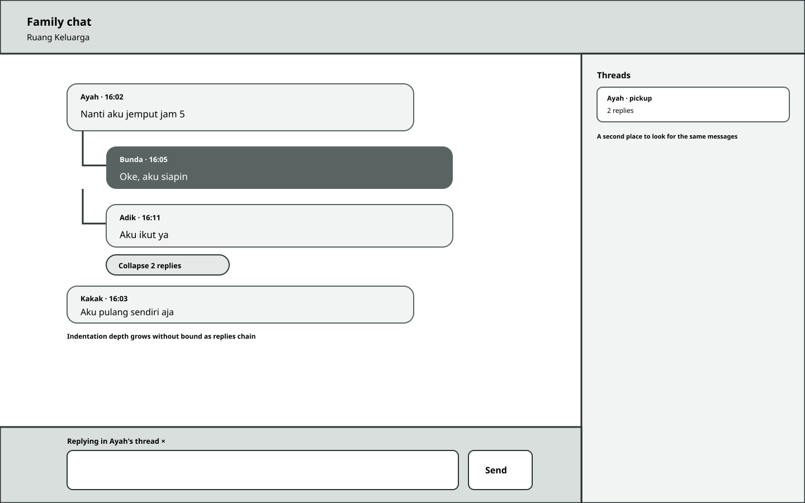

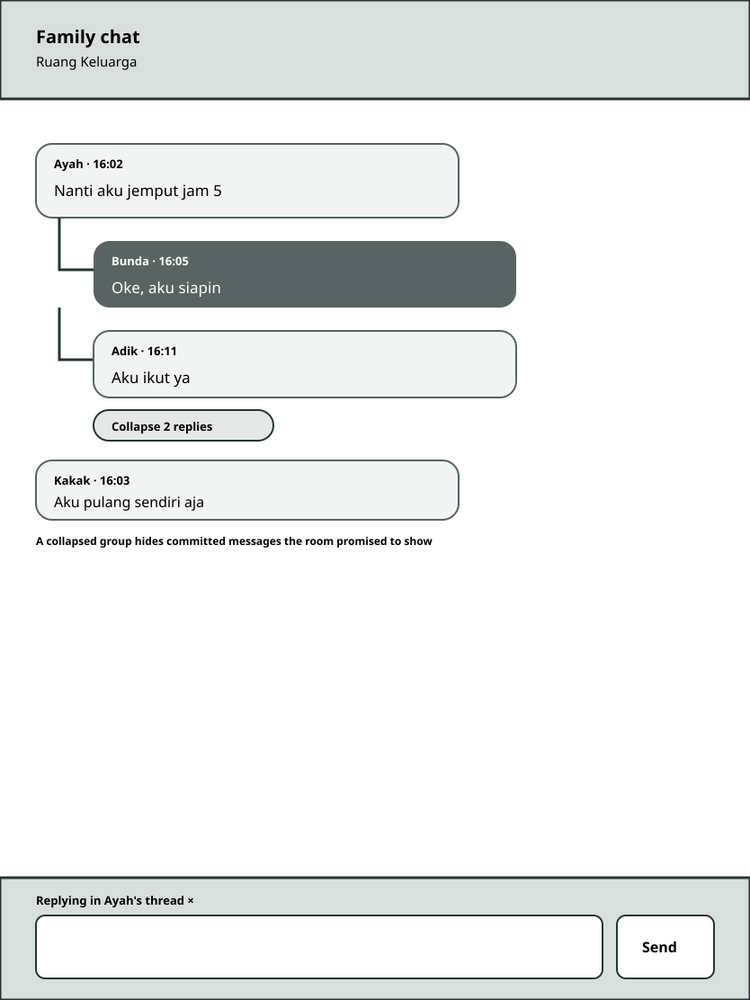

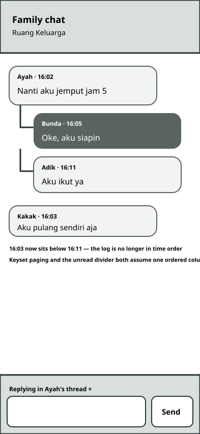

## Comparison and Selection

| Criterion           | A — Quote card (selected)                                                            | B — Inline prefix                                                                        | C — Thread rail                                                                      |
| ------------------- | ------------------------------------------------------------------------------------ | ---------------------------------------------------------------------------------------- | ------------------------------------------------------------------------------------ |
| Usability           | Quote is visibly a distinct object and an obvious tap target                         | Quote reads as part of the body; nothing suggests it can be activated                    | Strongest grouping, but the reader must track two orderings at once                  |
| Accessibility       | The card is a `button` with its own label; the menu has an owner focus can return to | A floating toolbar has no owning element, so Escape has nowhere to return focus to       | Collapsed groups hide committed messages from the `role="log"` reading order         |
| Implementation cost | One new menu component, one new quote component, no change to ordering or paging     | Cheapest to draw, but the toolbar's positioning and focus model cost more than they save | Highest: breaks keyset paging, the unread divider, and the scroll anchor all at once |
| Product fit         | Keeps one chronological room, which is the room the household already agreed to      | Fits, but under-serves the one job — finding the original                                | Contradicts the room's stated shape; reorders 16:03 below 16:11                      |

**A is selected.** The deciding factor is not appearance. B and C each break something the existing room guarantees: B
leaves the action surface without an element that owns it, so there is no correct answer to "where does focus go when
the menu closes"; C makes the message list non-chronological, which invalidates keyset pagination, the unread divider,
and the resume anchor in one move — three mechanisms the previous plan built and proved. A adds a component and
changes nothing that already works.

## What Was Adopted, and What Was Rejected, From Other Products

**Adopted as interaction discipline:** the quoted block living inside the reply bubble and acting as the jump control
(WhatsApp, Telegram, Discord); a flat one-level quote enforced in the data shape rather than by convention (Telegram's
Bot API strips the nested field; Slack forbids threading onto a reply); a cancel affordance on the composer preview
(Signal documents the X in the compose area); and an explicit, stated outcome when the original cannot be reached —
Signal's own issue tracker records `"Quoted message not found"` appearing when a quote points beyond the pagination
boundary, which is the failure this design's bounded jump and its refusal copy exist to avoid.

**Rejected:** swipe-to-reply. It is WhatsApp's and Signal's primary mobile gesture, but it is a path-based gesture
under WCAG 2.5.1 and therefore needs an alternative anyway; Discord's rollout of it collided with the existing
swipe-to-navigate gesture and drew sustained complaints from users who could not disable it. Also rejected: Telegram's
selectable-fragment quoting, Discord's reply-ping toggle, and any visual identity from those products. The palette,
typography, and bubble geometry remain Bnest's own.

## Selected Direction in Detail

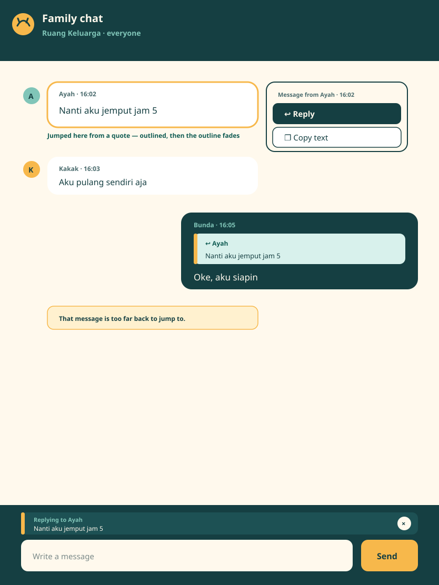

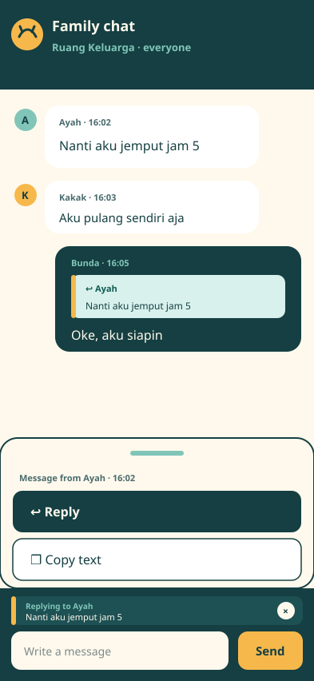

### Tokens

Reused from the existing room; nothing new is introduced.

| Token  | Value     | Used for                                                |
| ------ | --------- | ------------------------------------------------------- |
| ink    | `#153f42` | own-message bubble, menu text, header                   |
| paper  | `#fff9ed` | page background, menu surface                           |
| mint   | `#d8f1ec` | quote card fill inside a bubble                         |
| sun    | `#f7b84b` | quote accent bar, jump-target outline, send control     |
| lagoon | `#80c5b8` | secondary label text on ink surfaces                    |
| cream  | `#fff1cf` | the too-far-back refusal banner                         |
| coral  | `#e5633d` | reserved for failure states already defined by the room |

The quote card keeps a mint fill on both the ink (own) and white (other) bubble, so one card style serves both and the
accent bar carries the distinction rather than the fill.

### Components

- **`family-chat-message-actions`** — the menu. One component, four triggers, two items. Reused unchanged by any later
  per-message action.
- **`family-chat-message-quote`** — the quote card rendered inside a reply bubble. A `button` carrying
  `tabindex="-1"`. **Corrected 2026-09-22:** the card was specified simply as a `button`, which is a sequential tab
  stop by default, so with fifty replies on screen Tab walked the conversation one quote at a time instead of
  leaving the list. Every browserless layer agreed it was fine — `rovingInvariantHolds` could only see that exactly
  one _message_ carried a tab stop, and that stayed true. `tabindex="-1"` fixes the order without touching the role,
  the type, or the accessible name, so a screen reader still reaches and announces the card. Whether a keyboard-only
  reader without a screen reader should reach it at all is a separate question, raised as an idea brief rather than
  settled by widening the tab order.
- **`family-chat-reply-strip`** — the composer's reply target, with its cancel control.

### Copy Inventory

Exact strings, all in English to match the room's existing copy:

| Situation                               | String                                            |
| --------------------------------------- | ------------------------------------------------- |
| Menu accessible name                    | `Message actions`                                 |
| Menu item                               | `Reply`                                           |
| Menu item                               | `Copy text`                                       |
| Reply unavailable, on a pending message | `Send this message before replying to it`         |
| Copy succeeded (live region)            | `Message copied.`                                 |
| Copy refused (live region)              | `Couldn't copy. Select the text manually.`        |
| Composer strip label                    | `Replying to {name}`                              |
| Composer strip cancel control           | `Cancel reply`                                    |
| Reply selected (live region)            | `Replying to {name}.`                             |
| Quote card accessible name              | `Reply to {name}: {preview}. Go to that message.` |
| Jump refused                            | `That message is too far back to jump to.`        |

`{name}` is the live-resolved display name, or `System` for a system message.

### Responsive Behaviour

| Width       | Menu                            | Quote card                             | Reply strip                             |
| ----------- | ------------------------------- | -------------------------------------- | --------------------------------------- |
| ≥ 1024 px   | popover anchored to the message | full bubble width, single preview line | full composer width above the textarea  |
| 600–1023 px | popover anchored to the message | full bubble width, single preview line | full composer width above the textarea  |
| < 600 px    | sheet from the bottom edge      | full bubble width, single preview line | full composer width, above the textarea |

The actions control (`⋯`) is revealed on hover or focus on fine pointers and is not rendered on coarse pointers, where
holding the message is the gesture and a permanently visible control on every bubble would be noise.

### State Expectations

- **Empty.** Unchanged. A room with no messages has nothing to act on and shows no new affordance.
- **Loading.** Unchanged. The menu is only reachable from a rendered message.
- **Error.** A refused clipboard and a refused jump both speak through the existing live region and the existing
  remediation paragraph. No new error surface is introduced.
- **Focus.** Visible focus ring on the message, on the actions control, on each menu item, on the quote card, and on
  the cancel control. The ring is the room's existing one.
- **Reduced motion.** The jump highlight is a 1.2 s fade under normal preference and a static outline held for 2 s
  under `prefers-reduced-motion: reduce`. The menu opens without transition under the same preference.
- **Offline.** The menu, the strip, and the quote all behave identically offline. Only `Reply` on a message that has
  not committed is unavailable, and that is a property of the message, not of the connection.

  **Corrected 2026-09-22.** This document named a "Waiting for connection" state and nothing ever put a message in
  it. The outbox attempted immediately, the transport failed, and the member saw `Retrying in …` — wording that
  reads like something went wrong, for the one case where nothing did. The outbox now carries the browser's own
  `online`/`offline` verdict, deliberately as a flag **separate** from `draining`, which `reconnect.js` owns while
  it fills a catch-up gap. Both can be true at once, and resuming one must never resume the other.

### The Reply Target Is Optional All the Way Down

Added 2026-09-22, because this turned out to be load-bearing rather than incidental. Three hops carry the reply
target — the queued record (`outbox_namespace.js`), the transport call (`outbox_send.js`), and the persisted row
(`persistence_indexeddb.js`) — and all three spread it **conditionally** rather than writing
`replyToMessageId: x ?? null`.

That is what lets `DB_VERSION` stay at 1. A row written by the shipped release and a non-reply written by this one
are the same object, so hydration needs no migration and no version check. A `null` default would have forced a
schema bump for a field that adds nothing to most messages.

The same reasoning governs the documents the browser sends; see
[GraphQL Contract](002-graphql-contract.md#operation-documents).

Implementation, test, specification, and asset paths are in
[File Impact and Release](006-file-impact-and-release.md).
