# Technical Design

## Current State

`BnestApp.DataRepository` owns one `Store` rooted at `BNEST_RUNTIME_ROOT`. `Store` validates typed JSON, maps identities to paths, serializes writes, uses atomic replacement, and reads every write back. `Identity.FileStore`, imports, ChatLive, SifatAllahLive, and theme handling consume this store. Production roots end in `data/prod`; tests use marked `data/test/runs/<run-id>/` roots.
Supported sources are generated by the existing store. `<user-id>` and `<import-id>` are validated application IDs, `<username>` is a normalized username, and `<digest>` is a SHA-256 token digest.

| Source template                                  | Reader/writer          | Owner        | Accepted shape                     | Destination key                        | Final disposition                     |
| ------------------------------------------------ | ---------------------- | ------------ | ---------------------------------- | -------------------------------------- | ------------------------------------- |
| `system/bootstrap.json`                          | Bootstrap/FileStore    | System       | bootstrap v1                       | `bootstrap/singleton`                  | Verified rollback mirror; no deletion |
| `system/accounts/<user-id>.json`                 | Identity/FileStore     | User         | account v1                         | `account/<user-id>`                    | Same                                  |
| `system/usernames/<username>.json`               | Identity/FileStore     | System       | username-index v1                  | `username-index/<username>`            | Same                                  |
| `system/sessions/<digest>.json`                  | Identity/FileStore     | User/browser | browser-session v1                 | `browser-session/<digest>`             | Same                                  |
| `system/manifests/<import-id>.json`              | Manifest/Import        | System       | import-manifest v1                 | `import-manifest/<import-id>`          | Same                                  |
| `system/schema-registry.json`                    | Schema registry        | System       | schema-registry v1                 | `schema-registry/singleton`            | Same                                  |
| `users/<user-id>/imports/<import-id>.json`       | Import/recovery        | User         | browser-import v1                  | `browser-import/<user-id>:<import-id>` | Same                                  |
| `users/<user-id>/chat/current.json`              | ChatLive               | User         | chat v1                            | `chat/<user-id>`                       | Same                                  |
| `users/<user-id>/sifat-allah/progress.json`      | SifatAllahLive         | User         | sifat-allah-progress v1            | `sifat-allah-progress/<user-id>`       | Same                                  |
| `users/<user-id>/preferences/theme.json`         | ThemeController/layout | User         | theme-preference v1                | `theme-preference/<user-id>`           | Same                                  |
| `apps/beaver-nest/legacy/<import-id>/source.bin` | Backup                 | Application  | immutable bytes + receipt checksum | recovery source tuple                  | Same                                  |
| `users/<user-id>/legacy/<import-id>/source.bin`  | Backup                 | User         | immutable bytes + receipt checksum | recovery source tuple                  | Same                                  |

Inventory follows only these exact templates, rejects symlinks, and validates through the current schema module. Other files remain opaque and unchanged with an `unsupported_source` outcome; they never become proof of a complete cutover.

## Decisions

1. Use `Ecto.Repo`, `ecto_sql`, and `ecto_sqlite3` (which uses Exqlite) rather than raw driver calls. Ecto owns committed DDL and transactions; the existing Bnest facade remains the product boundary. Do not add `phoenix_ecto` unless implementation actually needs its changeset form or exception protocols. See the official [adapter options](https://ecto-sqlite3.hexdocs.pm/Ecto.Adapters.SQLite3.html), [release-capable migrator](https://ecto-sql.hexdocs.pm/Ecto.Migrator.html), and [Phoenix/Ecto protocol scope](https://phoenix-ecto.hexdocs.pm/).
2. Preserve current typed record maps as validated JSON documents in one relational envelope. Feature-specific normalization is deferred; this minimizes migration surface and keeps readers stable.
3. The stable configuration pointer is `~/.config/bnest/storage.json` unless `BNEST_STORAGE_CONFIG` explicitly selects another machine-local pointer. The UI selects a directory only. Bnest appends the fixed `bnest.sqlite3` filename.
4. Default production database path is `~/.config/bnest/bnest.sqlite3`; `~` is expanded server-side and the stored value is absolute. Database, `-wal`, `-shm`, configuration, and recovery files stay ignored and private.
5. The committed DDL file is `apps/bnest-app/priv/sqlite_repo/migrations/20260829000000_create_bnest_storage.exs`. DDL never scans flat files. Data copying is owned by adapter `flat-files-v1-to-sqlite-v1`, called by the UI or the reproducible `bnest-app:storage:migrate` Nx target through the same domain module.
6. Schema migration never runs implicitly on ordinary application startup. UI or managed release tooling calls `Ecto.Migrator.with_repo/3` under the host migration lock.
7. SQLite uses WAL, foreign keys, `synchronous: :full`, an execution-measured bounded busy timeout, and a small pool. Exact pool/timeout values are accepted only after overlap tests; initial test candidates are pool 5 and 5,000 ms.
8. SQLite becomes primary only after the incompatible flat-only slot is retired. Flat compatibility remains during rollback; deletion and reader removal need a later plan.

## Target Architecture

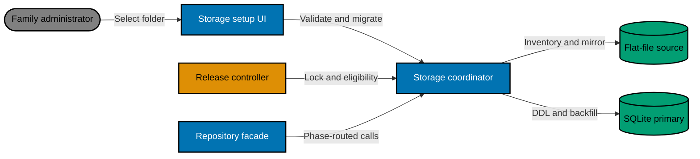

`StorageCoordinator` starts the flat adapter when a legacy root exists and dynamically starts `SQLiteRepo` after a location passes validation. The existing facade delegates to the phase-owned backend. It serializes the final inventory and authority switch while normal reads continue; writes are bounded and queued during final parity. A timeout aborts without switching authority.

## UI Design

The representative task is an existing family administrator moving household data on the Bnest host. The interface uses real copy such as “Database folder,” “This folder is on the Bnest computer,” and “Move data.” New setup reuses the selected structure but replaces migration status with “Create database” and then continues account setup.

### Alternatives

- **A — Quiet card, not selected:** one compact form. Lowest cost, but hides migration dependencies and recovery status.
- **B — Migration ledger, selected:** one vertical sequence whose rows are real states: folder, source inventory, copy, verification, activation. It gives the safest reading order and collapses naturally on smaller devices.
- **C — Source/destination split, not selected:** explicit side-by-side transfer. Strong mental model on desktop, but weak mobile order and too operational for a household setup.

| Alternative        | Usability                            | Accessibility               | Cost   | Product fit                          |
| ------------------ | ------------------------------------ | --------------------------- | ------ | ------------------------------------ |
| Quiet card         | Fast for fresh setup; weak for retry | Simple landmarks            | Low    | Too little migration confidence      |
| Migration ledger   | Clear state and recovery             | Linear headings/live status | Medium | Selected: makes preservation visible |
| Source/destination | Strong comparison                    | Reading-order risk          | High   | Feels like an admin console          |

#### Lo-fi A — quiet card (not selected)

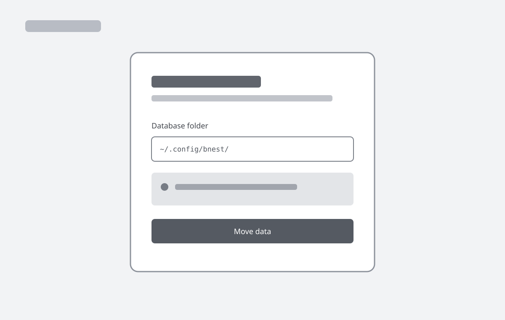
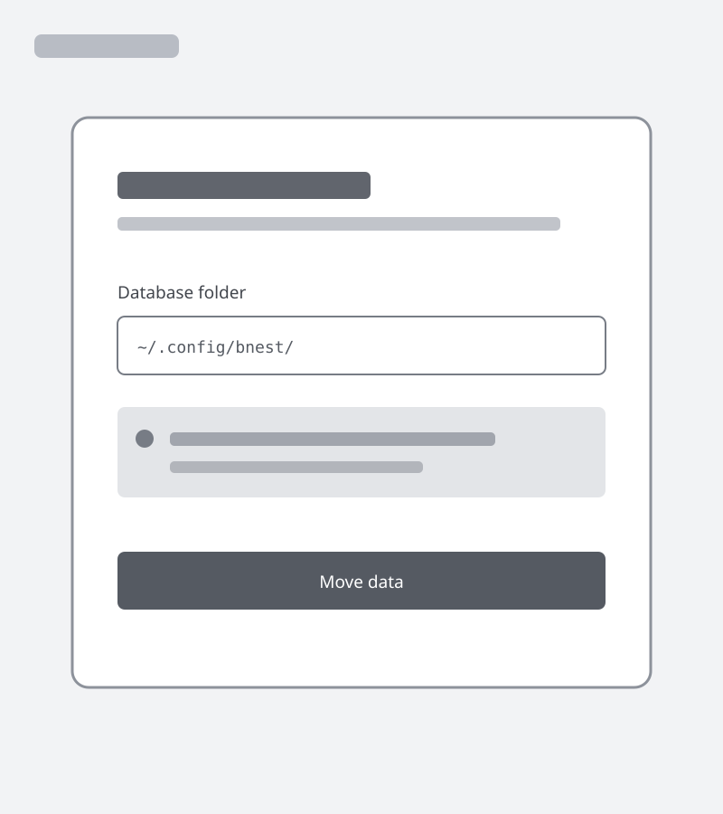
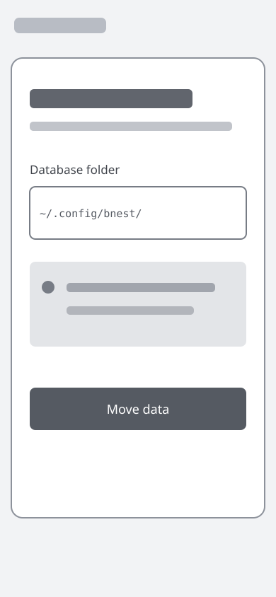

#### Lo-fi B — migration ledger (selected)

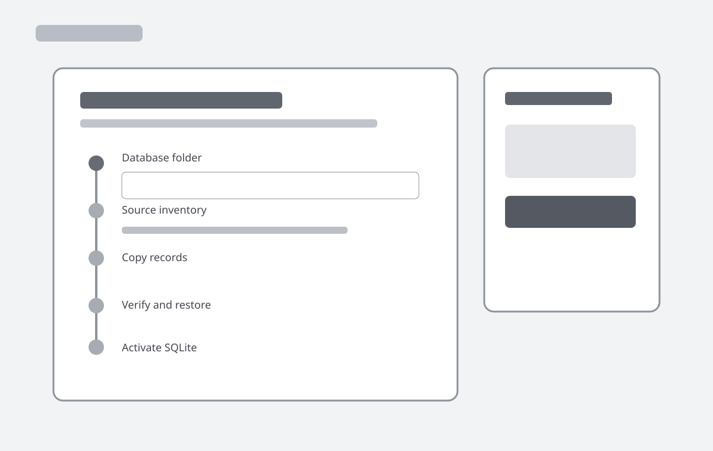
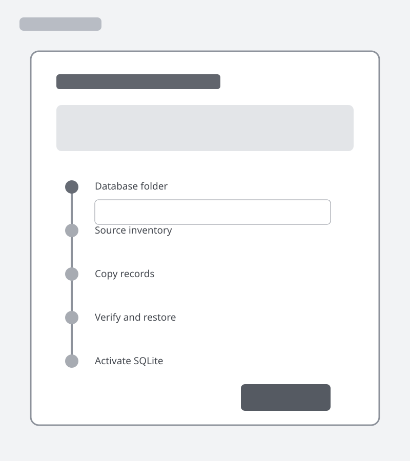
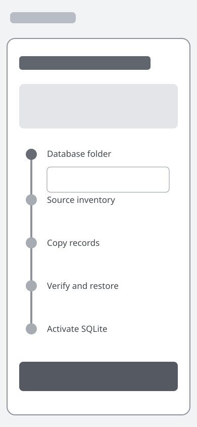

#### Lo-fi C — source and destination (not selected)

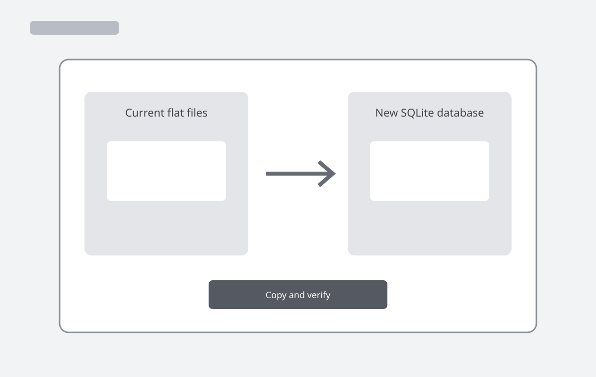
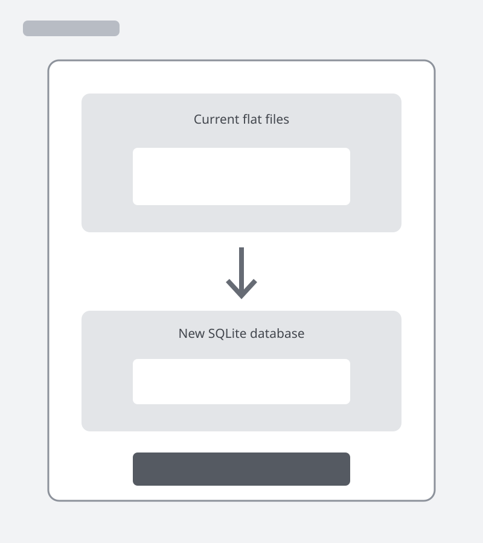
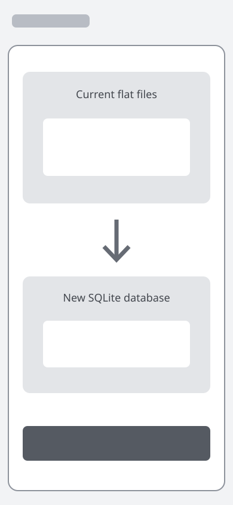

#### Selected hi-fi — migration ledger


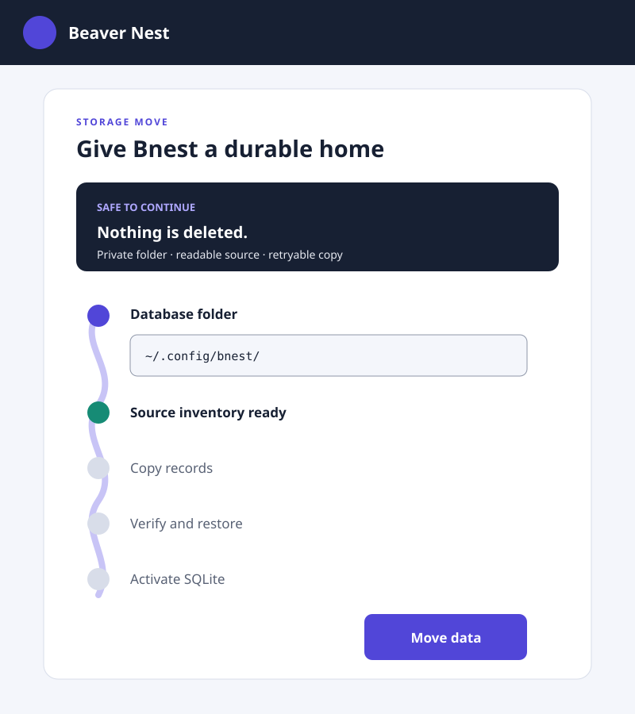
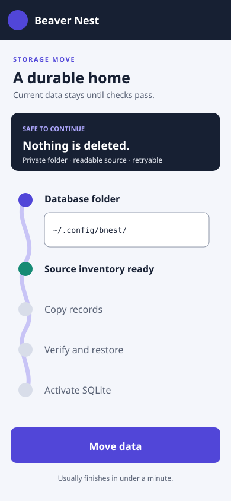

The visual direction extends Bnest's indigo system with **Night Ink** `#172033`, **Nest Indigo** `#5146D8`, **River Blue** `#187EA8`, **Safe Teal** `#168B75`, **Parchment Mist** `#F4F6FB`, and **Warning Amber** `#B86513`. Existing system/body faces remain to avoid a new font dependency; utility paths use the current monospace stack. The signature is a “nest path” ribbon connecting actual migration states—not decorative step numbers. Quiet surfaces and restrained motion keep that one motif distinctive.

Desktop uses a 960 px ledger with a sticky safe-summary rail; tablet uses one 680 px column; mobile uses full-width stacked rows with the action fixed only while it does not cover focused content. At 200% zoom, all content reflows without horizontal scrolling. Folder text wraps anywhere but retains a full accessible name.

Keyboard order follows folder → check → confirmation → move. Focus is visible, errors focus the summary, progress uses `aria-live="polite"`, and blocking failures use `role="alert"`. Loading never disables navigation; retry explains the preserved state. Reduced motion removes ribbon drawing and uses an immediate state change. Color is paired with icon, label, and status text.

## Storage Configuration Contract

The pointer is atomically written with mode `0600`; its parent is `0700`. It contains no credentials or user data.

```json
{
  "schemaVersion": 1,
  "databaseDirectory": "/absolute/server-local/directory",
  "databaseFilename": "bnest.sqlite3",
  "phase": "flat_primary",
  "migrationId": "flat-files-v1-to-sqlite-v1"
}
```

`phase` is `flat_primary` or `sqlite_primary`. Missing configuration means storage setup is required for a fresh install or legacy flat-primary mode for an existing install. The location validator expands `~`, requires an absolute server path owned by the service account, rejects symlink components and world-writable parents, and rejects repository, legacy source, deployment artifact, and test-run overlap. It creates no path until the user confirms. Once DDL begins, directory and filename cannot change.

## SQLite Schema Contract

The versioned migration creates four strict logical tables plus Ecto's `schema_migrations`:

```text
bnest_records(
  record_type TEXT NOT NULL,
  record_key TEXT NOT NULL,
  owner_id TEXT NULL,
  schema_version INTEGER NOT NULL CHECK(schema_version > 0),
  revision INTEGER NULL CHECK(revision IS NULL OR revision >= 0),
  payload_json TEXT NOT NULL CHECK(json_valid(payload_json)),
  payload_sha256 TEXT NOT NULL CHECK(length(payload_sha256) = 64),
  inserted_at TEXT NOT NULL,
  updated_at TEXT NOT NULL,
  PRIMARY KEY(record_type, record_key)
)
INDEX bnest_records_owner_type(owner_id, record_type)
bnest_recovery_sources(
  owner_kind TEXT NOT NULL CHECK(owner_kind IN ('app','user')),
  owner_key TEXT NOT NULL,
  import_id TEXT NOT NULL,
  payload_blob BLOB NOT NULL,
  payload_sha256 TEXT NOT NULL CHECK(length(payload_sha256) = 64),
  byte_size INTEGER NOT NULL CHECK(byte_size >= 0),
  inserted_at TEXT NOT NULL,
  PRIMARY KEY(owner_kind, owner_key, import_id)
)

bnest_migration_runs(
  migration_id TEXT PRIMARY KEY,
  source_fingerprint TEXT NOT NULL,
  ddl_checksum TEXT NOT NULL,
  state TEXT NOT NULL CHECK(state IN
    ('inventoried','copying','verifying','verified','failed')),
  started_at TEXT NOT NULL,
  verified_at TEXT NULL,
  error_category TEXT NULL
)

bnest_migration_items(
  migration_id TEXT NOT NULL REFERENCES bnest_migration_runs(migration_id),
  source_relative_path TEXT NOT NULL,
  record_type TEXT NOT NULL,
  record_key TEXT NOT NULL,
  source_sha256 TEXT NOT NULL,
  target_sha256 TEXT NULL,
  outcome TEXT NOT NULL CHECK(outcome IN
    ('pending','accepted','unsupported','invalid','changed','failed')),
  error_category TEXT NULL,
  PRIMARY KEY(migration_id, source_relative_path),
  UNIQUE(migration_id, record_type, record_key)
)
INDEX bnest_migration_items_outcome(migration_id, outcome)
```

The migration uses explicit `up/0`; `down/0` refuses once `bnest_records` or migration evidence is non-empty. Operational rollback changes readers, not schema. Timestamps are evidence metadata and do not enter payload equivalence.

Payload JSON retains the current validated map. Backfill stores the exact validated source bytes and their SHA-256. New writes use a canonical encoder with recursively sorted object keys before hashing. Reads decode and revalidate through `DataRepository.Schema`; database constraints supplement but do not replace domain validation.

## Reproducible Data Migration

Migration identity is fixed as `flat-files-v1-to-sqlite-v1`. Inventory sorts normalized relative paths bytewise. Each item identity is SHA-256 of `migration-id`, NUL, relative path, NUL, and source checksum. The source fingerprint is SHA-256 over the ordered item identities. The release manifest includes migration filename, DDL checksum, adapter ID, supported source record versions, and SQLite schema range `1..1`.

For each item, the adapter rechecks bytes after inventory, validates the existing schema, derives the exact destination key above, inserts record and accepted evidence in one immediate SQLite transaction, reads through the normal SQLite adapter, and compares the validated map and checksum. Retry skips only an accepted row whose source, target, and current target checksums still match. A collision, changed source, unknown version, or checksum mismatch is preserved and blocks activation.

SQLite integrity proof runs `PRAGMA quick_check`; parity compares the full supported inventory by record type/key and checksums without logging identities or counts. Restore uses the SQLite backup API or `VACUUM INTO` into an isolated marked test directory, opens the restored database, applies read-only schema/integrity checks, and destroys only that proven test directory.

## Expand → Migrate → Verify → Contract

1. **Expand:** update specs and Gherkin first; add Ecto dependencies, migration file, adapters, coordinator, UI, release manifest support, and tests. Deploy while `flat_primary`; the candidate must remain compatible when SQLite is not configured.
2. **Migrate:** after Caddy promotes the expand revision and the incompatible slot drains and retires, an admin selects the folder. The coordinator acquires the host lock, applies DDL, inventories sources, and backfills idempotently. Ordinary startup never owns this transition.
3. **Verify:** prove schema checksum, normal reads, parity, quick check, isolated restore, restart, representative synthetic user flows, and rollback-reader compatibility. Then atomically change the pointer to `sqlite_primary` and prove the same journeys again.
4. **Contract:** keep the flat reader and compatibility mirror for the stated rollback window and retained artifact. Releasing or deleting flat sources, mirror code, or `BNEST_RUNTIME_ROOT` occurs only in a later authorized plan.

During `flat_primary`, flat files are authoritative and SQLite is a verified mirror. During `sqlite_primary`, SQLite is authoritative; compatibility writes remain observable and block rollback eligibility when mirror parity is pending. If cross-store synchronization cannot be made failure-atomic, implement a SQLite outbox and reconciler rather than acknowledging a write that makes rollback silently stale.

## Failure and Rollback

- Folder/DDL/inventory/backfill failure: leave flat-primary route active, preserve partial SQLite/evidence, release the lock, and expose a safe retry category.
- Candidate or routed proof failure: keep or restore the prior Caddy upstream with `deploy:rollback`; diagnose before retry.
- Failure after SQLite activation: keep current SQLite route if data is healthy. Application rollback is allowed only when the target artifact supports SQLite phase or mirror parity is proven; never force an old flat reader onto stale data.
- Database integrity failure: stop new mutations through the storage coordinator, keep health explicit, restore into an isolated destination, and require authorized recovery; never overwrite the only database.
- Cleanup removes only temporary candidates, marked restore databases, and unused proxies. Production SQLite, WAL/SHM, pointer, source, recovery, and migration evidence remain.

## Verification Matrix

| Layer       | Proof                                                                                                                                                                                     |
| ----------- | ----------------------------------------------------------------------------------------------------------------------------------------------------------------------------------------- |
| Unit        | path validation, config encoding, key mapping, canonical JSON, phase transitions, manifest checksum, retry decisions, privacy projection                                                  |
| Integration | DDL twice, constraints, transactions, busy timeout, concurrent revisions, every source type, interruption/retry, parity, quick check, backup/restore, startup/restart                     |
| Behavior    | all `sqlite_storage.feature` scenarios bound in unit, integration, and E2E adapters                                                                                                       |
| Focused E2E | default/custom setup, admin migration, non-admin denial, error/retry, post-restart chat/learning/theme/session                                                                            |
| Release     | manifest adapter, lock exclusion, flat-primary candidate, Caddy promotion, revision readiness, routed exact-origin LiveView/WebSocket reconnect, bounded drain, cleanup, guarded rollback |

Run package-manager-prefixed targets: `bnest-app:test:unit`, `test:integration`, `test:coverage:behaviour`, `test:quick`, focused `bnest-app-e2e:test:e2e`, `bnest-app:release:test`, and `badakmini-cli:test:repo`. E2E uses unique `test-user-` identities and `data/test/runs/<run-id>/bnest.sqlite3`; it never falls back to production.

## Specification Changes

Plan acceptance AC-01 through AC-08 becomes durable behavior or architecture because each changes an observable setup, authorization, storage, migration, or continuity contract. Visual-alternative comparison remains plan-only and is proven by delivery review plus desktop/tablet/mobile manual checks.

### [E] `specs/apps/bnest/app/architecture.md`

```diff
- Runtime flat files are the only authoritative application store.
+ SQLite is the configured primary store after verified migration.
+ Flat files remain a compatibility source/mirror during rollback.
+ Storage coordinator, Ecto repo, migration lock, and configuration pointer own activation.
```

- = Preserve Tailscale → Caddy → Phoenix routing, auth, ownership, Codex boundaries, and resumable LiveView state.
- ✓ Proof: architecture map gate plus local/routed revision and reconnect evidence.

### [N] `specs/apps/bnest/app/behaviours/sqlite_storage.feature`

```diff
+ New setup proposes the private default SQLite folder.
+ Administrator selects a valid custom database folder.
+ Unsafe database folder is rejected without mutation.
+ Versioned SQLite migration creates the expected schema once.
+ Existing administrator migrates every recognized flat-file record.
+ Interrupted migration resumes idempotently.
+ SQLite becomes authoritative only after complete verification.
+ Invalid or changed source blocks cutover without data loss.
+ Non-admin cannot configure storage.
+ Routed client reconnects across compatible SQLite rollout.
```

- → Bindings: `apps/bnest-app/test/behaviour/steps/sqlite_storage_steps.exs`, both behavior support adapters, and `apps/bnest-app-e2e/tests/steps/sqlite_storage.steps.ts` with its support helper.
- ✓ Proof: `bnest-app:test:coverage:behaviour`, focused exact-origin E2E, and release reconnect proof.

### [E] `specs/apps/bnest/app/behaviours/centralized_data.feature`

```diff
- Future accepted records persist only in server flat files.
+ Future accepted records persist through the active repository backend.
```

- = Preserve all seven named import, stale-write, cleanup, and Codex-resume scenarios.
- → Bindings: existing centralized-data unit, integration, and E2E adapters update only storage assertions.
- ✓ Proof: behavior coverage plus focused browser-import continuation journey.

### [E] `specs/apps/bnest/app/behaviours/authentication.feature`

```diff
- Initial setup begins directly with account creation.
+ Initial setup requires ready SQLite storage before account creation.
```

- = Preserve redirect, password, roles, session, multi-browser, logout, and cross-user isolation scenarios.
- → Bindings: existing authentication adapters plus the new storage support helper.
- ✓ Proof: behavior coverage and fresh-install E2E.

### [E] `specs/apps/bnest/app/behaviours/README.md`

```diff
+ Map sqlite_storage.feature as the canonical local database contract.
```

- ✓ Proof: repository specification-map gate.

## File Impact

### Application and release

```text
apps/bnest-app/
├── [E] README.md
├── [E] mix.exs
├── [E] mix.lock
├── [E] project.json
├── config/
│   ├── [E] config.exs
│   ├── [E] runtime.exs
│   └── [E] test.exs
├── lib/bnest_app/
│   ├── [E] application.ex
│   ├── [E] data_repository.ex
│   ├── [E] identity/bootstrap.ex
│   ├── [E] identity/file_store.ex
│   ├── [N] sqlite_repo.ex
│   ├── data_repository/
│   │   ├── [E] backup.ex
│   │   ├── [E] store.ex
│   │   ├── [E] schema.ex
│   │   ├── [N] backend.ex
│   │   ├── [N] canonical_json.ex
│   │   ├── [N] sqlite_store.ex
│   │   └── [N] storage_coordinator.ex
│   └── storage/
│       ├── [N] config.ex
│       ├── [N] location.ex
│       ├── [N] migration.ex
│       ├── [N] migration_item.ex
│       ├── [N] migration_run.ex
│       └── [N] record.ex
├── lib/bnest_app_web/
│   ├── [E] router.ex
│   ├── [E] user_auth.ex
│   ├── controllers/
│   │   └── [E] bootstrap_controller.ex
│   └── live/
│       ├── [E] login_live.ex
│       └── [N] storage_live.ex
├── priv/sqlite_repo/migrations/
│   └── [N] 20260829000000_create_bnest_storage.exs
└── tools/
    ├── [E] deployment.mjs
    ├── [E] release.mjs
    └── [E] release.test.mjs
```

### UI, tests, and specifications

```text
apps/bnest-app/assets/css/app.css                                      [E]
apps/bnest-app/test/behaviour/driver.ex                               [E]
apps/bnest-app/test/behaviour/steps/sqlite_storage_steps.exs          [N]
apps/bnest-app/test/behaviour/support/integration.exs                  [E]
apps/bnest-app/test/behaviour/support/unit.exs                         [E]
apps/bnest-app/test/integration/bnest_app/application_test.exs        [E]
apps/bnest-app/test/integration/bnest_app/backup_test.exs             [E]
apps/bnest-app/test/integration/bnest_app/data_repository_test.exs    [E]
apps/bnest-app/test/integration/bnest_app/identity_test.exs            [E]
apps/bnest-app/test/integration/bnest_app/schema_audit_test.exs        [E]
apps/bnest-app/test/integration/bnest_app/sqlite_storage_test.exs     [N]
apps/bnest-app/test/support/test_runtime_root.ex                       [E]
apps/bnest-app/test/unit/bnest_app/storage_config_test.exs            [N]
apps/bnest-app/test/unit/bnest_app/storage_migration_test.exs         [N]
apps/bnest-app-e2e/README.md                                          [E]
apps/bnest-app-e2e/playwright.config.mts                              [E]
apps/bnest-app-e2e/tests/steps/authentication.steps.ts                 [E]
apps/bnest-app-e2e/tests/steps/centralized_data.steps.ts               [E]
apps/bnest-app-e2e/tests/steps/sqlite_storage.steps.ts                 [N]
apps/bnest-app-e2e/tests/support/sqlite-storage.ts                     [N]
apps/bnest-app-e2e/tests/support/test-runtime.mts                      [E]
apps/bnest-app-e2e/tools/run-e2e.mts                                  [E]
apps/bnest-app/lib/mix/tasks/bnest.schema.audit.ex                     [E]
apps/bnest-app/lib/mix/tasks/bnest.storage.migrate.ex                  [N]
specs/apps/bnest/app/architecture.md                                  [E]
specs/apps/bnest/app/behaviours/README.md                              [E]
specs/apps/bnest/app/behaviours/authentication.feature                [E]
specs/apps/bnest/app/behaviours/centralized_data.feature              [E]
specs/apps/bnest/app/behaviours/sqlite_storage.feature                [N]
README.md                                                              [E]
.gitignore                                                             [E]
```

### Runtime instances

```text
~/.config/bnest/storage.json                              [N] private pointer; default fixed location
<database-directory>/bnest.sqlite3                       [N] SQLite database
<database-directory>/bnest.sqlite3-wal                   [N] SQLite-managed WAL sidecar when present
<database-directory>/bnest.sqlite3-shm                   [N] SQLite-managed shared-memory sidecar when present
data/test/runs/<run-id>/bnest.sqlite3                    [N] isolated generated test database
<legacy-runtime-root>/system/bootstrap.json              [E] compatible mirror; no deletion
<legacy-runtime-root>/system/accounts/<user-id>.json     [E] compatible mirror; no deletion
<legacy-runtime-root>/system/usernames/<username>.json   [E] compatible mirror; no deletion
<legacy-runtime-root>/system/sessions/<digest>.json      [E] compatible mirror; no deletion
<legacy-runtime-root>/system/manifests/<import-id>.json  [E] compatible mirror; no deletion
<legacy-runtime-root>/system/schema-registry.json        [E] compatible mirror; no deletion
<legacy-runtime-root>/users/<user-id>/imports/<import-id>.json [E] compatible mirror; no deletion
<legacy-runtime-root>/users/<user-id>/chat/current.json  [E] compatible mirror; no deletion
<legacy-runtime-root>/users/<user-id>/sifat-allah/progress.json [E] compatible mirror; no deletion
<legacy-runtime-root>/users/<user-id>/preferences/theme.json [E] compatible mirror; no deletion
<legacy-runtime-root>/apps/beaver-nest/legacy/<import-id>/source.bin [E] immutable source; no deletion
<legacy-runtime-root>/users/<user-id>/legacy/<import-id>/source.bin [E] immutable source; no deletion
```

The application creates `<run-id>` and fixed runtime filenames; user-controlled input never supplies record keys or filenames. Runtime instances are ignored and never plan assets.
