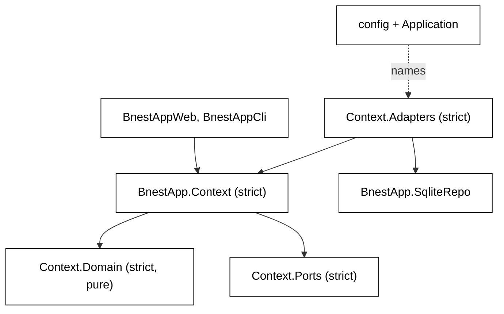
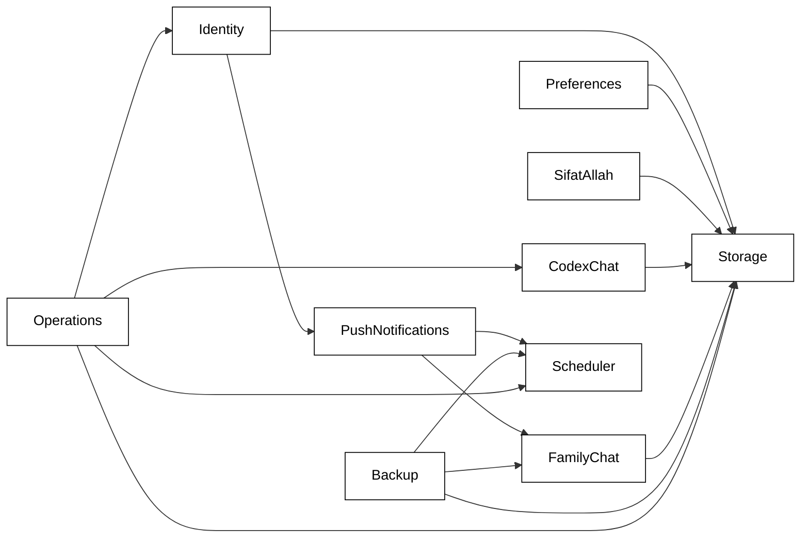

# 002: Target Architecture and Context Map

## Boundary Topology

Three properties of `boundary` shape this topology:

- `boundary` assigns each module to the boundary of its nearest ancestor that declares one.
- A sub-boundary may list as dependencies only its direct siblings, its parent, and the dependencies of ancestors up to
  the first `type: :strict` ancestor.
- A `type: :strict` boundary inherits nothing and must list every dependency, including external applications.

A prototype (recorded in `learnings.md`, E1) showed what this means for a nested layout. An `Adapters` sub-boundary
inside a strict context cannot list `SqliteRepo` or an infrastructure application unless the context facade lists it
too, and then the facade could reach SQL. The topology therefore makes each context's **facade** and its **adapters**
two _top-level_ strict boundaries, with `Domain` and `Ports` as sub-boundaries of the facade. The prototype confirmed
that this layout rejects every forbidden edge and accepts every allowed one:

- **Rejected:** facade → `SqliteRepo`, an unlisted external app or adapters; domain → adapters; another context →
  adapters; web → adapters or `SqliteRepo`. (The prototype used `Jason` as its stand-in external app.)
- **Accepted:** adapters → facade exports, `SqliteRepo`, infrastructure apps and legacy root modules; web → facades.

A migrated context's facade never lists `BnestApp`. When it needs a module that has not migrated yet, it calls a port,
and the port's adapter, whose boundary may list `BnestApp`, makes the call. Nothing names an `Adapters` boundary at
compile time except configuration, so legacy modules can call a migrated facade while that context still reaches
legacy code, and `boundary`'s dependency-cycle check ("dependency cycle found") can never trigger.

| Boundary                                    | Kind                                                                                                                       | Declared deps                                                                                                                                                                                                                                                                                           | Exports                                                               |
| ------------------------------------------- | -------------------------------------------------------------------------------------------------------------------------- | ------------------------------------------------------------------------------------------------------------------------------------------------------------------------------------------------------------------------------------------------------------------------------------------------------- | --------------------------------------------------------------------- |
| `BnestApp`                                  | root of the core namespace, relaxed; holds only legacy modules during migration, and only `BnestApp` and `Mailer` after it | `BnestApp.SqliteRepo`, plus each migrated facade a legacy module calls; an entry is added in the unit that migrates the callee and removed in the unit that migrates the last caller                                                                                                                    | `@legacy_exports` during migration; nothing after                     |
| `BnestApp.SqliteRepo`                       | `top_level?: true`, relaxed                                                                                                | the implicit `Ecto` boundaries its `use Ecto.Repo` expansion calls, exactly as U3's RED compile reports them                                                                                                                                                                                            | itself                                                                |
| `BnestApp.<Context>`                        | `top_level?: true`, `type: :strict`; the facade plus application-layer modules                                             | the other migrated context facades it calls; external apps its application layer needs, such as `Phoenix.PubSub`; never `BnestApp`                                                                                                                                                                      | the domain types callers read, and its ports (needed by its adapters) |
| `BnestApp.<Context>.Domain`                 | sub-boundary of the facade, `type: :strict`                                                                                | none, except `Jason` where a domain value is canonical JSON (only Storage's `CanonicalJson`, `Normalizer` and `RecordSchema`); `boundary` accepts a sub-boundary dep only when its parent lists it, so the Storage facade lists `Jason` too, and `Jason` is a pure encoding library, not infrastructure | `:all`                                                                |
| `BnestApp.<Context>.Ports`                  | sub-boundary of the facade, `type: :strict`                                                                                | `BnestApp.<Context>.Domain`                                                                                                                                                                                                                                                                             | `:all`                                                                |
| `BnestApp.<Context>.Adapters`               | `top_level?: true`, `type: :strict`                                                                                        | `BnestApp.<Context>`, `BnestApp.SqliteRepo`, the infrastructure apps it wraps, other migrated context facades, and `BnestApp` while a port of this context still reaches a legacy module                                                                                                                | `:all` (only configuration and the composition root name them)        |
| `BnestApp.Release`                          | `top_level?: true`, relaxed                                                                                                | the context facades it drives                                                                                                                                                                                                                                                                           | `Migrations`, `Migrations.*`, `CaddyConfig`                           |
| `BnestAppWeb`                               | top-level, relaxed                                                                                                         | every context facade it calls, plus `BnestApp` during migration                                                                                                                                                                                                                                         | `Endpoint`, `Telemetry`                                               |
| `BnestAppCli` (new, `lib/bnest_app_cli.ex`) | top-level, relaxed; Mix tasks `classify_to: BnestAppCli`                                                                   | the context facades its tasks call, plus `BnestApp` during migration                                                                                                                                                                                                                                    | none                                                                  |
| `BnestApp.Application`                      | `top_level?: true`, relaxed composition root                                                                               | every context facade, `BnestAppWeb`, `BnestApp.SqliteRepo`                                                                                                                                                                                                                                              | none                                                                  |

The facade does not list `BnestApp.SqliteRepo`, any infrastructure application, or its own `Adapters`, so it cannot
reach SQL or choose an implementation. It resolves its adapters at run time from
`Application.fetch_env!(:bnest_app, __MODULE__)`, so the compile graph never runs from application to adapter. Each
adapter key's default lives in `config/config.exs`, and `config/test.exs` overrides it with the in-memory adapters for
the unit layer. Exported ports are visible to inbound adapters at compile time, so the layering scan's rule L4 refuses
any inbound-adapter reference to `*.Ports.*` or `*.Adapters.*`.

## Context Map

Every arrow starts in the consumer's **Adapters** layer, except for PushNotifications → FamilyChat, Backup → FamilyChat
and the Operations arrows, which are application-to-facade calls. Identity → PushNotifications is the logout path
(`Identity.logout/1` disables the session's push subscription) through `Identity.Ports.SubscriptionRevoker`, so from
U5 to U9 the adapter lists `BnestApp` and U10 swaps that for `BnestApp.PushNotifications`. PushNotifications →
Scheduler and Backup → Scheduler are task adapters implementing the exported `Scheduler.Ports.Task`. No arrow is reversed. Scheduler calls into
PushNotifications and Backup only through task modules and tick handlers _named in configuration_, so Scheduler has no
compile-time dependency on either. Storage validates other contexts' records through a `RecordKind` port that those
contexts implement and configuration registers, so Storage has no compile-time dependency on CodexChat or SifatAllah.
That breaks today's `DataRepository.Schema` → `Chat`/`SifatAllah` edge.

## Module Destinations

The `Shape` column uses the names from [001](001-architecture-standard.md). Context sections are listed in delivery
order: foundations first.

### U4: Storage (supporting context: records and the storage lifecycle)

| From                                                                        | To                                                                                                                                                                                                        | Layer                                                                                                                                                                                                                                                                                                                                                                                                                                                                      |
| --------------------------------------------------------------------------- | --------------------------------------------------------------------------------------------------------------------------------------------------------------------------------------------------------- | -------------------------------------------------------------------------------------------------------------------------------------------------------------------------------------------------------------------------------------------------------------------------------------------------------------------------------------------------------------------------------------------------------------------------------------------------------------------------- |
| _(new)_                                                                     | `BnestApp.Storage`                                                                                                                                                                                        | facade: storage status, migrate, relocate, retire, purge test data, import, health probe, plus the calls other modules make today: `ensure_started!/0,1` and `stop/0` (were `StorageCoordinator`), `database_path/0` (was `Config.resolved_database_path/0`), `database_generation/0` and `phase/0` (were `Config`), `with_shared_lock/1` and `with_exclusive_lock/1` (were `Lock.with_shared/1`, `with_exclusive/1`), and `active_store/0` (was `DataRepository.store/0`) |
| `BnestApp.DataRepository`                                                   | `BnestApp.Storage.Records`                                                                                                                                                                                | application process; the published record API, exported for other contexts' adapters and legacy modules only (scan rule L4 refuses it in inbound adapters)                                                                                                                                                                                                                                                                                                                 |
| `BnestApp.DataRepository.StorageCoordinator`                                | `BnestApp.Storage.Ports.DatabaseLifecycle` + `BnestApp.Storage.Adapters.SqliteCoordinator` (`ensure_started!/0,1`, `stop/0`); the phase-to-backend choice (`active_backend/1`) moves to `Storage.Records` | port + adapter (it creates directories and starts the repo); application                                                                                                                                                                                                                                                                                                                                                                                                   |
| `BnestApp.DataRepository.Import`                                            | `BnestApp.Storage.Import`                                                                                                                                                                                 | application                                                                                                                                                                                                                                                                                                                                                                                                                                                                |
| `BnestApp.DataRepository.RecoverySource`                                    | `BnestApp.Storage.RecoverySource`                                                                                                                                                                         | application                                                                                                                                                                                                                                                                                                                                                                                                                                                                |
| `BnestApp.DataRepository.Schema`                                            | `BnestApp.Storage.Domain.RecordSchema`                                                                                                                                                                    | domain; context-owned kinds come from the `RecordKind` port                                                                                                                                                                                                                                                                                                                                                                                                                |
| `BnestApp.DataRepository.Normalizer`                                        | `BnestApp.Storage.Domain.Normalizer`                                                                                                                                                                      | domain                                                                                                                                                                                                                                                                                                                                                                                                                                                                     |
| `BnestApp.DataRepository.CanonicalJson`                                     | `BnestApp.Storage.Domain.CanonicalJson`                                                                                                                                                                   | domain                                                                                                                                                                                                                                                                                                                                                                                                                                                                     |
| `BnestApp.DataRepository.Manifest`                                          | `BnestApp.Storage.Domain.Manifest`                                                                                                                                                                        | domain                                                                                                                                                                                                                                                                                                                                                                                                                                                                     |
| `BnestApp.Storage.RecordMap`                                                | `BnestApp.Storage.Domain.RecordMap`                                                                                                                                                                       | domain                                                                                                                                                                                                                                                                                                                                                                                                                                                                     |
| `BnestApp.Storage.Location`                                                 | `BnestApp.Storage.Domain.Location`                                                                                                                                                                        | domain                                                                                                                                                                                                                                                                                                                                                                                                                                                                     |
| `BnestApp.DataRepository.Backend`                                           | `BnestApp.Storage.Ports.RecordBackend`                                                                                                                                                                    | port                                                                                                                                                                                                                                                                                                                                                                                                                                                                       |
| _(new)_                                                                     | `BnestApp.Storage.Ports.RecordKind`                                                                                                                                                                       | port: `kind/0`, `validate/1`, `normalize/1` for a context-owned record kind                                                                                                                                                                                                                                                                                                                                                                                                |
| _(new)_                                                                     | `BnestApp.Storage.Ports.ConfigStore`, `Ports.Lock`, `Ports.Maintenance`                                                                                                                                   | ports over `Config`, `Lock`, and the migration/relocation/retirement/cleanup procedures                                                                                                                                                                                                                                                                                                                                                                                    |
| `BnestApp.DataRepository.Store`                                             | `BnestApp.Storage.Adapters.FileRecordBackend`                                                                                                                                                             | adapter                                                                                                                                                                                                                                                                                                                                                                                                                                                                    |
| `BnestApp.DataRepository.SqliteStore`                                       | `BnestApp.Storage.Adapters.SqliteRecordBackend`                                                                                                                                                           | adapter                                                                                                                                                                                                                                                                                                                                                                                                                                                                    |
| `BnestApp.DataRepository.Backup`                                            | `BnestApp.Storage.Adapters.FileRecordExport`                                                                                                                                                              | adapter                                                                                                                                                                                                                                                                                                                                                                                                                                                                    |
| `BnestApp.Storage.Config`                                                   | `BnestApp.Storage.Adapters.FileConfigStore`                                                                                                                                                               | adapter                                                                                                                                                                                                                                                                                                                                                                                                                                                                    |
| `BnestApp.Storage.Lock`                                                     | `BnestApp.Storage.Adapters.FileLock`                                                                                                                                                                      | adapter                                                                                                                                                                                                                                                                                                                                                                                                                                                                    |
| `BnestApp.Storage.Migration`, `Relocation`, `Retirement`, `TestDataCleanup` | `BnestApp.Storage.Adapters.SqliteMigration`, `SqliteRelocation`, `FlatRetirement`, `TestDataCleanup` (all behind `Ports.Maintenance`)                                                                     | adapters                                                                                                                                                                                                                                                                                                                                                                                                                                                                   |
| _(new)_                                                                     | `BnestApp.CodexChat.Adapters.TranscriptRecordKind`, `BnestApp.SifatAllah.Adapters.ProgressRecordKind`                                                                                                     | adapters of `RecordKind`, created at their final paths so later units do not move them                                                                                                                                                                                                                                                                                                                                                                                     |

Shape: supporting context. Its consumers call `Storage.Records` only from their adapters, except Operations, which
calls the `Storage` facade's read-only health probe. Until each consumer migrates, its legacy modules call the
`Storage` facade functions above in place of the old coordinator, config, lock and repository calls; U4 edits every
such caller, as [006](006-file-impact.md) lists. The process name `BnestApp.DataRepository` becomes
`BnestApp.Storage.Records`, and readiness moves in the same unit.

### U5: Identity

| From                                                                           | To                                                                                                       | Layer                                                                                |
| ------------------------------------------------------------------------------ | -------------------------------------------------------------------------------------------------------- | ------------------------------------------------------------------------------------ |
| `BnestApp.Identity`                                                            | `BnestApp.Identity`                                                                                      | facade + process; gains `account/1` used by `UserAuth`                               |
| `BnestApp.Identity.Login`, `Bootstrap`                                         | same names                                                                                               | application                                                                          |
| `BnestApp.Identity.Session`                                                    | `BnestApp.Identity.Sessions` (application) + `BnestApp.Identity.Domain.Session` (token and expiry rules) | application + domain                                                                 |
| `BnestApp.Identity.Authorization`                                              | `BnestApp.Identity.Domain.Authorization`                                                                 | domain                                                                               |
| `BnestApp.Identity.FileStore`                                                  | `BnestApp.Identity.Ports.IdentityStore` + `BnestApp.Identity.Adapters.RecordIdentityStore`               | port + adapter over `Storage.Records`                                                |
| `BnestApp.Identity.CredentialVerifier`                                         | `BnestApp.Identity.Ports.CredentialHasher` + `BnestApp.Identity.Adapters.Argon2CredentialHasher`         | port + adapter                                                                       |
| _(new)_                                                                        | `BnestApp.Identity.Ports.SessionNotifier` + `BnestApp.Identity.Adapters.EndpointSessionNotifier`         | replaces the notifier argument passed into `Login.revoke/3`                          |
| _(the `PushNotifications.disable_subscription/2` call in `Identity.logout/1`)_ | `BnestApp.Identity.Ports.SubscriptionRevoker` + `BnestApp.Identity.Adapters.PushSubscriptionRevoker`     | port + adapter; the adapter is the only Identity module that names PushNotifications |

### U6: Preferences (new context, post-write gate D17)

| From                                                           | To                                                                              | Layer                                                 |
| -------------------------------------------------------------- | ------------------------------------------------------------------------------- | ----------------------------------------------------- |
| _(theme reads and writes in `ThemeController` and `UserAuth`)_ | `BnestApp.Preferences`                                                          | facade: `theme/1`, `put_theme/3`, `clear_theme/1`     |
| _(new)_                                                        | `BnestApp.Preferences.Domain.Theme`                                             | domain: the allowed theme values and the record shape |
| _(new)_                                                        | `BnestApp.Preferences.Ports.PreferenceStore` + `Adapters.RecordPreferenceStore` | port + adapter over `Storage.Records` (`:theme`)      |

Shape: port-backed. The `:theme` record kind atom and its stored format are unchanged.

### U7: SifatAllah (pure library becomes port-backed)

| From                                       | To                                                                         | Layer                                                                                          |
| ------------------------------------------ | -------------------------------------------------------------------------- | ---------------------------------------------------------------------------------------------- |
| `BnestApp.SifatAllah` (pure, 55 functions) | `BnestApp.SifatAllah.Domain.Quiz`                                          | domain (exported for rendering values)                                                         |
| _(new)_                                    | `BnestApp.SifatAllah`                                                      | facade: `load_progress/1`, `record_answer/…`, `save_progress/3`, moved out of `SifatAllahLive` |
| _(new)_                                    | `BnestApp.SifatAllah.Ports.ProgressStore` + `Adapters.RecordProgressStore` | port + adapter over `Storage.Records` (`:sifat_allah`)                                         |

### U8: CodexChat (renamed from `Chat` + `Codex`)

| From                                                            | To                                                                            | Layer                                                                                                             |
| --------------------------------------------------------------- | ----------------------------------------------------------------------------- | ----------------------------------------------------------------------------------------------------------------- |
| `BnestApp.Chat`                                                 | `BnestApp.CodexChat.Domain.Transcript`                                        | domain                                                                                                            |
| `BnestApp.Codex.Settings`, `ModelAccess`, `RepositoryAccess`    | `BnestApp.CodexChat.Domain.Settings`, `ModelAccess`, `RepositoryAccess`       | domain                                                                                                            |
| `BnestApp.Codex.Session`                                        | `BnestApp.CodexChat.Ports.AgentSession`                                       | port                                                                                                              |
| `BnestApp.Codex.ModelDiscovery`                                 | `BnestApp.CodexChat.Ports.ModelDiscovery` + `Adapters.CodexCliModelDiscovery` | port + adapter                                                                                                    |
| `BnestApp.Codex.PortSession`                                    | `BnestApp.CodexChat.Adapters.CodexPortSession`                                | adapter                                                                                                           |
| `BnestApp.Codex.ModelCatalog`                                   | `BnestApp.CodexChat.ModelCatalog`                                             | application process                                                                                               |
| _(new)_                                                         | `BnestApp.CodexChat`                                                          | facade: open/resume conversation, send prompt, apply session event, persist snapshot, all moved out of `ChatLive` |
| _(new)_                                                         | `BnestApp.CodexChat.Ports.TranscriptStore` + `Adapters.RecordTranscriptStore` | port + adapter (`:chat`)                                                                                          |
| _(the `BnestApp.Codex.ModelCatalog` child in `application.ex`)_ | `BnestApp.CodexChat.child_specs/0`                                            | facade; `BnestApp.Application` starts what it returns                                                             |
| `config :bnest_app, :codex_session` / `:codex_models`           | `config :bnest_app, BnestApp.CodexChat, agent_session: …, model_discovery: …` | composition root                                                                                                  |

### U9: FamilyChat

| From                                                                                                                                               | To                                                                                                                                      | Layer                                                                                                                          |
| -------------------------------------------------------------------------------------------------------------------------------------------------- | --------------------------------------------------------------------------------------------------------------------------------------- | ------------------------------------------------------------------------------------------------------------------------------ |
| `BnestApp.FamilyChat`                                                                                                                              | `BnestApp.FamilyChat`                                                                                                                   | facade; validation, authorization and cursor rules leave it for the domain                                                     |
| `BnestApp.FamilyChat.Message`                                                                                                                      | `BnestApp.FamilyChat.Domain.Message`                                                                                                    | domain (exported; GraphQL types use it)                                                                                        |
| _(new)_                                                                                                                                            | `BnestApp.FamilyChat.Domain.Policy`, `Domain.Cursor`                                                                                    | domain, extracted from the facade                                                                                              |
| `BnestApp.FamilyChat.Store`                                                                                                                        | `BnestApp.FamilyChat.Ports.RoomStore` + `Adapters.SqliteRoomStore`                                                                      | port + adapter                                                                                                                 |
| _(new)_                                                                                                                                            | `BnestApp.FamilyChat.Ports.MessagePublisher` + `Adapters.AbsintheMessagePublisher`                                                      | port + adapter for the PubSub/Absinthe publish                                                                                 |
| _(`FamilyChat.Store` calls from `push_notifications.ex`, `push_notifications/dispatcher.ex`, `backup.ex` and `release/migrations/family_chat.ex`)_ | `BnestApp.FamilyChat.ensure_ready!/0`, `canonical_room/0` (the active room at the canonical slug), `insert_message!/6` and `migrate!/0` | facade functions delegating to `RoomStore`; U9 switches all four callers, including the still-legacy PushNotifications modules |
| `BnestApp.Release.Migrations.FamilyChat`                                                                                                           | same name, body delegates to `FamilyChat.converge_after_drain!/0`                                                                       | release entry point; name frozen because `tools/deployment.mjs` evals it                                                       |

### U10: PushNotifications

| From                                      | To                                                                                                                     | Layer                                                                                                                                                                                                                                                                                                                    |
| ----------------------------------------- | ---------------------------------------------------------------------------------------------------------------------- | ------------------------------------------------------------------------------------------------------------------------------------------------------------------------------------------------------------------------------------------------------------------------------------------------------------------------ |
| `BnestApp.PushNotifications`              | same                                                                                                                   | facade; its SQL moves to adapters (its FamilyChat calls already go through the facade since U9)                                                                                                                                                                                                                          |
| `BnestApp.PushNotifications.Policy`       | `BnestApp.PushNotifications.Domain.Policy`                                                                             | domain                                                                                                                                                                                                                                                                                                                   |
| `BnestApp.PushNotifications.Dispatcher`   | same                                                                                                                   | application                                                                                                                                                                                                                                                                                                              |
| `BnestApp.PushNotifications.Sender`       | `Ports.PushSender` + `Adapters.WebPushSender` + `Adapters.RecordingPushSender`                                         | port + adapters; `:push_notifications_test_provider?` becomes adapter selection in configuration                                                                                                                                                                                                                         |
| _(SQL in facade/dispatcher)_              | `Ports.SubscriptionStore` + `Adapters.SqliteSubscriptionStore`, `Ports.DeliveryStore` + `Adapters.SqliteDeliveryStore` | ports + adapters                                                                                                                                                                                                                                                                                                         |
| `BnestApp.PushNotifications.RetentionJob` | `BnestApp.PushNotifications.Adapters.RetentionTask`                                                                    | inbound adapter (scheduler task); U11 adds `@behaviour BnestApp.Scheduler.Ports.Task` to it. The handler atom in `scheduler/registry.ex` and the handler pattern in `release/migrations/family_chat.ex` change in U10; both are data, not calls, so `family_chat_migration_test.exs` and `scheduler_test.exs` guard them |

### U11: Scheduler

| From                                                                                                    | To                                                                                                                                                                                                    | Layer                                                                                                                                                                |
| ------------------------------------------------------------------------------------------------------- | ----------------------------------------------------------------------------------------------------------------------------------------------------------------------------------------------------- | -------------------------------------------------------------------------------------------------------------------------------------------------------------------- |
| `BnestApp.Scheduler`                                                                                    | same                                                                                                                                                                                                  | facade + process; gains `admin_inventory/0`, `update_daily/…`, `run_now/…` for `AdminScheduleSettingsLive`                                                           |
| `BnestApp.Scheduler.Policy`                                                                             | `BnestApp.Scheduler.Domain.Policy`                                                                                                                                                                    | domain (exported; Backup task uses its time rules)                                                                                                                   |
| `BnestApp.Scheduler.Store`                                                                              | `Ports.ScheduleStore` + `Adapters.SqliteScheduleStore`                                                                                                                                                | port + adapter                                                                                                                                                       |
| `BnestApp.Scheduler.Registry`, `Run`                                                                    | `BnestApp.Scheduler.TaskRegistry`, `Run`                                                                                                                                                              | application; the task map and tick handlers come from configuration                                                                                                  |
| _(implicit `execute/2`)_                                                                                | `BnestApp.Scheduler.Ports.Task`                                                                                                                                                                       | port (behaviour every task adapter implements)                                                                                                                       |
| _(`Scheduler.Store` and `Registry` calls from `backup/run.ex` and `release/migrations/family_chat.ex`)_ | `BnestApp.Scheduler.complete_run/4`, `skip_run/4`, `active_attempt?/3`, `activate_if_pristine!/2` and `registered_handler/1`                                                                          | facade functions delegating to `ScheduleStore` and `TaskRegistry`; U11 switches both callers                                                                         |
| `BnestApp.Release.Migrations.PersistentSchedules`                                                       | same name; keeps its `Ecto.Migrator` run and verification SQL, reaches the seed rules through the exported `Scheduler.Domain.Policy` and the lock and database lifecycle through the `Storage` facade | release entry point (frozen name); `BnestApp.Release` lists `BnestApp.SqliteRepo`, `Ecto.Migrator`, `Ecto.Adapters.SQL`, `BnestApp.Scheduler` and `BnestApp.Storage` |

### U12: Backup

| From                                                             | To                                                                                                                 | Layer                                                                                                                                   |
| ---------------------------------------------------------------- | ------------------------------------------------------------------------------------------------------------------ | --------------------------------------------------------------------------------------------------------------------------------------- |
| `BnestApp.Backup`                                                | same                                                                                                               | facade; file and SQL effects leave it                                                                                                   |
| `BnestApp.Backup.Receipt`                                        | `BnestApp.Backup.Domain.Receipt`                                                                                   | domain                                                                                                                                  |
| _(retention and capacity decisions inside `Backup`, `Capacity`)_ | `BnestApp.Backup.Domain.Retention`, `Domain.CapacityPolicy`                                                        | domain                                                                                                                                  |
| `BnestApp.Backup.Capacity`                                       | `Ports.CapacityProbe` + `Adapters.DfCapacityProbe`                                                                 | port + adapter                                                                                                                          |
| `BnestApp.Backup.Location`                                       | `Domain.Location` + `Ports.IgnoreCheck` + `Adapters.GitIgnoreCheck`                                                | domain + port + adapter                                                                                                                 |
| `BnestApp.Backup.Config`                                         | `Ports.ConfigStore` + `Adapters.FileConfigStore`                                                                   | port + adapter; the `owner: BnestApp.Backup.Config` panel atom in the still-legacy `admin_config/registry.ex` becomes `BnestApp.Backup` |
| _(File and `VACUUM INTO` in `Backup`)_                           | `Ports.ArtifactStore` + `Adapters.FileArtifactStore`, `Ports.DatabaseSnapshot` + `Adapters.SqliteDatabaseSnapshot` | ports + adapters                                                                                                                        |
| `BnestApp.Backup.Run`                                            | `BnestApp.Backup.Adapters.ScheduledBackupTask`                                                                     | inbound adapter (scheduler task)                                                                                                        |

### U13: Operations

| From                                   | To                                                                                                                                                      | Layer                                                        |
| -------------------------------------- | ------------------------------------------------------------------------------------------------------------------------------------------------------- | ------------------------------------------------------------ |
| `BnestApp.Deployment`                  | `BnestApp.Operations` facade (`liveness/0`, `readiness/0`, `health/0`, `revision/0`) + `Ports.ReleaseEnvironment` + `Adapters.SystemReleaseEnvironment` | facade + port + adapter                                      |
| `BnestApp.AdminConfig.Registry`        | `BnestApp.Operations.Domain.AdminPanels`                                                                                                                | domain (panel owners become context names, not module atoms) |
| _(health logic in `HealthController`)_ | `BnestApp.Operations.health/0`                                                                                                                          | application                                                  |

## Inbound Adapters After Migration

| Module                                                                                   | Calls only                                                                 |
| ---------------------------------------------------------------------------------------- | -------------------------------------------------------------------------- |
| `StorageLive`, `DataMigrationLive`, `bnest.storage.*` and `bnest.schema.audit` Mix tasks | `BnestApp.Storage`                                                         |
| `HealthController`, `ReleaseHeaders`, `AdminSettingsLive`                                | `BnestApp.Operations`                                                      |
| `ThemeController`                                                                        | `BnestApp.Preferences`                                                     |
| `UserAuth`                                                                               | `BnestApp.Identity`, `BnestApp.Preferences`                                |
| `LoginLive`, `SessionController`, `BootstrapController`, `bnest.identity.benchmark`      | `BnestApp.Identity`                                                        |
| `ChatLive`                                                                               | `BnestApp.CodexChat`                                                       |
| `SifatAllahLive`                                                                         | `BnestApp.SifatAllah` (+ exported `Domain.Quiz` for pure rendering values) |
| `FamilyChatController`, `UserSocket`, `FamilyChatResolver`, `FamilyChatTypes`            | `BnestApp.FamilyChat` (+ exported `Domain.Message`), `BnestApp.Identity`   |
| `WebPushResolver`                                                                        | `BnestApp.PushNotifications`, `BnestApp.Identity`                          |
| `AdminScheduleSettingsLive`                                                              | `BnestApp.Scheduler`, `BnestApp.Backup`, `BnestApp.Operations`             |

Each callback translates one event into one facade call and one result into assigns, as the amended Phoenix standard
requires. Facade results stay tagged tuples. The transport status is still chosen in the controller.

## Naming Invariants

These names are external contracts and do not change: `BnestApp.Release.Migrations`, `.FamilyChat` and
`.PersistentSchedules` (evaluated by `tools/deployment.mjs`); `BnestApp.SqliteRepo` (Ecto configuration and the
`priv/sqlite_repo` path); `BnestApp.PubSub`; `BnestAppWeb.Endpoint`; every route, GraphQL type and field; every
`DataRepository` record kind atom (`:chat`, `:sifat_allah`, `:theme`, `:account` and the others); every SQL table and
column.
