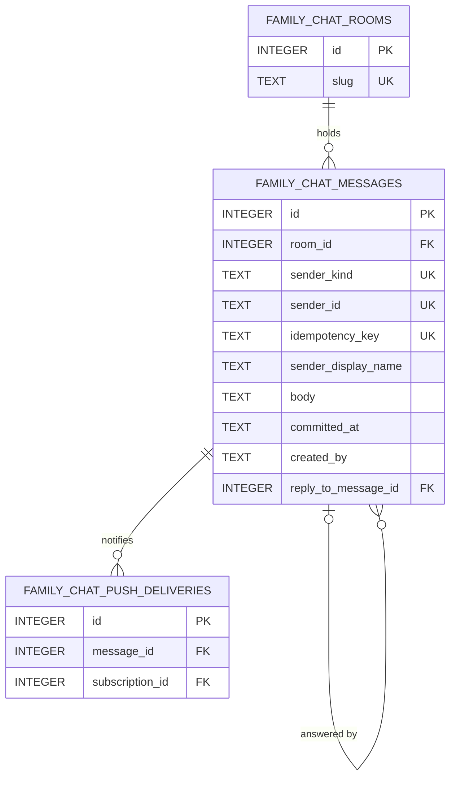

# Data Model and Migration Contract

## The Decision

A reply is stored as **one nullable self-reference** on `family_chat_messages`. Nothing is copied, and no second table
is introduced.

```sql
ALTER TABLE family_chat_messages
  ADD COLUMN reply_to_message_id INTEGER REFERENCES family_chat_messages(id);

CREATE INDEX family_chat_messages_reply_to
  ON family_chat_messages(reply_to_message_id)
  WHERE reply_to_message_id IS NOT NULL;
```

### Why a reference and not a snapshot

WhatsApp and Signal both denormalize the quote — Signal's `DataMessage.Quote` carries `text` and attachment thumbnails
alongside the `id`, and WhatsApp's `ContextInfo` embeds an entire `quotedMessage`. That is a correct choice **for
them**: in an end-to-end encrypted, multi-device protocol there is no server-side plaintext to join against, and a
freshly linked device may never have received the original at all.

Bnest has the opposite situation, and copying their shape would import a cost without the reason for it:

1. **There is nothing to desync from.** `family_chat_messages` carries a `BEFORE UPDATE` trigger that aborts every
   update and a `BEFORE DELETE` trigger that aborts every delete. A referenced row can never change and can never
   disappear. The entire class of defect that snapshots exist to prevent is already prevented by the schema.
2. **A snapshot of the sender name would be wrong.** `sender_display_name` is stamped at commit time and is
   deliberately **not** trusted at read time — `FamilyChat.live_sender_display_name/2` resolves the current account
   name instead, because the stamped value cannot be corrected once written. A copied quote name would reintroduce
   exactly the staleness that resolution was added to fix, and it would be visibly inconsistent with the original
   bubble two rows above it.
3. **SQLite is the single authority.** The server joins at read time on the same connection that served the page.
   There is no federation boundary and no offline reader of committed history to serve.

Discord, Telegram, and Slack — all centralized, like Bnest — all use references, and Discord's API even documents the
tombstone case explicitly (`referenced_message: null` once the original is deleted). Bnest cannot reach that case, but
if a delete or hide feature is ever added, a reference is the shape that can grow a tombstone; a snapshot is the shape
that silently keeps showing text the author retracted.

### What this costs

One extra read per page to resolve the quotes, and a hard dependency on the immutability triggers staying in place. If
a future plan ever relaxes them, that plan inherits the obligation to define tombstone rendering here. This document is
the record that the obligation exists.

## Field Guide

Every column of `family_chat_messages` **as it will exist after this change**, not only the new one. The DDL remains
authoritative for types and constraints; this guide is for intent and lifecycle, which a column name cannot carry.

| Column                | Type      | Key | Null | Purpose, shape, and lifecycle                                                                                                                                                                                                                                                     |
| --------------------- | --------- | --- | ---- | --------------------------------------------------------------------------------------------------------------------------------------------------------------------------------------------------------------------------------------------------------------------------------- |
| `id`                  | `INTEGER` | PK  | no   | `AUTOINCREMENT` surrogate key and the room's **ordering key** — history paging is keyset over it, so it is never reused and never renumbered.                                                                                                                                     |
| `room_id`             | `INTEGER` | FK  | no   | The owning `family_chat_rooms.id`. Written once at commit; v1 always `1`.                                                                                                                                                                                                         |
| `sender_kind`         | `TEXT`    |     | no   | `user` or `system`. Decides whose identity the sender columns hold and whether the sender's own devices are excluded from push.                                                                                                                                                   |
| `sender_id`           | `TEXT`    |     | no   | For `user`, the authenticated account id, server-resolved, never client-supplied. For `system`, the trusted producer key.                                                                                                                                                         |
| `sender_display_name` | `TEXT`    |     | no   | The name **stamped at commit time**. Deliberately not trusted at read time for user senders — see the read path below — because the append-only triggers make it uncorrectable. A `system` sender keeps it.                                                                       |
| `idempotency_key`     | `TEXT`    | UQ* | no   | The browser's `clientMessageId` (a UUID) for users, or the producer key for system messages. Unique with `room_id`, `sender_kind`, `sender_id`; this is what makes a retried send return the first commit.                                                                        |
| `body`                | `TEXT`    |     | no   | Normalized plain text: trimmed, `\r\n` collapsed to `\n`, 1–4,000 graphemes and at most 16 KiB. Never HTML, never Markdown.                                                                                                                                                       |
| `committed_at`        | `TEXT`    |     | no   | ISO-8601 UTC instant the row was committed. Display timezone is the reader's; the stored value is always UTC.                                                                                                                                                                     |
| `created_by`          | `TEXT`    |     | no   | Audit actor for the insert. The only audit column this table carries, by the event-log exemption below.                                                                                                                                                                           |
| `reply_to_message_id` | `INTEGER` | FK  | yes  | **New.** The `family_chat_messages.id` this message answers; `NULL` means not a reply. Written once at commit and never changed or cleared, because the row cannot be updated. Always strictly less than this row's own `id`. Sensitive only insofar as the body it points at is. |

`UQ*` marks a composite unique constraint rather than a single-column one.

No column in this table is ever updated, cleared, or deleted after commit; the lifecycle of every field above is
"written once at commit, then read". That is enforced by trigger, not by convention.

Rules the application enforces, in this order, before any insert is attempted:

1. Absent or `NULL` — an ordinary message. No further check.
2. Present — it must parse as a positive integer, or the send is rejected as `VALIDATION_FAILED`.
3. It must name a row that exists **in the same room** as the message being sent, or the send is rejected as
   `VALIDATION_FAILED`. Cross-room references are refused even though only one room exists in v1: the column outlives
   the single-room assumption, and a check added later is a check that was missing in between.
4. No depth, chain, or cycle check is performed, because none is reachable. A row can only reference a row that already
   existed when it was inserted, and `id` is a monotonically increasing `AUTOINCREMENT` key, so `reply_to_message_id`
   is always strictly less than `id`. Cycles and self-references are impossible by construction, not by validation.

## Audit Columns

`family_chat_messages` is exempt from the [audit-column convention](../../../../repo-governance/conventions/database-audit-columns.md)
as an append-only event log, and remains so. This change adds no `updated_*` or `deleted_*` column, and must not: the
`BEFORE UPDATE` trigger would abort any write that tried to use them.

## Foreign-Key Enforcement

SQLite only enforces `REFERENCES` when `PRAGMA foreign_keys` is on, and that pragma is per-connection. The application
must not rely on it: rule 3 above is the real guard, and it runs in Elixir before the insert. The `REFERENCES` clause
is retained because it documents the relationship in the schema and because it is free.

Delivery verifies the actual pragma state on the shared `SqliteRepo` connection and records it, rather than assuming
either answer. If it is on, the constraint is a second line of defence. If it is off, nothing changes, because the
application check is the first one.

## Why `ALTER TABLE ADD COLUMN` Is Safe Here

- SQLite permits `ADD COLUMN` with a `REFERENCES` clause only when the column's default is `NULL`. It is.
- The immutability triggers are `BEFORE UPDATE` and `BEFORE DELETE`. `ALTER TABLE` is DDL and fires neither, so no
  table rebuild and no trigger suspension is needed.
- Every existing row acquires `NULL`, which reads as "not a reply". No backfill exists and none is needed.
- The operation rewrites the table header, not the rows, so it is constant-time regardless of history size.

## Transition Contract

### Source Inventory

One affected source: the `family_chat_messages` table in the authoritative SQLite database. Nothing is moved, copied,
normalized, or retired.

| Aspect         | Before                                                                                         | After                                                                |
| -------------- | ---------------------------------------------------------------------------------------------- | -------------------------------------------------------------------- |
| Location       | `family_chat_messages` in the server-managed SQLite database                                   | unchanged                                                            |
| Readers        | `FamilyChat.list_messages/3`, `Store.find_message/4`, the GraphQL message type, the backup job | the same, plus one batch quote lookup                                |
| Writers        | `Store.insert_message!/6` only                                                                 | `Store.insert_message!/7`, one additional bound value                |
| Accepted shape | nine columns, all written once                                                                 | ten columns, all written once                                        |
| Owner          | the `familychat` backend component                                                             | unchanged                                                            |
| Compatibility  | —                                                                                              | a revision without the column reads and writes the other nine        |
| Disposition    | —                                                                                              | every existing row retained unchanged, with `NULL` in the new column |

No private value from this table is copied into the plan, the assets, or any fixture.

### Expand

Add the column, then the partial index. Both are additive; a revision that does not know the column continues to read
and write every other column unchanged, which is what makes the compatibility release in
[Release](006-file-impact-and-release.md) possible. This is the whole of the forward schema change.

### Migrate

**Not applicable, and that is the point.** No existing row is read, copied, transformed, or rewritten. Every historical
message acquires `NULL` from the `ALTER TABLE` itself, which is the correct value for "not a reply". There is no
backfill to be idempotent about, no identity to preserve across a copy, and no malformed source to preserve opaquely —
because nothing is being moved. Recorded explicitly so a reader can tell a migration that was considered and found
unnecessary from one that was forgotten.

### Verify

Three layers, in the order the convention names them:

1. **Through the normal product flow**, not through an adapter: a member sends a reply at the routed origin and both
   members read it back, which exercises writer, reader, and quote resolution end to end. Row counts and schema
   presence are explicitly insufficient.
2. **Mixed-version boundary**: the compatibility revision is proven to serve a browser holding the previous bundle,
   and the rollback floor is proven to serve the reply-aware bundle. Both are delivery items, not assumptions.
3. **Restore rehearsal from the immutable recovery source**: the existing whole-database restore drill is re-run and
   extended by one assertion — a restored database's replies still resolve their quotes. The recovery source is the
   existing daily `prod-sqlite-backup-daily` snapshot; this plan creates no second backup path.

**Rollback reader and writer behaviour.** On a rollback to a revision without the column, writers simply omit it and
readers never select it; rows written with a reply target keep it, invisible until a forward revision is routed again.
No data is lost by rolling back, which is why the rollback floor is a real floor rather than a one-way door.

**Retry behaviour.** A send rejected for an impossible reply target is `VALIDATION_FAILED`, which is already
non-retryable, so the outbox reports it rather than spending a retry budget. A send interrupted mid-flight retries on
the same `clientMessageId` and returns the first commit.

### Contract

Compatibility is retained indefinitely by this plan: the column stays nullable, the argument stays optional, and
nothing is removed. The only scheduled contraction is retiring `BNEST_FAMILY_CHAT_REPLY_ENABLED` after the rollback
window, which is deferred to a later explicitly authorized plan rather than performed here.

**Reverse.** The existing family-chat migration refuses to reverse once feature rows exist, and this one follows that
precedent with a narrower condition:

```sql
SELECT COUNT(*) FROM family_chat_messages WHERE reply_to_message_id IS NOT NULL
```

A non-zero count raises and the migration stops. Reversing would silently discard links the family created, and a
migration that destroys user data to tidy a schema is not a rollback.

A zero count drops the index and then the column. `ALTER TABLE ... DROP COLUMN` needs SQLite 3.35 or newer. Delivery
verifies the bundled version through `exqlite` and records it **before** writing the down path; if the runtime is
older, the down path instead raises with that reason, and the documented rollback is the release-level one — roll the
routed revision back to the compatibility floor, which tolerates the column being present.

## Read Path

Quote resolution belongs to `BnestApp.FamilyChat`, not to the GraphQL layer, matching the existing rule that the
resolver holds no query logic.

- **A page of messages.** `FamilyChat.list_messages/3` collects the distinct non-null `reply_to_message_id` values in
  the page, issues **one** `SELECT ... WHERE id IN (?)` for them, and attaches a `:reply_to` map to each node. One
  extra query per page, never one per message, and never a query at all for a page with no replies.
- **A single message** (mutation result, subscription payload, idempotent replay). One lookup, or none.
- **The quote's own sender name** is resolved live at the GraphQL type layer through `Identity.display_name_for/1`,
  exactly as the message's own `sender_display_name` already is. The store returns the stamped name; the type layer
  replaces it. A system sender keeps its stamped `"System"`.

The quoted row's **body preview** is truncated in the context, not in the browser and not in CSS:

- newlines and runs of whitespace collapse to single spaces, so a quote is always one logical line;
- the result is cut to **160 graphemes** by `String.length/1` and `String.slice/3`, never by byte count;
- when a cut occurred, a single `…` is appended, so a reader can tell a short message from a shortened one.

160 graphemes bounds a 50-message page at roughly 8 KB of quote text instead of the 200 KB a page of full 4,000-
grapheme bodies would permit, and it keeps the truncation rule in one tested place instead of three rendering paths.

## What Happens If the Original Is Gone Anyway

The triggers make this unreachable through any supported path, so this section is not a feature. It states what the
system does in a state it should never be in, because "impossible" is a claim about today's schema and the code will
outlive it. A dangling `reply_to_message_id` can arise from a later migration dropping the triggers, from a manual SQL
repair, or from a delete feature added without reading this document.

**The behaviour is defined, not emergent.** The batch lookup is `SELECT ... WHERE id IN (?)`. A missing row is simply
not returned, so `:reply_to` stays nil, `replyTo` resolves to `null`, and the browser renders the reply as an ordinary
message. Nothing raises, nothing 500s, and the room keeps working — the link stays in the column, only the rendering
of it disappears.

That is the right failure. It is also a **silent** one, and silence is what turns an impossible state into one nobody
discovers. Two obligations follow:

1. A unit test pins the degradation, so it is a decision rather than a side effect of how `IN` behaves. Without the
   test, a later change to batch loading could turn the same state into a crash, and no one would notice which
   behaviour was intended.
2. A future plan that makes deletion reachable must replace this silence with a tombstone before it ships — Discord's
   `referenced_message: null` convention is the directly transferable shape. Rendering nothing is acceptable only
   while the state is unreachable. Once it is reachable, a reply that quietly stops showing what it answers is worse
   than one that says the original is gone.

## Entity Relationship



`UK` on `sender_kind`, `sender_id`, and `idempotency_key` marks one composite unique constraint together with
`room_id`, not three separate ones.

The self-relationship is optional on both sides: a message need not answer anything, and a message need not be
answered. Depth is unbounded in storage and flattened to one level in every rendering path — see
[Interaction and Accessibility](004-interaction-and-accessibility.md).
