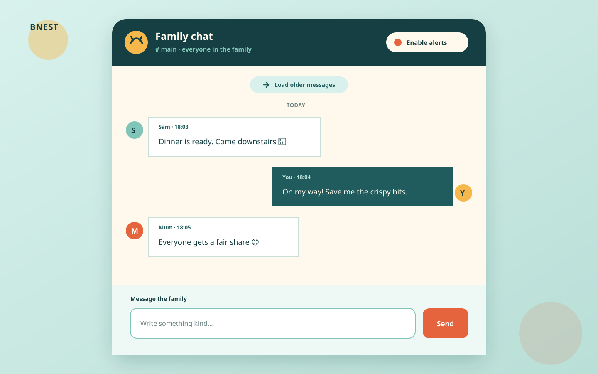

# Family Chat Room

## Status

**In progress — materially revised plan; product delivery has not started.** This documentation-only amendment performs
no application code, migration, dependency, deployment, or production-data change. Integrating these plan documents does
not authorize product delivery; that begins only after the separately authorized quality and execution checkpoints in
[`delivery.md`](delivery.md).

## Outcome

Bn​est gains the hierarchy **Family Chat → Room**. Version one exposes the single seeded room **Ruang Keluarga** at
`/family-chat/ruang-keluarga`; `/family-chat` redirects there. Every UI-facing backend operation uses authenticated
GraphQL query, mutation, or subscription operations. The browser persists unacknowledged sends in a per-user,
per-room IndexedDB outbox and resumes them after reconnect or app reopen without storing committed history offline.

The data model, service boundaries, URL, and GraphQL arguments name rooms from the first release so a later plan can
create rooms automatically without migrating an unscoped message log. Version one has no room creation or switcher.

## Scope Boundary

Included: authenticated family access; the seeded `ruang-keluarga` room; plain-text permanent messages; user and system
sender identities; SQLite authority; GraphQL HTTP and Phoenix-socket subscriptions; keyset history; post-commit room
events; a 100-record IndexedDB outbox per user and room; reconnect/catch-up/deduplication; per-device Web Push;
seven-day active plus seven-day soft-deleted delivery-record retention; full-database daily backup at 01:00 WIB;
capacity preflight and restore proof; split backend/frontend specifications and E2E projects; accessible responsive UI;
documentation; and two-stage no-downtime production release.

Excluded: room CRUD or switcher, calendar UI or producer, attachments, rich text, Markdown, link previews, edits,
deletion, reactions, threads, mentions, presence, typing, read receipts, unread badges, search, moderation, message
retention, offline transcript access, Background Sync, and a public system-message mutation.

## Locked Product Decisions

| Decision              | Selected contract                                                                                                                                                      |
| --------------------- | ---------------------------------------------------------------------------------------------------------------------------------------------------------------------- |
| Domain hierarchy      | Family Chat → Room                                                                                                                                                     |
| Canonical room        | `id = 1`, slug `ruang-keluarga`, name `Ruang Keluarga`, kind `conversation`                                                                                            |
| Route                 | `/family-chat/ruang-keluarga`; `/family-chat` redirects there                                                                                                          |
| UI backend boundary   | GraphQL only at `/api/graphql` and authenticated `/api/graphql/socket`                                                                                                 |
| History               | Permanent; latest 50 and keyset pages of at most 50                                                                                                                    |
| Offline send          | IndexedDB outbox, 100 records per user/room, seven-day expiry, no Background Sync                                                                                      |
| Reconnect             | Subscribe first, query after last committed ID, dedupe by server ID, then drain FIFO                                                                                   |
| Notification payload  | Sender display name plus a 120-grapheme preview                                                                                                                        |
| Push delivery records | Final rows active 7 days, soft-deleted 7 more days, then purged                                                                                                        |
| Backup                | One complete SQLite backup through `prod-sqlite-backup-daily` at 01:00 WIB (`18:00 UTC`)                                                                               |
| Release               | Compatibility then experience; Caddy reload closes prior-slot sockets immediately, clients reconnect/catch up, and the warm prior slot retires after five-minute proof |

## Selected UI Direction

The selected **Family hearth** direction keeps one chronological room central and quiet. Its updated mockups show **Ruang
Keluarga**, an offline banner, and message states **Waiting for connection**, **Sending**, **Retrying in …**, **Sent**, and
**Couldn’t send**. The composer remains anchored, history grows upward, and no empty room switcher is shown.

See [UI Design](tech-docs/005-ui-design.md) for the alternatives, responsive behavior, offline states, and selected set.

## Reading Order

1. [Business Requirements](brd.md) — why this is worth doing.
2. [Product Requirements](prd.md) — what must be observably true.
3. [Technical Documentation](tech-docs/README.md) — how the system, data, API, UI, tests, and operations fit together.
4. [Delivery](delivery.md) — the exact implementation and proof sequence.
5. [Learnings](learnings.md) — planning evidence and later execution discoveries.

## Dependencies and Authority

- Bnest identity, authoritative SQLite, persistent Scheduler, loopback Caddy, Tailscale HTTPS, and PWA shell remain.
- `bnest-app` remains the production owner and aggregates boundary-specific specs under `specs/apps/bnest/app-be/` and
  `specs/apps/bnest/app-fe/`.
- Absinthe owns GraphQL execution and Phoenix subscriptions. Every runnable slot uses the code-owned subscription
  `pool_size: 8`, but blue/green registries stay independent; Caddy reconnect plus SQLite catch-up bridges cutover.
- SQLite and catch-up queries are authoritative. PubSub, subscriptions, Web Push, and IndexedDB are delivery/recovery
  mechanisms, never committed-history authorities.
- Scheduler handlers call public Backup or Push Notifications services. Scheduler and release adapters never access
  backup or family-chat tables directly.

## Directory Map

- [`assets/`](assets/README.md) — responsive design artifacts.
- [`brd.md`](brd.md) — business need, outcomes, rules, risks, and measures.
- [`delivery.md`](delivery.md) — ordered TDD, release, evidence, recovery, and cleanup checklist.
- [`learnings.md`](learnings.md) — planning decisions and execution log.
- [`prd.md`](prd.md) — user stories, acceptance scenarios, constraints, and non-goals.
- [`tech-docs/`](tech-docs/README.md) — ordered technical contracts.
