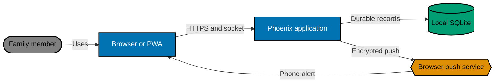
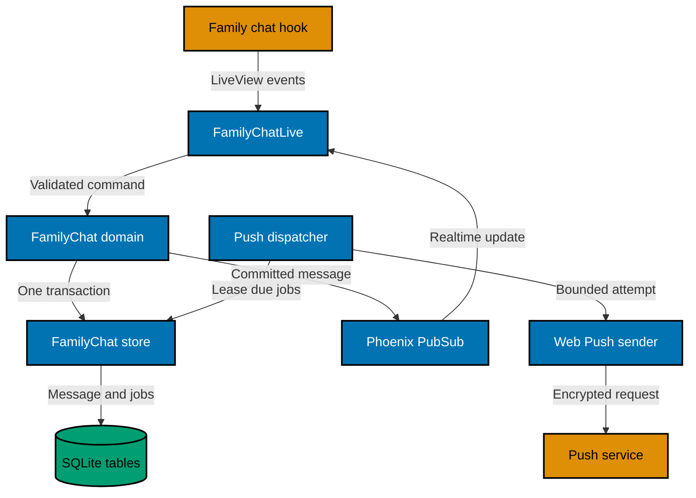

# Architecture and Data Flow

## Current State

Bn​est is one Phoenix/LiveView application behind Tailscale Serve and loopback Caddy. Approved accounts authenticate
through an opaque-cookie browser session. User-owned chat currently means the private Codex conversation at `/chat`;
there is no family-to-family message domain, shared transcript, realtime family broadcast, or Web Push dispatcher.

SQLite is authoritative for identity, user-owned records, schedules, and backup state. `Phoenix.PubSub` is already
supervised. The current service worker installs a shell and caches every successful GET, including navigation responses;
the family-chat release must narrow that policy before it can safely handle shared family content.

## Target Context

The push service is transport, never storage authority. Notification payloads use RFC 8291 encryption and VAPID
authentication. The message remains available even when subscription creation, egress, provider acceptance, or OS
display fails.

## Component View

## Owned Components

### `BnestApp.FamilyChat`

Owns message validation, idempotent command behavior, channel lookup, recipient selection, pagination contracts, and the
commit-before-broadcast rule. It accepts the authenticated account from the server boundary; it never accepts an author
ID or display name from browser parameters.

### `BnestApp.FamilyChat.Store`

Owns all SQL for channels, messages, subscriptions, and outbox deliveries. It uses `BnestApp.SqliteRepo` and explicit
transactions. It exposes typed operations rather than adding family-chat records to the generic `bnest_records` JSON
facade, because ordered range queries, foreign keys, partial indexes, and leased work are relational concerns.

### `BnestAppWeb.FamilyChatLive`

Owns the protected `/family-chat` page, assigns the current authenticated user, subscribes to one channel topic, renders
the chronological window, handles validated LiveView events, and delegates scrolling/Push API access to browser hooks.
It does not own persistence, ordering, or retry state.

### `BnestApp.PushNotifications.Dispatcher`

Runs under supervision, reconciles due and expired-leased delivery rows, and starts bounded attempts under a dedicated
`Task.Supervisor`. Two blue/green application slots may run it concurrently; SQLite claim updates decide ownership.

### `BnestApp.PushNotifications.Sender`

Maps one active subscription and one prepared payload into the selected Web Push library plus the existing Req transport.
It classifies provider outcomes but never decides retry timing or writes SQLite directly.

### Browser hooks and service worker

The family-chat hook owns stable client message IDs, scroll anchoring, near-bottom detection, notification feature
detection, permission requests, Push API subscription JSON, and LiveView event bridging. The service worker owns static
shell caching, `push`, and `notificationclick`; it does not read authenticated state or cache transcripts.

## Interfaces

### Protected route

`GET /family-chat` joins the existing authenticated LiveView session. Every approved role is allowed. Logged-out access
uses the existing safe return path to `/login`. `BnestApp.Identity.Authorization` treats `use_family_chat` as a shared
capability: `children`, `parents`, `admin`, or a valid combination is allowed with `owner_id = nil`; malformed roles,
unknown capabilities, and any non-nil owner are denied. It is not added to the self-owned capability list.

`UserAuth.fetch_current_user/2` computes `Session.digest/1` from the opaque identity token and stores only that digest in
the signed, HTTP-only Phoenix session used by LiveView. The raw token never becomes a LiveView assign, DOM value, event
parameter, or log field. The LiveView uses the server-provided digest when binding a subscription; browser input cannot
select a session or user.

### LiveView client events

| Event                     | Required input                     | Result                                                                           |
| ------------------------- | ---------------------------------- | -------------------------------------------------------------------------------- |
| `send_message`            | `client_message_id`, `body`        | Commit or return a safe validation/storage error                                 |
| `load_older`              | current oldest integer `before_id` | Prepend at most 50 older rows                                                    |
| `enable_notifications`    | PushSubscription JSON              | Bind the endpoint to current user and browser session                            |
| `disable_notifications`   | none                               | Soft-deactivate every active binding for the current server-owned session digest |
| `notification_capability` | supported/install/permission state | Render truthful device-specific guidance                                         |

Every identifier is validated server-side. Unknown keys, malformed or unapproved endpoint URLs, keys outside Web Push
shapes, stale history cursors, and user-supplied ownership fields are rejected without logging their values or making a
network request. The exact endpoint egress policy is owned by the Web Push privacy companion.

### PubSub contract

- Topic: `family_chat:channel:<channel-id>`.
- Event: `{:message_created, public_message}` after the database transaction commits.
- `public_message` contains only message ID, channel ID, author ID, author display snapshot, body, and created-at time.
- Subscribers deduplicate by message ID because subscribe-then-query and reconnect can observe the same commit twice.

### Runtime configuration

The release receives `BNEST_WEB_PUSH_PUBLIC_KEY`, `BNEST_WEB_PUSH_PRIVATE_KEY`, and `BNEST_WEB_PUSH_SUBJECT`. Deployment
reads the key values from machine-local mode-restricted files named by
`BNEST_DEPLOY_WEB_PUSH_PUBLIC_KEY_FILE` and `BNEST_DEPLOY_WEB_PUSH_PRIVATE_KEY_FILE`; the subject is a validated
`mailto:` or `https:` value. Production readiness fails closed when any value is missing or malformed. Development may
run chat with push reported unavailable; tests inject deterministic adapters and never send non-loopback traffic.

## End-to-End Message Flow

1. The browser retains a UUID for the current submission and sends it with plain text.
2. LiveView resolves the authenticated account and calls the domain; browser ownership values are ignored.
3. One SQLite transaction inserts or finds the idempotent message and inserts one delivery row per active subscription
   belonging to another user.
4. After commit, the domain broadcasts the public message. The sender clears the accepted draft and creates the next
   UUID; connected recipients append the message by integer ID.
5. Dispatchers lease due rows. A task sends an encrypted preview and records delivered, retryable, or terminal state.
6. The service worker shows a notification with a deterministic tag. Activation focuses an existing Bnest client or
   opens `/family-chat`.

## Trust and Failure Boundaries

- Authentication precedes all room and subscription operations; logout follows the explicit deactivation ordering below.
- Logout computes the current digest and soft-deactivates its subscriptions before identity revocation or cookie
  clearing. If that SQLite step fails, logout returns a generic retry message and leaves the authenticated browser
  session intact; the UI never claims logout succeeded while a binding remains targetable.
- SQLite transaction success is the acknowledgement boundary. PubSub and Push are downstream effects.
- A failed broadcast is recovered by a recipient's authoritative reload; a failed push is recovered only within the
  bounded outbox policy.
- A provider `2xx` means accepted by the provider, not displayed by the device.
- Logs and health expose only generic states, counts, durations, and failure categories.
- Push egress is restricted to reviewed browser-provider hosts and never follows redirects; a subscription URL is
  untrusted input even though it came from an authenticated browser.
- The prior Bnest release ignores the additive tables. The new release never requires the prior slot to understand them.
