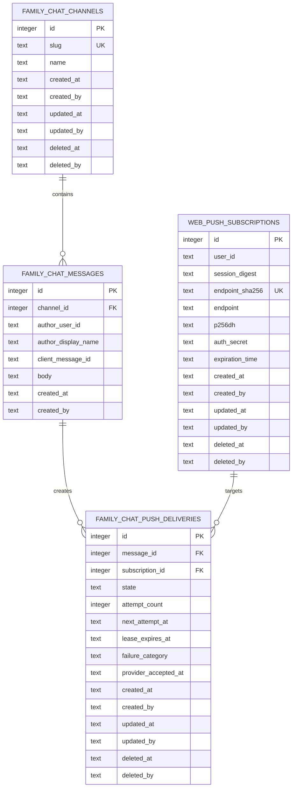

# Data Model and Migration Contract

## Relational Model



## Migration Identity

Create `apps/bnest-app/priv/sqlite_repo/migrations/20260918000000_add_family_chat.exs`. It is additive and safe while
the prior release continues serving. Its `up/0` creates all four tables, indexes, immutable-message triggers, and the
`main` seed in one migration transaction.

The seed is deterministic:

- `id = 1`
- `slug = "main"`
- `name = "Main"`
- audit actor `system:migration`
- the migration's one UTC timestamp is used for both created and updated values

`INSERT OR IGNORE` is allowed only with a following exact-value verification. An existing row with ID or slug collision
but different content fails migration verification.

## Exact Schema Contract

```sql
CREATE TABLE family_chat_channels (
  id INTEGER PRIMARY KEY,
  slug TEXT NOT NULL,
  name TEXT NOT NULL,
  created_at TEXT NOT NULL,
  created_by TEXT NOT NULL,
  updated_at TEXT NOT NULL,
  updated_by TEXT NOT NULL,
  deleted_at TEXT,
  deleted_by TEXT,
  CHECK (length(slug) BETWEEN 1 AND 64),
  CHECK (length(name) BETWEEN 1 AND 80),
  CHECK ((deleted_at IS NULL) = (deleted_by IS NULL))
);

CREATE UNIQUE INDEX family_chat_channels_active_slug
  ON family_chat_channels(slug) WHERE deleted_at IS NULL;

CREATE TABLE family_chat_messages (
  id INTEGER PRIMARY KEY AUTOINCREMENT,
  channel_id INTEGER NOT NULL REFERENCES family_chat_channels(id),
  author_user_id TEXT NOT NULL,
  author_display_name TEXT NOT NULL,
  client_message_id TEXT NOT NULL,
  body TEXT NOT NULL,
  created_at TEXT NOT NULL,
  created_by TEXT NOT NULL,
  UNIQUE(author_user_id, client_message_id),
  CHECK (length(author_user_id) BETWEEN 1 AND 128),
  CHECK (length(author_display_name) BETWEEN 1 AND 32),
  CHECK (length(client_message_id) BETWEEN 1 AND 64),
  CHECK (length(CAST(body AS BLOB)) BETWEEN 1 AND 16384)
);

CREATE INDEX family_chat_messages_channel_id
  ON family_chat_messages(channel_id, id DESC);

CREATE TRIGGER family_chat_messages_no_update
BEFORE UPDATE ON family_chat_messages
BEGIN SELECT RAISE(ABORT, 'family chat messages are immutable'); END;

CREATE TRIGGER family_chat_messages_no_delete
BEFORE DELETE ON family_chat_messages
BEGIN SELECT RAISE(ABORT, 'family chat messages are permanent'); END;

CREATE TABLE web_push_subscriptions (
  id INTEGER PRIMARY KEY AUTOINCREMENT,
  user_id TEXT NOT NULL,
  session_digest TEXT NOT NULL,
  endpoint_sha256 TEXT NOT NULL,
  endpoint TEXT NOT NULL,
  p256dh TEXT NOT NULL,
  auth_secret TEXT NOT NULL,
  expiration_time TEXT,
  created_at TEXT NOT NULL,
  created_by TEXT NOT NULL,
  updated_at TEXT NOT NULL,
  updated_by TEXT NOT NULL,
  deleted_at TEXT,
  deleted_by TEXT,
  CHECK (length(session_digest) = 64),
  CHECK (length(endpoint_sha256) = 64),
  CHECK (length(endpoint) BETWEEN 1 AND 2048),
  CHECK (length(p256dh) BETWEEN 1 AND 256),
  CHECK (length(auth_secret) BETWEEN 1 AND 128),
  CHECK ((deleted_at IS NULL) = (deleted_by IS NULL))
);

CREATE UNIQUE INDEX web_push_subscriptions_active_endpoint
  ON web_push_subscriptions(endpoint_sha256) WHERE deleted_at IS NULL;

CREATE UNIQUE INDEX web_push_subscriptions_active_session
  ON web_push_subscriptions(user_id, session_digest) WHERE deleted_at IS NULL;

CREATE TABLE family_chat_push_deliveries (
  id INTEGER PRIMARY KEY AUTOINCREMENT,
  message_id INTEGER NOT NULL REFERENCES family_chat_messages(id),
  subscription_id INTEGER NOT NULL REFERENCES web_push_subscriptions(id),
  state TEXT NOT NULL CHECK (state IN ('pending','claimed','retryable','delivered','terminal')),
  attempt_count INTEGER NOT NULL CHECK (attempt_count BETWEEN 0 AND 5),
  next_attempt_at TEXT,
  lease_expires_at TEXT,
  failure_category TEXT,
  provider_accepted_at TEXT,
  created_at TEXT NOT NULL,
  created_by TEXT NOT NULL,
  updated_at TEXT NOT NULL,
  updated_by TEXT NOT NULL,
  deleted_at TEXT,
  deleted_by TEXT,
  UNIQUE(message_id, subscription_id),
  CHECK ((deleted_at IS NULL) = (deleted_by IS NULL)),
  CHECK ((state = 'claimed') = (lease_expires_at IS NOT NULL)),
  CHECK (state IN ('pending','retryable') OR next_attempt_at IS NULL)
);

CREATE INDEX family_chat_push_deliveries_due
  ON family_chat_push_deliveries(state, next_attempt_at, lease_expires_at, id)
  WHERE deleted_at IS NULL;
```

The application additionally enforces trimmed non-empty text and a 4,000-grapheme limit before the byte-level database
constraint. SQLite cannot express Unicode grapheme length truthfully.

## Field Guide

### `family_chat_channels`

- `id`: stable integer primary key referenced by messages; `1` is reserved for `main`.
- `slug`: URL-safe lower-case product identity; unique only among active rows.
- `name`: user-visible channel name.
- audit columns: complete mutable-row history under the repository audit convention. V1 does not expose mutation.

### `family_chat_messages`

- `id`: authoritative server ordering and pagination cursor. Client clocks never order messages.
- `channel_id`: required channel owner.
- `author_user_id`: authenticated account identifier captured by the server.
- `author_display_name`: immutable display snapshot so history remains intelligible if account presentation changes.
- `client_message_id`: browser-generated UUID retained through one submission/reconnect; unique per author.
- `body`: UTF-8 plain text after CRLF-to-LF normalization; never rendered as HTML or Markdown.
- `created_at`: second-precision ISO-8601 UTC commit time.
- `created_by`: `user:<author_user_id>`.

Messages are an append-only log and therefore exempt from `updated_*` and `deleted_*`. The migration states the exemption
and enforces it with update/delete triggers. Correction requires a future compensating-message design, not mutation.

### `web_push_subscriptions`

- `user_id`: current authenticated owner; never accepted from the browser.
- `session_digest`: SHA-256 digest of the owning opaque browser session. Logout soft-deactivates only bindings for this
  session, preserving independent devices and browser sessions.
- `endpoint_sha256`: lower-case SHA-256 identity used for uniqueness and safe comparison; it may appear only where values
  remain private, never in committed evidence.
- `endpoint`: secret capability URL supplied by `PushSubscription`.
- `p256dh` and `auth_secret`: Web Push encryption material; secret and value-redacted everywhere outside SQLite.
- `expiration_time`: nullable browser-supplied ISO-8601 UTC time after validated conversion from epoch milliseconds.
- audit columns: create/update/soft-delete actor and time. User actions use `user:<id>`; provider retirement uses
  `system:web-push`.

### `family_chat_push_deliveries`

- `message_id` and `subscription_id`: immutable fan-out identity; the unique pair prevents duplicate jobs.
- `state`: lifecycle from pending/claimed to delivered or terminal.
- `attempt_count`: increments atomically when a lease is acquired, never when a row is merely scanned.
- `next_attempt_at`: next eligible UTC time for pending/retryable rows, calculated by adding the next fixed wait to the
  recorded failure time; the waits are not absolute offsets from message creation.
- `lease_expires_at`: bounded ownership for a claimed row; another slot may recover only after expiry.
- `failure_category`: allowlisted value such as `network`, `rate_limited`, `provider_5xx`, `gone`, `provider_4xx`,
  `attempt_limit`, or `age_limit`; never response bodies.
- `provider_accepted_at`: set only for provider `2xx`.
- audit columns: created by the message actor, updated by `system:web-push`. V1 retains terminal rows; deletion is not part
  of this plan.

## Transaction Contracts

### Send

1. Begin one SQLite transaction.
2. Resolve active `main`; reject missing or ambiguous seed.
3. Look up `(author_user_id, client_message_id)`.
4. If present, return the existing row without creating new deliveries.
5. Otherwise insert the message, select all active non-sender subscriptions, and insert one pending delivery per row.
6. Commit; only then return and broadcast.

Any failure rolls back both message and deliveries. Zero target subscriptions is a successful message transaction.

### Subscribe, disable, and logout

- Enabling performs one transaction after pure validation: enforce the code-owned provider policy, soft-deactivate any
  other active binding for `(user_id, session_digest)`, then insert or reactivate the submitted endpoint for that same
  server-owned pair.
- **Turn off** soft-deactivates all active rows for `(user_id, session_digest)`; it accepts no browser-owned user/session
  selector.
- Logout computes the digest from the presented opaque token and completes the same session deactivation before calling
  identity revocation and clearing either cookie. If deactivation fails, the request returns a generic retry state and
  preserves the authenticated session. This ordering is the cross-store fail-closed boundary.

### Claim

Within one immediate transaction, select the oldest due or expired-claimed row and conditionally update it to `claimed`,
increment `attempt_count`, set a bounded lease, clear `next_attempt_at`, and set `updated_by = 'system:web-push'`. Return
work only when one row changed. Concurrent slots repeat until no row is claimable.

### Complete or fail

Only the matching delivery ID, attempt number, and `claimed` state may transition. A stale task records nothing. Provider
`2xx` becomes delivered; `404/410` becomes terminal and soft-deactivates the subscription in the same transaction; other
terminal `4xx` becomes terminal; retryable failures receive the next fixed wait unless attempts or age reached the
ceiling.

## Expand, Verify, and Rollback

### Expand

- Add tables, indexes, triggers, and seed without changing an existing table or reader.
- Generalize release migration orchestration so all DDL runs once under the existing exclusive storage lock, then each
  feature verifier checks its exact objects and seed.
- The old release remains compatible because it neither references nor writes these tables.

### Verify

- Check the migration version, all object names, trigger SQL presence, foreign-key enforcement, partial indexes, and exact
  `main` seed.
- Open a fresh application process on an isolated migrated database, make any flat source unavailable, and exercise
  message insert, pagination, subscription, outbox claim, retry, restart, and read-back through normal boundaries.
- Run `PRAGMA quick_check` and an isolated backup/restore read suite; do not rely on row counts alone.

### Rollback and contraction

Application rollback to the prior compatible release is allowed because the schema is additive. The migration `down/0`
must refuse if any message, subscription, or delivery exists; an empty test-only schema may reverse in foreign-key-safe
order. Production table or message deletion is out of scope and requires a separately authorized contraction plan.
