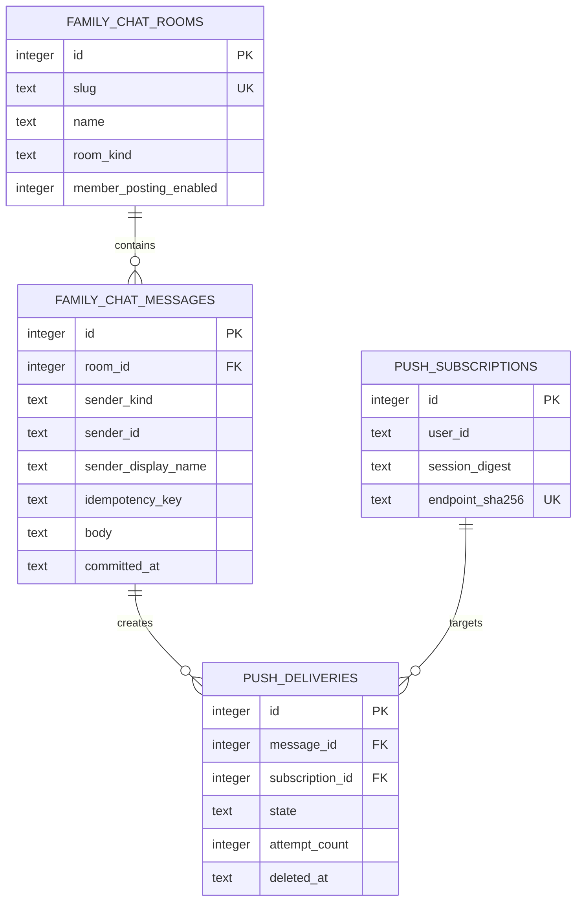

# Data Model and Migration Contract

## Relational Model



## Migration and Seed

The authoring audit inspected the live migration inventory and locked the currently unused additive migration path
`20260918000000_add_family_chat.exs`. Before creation, execution rechecks current `origin/main`; if that timestamp has
since collided, it records a File Impact deviation and selects the next valid timestamp before any migration edit. The
migration creates `family_chat_rooms`, `family_chat_messages`, `web_push_subscriptions`, and
`family_chat_push_deliveries`, their indexes and immutable-message triggers, plus the disabled retention schedule seed.

The canonical room seed is exact:

| Field                    | Value              |
| ------------------------ | ------------------ |
| `id`                     | `1`                |
| `slug`                   | `ruang-keluarga`   |
| `name`                   | `Ruang Keluarga`   |
| `room_kind`              | `conversation`     |
| `member_posting_enabled` | `1`                |
| audit actor              | `system:migration` |

The retention schedule seed is disabled during mixed-version overlap. The existing
`prod-sqlite-backup-daily` row is not replaced and no chat-only backup row is created. After compatible code is active,
the public Scheduler service reconciles both fresh and existing backup schedules to `daily_at_utc = 18:00` once. Later
operator changes remain valid and are not overwritten by ordinary startup.

The exact retention seed is:

| Field              | Value                              |
| ------------------ | ---------------------------------- |
| `schedule_key`     | `family-chat-push-retention-daily` |
| `handler_key`      | `family_chat_push_retention`       |
| `schedule_context` | `admin_system`                     |
| `cadence`          | `daily`                            |
| `daily_at_utc`     | `17:15` (00:15 WIB)                |
| `enabled`          | `0` until compatible-slot drain    |
| expiration         | `never`                            |
| `revision`         | `1`                                |

`INSERT OR IGNORE` is permitted only when followed by exact-value verification. A colliding room or retention schedule
with different immutable identity fails migration verification. Runtime verification allows only Scheduler-owned
lifecycle fields to differ. The backup-time migration is an explicit release reconciliation tied to this compatibility
revision, not a startup loop: it force-updates `prod-sqlite-backup-daily` once through Scheduler, records the resulting
revision in sanitized release evidence, and never reapplies after an operator later edits the schedule.

## Schema Contract

```sql
CREATE TABLE family_chat_rooms (
  id INTEGER PRIMARY KEY,
  slug TEXT NOT NULL,
  name TEXT NOT NULL,
  room_kind TEXT NOT NULL CHECK (room_kind IN ('conversation')),
  member_posting_enabled INTEGER NOT NULL CHECK (member_posting_enabled IN (0, 1)),
  created_at TEXT NOT NULL,
  created_by TEXT NOT NULL,
  updated_at TEXT NOT NULL,
  updated_by TEXT NOT NULL,
  deleted_at TEXT,
  deleted_by TEXT,
  CHECK (length(slug) BETWEEN 1 AND 64),
  CHECK (length(name) BETWEEN 1 AND 80),
  CHECK ((deleted_at IS NULL) = (deleted_by IS NULL))
);

CREATE UNIQUE INDEX family_chat_rooms_active_slug
  ON family_chat_rooms(slug) WHERE deleted_at IS NULL;

CREATE TABLE family_chat_messages (
  id INTEGER PRIMARY KEY AUTOINCREMENT,
  room_id INTEGER NOT NULL REFERENCES family_chat_rooms(id),
  sender_kind TEXT NOT NULL CHECK (sender_kind IN ('user', 'system')),
  sender_id TEXT NOT NULL,
  sender_display_name TEXT NOT NULL,
  idempotency_key TEXT NOT NULL,
  body TEXT NOT NULL,
  committed_at TEXT NOT NULL,
  created_by TEXT NOT NULL,
  UNIQUE(room_id, sender_kind, sender_id, idempotency_key),
  CHECK (length(sender_id) BETWEEN 1 AND 128),
  CHECK (length(sender_display_name) BETWEEN 1 AND 80),
  CHECK (length(idempotency_key) BETWEEN 1 AND 128),
  CHECK (length(CAST(body AS BLOB)) BETWEEN 1 AND 16384)
);

CREATE INDEX family_chat_messages_room_id
  ON family_chat_messages(room_id, id DESC);

CREATE TRIGGER family_chat_messages_no_update
BEFORE UPDATE ON family_chat_messages
BEGIN SELECT RAISE(ABORT, 'family chat messages are immutable'); END;

CREATE TRIGGER family_chat_messages_no_delete
BEFORE DELETE ON family_chat_messages
BEGIN SELECT RAISE(ABORT, 'family chat messages are permanent'); END;

CREATE TABLE web_push_subscriptions (
  id INTEGER PRIMARY KEY AUTOINCREMENT,
  user_id TEXT NOT NULL,
  session_digest TEXT NOT NULL,
  endpoint_sha256 TEXT NOT NULL,
  endpoint TEXT NOT NULL,
  p256dh TEXT NOT NULL,
  auth_secret TEXT NOT NULL,
  expiration_time TEXT,
  created_at TEXT NOT NULL,
  created_by TEXT NOT NULL,
  updated_at TEXT NOT NULL,
  updated_by TEXT NOT NULL,
  deleted_at TEXT,
  deleted_by TEXT,
  CHECK (length(session_digest) = 64),
  CHECK (length(endpoint_sha256) = 64),
  CHECK (length(endpoint) BETWEEN 1 AND 2048),
  CHECK (length(p256dh) BETWEEN 1 AND 256),
  CHECK (length(auth_secret) BETWEEN 1 AND 128),
  CHECK ((deleted_at IS NULL) = (deleted_by IS NULL))
);

CREATE UNIQUE INDEX web_push_subscriptions_active_endpoint
  ON web_push_subscriptions(endpoint_sha256) WHERE deleted_at IS NULL;

CREATE UNIQUE INDEX web_push_subscriptions_active_session
  ON web_push_subscriptions(user_id, session_digest) WHERE deleted_at IS NULL;

CREATE TABLE family_chat_push_deliveries (
  id INTEGER PRIMARY KEY AUTOINCREMENT,
  message_id INTEGER NOT NULL REFERENCES family_chat_messages(id),
  subscription_id INTEGER NOT NULL REFERENCES web_push_subscriptions(id),
  state TEXT NOT NULL CHECK (state IN ('pending','claimed','retryable','delivered','terminal')),
  attempt_count INTEGER NOT NULL CHECK (attempt_count BETWEEN 0 AND 5),
  next_attempt_at TEXT,
  lease_expires_at TEXT,
  failure_category TEXT,
  provider_accepted_at TEXT,
  created_at TEXT NOT NULL,
  created_by TEXT NOT NULL,
  updated_at TEXT NOT NULL,
  updated_by TEXT NOT NULL,
  deleted_at TEXT,
  deleted_by TEXT,
  UNIQUE(message_id, subscription_id),
  CHECK ((deleted_at IS NULL) = (deleted_by IS NULL)),
  CHECK (deleted_at IS NULL OR state IN ('delivered','terminal')),
  CHECK ((state = 'claimed') = (lease_expires_at IS NOT NULL)),
  CHECK (state IN ('pending','retryable') OR next_attempt_at IS NULL)
);

CREATE INDEX family_chat_push_deliveries_due
  ON family_chat_push_deliveries(state, next_attempt_at, lease_expires_at, id)
  WHERE deleted_at IS NULL;

CREATE INDEX family_chat_push_deliveries_retention
  ON family_chat_push_deliveries(updated_at, id)
  WHERE deleted_at IS NULL AND state IN ('delivered','terminal');

CREATE INDEX family_chat_push_deliveries_purge
  ON family_chat_push_deliveries(deleted_at, id)
  WHERE deleted_at IS NOT NULL;
```

Immutable triggers reject message update/delete. Messages are append-only event records and are exempt from mutable-row
update/delete audit columns; `created_by` records `user:<stable-id>` or `system:<stable-id>`. Room, subscription, and
delivery tables carry the repository's full audit columns. The existing push subscription and delivery constraints from
the earlier plan remain, including unique message/subscription fan-out, leases, attempt ceiling, soft deletion, and
retention indexes.

## Field Semantics

- `room_id` is always resolved from an authorized slug; v1 uses ID 1 but callers never hard-code it as authorization.
- `sender_kind` distinguishes current authenticated users from internal trusted producers.
- `sender_id` is a stable server-side account or producer identifier, never browser-selected.
- `sender_display_name` is an immutable display snapshot.
- `idempotency_key` is the browser's `clientMessageId` for users and a producer-owned stable key for system messages.
- `committed_at` is the UTC commit time. Integer `id` remains the only ordering and cursor authority.

## Send Transactions

### User message

1. Resolve and authorize the active room.
2. Validate posting enabled, normalized text, 4,000 graphemes, 16 KiB, and UUID shape.
3. Look up `(room_id, 'user', current_user_id, client_message_id)`.
4. Return the existing row unchanged when found, even if the retried body differs.
5. Otherwise insert the message and one delivery row for each active non-sender subscription in one transaction.
6. Commit, return, then publish the subscription event.

### System message

`post_system_message/…` performs the same transaction with a stable internal producer identity and idempotency key. It
does not accept a browser session and is not reachable from GraphQL. Recipient selection includes every active user
subscription because a system sender has no user-owned device.

### Subscription upsert and disable

- Parse and validate the complete endpoint/key input before opening a transaction. Derive `user_id`, `session_digest`,
  endpoint digest, and audit actor server-side.
- In one transaction, soft-deactivate any other active binding for `(user_id, session_digest)`, then insert/reactivate the
  validated endpoint for that pair. Endpoint ownership moving between users is explicit rebind behavior after the old
  session is disabled; it is never inferred from a user ID in input.
- Disable selects only `(current_user_id, current_session_digest)`, sets both deletion audit fields, and returns disabled
  even when already disabled.
- Logout completes server deactivation before identity revocation. If deactivation fails, the authenticated session
  remains so the user can retry; partial logout is not reported as success.

### Delivery claim and transition

An immediate transaction selects the oldest due `pending`/`retryable` row or an expired `claimed` row, conditionally
updates it to `claimed`, increments `attempt_count`, sets a two-minute lease, clears `next_attempt_at`, and returns work
only when one row changed. Completion compares delivery ID, attempt number, and `claimed` state so a stale task cannot
overwrite a recovered attempt. Provider `2xx` becomes `delivered`; `404/410`, redirects, and terminal `4xx` become
`terminal`; retryable classes set the next fixed push time unless the five-attempt or one-hour ceiling is reached.

## IndexedDB Outbox

Database name and schema version are code-owned (`bnest-family-chat-outbox`, version 1). One record contains only:

- a namespace key (`${userId}:${roomSlug}`), client message UUID, normalized body;
- created time, next-retry time, attempt number, retry count, and current local status;
- a `neverSucceed` test-only flag, never a server body, cookie, token, or endpoint.

A transaction counts the active (non-`Sent`) records in a namespace before insert and refuses record 101.
Acknowledgement deletes exactly that record. Logout deletes every record in the current namespace. Records older than
seven elapsed days become manual-only; they are not silently deleted or automatically retried.

Committed messages, room lists, subscriptions, and GraphQL responses are never stored in IndexedDB or Cache Storage.

**As built** (`persistence_indexeddb.js`, landed with the real cross-reload binding in Phase 9 — see delivery.md): one
object store, `queuedMessages`, keyed by the single string `${namespace}::${clientMessageId}` rather than a compound
array key, with one index, `namespace` (on the namespace field alone), used both to load a room's queue and to delete
every record on logout. FIFO ordering is achieved by the shared in-memory `Map`'s insertion order after `loadAll`
repopulates it, not by a dedicated `createdAt`-ordered index — this repository has no scenario exercising enough
concurrent queued messages across a reload for that distinction to be observable, so the simpler single-index schema
was kept rather than adding the originally-planned `byUserRoomCreated`/`byUser` compound indexes. Times are UTC epoch
milliseconds from an injected clock.

Every status transition (`outbox_send.js`'s `notify`, the queue's single write-through point) persists the message's
current status, including the transient `Sending` and `Sent` values — not only `Waiting for connection`, `Retrying in
…`, and `Couldn't send` as originally planned. In practice this is safe: a tab killed mid-send leaves a `Sending` row
on disk, and `resumeOnOpen` does not special-case it — since it falls through to the same retry path a `Waiting`
row takes, a resumed send is simply retried, achieving the "does not believe a request is still in flight" outcome the
original design called for by a different mechanism. A `Sent` row is deleted on the same tick it is written
(`scheduleDeletion`'s zero-delay timer), so it is visible on disk only for a moment; a hard crash landing in that
exact window would leave an orphaned `Sent` row that `resumeOnOpen` explicitly skips deleting on the next load (a
known, low-probability, low-severity residual noted in `learnings.md`'s Resolution Ledger — not fixed here as part of
Phase 9 documentation reconciliation).

The namespace is derived from the authenticated user's server-issued account ID (via `family_chat.js`'s `userId`) and
the room slug, concatenated as plain text rather than a cryptographic hash. This still satisfies the non-reversibility
requirement below: the ID is a stable, non-secret, server-issued discriminator, never the cookie, token, display name,
or another reversible serialization of private identity. Database open/upgrade is blocked until identity is known. An
unknown schema version fails closed and leaves the composer draft unsent.

## Delivery Retention

Final `delivered` and `terminal` rows remain active for seven elapsed days from completion, then are soft-deleted in
ascending-ID batches. Rows soft-deleted for seven more days are purged. `pending`, `claimed`, and `retryable` rows are
reported by aggregate category but never age-purged. The public Push Notifications service fixes cutoffs once per run;
the Scheduler handler contains no family-chat SQL.

Each retention run fixes `active_cutoff` and `purge_cutoff` from one injected UTC instant. It processes ascending IDs in
batches of at most 250 and one short immediate transaction per batch. A batch smaller than 250 terminates the stage;
new concurrent rows cannot enter the fixed eligible set. The result returns only aggregate `soft_deleted`, `purged`, and
`stale_nonfinal` counts. Repeating after scheduler retry is idempotent.

## Disk Model

Assumptions: 200 messages/day, 1 KiB average body, 2 KiB effective message-plus-index cost, eight devices, seven
recipient delivery rows per message, 1 KiB per delivery row, and a 14-day delivery footprint.

| Horizon             |        Live chat increment |          Seven backups |                 Peak during snapshot |
| ------------------- | -------------------------: | ---------------------: | -----------------------------------: |
| Year 1              |     approximately 0.17 GiB |  approximately 1.2 GiB | approximately 1.8 GiB; reserve 2 GiB |
| Year 3              |     approximately 0.45 GiB |  approximately 3.2 GiB | approximately 4.3 GiB; reserve 5 GiB |
| Stress at 2,000/day | approximately 3.8 GiB/year | approximately 26.6 GiB | approximately 34 GiB; reserve 36 GiB |

These are chat-only increments. If the current database is `B0`, the same-volume peak is estimated as
`9 × (B0 + chat_live) + WAL + 256 MiB`: live database, seven retained snapshots, one in-progress snapshot, WAL, and fixed
headroom. Release records actual file bytes, page count, page size, WAL bytes, destination capacity, and the derived
guard before backup. A failed guard stops before `VACUUM INTO`.

## Expand, Verify, and Rollback

- **Expand:** additive tables, indexes, triggers, exact room seed, disabled retention seed, GraphQL/schema/socket, and
  dormant UI. The prior release ignores all new objects.
- **Verify:** exact objects and seed; foreign keys; idempotent user/system insert; pagination; retention; isolated restart;
  `PRAGMA quick_check`; whole-backup restore; and no production data access.
- **Rollback:** application rollback retains additive tables and messages. Before code without a new handler can claim,
  disable that schedule through Scheduler. Destructive down migration refuses after any feature row exists.

## Restore Proof

Restore never opens the live database. Copy the verified artifact into an isolated marked root, open it with a fresh
application process, run `PRAGMA quick_check`, verify schema migration versions and exact room seed, then read structural
examples through Family Chat, Push Notifications, and Scheduler service interfaces. Evidence may record counts, IDs from
synthetic fixtures, state categories, checksums, and schedule time; it must not record message body, endpoint, key,
session digest, private path, or production user information. Cleanup removes only the marked restore root and fails the
gate if any owned file remains.
