# UI Design

## User and Job

The user is an authenticated family member, including children. Their primary job is to enter one shared room, recognize
who said what, read the newest conversation, write a short message, and move upward for older context. Notification setup
is secondary and must not dominate the conversation.

The visual language remains Beaver Nest's playful workshop: firm ink outlines, paper surfaces, lagoon framing, one sun
action color, and coral reserved for attention. The design avoids both a corporate Slack clone and a copy of the Codex
chat, whose model and repository controls do not belong here.

## Real Product Copy

- Home entry: **Family chat** / **Talk with everyone at home**
- Page title: **Family chat**
- Channel label: **Main**
- Empty state: **Start the family conversation.** / **Messages from everyone at home will appear here.**
- Composer label: **Message the family**
- Placeholder: **Write a message**
- Primary action: **Send**
- History terminal: **Beginning of family chat**
- Live arrival control: **New messages below**
- Notification actions: **Enable notifications**, **Notifications on**, **Turn off**
- Validation: **Write a message first.** / **Keep messages under 4,000 characters.**
- Storage error: **Your message was not saved. Keep it here and try again.**

## Design Tokens

| Token    | Value     | Use                                       |
| -------- | --------- | ----------------------------------------- |
| Ink      | `#153f42` | Text, outlines, own-message surface       |
| Soft ink | `#205c5d` | Secondary text and timestamps             |
| Canvas   | `#d8f1ec` | Page field                                |
| Paper    | `#fff9ed` | Conversation and incoming-message surface |
| Sun      | `#f7b84b` | Send and new-message actions              |
| Coral    | `#e5633d` | Focus and notification attention          |
| Lagoon   | `#80c5b8` | Composer and structural separation        |

Typography reuses `--bnest-display` for the page/channel identity and `--bnest-body` for messages and controls. Message
measure remains below 70 characters on wide screens. Body size never falls below 1rem; metadata never falls below
0.78rem. Existing asymmetric radii identify speech without adding decorative avatars.

## Lo-fi Alternatives

### Alternative A — Family hearth (selected)

One centered conversation panel treats the transcript as the room itself. The compact header contains home identity,
`Main`, and notification status. Messages occupy the flexible middle; the composer anchors the bottom. Desktop preserves
a generous canvas, while mobile becomes edge-to-edge.

```text
+----------------------------------+
| Beaver Nest   Main   Notify      |
|----------------------------------|
|          older messages          |
| Sam  Dinner is ready             |
|                  Great, coming!  |
|----------------------------------|
| Message the family        Send   |
+----------------------------------+
```

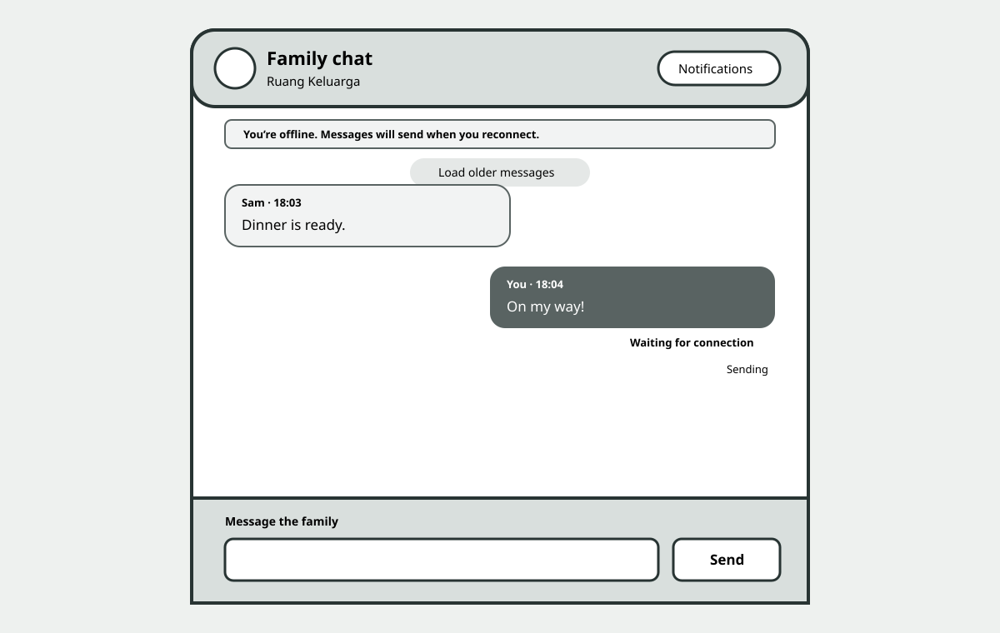
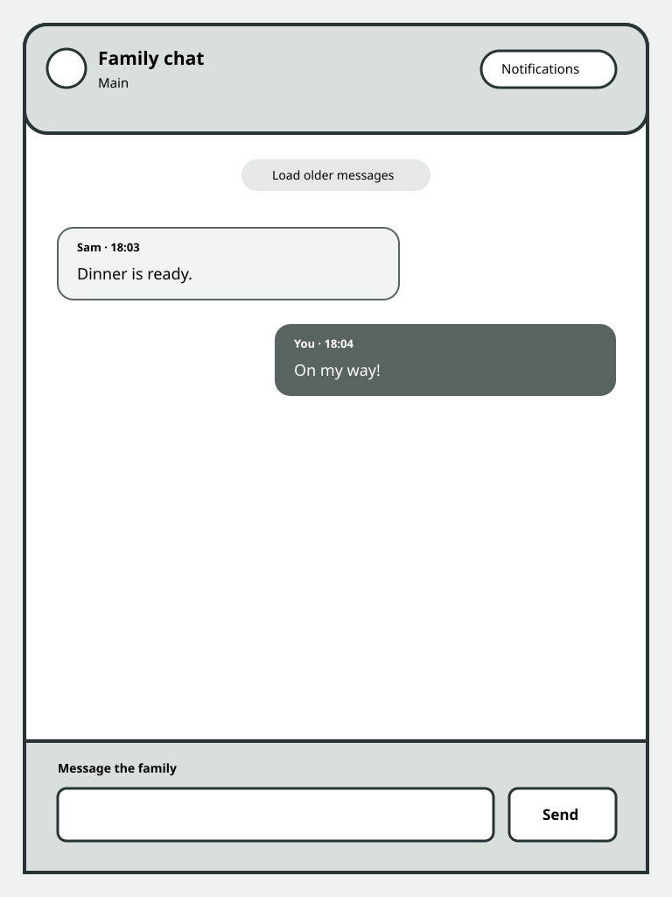
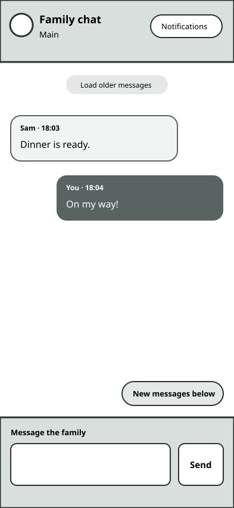

### Alternative B — Channel rail (not selected)

A left rail reserves visible space for channels even though only `Main` exists. It communicates future direction but
creates an empty navigation promise, shrinks the conversation on tablets, and adds a mobile drawer without current value.

```text
+-----------+----------------------+
| Channels  | Main                 |
| # Main    | messages             |
|           |                      |
|           | composer             |
+-----------+----------------------+
```

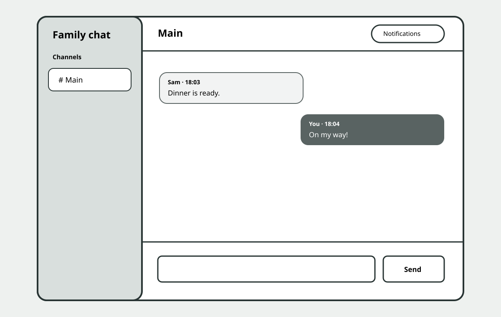
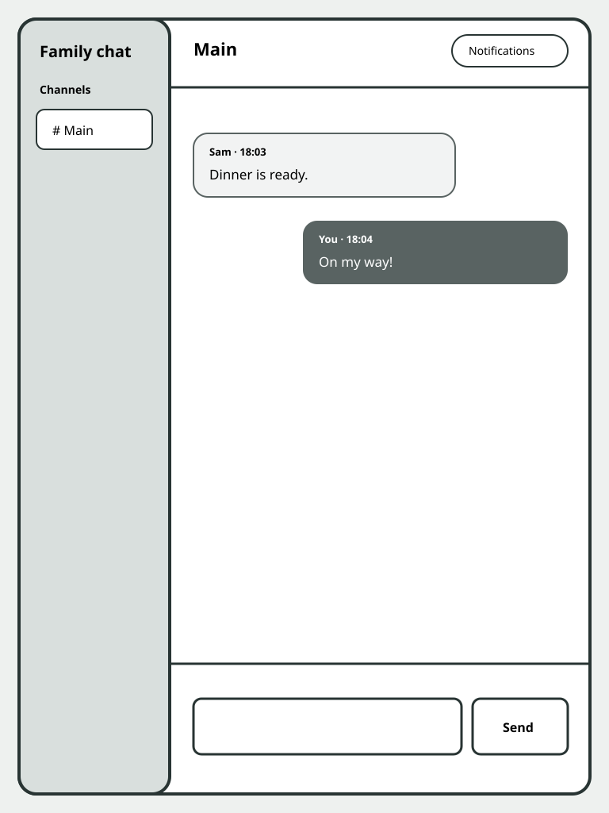
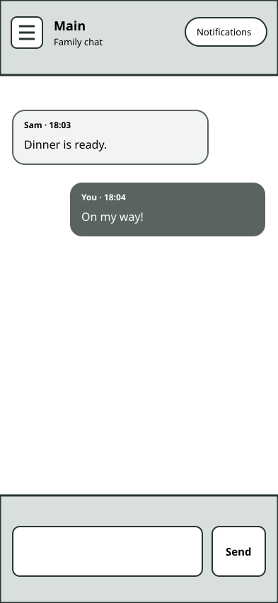

### Alternative C — Message ledger (not selected)

A dense full-width ledger aligns sender, timestamp, and body in rows. It is efficient for scanning long history but feels
administrative, makes short family conversation less conversational, and performs poorly for child users and narrow
screens.

```text
+----------------------------------+
| Main                     Notify  |
| 18:03 Sam  Dinner is ready       |
| 18:04 Mia  Great, coming!        |
|----------------------------------|
| Write a message           Send   |
+----------------------------------+
```

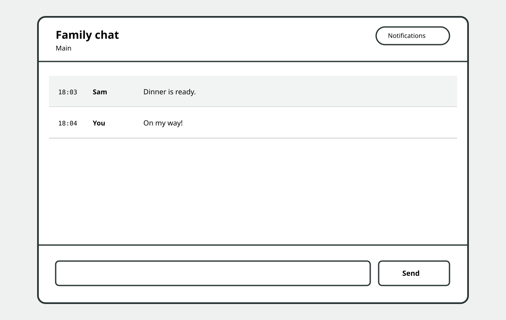
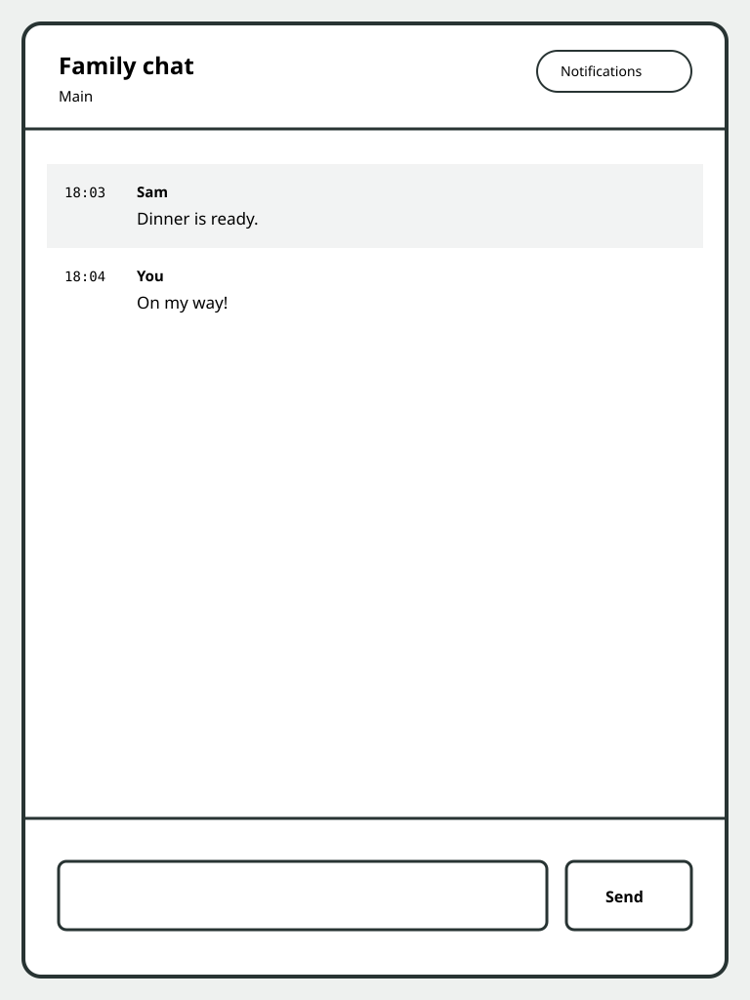
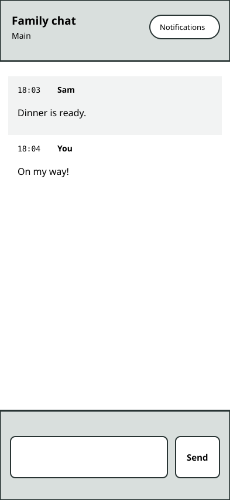

## Comparison and Selection

| Dimension           | Family hearth                      | Channel rail                     | Message ledger                      |
| ------------------- | ---------------------------------- | -------------------------------- | ----------------------------------- |
| One-channel clarity | Strong; only real controls appear  | Weak; empty future navigation    | Strong                              |
| Child usability     | Familiar conversation rhythm       | Extra navigation concept         | Dense metadata-first rows           |
| Future channels     | Header can gain a switcher later   | Already visible                  | Requires later navigation           |
| Mobile              | Natural edge-to-edge panel         | Drawer or wasted space           | Sender/body columns collapse poorly |
| Accessibility       | Simple landmarks and reading order | Drawer focus management required | Repetitive row metadata             |
| Implementation cost | Lowest honest v1                   | Highest                          | Medium                              |
| Product fit         | Warm family room                   | Workplace tool                   | Audit/history tool                  |

**Selected: Family hearth.** Its one memorable element is the strong conversation frame; the rest stays quiet. It does
not spend v1 complexity on a fictional channel list. The `Main` identity remains explicit, so a later channel switcher
can replace the static label without changing the timeline.

## Selected Hi-fi Direction


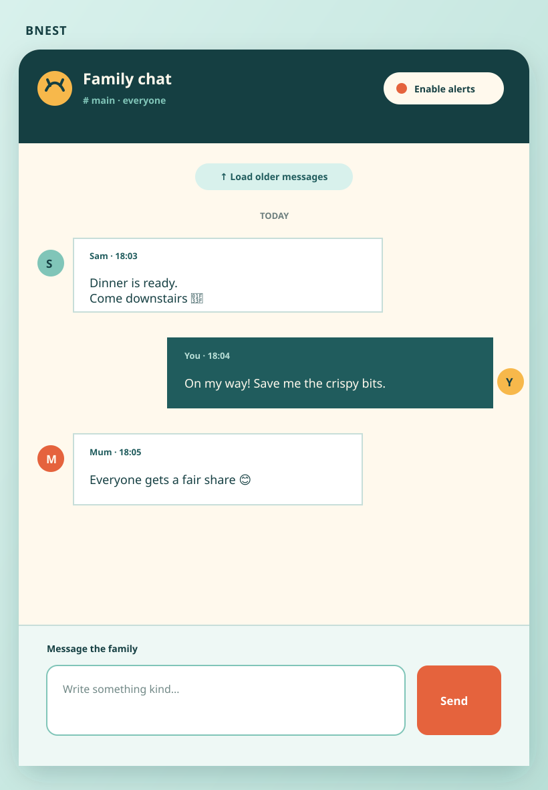
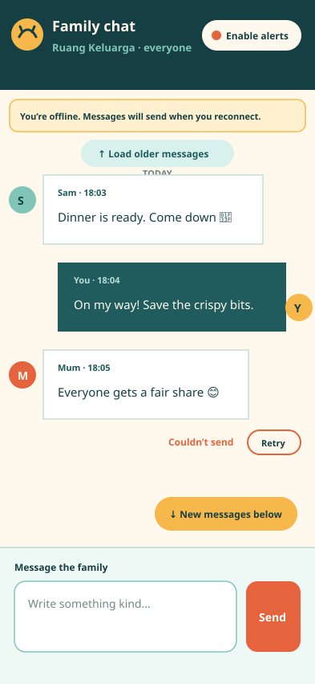

## Responsive Behavior

### Desktop — 1280×800 and wider

- Center one panel at a maximum width of 48rem and a minimum useful height of `calc(100vh - 4rem)`.
- Keep header identity/channel on the left and notification control on the right.
- Limit bubbles to 78% of the transcript width and preserve readable measure.
- Composer uses a flexible textarea plus fixed Send button.

### Tablet — 768×1024

- Use a panel within 1rem outer gutters; allow the notification control to wrap below identity.
- Keep the composer two-column while 44×44 CSS-pixel target sizes remain possible.
- Bubble maximum width increases to 84%.

### Mobile — 393×852 down to 320 CSS pixels

- Remove outer border/radius and use the viewport as the room.
- Keep a compact sticky header and sticky composer within safe-area insets.
- Stack textarea and Send button only below 360 CSS pixels; otherwise retain the compact side action.
- Bubble maximum width is 90%; timestamps and sender remain readable without horizontal scrolling.

## States

- **Loading:** panel shell and composer frame remain stable; transcript announces loading without skeleton animation.
- **Empty:** centered invitation plus available composer; no fake messages.
- **Populated:** incoming messages align left with paper/ink outline; the current user's messages align right on ink.
- **Loading older:** sentinel becomes a small progress status; existing rows remain interactive.
- **Beginning:** static history terminal replaces the sentinel.
- **New below:** sun-colored button floats immediately above the composer without covering messages.
- **Validation error:** inline alert adjacent to the composer; draft and focus remain.
- **Storage error:** explicit retry guidance, body and stable submission identity retained.
- **Notifications unavailable/blocked/install-required:** compact explanatory panel opened from the notification control.
- **Notifications enabled:** status text and Turn off action; never infer provider delivery success.

## Interaction Details

- Desktop Enter sends; Shift+Enter inserts a newline. IME composition never triggers send.
- The Send button is always present and is the only assumed mobile submission mechanism.
- Scroll-to-bottom occurs only when the user is already near the bottom or activates **New messages below**.
- Prepending history preserves the first visible message and never moves focus.
- A successful send clears the draft after the committed row is returned; errors retain it.
- Notification permission is requested only from **Enable notifications**.
- Non-user-triggered motion is limited to a short new-message-button entrance and is removed under reduced motion.

## Accessibility Contract

- `<main>` contains one labelled chat region, one transcript log, one notification-settings region, and one labelled form.
- The transcript uses `role="log"`, `aria-live="polite"`, and `aria-relevant="additions"`; loaded historical rows are not
  re-announced as new conversation.
- Sender and timestamp are text, not color-only distinctions. Own/incoming alignment is supplemental.
- Loading, validation, storage, notification, and new-message states use concise status or alert semantics.
- Focus order is home link, notification control, history fallback when present, new-message control when present,
  composer, Send.
- Visible focus uses coral with sufficient offset against every surface.
- Touch targets are at least 44×44 CSS pixels. Contrast, 200% zoom, forced text enlargement, reduced motion, and keyboard
  operation are verified at all three viewport classes.
- Theme behavior uses current Bnest tokens and is manually checked in both explicit light and dark modes.

## Exact Implementation and Proof Paths

Implementation is centered in `apps/bnest-app/lib/bnest_app_web/live/family_chat_live.ex`,
`apps/bnest-app/assets/js/family_chat.js`, and `apps/bnest-app/assets/css/app.css`. Browser behavior is specified in
`specs/apps/bnest/app/behaviours/family_chat.feature` and bound through the existing Bnest unit/integration and
`bnest-app-e2e` adapters. The complete path inventory is in
[File Impact, Dependencies, and Operations](007-file-impact-dependencies-and-operations.md).

Delivery requires automated assertions plus separate spec-aware exploratory and spec-blind usability passes at the exact
served origin. Static SVGs, source inspection, and automated geometry checks do not replace manual inspection.
