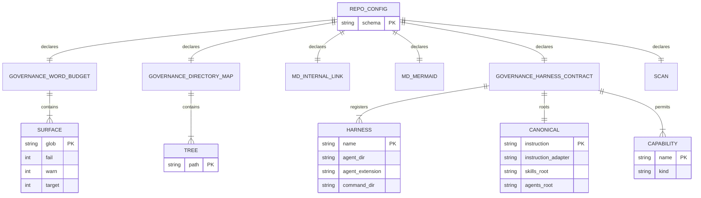

# Configuration Contract

This is the contract that makes RHINO generic. Every value Badakmini compiles in becomes a value the consuming repository declares. The tool ships no defaults for any of them: a repository that declares nothing gets a configuration error, never a borrowed assumption from BeaverNest.

## Current State

These are the constants to be moved, with their present locations. Nothing else in Badakmini is repository-specific.

| Constant                             | Present location                                         | Present value                                                                                            |
| ------------------------------------ | -------------------------------------------------------- | -------------------------------------------------------------------------------------------------------- |
| Governed word limit                  | `Governance.fs:59`                                       | `750`                                                                                                    |
| Word-budget scope                    | `Governance.fs:591-592`                                  | Root `AGENTS.md` and the `repo-governance` tree                                                          |
| Mapped trees                         | Nx `test:repo` arguments, default in `Governance.fs:844` | `repo-governance`, `docs`, `specs`, `plans`                                                              |
| Internal-link exclusion              | `Governance.fs:718`                                      | `plans/done/` as a source tree                                                                           |
| Scan exclusions                      | `Governance.fs:142-146`                                  | `node_modules` and siblings                                                                              |
| Mermaid label limits                 | `Governance.fs`                                          | 32 graphemes for node and state segments, 24 for edge and transition segments                            |
| Canonical instruction file           | `HarnessContract.fs:291-298`                             | `AGENTS.md`, with `CLAUDE.md` containing only `@AGENTS.md`                                               |
| Canonical skill and agent roots      | `HarnessContract.fs:344,716`                             | `.agents/skills`, `.agents/agents`                                                                       |
| Harness roster                       | `HarnessContract.fs:741-743`                             | `codex` → `.codex/agents/*.toml`, `claude` → `.claude/agents/*.md`, `opencode` → `.opencode/agents/*.md` |
| Claude command wrappers              | `HarnessContract.fs:380-385`                             | `.claude/commands/<skill>.md`                                                                            |
| Prohibited instruction sources       | `HarnessContract.fs:308-311`                             | Nested `AGENTS.md`, `AGENTS.override.md`, extra `CLAUDE.md`, `.claude/rules/**`                          |
| Capability and constraint vocabulary | `HarnessContract.fs:71-81`                               | The repository's known capability, deny, and constraint names                                            |
| Required MCP capability              | `HarnessContract.fs`                                     | The credential-free `npx nx mcp` vector rooted at the workspace                                          |

## File and Schema Identity

The file is `repo-config.yml` at the consuming repository's root, opening with a schema comment. `ose-public` uses `# repo-config.yml — schema: rhino-cli/repo-config/v1`; the standalone tool declares `rhino/repo-config/v1` and accepts the `rhino-cli/` spelling as an alias, so a future merge does not require every consumer to rewrite its first line on the same day.

Each section RHINO owns is named after the command path that reads it, with spaces replaced by hyphens: `governance word-budget validate` reads `governance-word-budget`, `md internal-link validate` reads `md-internal-link`. This is not invented — it is the rule `ose-public`'s existing `governance-word-budget` section already follows, made explicit so a reader can find a section from a command and vice versa. `scan` is the one exception, because it is cross-cutting and belongs to no single command.

Only the sections RHINO reads are defined here. `ose-public`'s file also carries `harness`, `env-contract`, `env-injection`, `gates`, and `model-grades` sections owned by other commands; RHINO ignores unknown top-level sections so the two can share one file, and rejects unknown keys _within_ the sections it owns so a typo in a policy value fails loudly.

## Record Model



Every entity above is owned by the consuming repository. RHINO owns only the shape.

## Schema

```yaml
# repo-config.yml — schema: rhino/repo-config/v1

governance-word-budget:
  surfaces:
    - glob: "AGENTS.md"
      fail: 750
    - glob: "repo-governance/**/*.md"
      fail: 750

governance-directory-map:
  trees:
    - path: repo-governance
    - path: docs
    - path: specs
    - path: plans

md-internal-link:
  exclude-sources:
    - "plans/done/**"

md-mermaid:
  node-label-graphemes: 32
  edge-label-graphemes: 24

governance-harness-contract:
  canonical:
    instruction: AGENTS.md
    instruction-adapter: CLAUDE.md
    skills-root: .agents/skills
    agents-root: .agents/agents
  harnesses:
    - name: codex
      agent-dir: .codex/agents
      agent-extension: .toml
    - name: claude
      agent-dir: .claude/agents
      agent-extension: .md
      command-dir: .claude/commands
    - name: opencode
      agent-dir: .opencode/agents
      agent-extension: .md
  prohibited-instruction-sources:
    - "**/AGENTS.md"
    - "**/AGENTS.override.md"
    - "**/CLAUDE.md"
    - ".claude/rules/**/*.md"
  capabilities: [...]
  constraints: [...]
  required-mcp:
    name: nx
    command: npx
    args: ["nx", "mcp"]

scan:
  exclude-directories:
    - node_modules
    - obj
    - bin
    - coverage
    - dist
    - .git
    - .nx
```

The `capabilities`, `constraints`, and `required-mcp` values are elided above because they are transcribed verbatim from `HarnessContract.fs:71-81` during delivery; inventing them here would create a second, wrong source of truth.

## Field Guide

**`schema`** — declared in the leading comment, not as a key, matching `ose-public`. Identifies the contract version. RHINO refuses a file whose schema it does not recognize rather than guessing at an older or newer shape.

**`governance-word-budget.surfaces[]`** — an ordered list. Each entry selects files by `glob`, relative to the repository root. Order matters: where two globs match one file, the _last_ matching entry wins, which is how `ose-public` lets a specific `**/README.md` surface override a general tree surface. Required; an empty list disables the validator rather than defaulting to a limit.

- `glob` — required. A path glob relative to the root. Not a regular expression.
- `fail` — required. The word count at which the file is a finding. Badakmini's behaviour is `>` this number is a violation, so `750` means 750 words pass and 751 fails.
- `warn` — optional. Reported, never gating. Omitted for BeaverNest, which has no advisory tier today; present in the schema because `ose-public` uses it and a shared file must round-trip.
- `target` — optional and purely advisory, same reason.

**`governance-directory-map.trees[]`** — the trees where every directory must contain a `README.md` with a complete `## Directory Map` of its direct siblings. Each entry's `path` is relative to the root. Required. The `--directory` flag overrides this list for a single invocation, which is how one tree is checked in isolation.

**`md-internal-link.exclude-sources[]`** — globs whose Markdown is not scanned _as a source of links_. Files under these globs remain valid link _targets_. BeaverNest excludes `plans/done/**` because archived plans deliberately reference paths that no longer exist. Optional; absent means every repository-owned Markdown file is a link source.

**`md-mermaid.node-label-graphemes`** and **`md-mermaid.edge-label-graphemes`** — the maximum visible label length per segment, counted in Unicode grapheme clusters after markup removal and entity decoding, with `<br>`, `<br/>`, and escaped newlines splitting segments. Both required. Which diagram kinds are enforced and which colour rules apply are tool behaviour, not policy, and stay in the binary.

**`governance-harness-contract.canonical.instruction`** — the single project-rule body every harness must reach. Required.

**`governance-harness-contract.canonical.instruction-adapter`** — the file permitted to contain nothing but an import of the instruction file. Required. RHINO derives the exact permitted content as `@<instruction>`, so this pair is what makes `CLAUDE.md` containing only `@AGENTS.md` legal and anything else a finding.

**`governance-harness-contract.canonical.skills-root`** / **`agents-root`** — the directories holding the one canonical skill bundle per skill and the one full agent prompt per agent. Required. Everything under a skill directory is part of that skill's hashed bundle.

**`governance-harness-contract.harnesses[]`** — the roster. Each entry must have exactly one native adapter per canonical agent, or it is a finding.

- `name` — required. Appears in finding output; also the key used to report which harness diverged.
- `agent-dir` — required. Where that harness's per-agent adapter files live.
- `agent-extension` — required. `.toml` for Codex, `.md` for Claude and OpenCode. This is what makes the roster extensible without a code change: adding a fourth harness is one entry.
- `command-dir` — optional. Only Claude has skill command wrappers today. When present, every canonical skill must have exactly one wrapper there mirroring its description and containing only the fixed canonical route.

**`governance-harness-contract.prohibited-instruction-sources[]`** — globs for competing always-on instruction sources. Matches are findings, with the declared canonical `instruction` and `instruction-adapter` paths implicitly exempt. Required; this is the instruction boundary, and defaulting it to empty would silently drop a rule.

**`governance-harness-contract.capabilities[]`** / **`constraints[]`** — the closed vocabulary of capability, deny, and constraint names an agent definition may use. An unknown name is a finding, which is what stops a typo from silently granting nothing. Required.

**`governance-harness-contract.required-mcp`** — the credential-free capability every harness must declare, compared semantically on executable vector and working directory rather than by raw vendor syntax. `name`, `command`, and `args` are required; no credential, token, or environment value may ever appear here, and RHINO rejects the file if one does.

**`scan.exclude-directories[]`** — directory _names_, matched at any depth, skipped by every scanner. Filesystem links and reparse points are always skipped regardless of this list, because following them can escape the repository. Required.

## Configuration Failure Behaviour

Missing file, unreadable file, unknown schema, unknown key inside an owned section, missing required key, a non-integer where an integer is required, or a path that escapes the repository root each produce exit code `2` with a message naming the offending key and its file position. None of these degrade to a partial run: a validator that silently skipped a tree because its configuration was malformed would report a clean repository that was never checked.

`rhino repo-config validate` performs exactly these checks and nothing else, so a configuration problem can be diagnosed without inferring it from a validator's behaviour.

## Migration Shape

This is an expand-migrate-verify-contract transition over configuration, per the [plan-migrations convention](../../../../repo-governance/conventions/plan-migrations.md).

1. **Expand.** BeaverNest gains `repo-config.yml` transcribing every constant in the table above. Badakmini still runs from its compiled values and is unaffected; the two sources now agree by construction.
2. **Migrate.** The pinned `rhino` binary reads the file and produces findings over the same repository.
3. **Verify.** A freshly started `rhino` process runs the full gate from the persisted file with `apps/badakmini-cli` deleted, so no fallback exists. Word counts are compared file by file first, because that gate's output is a number and a silent drift there would look like success.
4. **Contract.** Badakmini and its E2E project are removed, and every rule, document, target, and hook is repointed in the same change.

There is no compatibility window in which both validators gate pushes. A window like that has a specific failure mode — a contributor satisfying one validator while the other is authoritative — and a read-only validator with no persisted state gains nothing from it. Rollback is restoring the deleted projects and the previous hook from Git, not keeping a spare copy.
