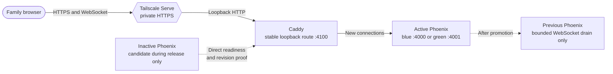
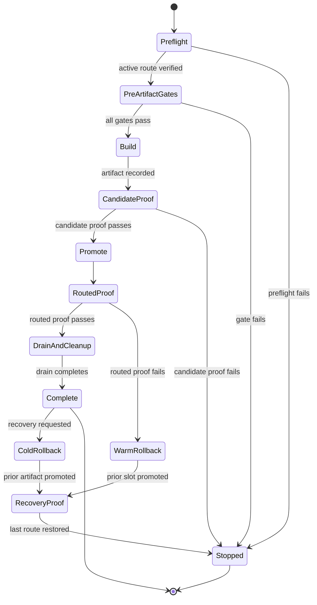
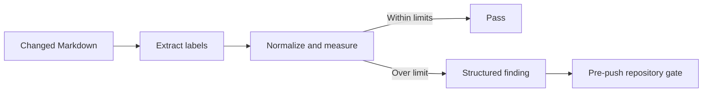

# Technical Documentation

## Reading Order

1. Read [current condition](#current-condition) for source-backed facts and observation boundaries.
2. Read [primary-source verification](#primary-source-verification) for current external contracts.
3. Read [recommendation and ranking](#recommendation-and-ranking) for the proposed direction.
4. Read [possible alternatives](#possible-alternatives) for the detailed comparison.
5. Use [deterministic release constraints](#deterministic-release-constraints) and [decision criteria](#decision-criteria) to validate the recommendation against the deferred live baseline.

## Current Condition

### Route and process lifecycle

The deployed route is deliberately independent from the Phoenix server. The inactive slot is not routed until it passes direct readiness and revision checks:



`apps/bnest-app/tools/deployment.mjs` owns that lifecycle. `proxy:install` installs a loopback Caddy LaunchAgent. `release:build` builds an immutable Phoenix release from an isolated temporary worktree and stores it under the machine-local deployment root. `deploy:prepare` starts the inactive slot as a LaunchAgent and waits up to 60 seconds for `/health/ready` to return the requested `X-Bnest-Revision`. `deploy:promote` validates a temporary Caddy configuration, gracefully reloads Caddy to the candidate, records active and previous slots/revisions, and verifies the Caddy route. `deploy:rollback` promotes the recorded previous slot only while that slot is still prepared and healthy; `deploy:retire` refuses to stop the active slot but removes the inactive LaunchAgent. After retirement, the current rollback command cannot start the retained artifact by itself. A cold rollback must deterministically run `deploy:prepare` for the recorded prior revision and inactive slot, prove readiness/revision, and then run `deploy:promote`.

The Caddy configuration has a five-minute `grace_period` and `stream_close_delay`. After the first successful promotion it uses `/health/ready` for upstream health checks. The readiness endpoint checks that the data repository, identity service, and Codex model catalog are running. Release slots have `RELEASE_DISTRIBUTION=none`, so the safety property comes from independent processes, shared-store compatibility, Caddy routing, and verification—not an Erlang cluster.

### Resource shape

| Lifecycle point     | Long-lived components                                                    | Additional bounded components                                             |
| ------------------- | ------------------------------------------------------------------------ | ------------------------------------------------------------------------- |
| Normal steady state | Tailscale Serve, Caddy, one Phoenix slot, its normal supervised services | None required by the release design                                       |
| Build               | The steady-state components                                              | Temporary detached worktree, build output, and immutable release artifact |
| Prepare and promote | The steady-state components                                              | One second Phoenix release slot until routed proof and drain complete     |
| Complete cleanup    | Tailscale Serve, Caddy, chosen active Phoenix slot                       | Previous slot must be retired; temporary worktree must be removed         |

This means the existing mechanism is already a one-machine design and has one application process in intended steady state. It deliberately spends the memory and CPU of a second release only to avoid replacing the sole reader. The current script does not retire the previous slot automatically, so release completion depends on the documented `deploy:retire` step. It also keeps immutable artifacts under machine-local deployment state; an evidence-based retention policy has not yet been found in the script.

### Determinism already present and missing

The existing launcher has useful deterministic primitives: fixed blue/green ports, revision-addressed release directories, an exact revision response header, bounded readiness polling, nonzero failure exits, atomic state writes, and JSON `proxy:status`. The resolved Nx targets also define named quality gates.

The end-to-end release is still manually composed. `release:build` does not run tests first, require a clean `main`, bind gate evidence to the revision, verify an existing revision directory by digest/manifest, or emit one transaction result. Prepare, promote, routed browser proof, retire, worktree cleanup, and artifact retention are separate operator actions. These are assessment gaps, not evidence that the current releases are faulty.

### Observed boundaries and gaps

- The repository target configuration, release script, workflow, architecture specification, and recent release documentation support the facts above.
- A safe attempt to inspect `proxy:status` in this shell stopped because `BNEST_DEPLOY_ROOT` is unavailable. It did not query Caddy or Tailscale. The actual active slot, active revision, service health, process count, RSS/CPU, artifact size, and tailnet route are therefore unobserved.
- The deployment workflow requires local Caddy HTTP, Tailnet HTTPS, reported revision, and a connected synthetic LiveView before the old slot is retired. The existing E2E reconnect step models deployment with a page reload; later work must prove real routed WebSocket reconnect without using refresh as the release mechanism.
- The canonical chat scenario preserves completed state across that manual reload, but it does not preserve in-progress form input or prove that LiveView reconnects by itself. It is useful prior coverage, not acceptance evidence for this plan.
- The current rollback target is a warm rollback edge. The prior artifact may remain on disk after retirement, but no composed cold-rollback edge or retention manifest is implemented yet.
- Authenticated synthetic journeys cannot run against the production runtime root: the [test-identity standard](../../../repo-governance/development/test-identities.md) requires a marked `data/test/runs/<run-id>/` root, distinct identities and browser contexts, and exact cleanup. Phase 1 must establish an isolated served origin that exercises the same artifact and reconnect path, then keep production-origin proof read-only and anonymous unless a governed isolation mechanism exists. It must never use a real session or add a synthetic account to production.
- Two slots may write the same flat-file runtime root while they overlap. The [continuity standard](../../../repo-governance/development/live-service-continuity.md) therefore requires compatible schemas and locks before promotion.

### Blocking user-experience limitation

Endpoint health alone is insufficient. During a release, an open page must either remain usable or automatically reconnect/update itself after a brief interruption. Recovery must preserve the current route, acknowledged server data, and recoverable in-progress browser or LiveView state. It must not require the user to reload, re-enter input, repeat completed progress, or resolve duplicate submissions.

Before choosing an alternative, later work must inventory each affected journey's state owner and recovery behavior. This includes at least authenticated navigation, chat prompts and partial transcripts, learning progress and active exercises, theme or form input, and any pending write that could be retried. The inventory—not a generic HTTP 200 check—determines whether an alternative satisfies the limitation.

## Primary-Source Verification

Reviewed 2026-08-27 against official documentation:

- [Phoenix LiveView deployments and recovery](https://phoenix-live-view.hexdocs.pm/deployments.html) confirms automatic reconnect with exponential backoff, but explicitly warns that LiveView state can still be lost. It recommends URL-owned navigation state, durable application state, automatic form recovery, and special handling for complex sessions. Therefore reconnect alone cannot prove no progress loss.
- [Caddy configuration reload](https://caddyserver.com/docs/getting-started#reloading-config) documents graceful zero-downtime reload and retention of the old config if the new config fails. [Caddy reverse proxy streams](https://caddyserver.com/docs/caddyfile/directives/reverse_proxy#streaming) documents `stream_close_delay` as delaying forced WebSocket closure on config unload; it reduces reconnect spikes but is not itself an application-state guarantee.
- [Tailscale Serve](https://tailscale.com/docs/reference/tailscale-cli/serve) documents private HTTPS termination, a local reverse-proxy target, status, and declarative configuration. The reviewed contract does not document health-gated atomic target promotion, old-upstream WebSocket drain, or application rollback, so a direct-to-Phoenix design must prove those needs unnecessary or supply its own recovery evidence.
- [Mix releases](https://hexdocs.pm/mix/main/Mix.Tasks.Release.html#module-hot-code-upgrades) states that hot code upgrades are not supported out of the box and require per-application `.appup`, release `.relup`, process-aware code, and extensive tests. [Erlang/OTP upgrade guidance](https://www.erlang.org/doc/system/upgrade.html) states that core runtime upgrades restart the emulator. A universal zero-restart hot-upgrade path is therefore not an accurate assumption.
- [Nx caching](https://nx.dev/docs/concepts/how-caching-works) hashes declared source, dependency, configuration, runtime, environment, and argument inputs. Nx also cautions that only deterministic tasks are cache-safe; live network and production-state gates must execute rather than reuse cached success.
- [Mermaid flowchart syntax](https://mermaid.js.org/syntax/flowchart.html#markdown-strings) documents automatic wrapping for Markdown strings and explicit line breaks for traditional strings. Because wrapping varies by syntax and diagram type, the repository must enforce a conservative renderer-independent label contract rather than infer readability from parse success.

## Recommendation and Ranking

### 1. Recommended: ephemeral blue/green Caddy with one release transaction

Retain the current stable Caddy route and blue/green ports. Add one deterministic Nx entry point that composes preflight, fixed pre-artifact gates, immutable build, inactive-slot preparation, candidate proof, Caddy promotion, routed page/progress proof, rollback, bounded drain, retirement, and cleanup. Keep one Phoenix process normally and allow the second only during release. Keep the active and one prior verified artifact on disk so post-drain recovery does not require a warm process.

This is recommended because it changes the operator surface rather than replacing implemented continuity mechanics. Caddy's documented graceful reload and delayed WebSocket closure support the availability goal, while the existing revision health checks and slot rollback provide deterministic building blocks. The remaining work—state recovery proof, one orchestration transaction, automatic cleanup, and bounded artifact/log retention—is needed under every credible solution.

The routine transaction should have one fail-closed path and two explicit recovery edges:



`Stopped` means no further release mutation occurs. It does not mean stopping the active service.

### 2. Conditional fallback: direct Tailscale Serve to one Phoenix slot

Consider removing Caddy only when measurements show its steady-state cost is material and a single-slot restart proves a bounded interruption, automatic recovery for every affected page, no progress loss, and deterministic cold rollback. This has the fewest processes but removes documented Caddy cutover/drain behavior. It is not the first recommendation while page-state recovery remains unproven.

### 3. Not recommended without new evidence

- Permanently warm slots spend a second Phoenix VM continuously to optimize an occasional release.
- OTP hot upgrades add per-version upgrade/downgrade recipes and process-state testing, and still cannot avoid all emulator restarts.
- Containers or an orchestrator reproduce existing single-host slot behavior with additional infrastructure.

## Possible Alternatives

| Model                                                                   | Continuity                                                                                                                                                                                                                                     | Resource profile                                                                      | Rollback                                                                     | Complexity and current assessment                                                                                                                                                                                            |
| ----------------------------------------------------------------------- | ---------------------------------------------------------------------------------------------------------------------------------------------------------------------------------------------------------------------------------------------- | ------------------------------------------------------------------------------------- | ---------------------------------------------------------------------------- | ---------------------------------------------------------------------------------------------------------------------------------------------------------------------------------------------------------------------------- |
| **Keep current ephemeral blue/green Caddy promotion**                   | Candidate proves readiness before route switch; old WebSockets drain and compatible clients reconnect, subject to page-state recovery proof.                                                                                                   | One app normally; two only during prepare/drain. Caddy remains one permanent process. | Re-promote the recorded previous slot before diagnosis.                      | Selected as the recommended mechanism because it is already implemented and closest to the goals.                                                                                                                            |
| **Keep the mechanism, add one composed release command**                | Same safeguards if the command preserves discrete gates internally.                                                                                                                                                                            | Same as current.                                                                      | Same as current.                                                             | Selected as the recommended operator interface; it must keep fail-closed stages and structured evidence internally.                                                                                                          |
| **Keep both slots permanently warm**                                    | Fast reversal and no candidate startup on each release.                                                                                                                                                                                        | Two full Phoenix releases at all times, plus Caddy.                                   | Immediate route reversal.                                                    | Simple at release time but conflicts with the request to avoid unnecessary steady-state resources; not favored unless measurement shows releases are too slow.                                                               |
| **Direct Tailscale Serve to a single Phoenix slot (remove Caddy)**      | The backend may be briefly unavailable during restart; LiveView should reconnect automatically, but all page state must be reconstructed and the interruption bounded. Tailscale does not document Caddy-equivalent drain/promotion semantics. | Tailscale Serve and one Phoenix VM; lowest component count.                           | Restart the prior immutable artifact, then prove automatic page recovery.    | Now a viable investigation because brief downtime is allowed. It qualifies only with measured duration, no-progress-loss proof, and deterministic rollback; published Tailscale behavior alone is insufficient.              |
| **In-place OTP hot upgrade in one running release (remove Caddy)**      | Can retain the listener for compatible application upgrades, but core runtime changes restart the emulator and every process-state transition needs explicit handling.                                                                         | Roughly one application VM; upgrade artifacts and tooling remain.                     | Version-specific `.appup`/`.relup` downgrade or restart of a prior artifact. | Mix does not provide this out of the box. Its custom code, per-version recipes, and test matrix conflict with simplicity and deterministic low-token operation unless measured restart recovery cannot meet the requirement. |
| **Container/orchestrator-managed rolling replacement on the same host** | Can provide the same overlapping-reader property.                                                                                                                                                                                              | Usually adds container runtime and duplicate-release overhead during rollout.         | Depends on added orchestrator behavior.                                      | Duplicates current Caddy/slot capabilities with more machinery; out of scope under minimal sufficiency unless a demonstrated host-management need emerges.                                                                   |

## Deterministic Release Constraints

The selected mechanism must expose one revision-bound state machine even if it composes existing Nx targets internally:

1. **Preflight:** resolve one clean `main` revision, verify unchanged inputs and active-route health, and refuse missing configuration without printing values.
2. **Pre-artifact gates:** run a fixed target manifest covering applicable quick, integration, behavior, repository, and isolated browser tests. Any failure or indeterminate result stops before build.
3. **Build:** create or verify one immutable revision-addressed artifact and manifest its revision, toolchain, content digest, and passed gate evidence.
4. **Candidate or restart proof:** verify readiness and revision; run release-specific HTTP and browser checks that cannot be proven before build.
5. **Activate:** promote an independently verified candidate or perform the explicitly bounded single-slot restart.
6. **Routed proof:** verify intended revision, HTTPS, WebSocket reconnection, current route, no duplicate action, and no progress loss at the exact user origin.
7. **Recover or clean:** rollback automatically on a failed activation/proof; otherwise complete bounded drain, old-process retirement, worktree cleanup, and artifact retention.

Every stage returns a versioned structured summary and a nonzero failure status. It may reference detailed machine-local logs, but routine AI operation consumes only the bounded summary. Retrying with the same revision must be idempotent or return one exact recovery transition; it must never silently skip a gate because an artifact directory already exists.

### Exact proposed pre-artifact manifest

Until Phase 1 proves complete cache inputs and outputs, release evidence must use `--skip-nx-cache`. This spends more test time but removes cached success as a release decision. The composed release target must invoke this fixed order without asking an operator or AI to select tests:

| Order | Canonical Nx command                                                                                                    | Required result                                                                                                                            |
| ----- | ----------------------------------------------------------------------------------------------------------------------- | ------------------------------------------------------------------------------------------------------------------------------------------ |
| 1     | `npm exec -- nx run -p bnest-app -t test:quick --skip-nx-cache`                                                         | Typecheck, lint, unit, unit coverage, and `test:coverage:behaviour` pass.                                                                  |
| 2     | `npm exec -- nx run -p bnest-app -t test:integration --skip-nx-cache`                                                   | Local-only integration scenarios pass.                                                                                                     |
| 3     | `npm exec -- nx run -p bnest-app-e2e -t test:quick --skip-nx-cache`                                                     | E2E harness typecheck and lint pass.                                                                                                       |
| 4     | `npm exec -- nx run -p bnest-app-e2e -t test:e2e --skip-nx-cache -- --grep "An automatic LiveView reconnect preserves"` | The two checked-in automatic reconnect scenarios pass at the harness's exact served origin; the fixed filter is owned by the release tool. |
| 5     | `npm exec -- nx run -p badakmini-cli -t test:repo --skip-nx-cache`                                                      | Repository links, maps, word budgets, and Mermaid checks pass.                                                                             |

The Bnest behavior-coverage target is named explicitly above but is not duplicated because it is already a dependency of the application quick gate and the E2E runtime gate. The isolated browser run uses `test-user-<suite>-<run-id>`, a distinct marked `data/test/runs/<run-id>/` root and browser context, synthetic payloads only, and the exact application origin including hostname and port. Its `finally` cleanup stops its browsers and servers and removes only the validated marked run root; cleanup failure fails the gate and reports only the safe synthetic path.

### Transition and evidence contract

| Transition               | Declared success condition                                                                                                                  | Failure edge                                                                 |
| ------------------------ | ------------------------------------------------------------------------------------------------------------------------------------------- | ---------------------------------------------------------------------------- |
| Preflight → gates        | Clean `main` SHA fixed; active local and routed readiness/revision pass; required configuration exists without values being printed.        | Stop before tests/build; restore health before release work.                 |
| Gates → build            | Every manifest entry passes for the same SHA and isolated cleanup passes.                                                                   | Stop before artifact creation.                                               |
| Build → candidate        | Artifact manifest contains SHA, toolchain versions, digest, gate IDs, and build duration.                                                   | Remove only incomplete revision-addressed output; active route is unchanged. |
| Candidate → promote      | Inactive slot returns ready and the exact SHA; candidate-only HTTP and isolated journey pass.                                               | Retire failed candidate; active route is unchanged.                          |
| Promote → routed proof   | Caddy route reports the SHA; Tailnet HTTPS and connected LiveView/WebSocket pass at the exact user origin.                                  | Warm rollback before retirement, then prove the previous routed revision.    |
| Routed proof → cleanup   | Current route, acknowledged data, recoverable input, partial output, and completed progress survive automatically with no duplicate action. | Warm rollback and preserve safe evidence for diagnosis.                      |
| Cleanup → complete       | Drain deadline expires; inactive process and worktree are gone; only active and prior verified artifacts remain.                            | Report cleanup failure; never delete an unresolved path.                     |
| Complete → cold rollback | Recorded prior SHA is re-prepared in the inactive slot, passes readiness/revision, and is promoted and routed-proven.                       | Keep the current healthy route and stop recovery mutation.                   |

Each transition emits one bounded JSON result. `schemaVersion` is exactly `1`; `releaseRevision` is a 40-character lowercase Git SHA; states and `nextTransition` come from the documented machine; `outcome` is `passed`, `failed`, or `rolled-back`; `evidenceIds` is an ordered unique list from the fixed manifest; `durationMs` is a nonnegative integer; and `errorCategory` is `null` on success or one of `configuration`, `preflight`, `gate`, `artifact`, `candidate`, `promotion`, `routed-proof`, `rollback`, or `cleanup`. Unknown fields are allowed for forward compatibility, but missing required fields fail validation. Detailed logs stay below the machine-local deployment root; standard output contains exactly one final result.

```json
{
  "schemaVersion": 1,
  "releaseRevision": "0123456789abcdef0123456789abcdef01234567",
  "fromState": "preflight",
  "toState": "build",
  "outcome": "passed",
  "evidenceIds": [
    "bnest-quick",
    "bnest-integration",
    "e2e-quick",
    "release-recovery-e2e",
    "repository"
  ],
  "durationMs": 1234,
  "nextTransition": "build",
  "errorCategory": null
}
```

## Mermaid Legibility Prerequisite

The release state diagram exposed a deterministic documentation failure: long transition labels can be clipped without a syntax error. Before release implementation, extend Badakmini's existing `md mermaid validate` leaf with a renderer-free `mermaid-legibility` finding. Check all currently supported diagram types. Measure each visible node/state segment at a maximum of 32 Unicode grapheme clusters and each edge/transition segment at 24 after basic entity decoding, markup removal, and whitespace normalization. Treat `<br>`, `<br/>`, and escaped newlines as segment boundaries. As a repository parsing contract, reject `;` in state-transition labels so a static extractor never mistakes label text for a statement boundary. Exclude class members, ER attributes, requirement body fields, directives, comments, and front matter.



The JSON finding must include `kind`, `path`, `line`, `labelRole`, `actualLength`, `limit`, and `message`. Add canonical Gherkin fixtures for every supported diagram type, exact boundary values, split labels, combining graphemes, excluded declarations, and state semicolons. Prove the new behavior red before production code. The existing pre-push repository gate remains the enforcement point; expand its change detection so modifications to Badakmini, its E2E adapter, or the hook itself also trigger the full repository corpus. Repair every existing finding before enabling the hook. This proposal uses no Mermaid renderer, browser, network, or new package, keeping the result fast and deterministic.

## Specification Changes

- `[E] specs/apps/bnest/app/behaviours/chat.feature`: require automatic transport reconnect, current-route preservation, and unsent composer recovery without reload.
- `[E] specs/apps/bnest/app/architecture.md`: show the deterministic release transaction and browser draft-recovery boundary.
- `[E] apps/bnest-app/test/behaviour/driver.ex`, `apps/bnest-app/test/behaviour/steps/home_page_steps.exs`, `apps/bnest-app/test/unit/support/home_page_driver.ex`, `apps/bnest-app/test/integration/support/home_page_driver.ex`, and `apps/bnest-app-e2e/tests/steps/browser.steps.ts`: add draft/route bindings and adapters; make the deployment step disconnect and reconnect the transport.
- Release orchestration behavior is proven by deterministic Node unit tests because it operates OS processes and machine-local deployment state; shared application adapters must never execute it against production.

## File Impact

- `[E] apps/bnest-app/tools/deployment.mjs`: safe primitives for transaction proof, cold rollback, retention, and cleanup.
- `[N] apps/bnest-app/tools/release.mjs`: deterministic state machine and structured result contract.
- `[N] apps/bnest-app/tools/release.test.mjs`: fake-process/filesystem tests for ordering, fail-closed build, rollback, cleanup, and results.
- `[E] apps/bnest-app/project.json`: `release:test` and the single `release:run` entry point.
- `[E] apps/bnest-app/lib/bnest_app_web/live/chat_live.ex`: LiveView form recovery for unsent input.
- `[E] apps/bnest-app/test/behaviour/driver.ex`, `apps/bnest-app/test/behaviour/steps/home_page_steps.exs`, `apps/bnest-app/test/unit/support/home_page_driver.ex`, and `apps/bnest-app/test/integration/support/home_page_driver.ex`: shared recovery contract and adapters.
- `[E] apps/bnest-app-e2e/tests/steps/browser.steps.ts`: real offline/online reconnect without reload.
- `[E] apps/bnest-app/README.md` and `apps/bnest-app-e2e/README.md`: deterministic release and recovery-test operation.
- `[E] specs/apps/bnest/app/behaviours/chat.feature` and `specs/apps/bnest/app/architecture.md`: canonical behavior and architecture.
- `[E] plans/in-progress/single-machine-release-simplification/README.md`, `plans/in-progress/single-machine-release-simplification/brd.md`, `plans/in-progress/single-machine-release-simplification/prd.md`, `plans/in-progress/single-machine-release-simplification/tech-docs.md`, `plans/in-progress/single-machine-release-simplification/delivery.md`, and `plans/in-progress/single-machine-release-simplification/learnings.md`: decision detail, evidence, and remaining checkpoints.
- `[E] apps/badakmini-cli/Governance.fs`, `apps/badakmini-cli/Cli.fs`, `apps/badakmini-cli/tests/contract/BehaviourContract.fs`, `apps/badakmini-cli/tests/contract/BehaviourSteps.fs`, `apps/badakmini-cli/tests/contract/BehaviourSupport.fs`, `apps/badakmini-cli/tests/contract/CliContractTests.fs`, `apps/badakmini-cli/tests/unit/UnitDriver.fs`, `apps/badakmini-cli/tests/integration/IntegrationDriver.fs`, `apps/badakmini-cli-e2e/E2eDriver.fs`, and `apps/badakmini-cli/README.md`: deterministic label extraction, findings, adapters, CLI contract, and documentation.
- `[E] specs/apps/badakmini/cli/behaviours/mermaid-governance.feature` and `specs/apps/badakmini/cli/architecture.md`: exact label-legibility behavior and C4 component responsibility.
- `[E] .husky/pre-push`, `repo-governance/conventions/markdown-visualizations.md`, and `repo-governance/conventions/push-hook-verification.md`: enforcement, authoritative limits, and trigger rule.
- `[E] repo-governance/workflows/red-green-refactor.md`, `specs/apps/badakmini/cli/architecture.md`, `specs/apps/bnest/app/architecture.md`, `plans/done/2026-08-26__bnest-centralized-data/tech-docs/README.md`, and `plans/done/2026-08-26__bnest-centralized-data/tech-docs/migration-design.md`: currently identified Mermaid corpus repair paths; the new corpus run must prove no other file needs repair before hook enforcement.

## Decision Criteria

A later choice must use measurements collected without user data or secret exposure and show all of the following:

1. The active routed HTTPS service is healthy before work, every pre-artifact gate passes for one unchanged revision, and the resulting artifact is verified at that revision.
2. Every affected connected page remains usable or automatically reconnects/updates at the exact served HTTPS origin without a manual reload.
3. An overlapping design retains the previous usable backend until routed proof passes; a single-slot design proves a bounded interruption, automatic state recovery, and deterministic restart of the prior artifact.
4. Normal steady state contains no unneeded Phoenix slot, temporary worktree, watcher, candidate, or proxy.
5. The measured temporary overlap fits the machine's available CPU, memory, file-descriptor, and disk budget.
6. Mixed-version readers and writers remain compatible for the shared runtime root, or the release declares and safely handles the exception.
7. If Caddy is removed, the selected path explicitly proves how it replaces—or makes unnecessary—Caddy's stable listener, atomic promotion, five-minute WebSocket drain, health-gated upstream routing, and previous-slot rollback.
8. Before/after assertions prove that the current route, acknowledged data, recoverable in-progress input, partial output, and completed progress survive without duplicate actions or user reconstruction.
9. The routine path needs no free-form AI choice between stages and reports enough structured evidence to decide success, rollback, cleanup, or diagnosis without loading verbose logs.
10. Authenticated state/progress tests use a marked isolated test root and exact served application origin. Production-origin checks remain read-only and anonymous unless an approved mechanism proves test-data isolation; lack of that mechanism blocks live authenticated proof rather than permitting a real-user test.
