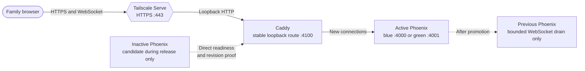
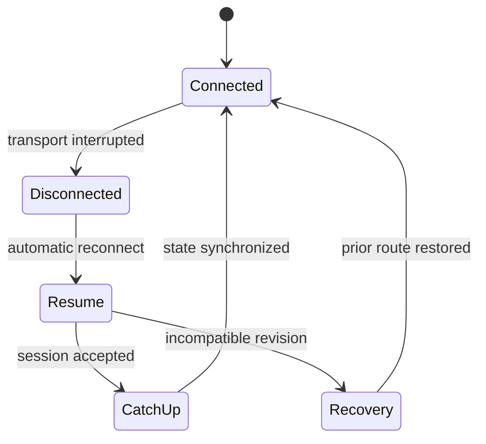
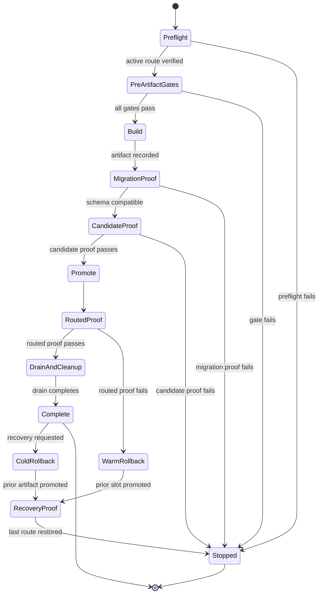

# Technical Decision Guide

## Reading Order

1. Read [current condition](#current-condition) for source-backed facts and observation boundaries.
2. Read [primary-source verification](#primary-source-verification) for current external contracts.
3. Read [recommendation and ranking](#recommendation-and-ranking) for the selected direction.
4. Read [possible alternatives](alternatives.md) for ports, resource expectations, test impact, and detailed comparison.
5. Read [migration design](migration-design.md) for current data and future database/schema safety.
6. Use the [deterministic release contract](release-contract.md) to verify the implemented transaction and completed live release.

## Directory Map

- [Release alternatives](alternatives.md) owns option diagrams, ports, absolute resources, tests, cadence, WebSocket impact, and verdicts.
- [Release contract](release-contract.md) owns deterministic stages, commands, results, Mermaid enforcement, specification changes, file impact, and decision criteria.
- [Migration design](migration-design.md) owns current flat-file and future database/schema ordering, option-specific behavior, verification, and recovery.

## Current Condition

### Route and process lifecycle

The deployed route is deliberately independent from the Phoenix server. The inactive slot is not routed until it passes direct readiness and revision checks:

`apps/bnest-app/tools/deployment.mjs` owns that lifecycle. `proxy:install` installs a loopback Caddy LaunchAgent. `release:build` builds an immutable Phoenix release from an isolated temporary worktree and stores it under the machine-local deployment root. `deploy:prepare` starts the inactive slot as a LaunchAgent and waits up to 60 seconds for `/health/ready` to return the requested `X-Bnest-Revision`. `deploy:promote` validates a temporary Caddy configuration, gracefully reloads Caddy to the candidate, records active and previous slots/revisions, and verifies the Caddy route. `deploy:rollback` promotes the recorded previous slot only while that slot is still prepared and healthy; `deploy:retire` refuses to stop the active slot but removes the inactive LaunchAgent. After retirement, the current rollback command cannot start the retained artifact by itself. A cold rollback must deterministically run `deploy:prepare` for the recorded prior revision and inactive slot, prove readiness/revision, and then run `deploy:promote`.

The Caddy configuration has a five-minute `grace_period` and `stream_close_delay`. After the first successful promotion it uses `/health/ready` for upstream health checks. The readiness endpoint checks that the data repository, identity service, and Codex model catalog are running. Release slots have `RELEASE_DISTRIBUTION=none`, so the safety property comes from independent processes, shared-store compatibility, Caddy routing, and verification—not an Erlang cluster.

### Resource shape

| Lifecycle point     | Long-lived components                                                    | Additional bounded components                                             |
| ------------------- | ------------------------------------------------------------------------ | ------------------------------------------------------------------------- |
| Normal steady state | Tailscale Serve, Caddy, one Phoenix slot, its normal supervised services | None required by the release design                                       |
| Build               | The steady-state components                                              | Temporary detached worktree, build output, and immutable release artifact |
| Prepare and promote | The steady-state components                                              | One second Phoenix release slot until routed proof and drain complete     |
| Complete cleanup    | Tailscale Serve, Caddy, chosen active Phoenix slot                       | Previous slot must be retired; temporary worktree must be removed         |

This remains a one-machine design with one application process in steady state. It deliberately spends the memory and CPU of a second release only to avoid replacing the sole reader. The composed transaction owns retirement after the five-minute drain and retains only the active and one prior verified artifact under machine-local deployment state.

### Deterministic transaction

The launcher provides fixed blue/green ports, revision-addressed release directories, an exact revision response header, bounded readiness polling, nonzero failure exits, atomic state writes, and JSON `proxy:status`. The resolved Nx targets also define named quality gates.

`release:run` composes these primitives into one revision-bound transaction. It requires clean `main`, runs the fixed uncached gates before build, binds evidence and an artifact digest to the revision, verifies an empty migration manifest, prepares and proves the candidate, promotes through Caddy, verifies routed anonymous LiveView recovery, drains, retires, and applies bounded retention. Capacity loss, lock contention, port collision, migration uncertainty, or failed continuity returns a deterministic non-mutating or recovery result.

### Observed boundaries and live proof

- The repository target configuration, release script, workflow, architecture specification, and recent release documentation support the facts above.
- The authorized baseline established Caddy and routed readiness at `200`, one green Phoenix listener on `4001`, Caddy on `4100`, and blue `4000` free. The earlier managed release moved its intended revision to blue `4000`, retained HTTP `200` and revision proof, retired green after drain, and left only Caddy `4100` plus blue `4000` listening. A subsequent `/chat` route failure exposed a missing persisted-pending-turn recovery case, so this evidence is historical capacity/routing evidence only, not completion proof.
- Isolated E2E now disconnects and reconnects `liveSocket` without page reload. Desktop, tablet, and mobile preserve the route, draft, conversation, and session; ten distinct synthetic clients across three groups also pass.
- Warm rollback remains available before retirement. After drain, the retained prior artifact is re-prepared and revision-proven through the same primitives before cold promotion.
- Authenticated synthetic journeys cannot run against the production runtime root: the [test-identity standard](../../../../repo-governance/development/test-identities.md) requires a marked `data/test/runs/<run-id>/` root, distinct identities and browser contexts, and exact cleanup. Isolated gates exercise the same artifact and reconnect path; production-origin proof stays anonymous and read-only. No real session or synthetic production account was used.
- Two slots may write the same flat-file runtime root while they overlap. The [continuity standard](../../../../repo-governance/development/live-service-continuity.md) therefore requires compatible schemas and locks before promotion.

### Blocking user-experience limitation

Endpoint health alone is insufficient. During a release, an open page must either remain usable or automatically reconnect/update itself after a brief interruption. Recovery must preserve the current route, acknowledged server data, and recoverable in-progress browser or LiveView state. It must not require the user to reload, re-enter input, repeat completed progress, or resolve duplicate submissions.

The state inventory covers authenticated navigation, chat prompts and partial transcripts, learning progress and active exercises, theme/form input, and pending retryable writes. This inventory—not a generic HTTP `200` check—determines whether a release satisfies the limitation.

### WebSocket and future multiplayer continuity

Automatic socket reconnection is necessary but does not preserve arbitrary LiveView process memory. The required outcome is preservation of user-visible and domain state: after a disconnect or release, the page reconnects at the same origin, reconstructs the current route and acknowledged state, restores recoverable input, and continues without a reload, duplicate action, missing event, or user reconstruction.

A future BeaverNest children's multiplayer game must therefore keep authoritative game state outside one LiveView process. A reconnect presents a versioned game/session identity and the client's last acknowledged event sequence; the server returns a compatible snapshot plus any later events. Commands carry idempotency identifiers, ordering is server-owned, timers derive from server time, and presence is rebuilt rather than treated as durable game truth. Old and new releases must understand the same transition protocol during drain and rollback.

Release proof must use at least two isolated browser contexts in one synthetic game/session. It disconnects one or both transports without reloading, promotes or restarts according to the selected alternative, and proves the same game identifier, authoritative version, players, turn, acknowledged actions, pending safe input, and event sequence after reconnection. A command sent near the interruption is applied exactly once. No test uses a household session or record.

## Primary-Source Verification

Reviewed 2026-08-27 against official documentation:

- [Phoenix LiveView deployments and recovery](https://phoenix-live-view.hexdocs.pm/deployments.html) confirms automatic reconnect with exponential backoff, but explicitly warns that LiveView state can still be lost. It recommends URL-owned navigation state, durable application state, automatic form recovery, and special handling for complex sessions. Therefore reconnect alone cannot prove no progress loss.
- [Phoenix Channels reliability guidance](https://phoenix.hexdocs.pm/channels.html#fault-tolerance-and-reliability-guarantees) confirms automatic reconnect/rejoin and demonstrates last-seen identifiers for catch-up. The [Channels JavaScript client](https://phoenix.hexdocs.pm/js/modules.html#Joining) sends updated join parameters such as a last-message identifier on rejoin. [Phoenix Presence](https://phoenix.hexdocs.pm/Phoenix.Presence.html#module-fetching-presence-information) defines presence metadata as small and ephemeral. Therefore game truth, ordering, and idempotency remain application contracts; socket assigns and presence are not durable authoritative state.
- [Caddy configuration reload](https://caddyserver.com/docs/getting-started#reloading-config) documents graceful zero-downtime reload and retention of the old config if the new config fails. [Caddy reverse proxy streams](https://caddyserver.com/docs/caddyfile/directives/reverse_proxy#streaming) documents `stream_close_delay` as delaying forced WebSocket closure on config unload; it reduces reconnect spikes but is not itself an application-state guarantee.
- [Tailscale Serve](https://tailscale.com/docs/reference/tailscale-cli/serve) documents private HTTPS termination, a local reverse-proxy target, status, and declarative configuration. Named [Tailscale Services](https://tailscale.com/docs/features/tailscale-services) can drain a host so it stops accepting new connections while existing connections close, but they require a Service definition, tag-based host identity, and approval or an auto-approval policy. The reviewed contract does not document a health-gated atomic same-host target promotion or application rollback. A no-Caddy design must therefore distinguish ordinary device Serve from a named Service and prove its exact reconfiguration, reconnect, and recovery behavior.
- [Mix releases](https://hexdocs.pm/mix/main/Mix.Tasks.Release.html#module-hot-code-upgrades) states that hot code upgrades are not supported out of the box and require per-application `.appup`, release `.relup`, process-aware code, and extensive tests. [Erlang/OTP upgrade guidance](https://www.erlang.org/doc/system/upgrade.html) states that core runtime upgrades restart the emulator. A universal zero-restart hot-upgrade path is therefore not an accurate assumption.
- [Nx caching](https://nx.dev/docs/concepts/how-caching-works) hashes declared source, dependency, configuration, runtime, environment, and argument inputs. Nx also cautions that only deterministic tasks are cache-safe; live network and production-state gates must execute rather than reuse cached success.
- [Docker Swarm services](https://docs.docker.com/engine/swarm/services/#automatically-roll-back-if-an-update-fails) document rolling replacement and rollback policies, while [Docker resource constraints](https://docs.docker.com/engine/containers/resource_constraints/) state that containers have no resource constraints by default. Containers can implement Alternative G, but packaging alone neither bounds resources nor proves WebSocket/data continuity.
- [Mermaid flowchart syntax](https://mermaid.js.org/syntax/flowchart.html#markdown-strings) documents automatic wrapping for Markdown strings and explicit line breaks for traditional strings. Because wrapping varies by syntax and diagram type, the repository must enforce a conservative renderer-independent label contract rather than infer readability from parse success.

## Recommendation and Ranking

### 1. Recommended: ephemeral blue/green Caddy with one release transaction

Retain the current stable Caddy route and blue/green ports. Add one deterministic Nx entry point that composes preflight, fixed pre-artifact gates, immutable build, inactive-slot preparation, candidate proof, Caddy promotion, routed page/progress proof, rollback, bounded drain, retirement, and cleanup. Keep one Phoenix process normally and allow the second only during release. Keep the active and one prior verified artifact on disk so post-drain recovery does not require a warm process.

This is recommended because the measured Caddy route, revision checks, slot rollback, automatic state recovery, and bounded cleanup cover more continuity properties than the alternatives currently prove. Reuse was not a constraint: Caddy, LaunchAgents, ports, or the slot mechanism could have been replaced if another option demonstrated equal state continuity and rollback, lower measured resource cost, and simpler deterministic operation.

The recommendation was reassessed after the 440-second managed release and remains unchanged for one or more releases every day. The host retained 12.80 GiB minimum available memory, 95.95 GiB minimum free disk, two p95 CPU cores of safety headroom, zero Caddy health failures, and only one Phoenix listener after cleanup. A post-release persisted-pending-turn crash is a release-proof gap, not evidence against the Caddy blue/green topology: its repair requires safe model normalization and a fixed isolated authenticated recovery gate before the next artifact. High cadence increases the value of one automated transaction and makes manual Alternative A, interruptive E, and version-pair-specific F less suitable. Alternative C avoids candidate startup but always consumes the second VM; B consumes it only for prepare, proof, and bounded drain. D or G can replace B when their full measured control-plane cost and continuity proof are better, not merely because they remove Caddy.

The routine transaction should have one fail-closed path and two explicit recovery edges:

`Stopped` means no further release mutation occurs. It does not mean stopping the active service.

### 2. Conditional fallback: Tailscale Service with ephemeral slots

If Phase 1 shows Caddy's measured cost is material, investigate a named Tailscale Service that points directly to the active Phoenix slot while an inactive slot exists only during release. Its documented host drain could protect existing connections while new connections are paused, but the plan must prove whether target replacement on this one host preserves those connections, how long new connections wait, and how rollback restores the prior target. This option removes Caddy but adds Service identity, policy, and approval dependencies.

### 3. Conditional fallback: device Serve to one Phoenix slot

Consider removing Caddy only when measurements show its steady-state cost is material and a single-slot restart proves a bounded interruption, automatic recovery for every affected page, no progress loss, and deterministic cold rollback. This has the fewest processes but removes documented Caddy cutover/drain behavior. It is not the first recommendation while page-state recovery remains unproven.

### 4. Not recommended without new evidence

- Permanently warm slots spend a second Phoenix VM continuously to optimize an occasional release.
- OTP hot upgrades add per-version upgrade/downgrade recipes and process-state testing, and still cannot avoid all emulator restarts.
- Containers or an orchestrator reproduce existing single-host slot behavior with additional infrastructure.
