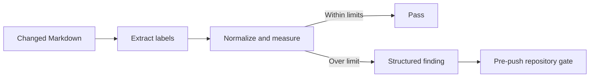

# Deterministic Release Contract

This companion defines the implementation and verification contract for the selected alternative. Read the [technical decision guide](README.md) first for the current condition, port allocation, recommendation, and alternatives.

## Deterministic Release Constraints

The selected mechanism must expose one revision-bound state machine even if it composes existing Nx targets internally:

1. **Preflight:** acquire the host-wide release lock; resolve one clean `main` revision; verify unchanged inputs, capacity admission, exact port owners, and active-route health; and refuse missing configuration without printing values. A busy lock queues/coalesces the request, while insufficient safe headroom returns a non-mutating deferred result.
2. **Pre-artifact gates:** run a fixed target manifest covering applicable quick, integration, behavior, repository, and isolated browser tests. Any failure or indeterminate result stops before build.
3. **Build:** create or verify one immutable revision-addressed artifact and manifest its revision, toolchain, content digest, passed gate evidence, and declared data/schema compatibility.
4. **Migration proof when declared:** verify backup/restore evidence and the migration checksum; acquire one lock; expand, migrate, and prove compatibility according to [migration design](migration-design.md). Failure leaves the active route unchanged and stops before candidate activation.
5. **Candidate or restart proof:** verify readiness, revision, port ownership, and observed schema compatibility; run release-specific HTTP and browser checks that cannot be proven before build.
6. **Activate:** promote an independently verified candidate or perform the explicitly bounded single-slot restart.
7. **Routed proof:** verify intended revision, HTTPS, WebSocket reconnection, current route, no duplicate action, no progress loss, and representative isolated data behavior at the exact user origin.
8. **Recover or clean:** rollback automatically on a failed activation/proof; otherwise complete bounded drain, old-process retirement, worktree cleanup, artifact retention, and recording of deferred contract work.

Every stage returns a versioned structured summary and a nonzero failure status. It may reference detailed machine-local logs, but routine AI operation consumes only the bounded summary. Retrying with the same revision must be idempotent or return one exact recovery transition; it must never silently skip a gate because an artifact directory already exists. Capacity deferral and queued/coalesced requests are normal non-mutating outcomes, not release failures.

### Exact proposed pre-artifact manifest

Until Phase 1 proves complete cache inputs and outputs, release evidence must use `--skip-nx-cache`. This spends more test time but removes cached success as a release decision. The composed release target must invoke this fixed order without asking an operator or AI to select tests:

| Order | Canonical Nx command                                                                                                    | Required result                                                                                                                            |
| ----- | ----------------------------------------------------------------------------------------------------------------------- | ------------------------------------------------------------------------------------------------------------------------------------------ |
| 1     | `npm exec -- nx run -p bnest-app -t test:quick --skip-nx-cache`                                                         | Typecheck, lint, unit, unit coverage, and `test:coverage:behaviour` pass.                                                                  |
| 2     | `npm exec -- nx run -p bnest-app -t test:integration --skip-nx-cache`                                                   | Local-only integration scenarios pass.                                                                                                     |
| 3     | `npm exec -- nx run -p bnest-app-e2e -t test:quick --skip-nx-cache`                                                     | E2E harness typecheck and lint pass.                                                                                                       |
| 4     | `npm exec -- nx run -p bnest-app-e2e -t test:e2e --skip-nx-cache -- --grep "An automatic LiveView reconnect preserves"` | The two checked-in automatic reconnect scenarios pass at the harness's exact served origin; the fixed filter is owned by the release tool. |
| 5     | `npm exec -- nx run -p badakmini-cli -t test:repo --skip-nx-cache`                                                      | Repository links, maps, word budgets, and Mermaid checks pass.                                                                             |

The Bnest behavior-coverage target is named explicitly above but is not duplicated because it is already a dependency of the application quick gate and the E2E runtime gate. The isolated browser run uses `test-user-<suite>-<run-id>`, a distinct marked `data/test/runs/<run-id>/` root and browser context, synthetic payloads only, and the exact leased application origin including hostname and port. Release qualification covers 10 clients across 3 groups, including at least one two-client resumable state session. Its `finally` cleanup stops its browsers and servers, releases its port lease, and removes only the validated marked run root; cleanup failure fails the gate and reports only the safe synthetic path.

When an artifact declares a data/schema migration, its unit and isolated adapter tests are part of the application quick/integration gates. The host migration and compatibility proof runs only after the artifact exists because it consumes that artifact's manifest, but it remains before candidate activation and cannot reuse cached live-state evidence.

### Transition and evidence contract

| Transition               | Declared success condition                                                                                                                      | Failure edge                                                                    |
| ------------------------ | ----------------------------------------------------------------------------------------------------------------------------------------------- | ------------------------------------------------------------------------------- |
| Preflight → gates        | Lock acquired; clean `main` SHA fixed; capacity and ports admitted; active local/routed readiness/revision pass; required configuration exists. | Defer or queue without mutation, or stop before tests/build and restore health. |
| Gates → build            | Every manifest entry passes for the same SHA and isolated cleanup passes.                                                                       | Stop before artifact creation.                                                  |
| Build → migration proof  | Artifact manifest contains SHA, toolchain versions, digest, gate IDs, schema range, migration checksum, and build duration.                     | Remove only incomplete revision-addressed output; active route is unchanged.    |
| Migration → candidate    | No migration is required, or backup, lock, expand/backfill, N−1 compatibility, and safe retry evidence pass.                                    | Keep the active route; record expanded state; never improvise a down change.    |
| Candidate → promote      | Inactive slot returns ready with the exact SHA and schema range; candidate-only HTTP and isolated journey pass.                                 | Retire failed candidate; active route is unchanged.                             |
| Promote → routed proof   | Caddy route reports the SHA; Tailnet HTTPS and connected LiveView/WebSocket pass at the exact origin and declared load.                         | Warm rollback before retirement, then prove the previous routed revision.       |
| Routed proof → cleanup   | Route, data, input, partial output, progress, session version, ordered events, and exactly-once actions survive automatically.                  | Warm rollback and preserve safe evidence for diagnosis.                         |
| Cleanup → complete       | Drain deadline expires; inactive process and worktree are gone; only active and prior verified artifacts remain.                                | Report cleanup failure; never delete an unresolved path.                        |
| Complete → cold rollback | Recorded prior SHA is re-prepared in the inactive slot, passes readiness/revision, and is promoted and routed-proven.                           | Keep the current healthy route and stop recovery mutation.                      |

Each transition emits one bounded JSON result. `schemaVersion` is exactly `1`; `releaseRevision` is a 40-character lowercase Git SHA when pinned and `null` for an unpinned capacity deferral; states and `nextTransition` come from the documented machine; `outcome` is `passed`, `failed`, `rolled-back`, `deferred`, or `queued`; `evidenceIds` is an ordered unique list from the fixed manifest; `durationMs` is a nonnegative integer; and `errorCategory` is `null` on success or one of `capacity`, `concurrency`, `configuration`, `port`, `preflight`, `gate`, `artifact`, `migration`, `candidate`, `promotion`, `routed-proof`, `rollback`, or `cleanup`. Unknown fields are allowed for forward compatibility, but missing required fields fail validation. Detailed logs stay below the machine-local deployment root; standard output contains exactly one final result.

```json
{
  "schemaVersion": 1,
  "releaseRevision": "0123456789abcdef0123456789abcdef01234567",
  "fromState": "preflight",
  "toState": "build",
  "outcome": "passed",
  "evidenceIds": [
    "bnest-quick",
    "bnest-integration",
    "e2e-quick",
    "release-recovery-e2e",
    "repository"
  ],
  "durationMs": 1234,
  "nextTransition": "build",
  "errorCategory": null
}
```

## Mermaid Legibility Prerequisite

The release state diagram exposed a deterministic documentation failure: long transition labels can be clipped without a syntax error. Before release implementation, extend Badakmini's existing `md mermaid validate` leaf with a renderer-free `mermaid-legibility` finding. Check all currently supported diagram types. Measure each visible node/state segment at a maximum of 32 Unicode grapheme clusters and each edge/transition segment at 24 after basic entity decoding, markup removal, and whitespace normalization. Treat `<br>`, `<br/>`, and escaped newlines as segment boundaries. As a repository parsing contract, reject `;` in state-transition labels so a static extractor never mistakes label text for a statement boundary. Exclude class members, ER attributes, requirement body fields, directives, comments, and front matter.



The JSON finding must include `kind`, `path`, `line`, `labelRole`, `actualLength`, `limit`, and `message`. Add canonical Gherkin fixtures for every supported diagram type, exact boundary values, split labels, combining graphemes, excluded declarations, and state semicolons. Prove the new behavior red before production code. The existing pre-push repository gate remains the enforcement point; expand its change detection so modifications to Badakmini, its E2E adapter, or the hook itself also trigger the full repository corpus. Repair every existing finding before enabling the hook. This proposal uses no Mermaid renderer, browser, network, or new package, keeping the result fast and deterministic.

## Specification Changes

- `[E] specs/apps/bnest/app/behaviours/chat.feature`: require automatic transport reconnect, current-route preservation, and unsent composer recovery without reload.
- `[E] specs/apps/bnest/app/architecture.md`: show the deterministic release transaction, capacity/port/migration boundaries, browser recovery, and future authoritative multiplayer session boundary.
- `[E] apps/bnest-app/test/behaviour/driver.ex`, `apps/bnest-app/test/behaviour/steps/home_page_steps.exs`, `apps/bnest-app/test/unit/support/home_page_driver.ex`, `apps/bnest-app/test/integration/support/home_page_driver.ex`, and `apps/bnest-app-e2e/tests/steps/browser.steps.ts`: add draft/route bindings and adapters; make the deployment step disconnect and reconnect the transport.
- Release orchestration behavior is proven by deterministic Node unit tests because it operates OS processes and machine-local deployment state; shared application adapters must never execute it against production.

## File Impact

- `[E] apps/bnest-app/tools/deployment.mjs`: safe primitives for transaction proof, cold rollback, port ownership, retention, and cleanup.
- `[N] apps/bnest-app/tools/release.mjs`: deterministic state machine owning capacity admission, host lock/queue, migration manifest, port leases, bounded results, and release lifecycle.
- `[N] apps/bnest-app/tools/release.test.mjs`: fake host/process/filesystem/data tests for admission, serialization, ordering, migration, rollback, cleanup, and results.
- `[E] apps/bnest-app/project.json`: explicit development port, bounded gate environment, `release:test`, and the single `release:run` entry point.
- `[E] apps/bnest-app/lib/bnest_app_web/live/chat_live.ex`: LiveView form recovery for unsent input.
- `[E] apps/bnest-app/test/behaviour/driver.ex`, `apps/bnest-app/test/behaviour/steps/home_page_steps.exs`, `apps/bnest-app/test/unit/support/home_page_driver.ex`, and `apps/bnest-app/test/integration/support/home_page_driver.ex`: shared recovery contract and adapters.
- `[E] apps/bnest-app-e2e/playwright.config.mts`, `apps/bnest-app-e2e/tests/support/test-runtime.mts`, and `apps/bnest-app-e2e/tests/steps/browser.steps.ts`: leased E2E ports, exact cleanup, multi-context state, and real offline/online reconnect without reload.
- `[E] apps/bnest-app/README.md` and `apps/bnest-app-e2e/README.md`: deterministic release and recovery-test operation.
- `[E] specs/apps/bnest/app/behaviours/chat.feature` and `specs/apps/bnest/app/architecture.md`: canonical behavior and architecture.
- `[E] plans/in-progress/single-machine-release-simplification/README.md`, `plans/in-progress/single-machine-release-simplification/brd.md`, `plans/in-progress/single-machine-release-simplification/prd.md`, `plans/in-progress/single-machine-release-simplification/tech-docs/`, `plans/in-progress/single-machine-release-simplification/delivery.md`, and `plans/in-progress/single-machine-release-simplification/learnings.md`: decision detail, ports, alternatives, migration design, evidence, and remaining checkpoints.
- `[E] apps/badakmini-cli/Governance.fs`, `apps/badakmini-cli/Cli.fs`, `apps/badakmini-cli/tests/contract/BehaviourContract.fs`, `apps/badakmini-cli/tests/contract/BehaviourSteps.fs`, `apps/badakmini-cli/tests/contract/BehaviourSupport.fs`, `apps/badakmini-cli/tests/contract/CliContractTests.fs`, `apps/badakmini-cli/tests/unit/UnitDriver.fs`, `apps/badakmini-cli/tests/integration/IntegrationDriver.fs`, `apps/badakmini-cli-e2e/E2eDriver.fs`, and `apps/badakmini-cli/README.md`: deterministic label extraction, findings, adapters, CLI contract, and documentation.
- `[E] specs/apps/badakmini/cli/behaviours/mermaid-governance.feature` and `specs/apps/badakmini/cli/architecture.md`: exact label-legibility behavior and C4 component responsibility.
- `[E] .husky/pre-push`, `repo-governance/conventions/markdown-visualizations.md`, and `repo-governance/conventions/push-hook-verification.md`: enforcement, authoritative limits, and trigger rule.
- `[E] AGENTS.md`, `repo-governance/development/live-service-continuity.md`, `repo-governance/workflows/development-caddy-deployment.md`, `repo-governance/workflows/development-server-restart.md`, and `repo-governance/workflows/development-tailnet-proxy.md`: shortest point-of-use and canonical release/port/capacity/migration continuity rules, subject to the rules-propagation idempotence gate.
- `[E] repo-governance/workflows/red-green-refactor.md`, `specs/apps/badakmini/cli/architecture.md`, `specs/apps/bnest/app/architecture.md`, `plans/done/2026-08-26__bnest-centralized-data/tech-docs/README.md`, and `plans/done/2026-08-26__bnest-centralized-data/tech-docs/migration-design.md`: currently identified Mermaid corpus repair paths; the new corpus run must prove no other file needs repair before hook enforcement.

## Decision Criteria

A later choice must use measurements collected without user data or secret exposure and show all of the following:

1. The active routed HTTPS service is healthy before work, every pre-artifact gate passes for one unchanged revision, and the resulting artifact is verified at that revision.
2. Every affected connected page remains usable or automatically reconnects/updates at the exact served HTTPS origin without a manual reload.
3. An overlapping design retains the previous usable backend until routed proof passes; a single-slot design proves a bounded interruption, automatic state recovery, and deterministic restart of the prior artifact.
4. Normal steady state contains no unneeded Phoenix slot, temporary worktree, watcher, candidate, or proxy.
5. The measured temporary overlap fits the machine's available CPU, memory, file-descriptor, and disk budget.
6. Mixed-version readers and writers remain compatible for the shared runtime root, or the release declares and safely handles the exception.
7. If Caddy is removed, the selected path explicitly proves how it replaces—or makes unnecessary—Caddy's stable listener, atomic promotion, five-minute WebSocket drain, health-gated upstream routing, and previous-slot rollback.
8. Before/after assertions prove that the current route, acknowledged data, recoverable in-progress input, partial output, and completed progress survive without duplicate actions or user reconstruction.
9. The routine path needs no free-form AI choice between stages and reports enough structured evidence to decide success, rollback, cleanup, or diagnosis without loading verbose logs.
10. Authenticated state/progress tests use a marked isolated test root and exact served application origin. Production-origin checks remain read-only and anonymous unless an approved mechanism proves test-data isolation; lack of that mechanism blocks live authenticated proof rather than permitting a real-user test.
11. Every listener has one declared owner, development cannot collide with a production slot, and the selected alternative's exact production/candidate/test port path passes preflight.
12. Data changes follow expand–migrate–verify–contract, run once under a lock, preserve N−1 rollback compatibility, and defer destructive contract work until the rollback window closes.
13. One release owns the host lock; newer requests queue/coalesce; the transaction defers without mutation when the documented RAM/CPU/disk envelope cannot coexist with 5–10 development workloads.
14. Repeated-release proof covers three serialized releases under 10 connected clients across 3 groups with no process, port, lock, artifact, resource, or user-state leak.
