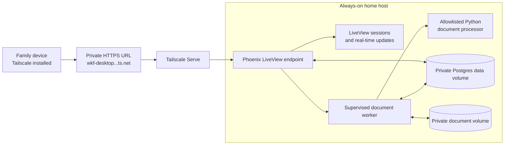
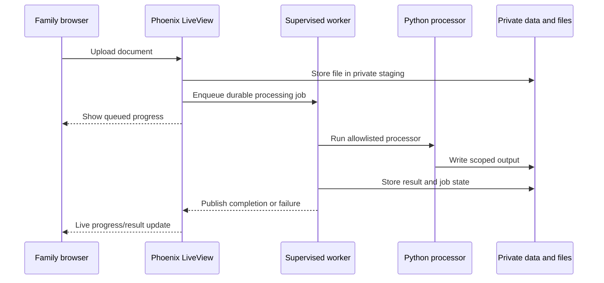
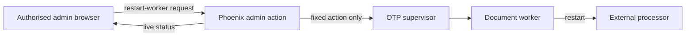
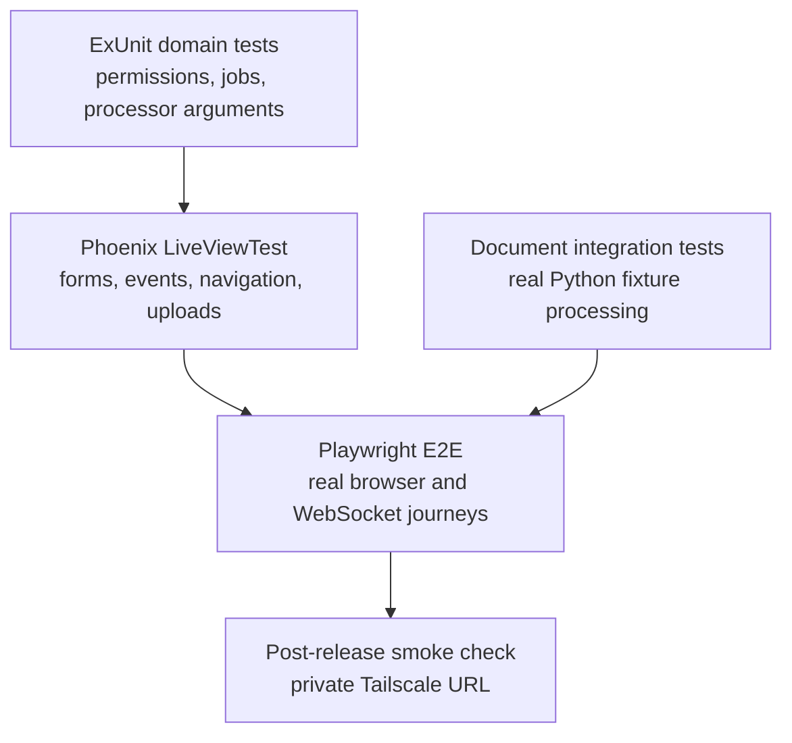

# Initial Plan

This is the plan overview. Detailed planning documents are in [the plans index](README.md).

## Problem statement

Create a private family app that is continuously available from approved family devices and can be improved frequently with Codex.

The app will hold private shared data and process user documents. It must therefore:

- remain private to authorised family members;
- preserve and back up user data across releases;
- safely execute approved document-processing programs;
- support rapid development without exposing arbitrary host control; and
- remain recoverable when a worker or application component fails.

Public-internet access is out of scope unless explicitly added later.

## Architecture goals

- Use one full-stack application rather than a separate browser client and API.
- Provide live browser updates during development and real-time progress updates in normal use.
- Run background document work independently from the web endpoint.
- Keep live data outside Git and the Dropbox-synchronised project workspace.
- Use Tailscale for private HTTPS access without opening router ports.
- Give Codex repeatable terminal commands for test, run, and release operations.

## Target architecture

### Application and worker boundary

Phoenix LiveView is the application-facing server. It renders the UI, identifies the family member, applies authorisation, and publishes real-time state to connected browsers.

Document work runs in a separately supervised worker. The worker receives a durable job, invokes only an allowlisted external executable, validates the result, and records progress. The web process never runs arbitrary browser-provided commands.

External processors run with an absolute executable path and argument list, not a shell command. They must be resource-limited and isolated from the network and broader host filesystem.

## Runtime control

Elixir/OTP supervision manages recoverable workers. An admin UI may request only explicit operational actions, such as restarting the document worker or checking service health. It must not expose a shell, Docker socket, or arbitrary process launcher.

Tailscale identity is the network-level access signal. The application listens only on localhost behind Tailscale Serve, then applies its own family roles and data permissions.

## Testing strategy

- **ExUnit** tests domain rules, authorisation, worker state, and safe external-command construction.
- **Phoenix LiveViewTest** covers most UI flows quickly without a browser.
- **Playwright** covers a small set of critical browser journeys: initial connection, document upload/progress, reconnects, permissions, and the admin worker-restart experience.
- **Document integration tests** run the real Python processor against safe test fixtures, including corrupt input, timeout, and processor failure cases.
- CI uses an isolated test database and files. Production receives only a read-only post-release smoke check.

## Key decisions

| Concern | Initial decision |
| --- | --- |
| Application | Phoenix LiveView |
| Runtime | Elixir/OTP supervision tree |
| Persistence | Postgres in a private mounted volume |
| Document processing | Supervised worker invoking allowlisted Python programs |
| Browser E2E | Playwright |
| Access | Tailscale Serve over private HTTPS |
| Hosting | Always-on home machine or server |

## Open questions

- Which always-on host will run the service?
- Which family members need distinct application identities and permissions?
- Which document formats and processors are required first?
- Where should encrypted backups be stored, and how long should they be retained?
