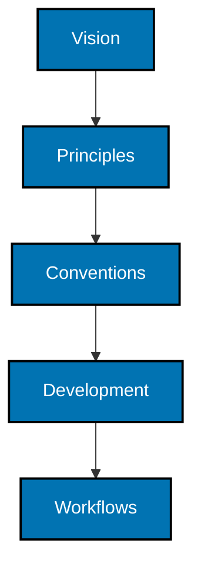

# Repository Governance

This directory contains the repository's detailed rules and working agreements.

Every directory in this tree follows the [governance directory-map convention](conventions/directory-maps.md).

## Directory Map

- [Vision](vision/README.md) defines the future this repository exists to create.
- [Principles](principles/README.md) contain durable constraints within that vision.
- [Conventions](conventions/README.md) define repository-wide choices within the vision and principles.
- [Development](development/README.md) defines engineering standards within all higher levels.
- [Workflows](workflows/README.md) define repeatable procedures within all higher levels and may compose other workflows.

## Governance Hierarchy

The precedence hierarchy is:



The hierarchy flows from top to bottom: a lower level cannot contradict any level above it. Higher levels do not need to conform to lower levels. When documents conflict, the higher level takes precedence and the lower-level document must change. Documents should link to higher-level rules rather than duplicate them.

Root instruction files such as `AGENTS.md` should remain concise and link to the relevant documents here. The [750-word governance budget](conventions/directory-maps.md#word-budget) sets the hard limit; progressive disclosure, clear ownership, and reader tasks determine when to split content earlier.

The `badakmini-cli` application enforces this limit for root `AGENTS.md` and every Markdown file in this directory, along with the governance navigation requirements. Run it manually with:

```sh
./hippo run --class ephemeral -- npm exec -- nx run -p badakmini-cli -t test:repo
```

The repository's pre-push hook follows the [push-hook verification convention](conventions/push-hook-verification.md). It runs sequential, HIPPO-guarded [`test:quick` quality gates](development/quality-gates.md) for affected projects, and also runs governance, recursive maps, and Mermaid checks when pushed commits change Markdown, a mapped tree, Badakmini source or adapters, or the hook itself.
