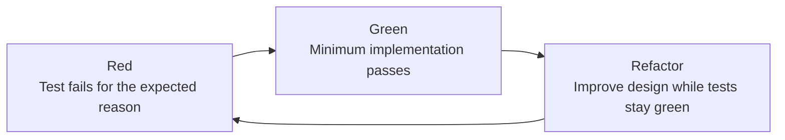

# Red–Green–Refactor

Use this workflow for each behavior increment required by the [test-driven development standard](../development/test-driven-development.md).

## Prerequisites

- Identify the smallest observable behavior to add or change.
- Identify the narrowest automated test target that can demonstrate it.

## Cycle

1. **Red:** Write or change one test that expresses the intended behavior. Run the relevant test target through Nx and confirm it fails because the behavior is absent or incorrect. Correct the test or environment if it fails for another reason.
2. **Green:** Implement the minimum production change needed for that test. Run the same target and confirm the new test and its surrounding tests pass.
3. **Refactor:** Improve names, structure, duplication, and design without adding behavior. Keep tests green, running the target after each meaningful refactor.
4. Repeat the cycle for the next behavior increment.

## Verification

After the final cycle, run the affected project's broader Nx test target and any required repository checks. The completed work must have evidence of the expected red failure and a final green result.

If the test cannot reach red because the test harness or environment is broken, repair or diagnose that problem first. Do not use an unrelated failure as evidence that the behavior test is valid.
