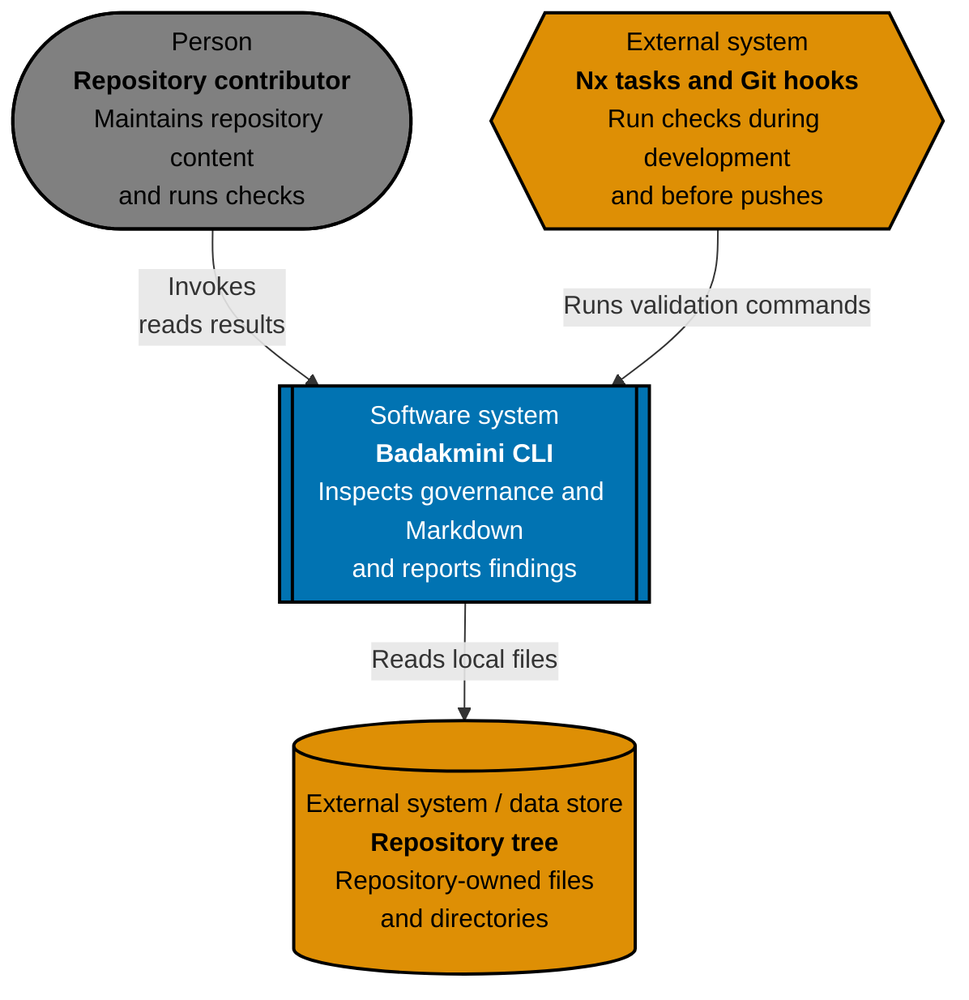
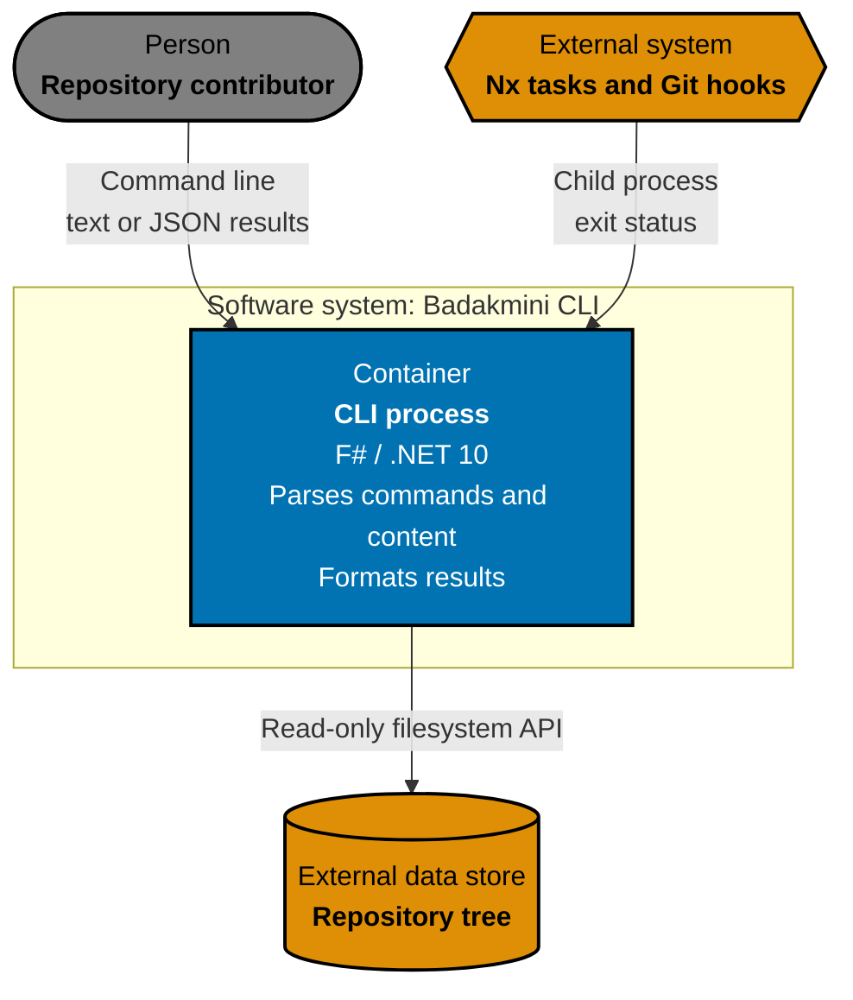
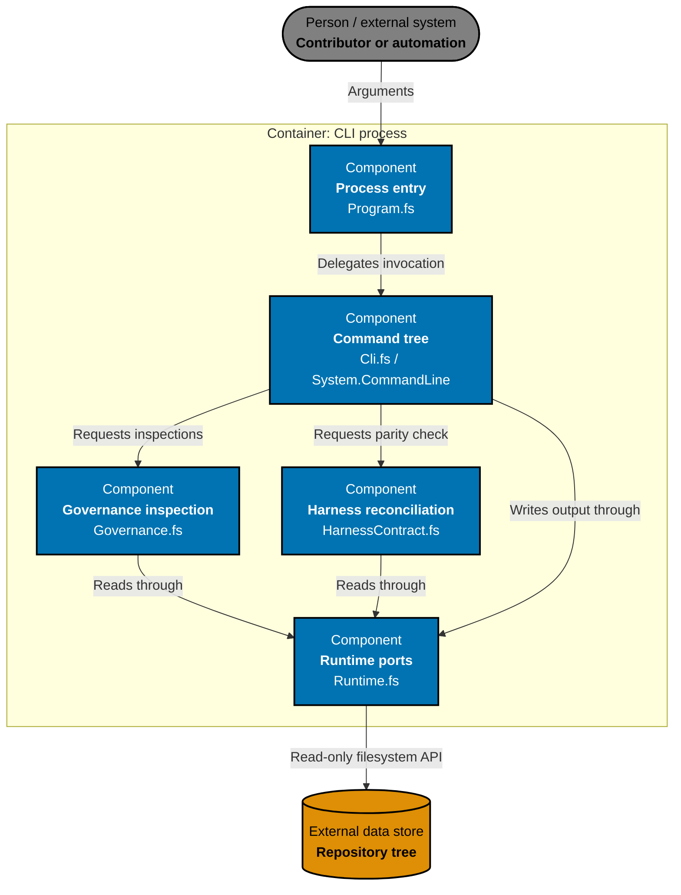

# Badakmini CLI Architecture

This is the canonical as-built C4 model for the Badakmini command-line application. Maintain it under the repository [architecture specification standard](../../../../repo-governance/development/architecture-specifications.md).

## System Context

Badakmini is a local, network-free governance system. Contributors may invoke it directly; Nx targets and Git hooks are its automated entry points.

## Container View

The compiled CLI is the only runtime container. It does not write inspected repositories or call network services.

## Component View

## Architectural Constraints

- Command handlers depend on the injectable runtime boundary; unit tests replace the filesystem and output writers.
- Integration tests use isolated local files without network access; E2E tests observe only the built process's public command contract.
- Governance documents remain authoritative. Badakmini reports structural, Markdown-link, Mermaid, and coding-harness parity violations but does not mutate repository content. Harness reconciliation normalizes only BOM and line endings, parses the owned YAML/JSON/JSONC/TOML subsets, compares exact adapter routes and semantic permissions, and hashes complete canonical rule, skill-resource, agent-prompt, and capability records with SHA-256. Mermaid checks enforce accessible colors and renderer-free visible-label grapheme limits across supported diagrams; they may read the complete repository or only caller-selected repository-relative Markdown files.
- Text output is the human default, JSON is the machine-observation boundary, and exit codes distinguish success, findings, and invocation errors.

## Behaviour Traceability

Executable behaviour is specified in [`behaviours/`](behaviours/). The production application and its unit, integration, and process E2E adapters must implement that exact recursive corpus.
