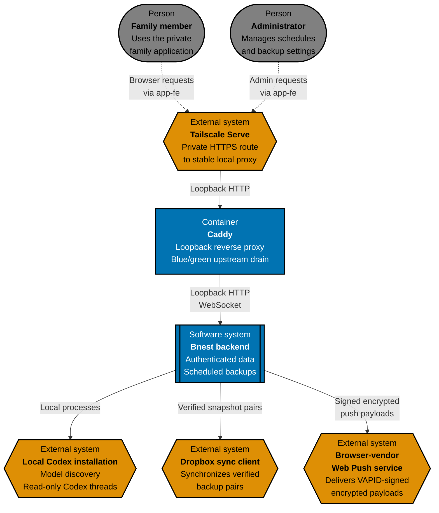
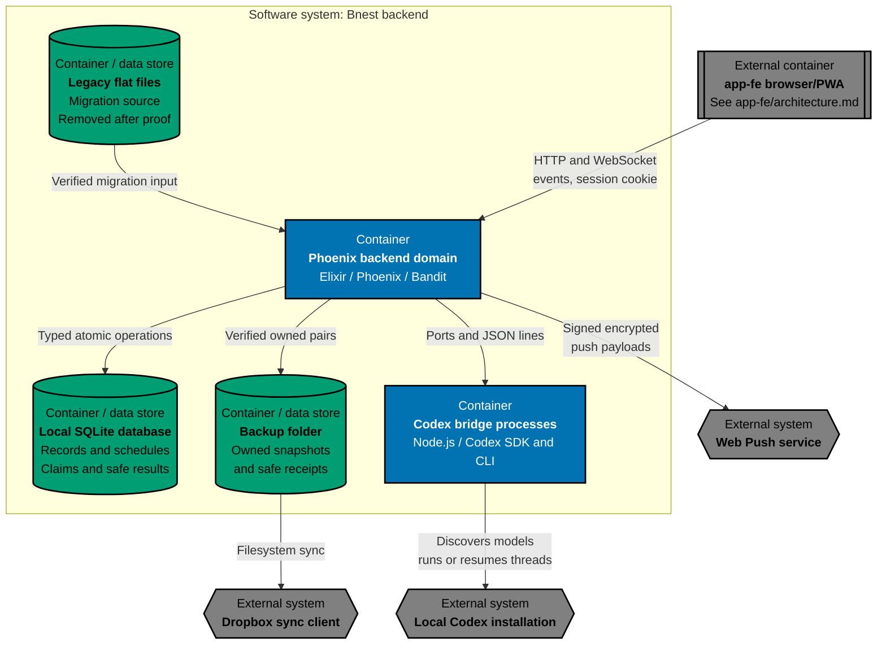
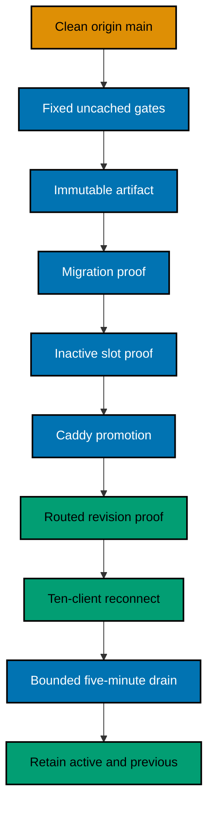
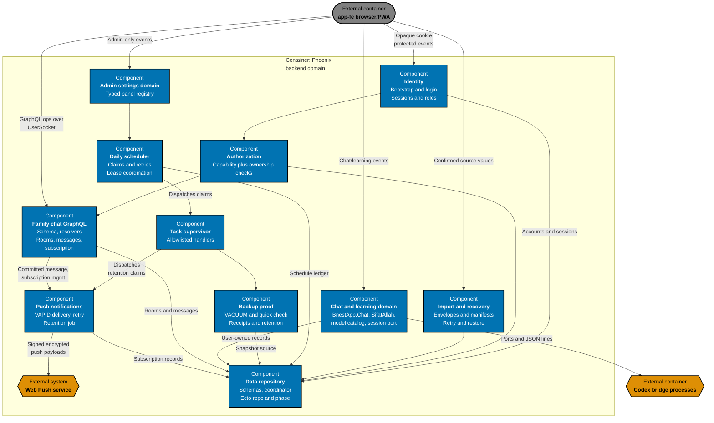

# Bnest Backend Architecture

This is the canonical as-built C4 model for Bnest's backend surface: authentication/authorization at the server
boundary, SQLite, Scheduler, Backup, and internal services. Maintain it under the repository
[architecture specification standard](../../../../repo-governance/development/architecture-specifications.md). The
frontend surface is documented separately at [`app-fe/architecture.md`](../app-fe/architecture.md); both surfaces are
delivered by the one running `bnest-app` process and are aggregated by [`specs/apps/bnest/README.md`](../README.md).

## System Context

The backend surface serves every authenticated request and scheduled job for the one 24/7 `bnest-app` process. Family
members and administrators never call it directly; every request arrives through the rendered routes owned by
[`app-fe`](../app-fe/architecture.md), which forwards it across the same HTTP/WebSocket boundary this document owns.
Elixir/OTP and Phoenix were selected for supervision, process isolation, and durable scheduled work. Bnest keeps
user-owned state and durable schedule claims in a server-managed local SQLite database; verified legacy flat files are
retired after cutover instead of remaining as an unbounded rollback copy. It publishes independently verified
snapshot pairs to an ignored folder observed by Dropbox, but the sync client is neither authoritative storage nor
complete disaster recovery. The compatibility revision adds an authenticated GraphQL surface (queries, mutations, and
an Absinthe subscription) serving the family chat feature, plus outbound Web Push delivery to each participant's
subscribed browser endpoints; both are implemented and tested behind the `BNEST_FAMILY_CHAT_ENABLED` flag, which
still defaults to off in this revision (see [Architectural Constraints](#architectural-constraints)).

## Container View

The Phoenix backend domain, SQLite storage, temporary flat-file migration source, backup folder, and Node bridges run
on the home host. The stable storage pointer remains at `~/.config/bnest/storage.json`, while the default production
database lives at `~/bnest/data/prod/bnest.sqlite3`. A separate private pointer optionally overrides the exact
ignored `data/backup/` default. Verified flat sources under `data/prod/` are removed after routed storage proof.
Filesystem test fixtures remain in a marked Dropbox run below `data/test/runs/`, while the paired SQLite database uses
the same run identifier below `~/bnest/data/test/runs/`; both roots are cleaned after the run.

## Release and Resumable State

The managed release controller serializes each clean `origin/main` revision through one fail-closed transaction.
Production slots own `4000` and `4001`, Caddy owns `4100`, isolated E2E leases `4010`–`4039`, and development leases
`4020`–`4029`. Every managed slot enables secure cookies and account identity cutover, so a logged-out root request
follows the login boundary instead of receiving a synthetic legacy user. The controller creates no artifact until
every fixed gate passes, refuses an undeclared migration adapter, and leaves the proven route active when only final
cleanup needs retrying. A private release-overlap monitor follows the logged-out root-to-login journey while
sampling explicit local health and the exact routed user surface from preflight through drain; schema-v5 evidence
rejects any routed failure, p95 latency above 500 ms, or individual sample above 2 seconds without persisting the
private origin.

Backend session and durable-record continuity are the foundation `app-fe`'s reconnect experience relies on: a
compatible transport reconnect restores the same authoritated session and server-owned records without this backend
losing or duplicating state. Blue/green release slots remain independent; no cross-slot PubSub is assumed by this
backend today.

## Component View

`app-fe` owns the LiveView route/presentation layer (`ChatLive`, `SifatAllahLive`) that renders this domain's state;
this document owns only the domain components those routes call into. Family chat is a materially different pattern:
`app-fe` renders it through a plain Phoenix controller route (`FamilyChatController`, not a LiveView), and the
browser drives every read/write itself through one authenticated GraphQL schema exposed at `/api/graphql`:
`family_chat_rooms`, `family_chat_room`, and `family_chat_messages` queries; `send_family_chat_message` mutation,
which accepts an optional `reply_to_message_id` naming an already-committed message in the same room; and
`family_chat_message_committed` subscription. Every message the schema returns carries an optional `reply_to` quote
(`id`, `sender_kind`, `sender_display_name`, and a server-bounded `body_preview`), which is a distinct object type
rather than a recursive message, so a quote can never carry a quote of its own. All are served by the `familychat`
component, with subscription identity
resolved only from the server-decoded session carried in `UserSocket`'s `connect_info` — never from client-supplied
socket params. Push-subscription lifecycle (`web_push_configuration`, `current_web_push_subscription` queries;
`upsert_web_push_subscription`, `disable_current_web_push_subscription` mutations) is served through that same
schema and routed into the `push` component. Push notifications also owns a second, independent `Scheduler.Registry`
handler (`family_chat_push_retention`, routed to `PushNotifications.RetentionJob`) alongside the pre-existing backup
handler; both share the same daily-scheduler claim/retry/lease machinery in `tasks` but dispatch to unrelated
allowlisted handler modules. `BnestApp.Chat` (the existing Codex conversation domain in `appdomain`) and the new
family chat feature are unrelated: distinct schemas, distinct transports (LiveView events vs. GraphQL/Absinthe
subscription), and distinct data stores.

## Architectural Constraints

- Every protected route and data operation resolves an unrevoked opaque-cookie session and current user before
  repository access.
- Bootstrap, username indexes, accounts, and browser sessions use the phase-aware repository; SQLite authority never
  reads a retired flat identity source.
- Roles may contain `children`, `parents`, and `admin`; capabilities still default-deny cross-user access.
- Codex model access is role-scoped server-side: admins receive the discovered catalog, parents use Terra at medium
  effort, and children use Luna at medium effort. A missing required model disables that role's chat instead of
  substituting another model.
- Durable chat, Sifat Allah progress, and explicit theme state live in the authenticated user's SQLite records after
  accepted import.
- Daily definitions, unique claims, retry state, leases, occurrence expiry, and safe results live in SQLite. One
  generic coordinator dispatches code-allowlisted handlers from both schedule contexts and never trusts executable
  names from stored data.
- The production SQLite backup schedule never expires. It verifies a `VACUUM INTO` snapshot through an independent
  read-only connection, checks the attempt fence before atomic publication, and retains only owned receipt-backed
  pairs for the latest seven WIB dates.
- Only the exact Git-ignored `data/backup/` path may be used inside the repository. External overrides reject
  symbolic links, live-source/config overlap, and unsafe repository paths; no route downloads or exposes backup
  paths or payloads.
- Browser keys are immutable compatibility sources until envelope, normalization, and normal read-back pass; only the
  accepted key is then cleared by `app-fe`.
- Mutable records use revision checks, one path lock coordinated across connected local BEAM release nodes, atomic
  replacement, and read-back. Sessions have no time expiry and remain independent per browser.
- Test adapters use only synthetic `test-user-` identities and paired marked flat-file and SQLite run roots;
  production structural audit is read-only.
- Routine releases are clean-revision transactions owning release and resource locks, with fixed uncached gates,
  capacity and port admission, immutable artifact and migration manifests, revision proofs, rollback, bounded drain,
  and two-artifact retention. Repository-owned development consumes fixed CPU-and-memory allocations from the shared
  reservation ledger; independent work may overlap, targeted warning/critical shedding remains owner-controlled, and
  HIPPO never signals production, Caddy, or unrelated processes.
- The GraphQL schema exposes no system-message mutation; system messages (room joins, retention notices) are
  server-originated only. A dedicated source-scan test (`SchemaSourceScan`) and a Scheduler-to-store
  dependency-direction test keep the GraphQL boundary and the Scheduler/handler/service/store call direction
  regression-proof.
- Web Push delivery signs every payload with a server-held VAPID keypair sourced from
  `BNEST_DEPLOY_WEB_PUSH_PUBLIC_KEY_FILE`/`BNEST_DEPLOY_WEB_PUSH_PRIVATE_KEY_FILE` and a validated `mailto:`/HTTPS
  `BNEST_WEB_PUSH_SUBJECT`; delivery retries and the retention job's purge window are bounded, and a failed
  subscription is soft-deleted rather than retried unboundedly.
- A message's reply quote is a **read-time derivation** inside the `familychat` component, never a stored copy and
  never a resolver-layer query: the row holds only `reply_to_message_id`, and the quoted sender and body preview are
  resolved from the referenced row when the page is read. One batched lookup serves a whole page. This depends on
  `family_chat_messages` remaining append-only by trigger, which is what makes a reference safe where other products
  denormalize.
- The family chat feature (GraphQL schema, resolvers, push delivery, and the second Scheduler handler) is fully
  implemented and tested but gated end-to-end behind `BNEST_FAMILY_CHAT_ENABLED`, which still defaults to `false`
  (off) in this compatibility revision; only a later experience-release phase flips it on in production.

## Behaviour Traceability

Executable backend behaviour is specified in [`behaviours/`](behaviours/). `bnest-app`'s unit and local-only
integration adapters, aggregated with [`app-fe`](../app-fe/architecture.md)'s root, must implement that exact
recursive corpus; `bnest-app-be-e2e` implements this root's E2E adapter alone.
