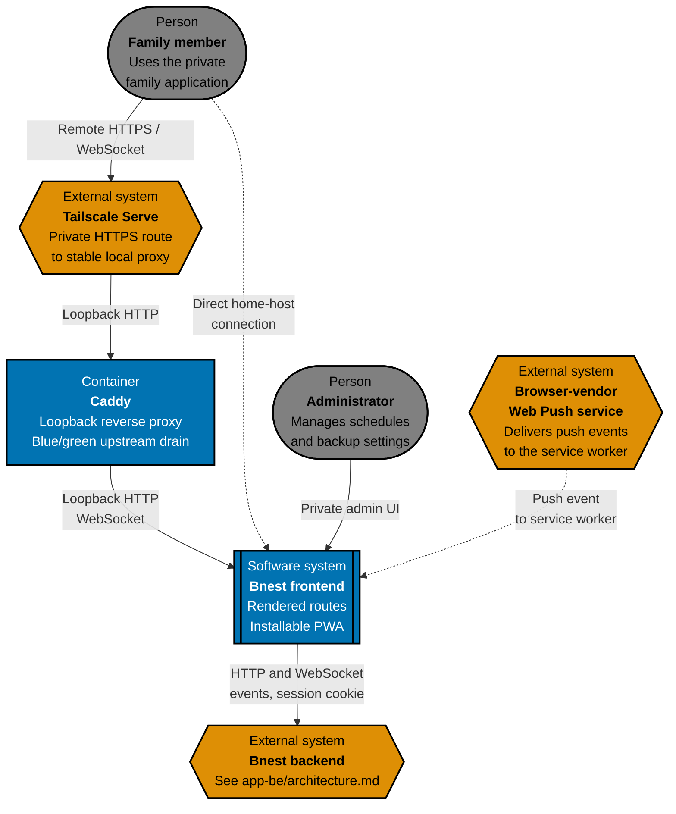
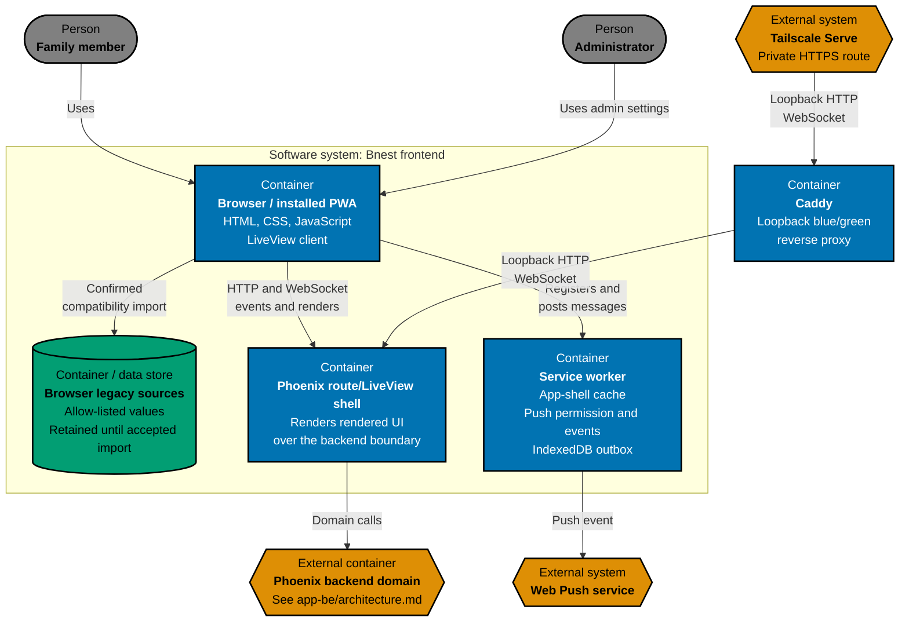
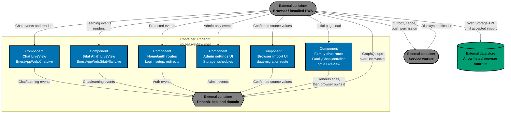

# Bnest Frontend Architecture

This is the canonical as-built C4 model for Bnest's frontend surface: routes and rendered UI, the installable PWA,
browser-owned compatibility storage, and responsive/accessible presentation. Maintain it under the repository
[architecture specification standard](../../../../repo-governance/development/architecture-specifications.md). The
backend surface is documented separately at [`app-be/architecture.md`](../app-be/architecture.md); both surfaces are
delivered by the one running `bnest-app` process and are aggregated by [`specs/apps/bnest/README.md`](../README.md).

## System Context

The frontend surface is the one place family members and administrators interact with Bnest: every rendered route,
LiveView, and browser asset. It renders through the same Phoenix process that hosts [`app-be`](../app-be/architecture.md);
the split here is by observable contract, not by a second deployed system. Elixir/Phoenix LiveView was selected so
server-rendered HTML and a persistent WebSocket connection stay authoritative without a separate client-side data
store. Caddy promotes a healthy blue or green Phoenix release with a bounded WebSocket drain; compatible LiveView
clients reconnect without a manual refresh. The compatibility revision adds a family chat room route that is
GraphQL-driven rather than LiveView-driven (see [Component View](#component-view)), and a service-worker push
subscription that, once granted, receives notifications directly from the browser vendor's Web Push service —
a delivery path that never crosses Tailscale Serve or Caddy. Both are implemented and tested behind the
`BNEST_FAMILY_CHAT_ENABLED` flag, which still defaults to off in this revision.

## Container View

The route/LiveView shell runs inside the same Phoenix OTP application as the backend domain; it is drawn as its own
container here because it is this surface's canonical observable boundary, not because it is a separately deployed
process. Phoenix binds to blue/green loopback endpoints; Caddy owns the stable loopback route and Tailscale Serve
forwards only to Caddy. The service worker (`service-worker.js` and `assets/js/family_chat/*`) is a distinct
browser-owned container: it keeps the offline app-shell cache, holds the bounded per-room IndexedDB send outbox with
backoff/seven-day-expiry, and owns the push-permission prompt and incoming `push` event handling, independent of
whether the family chat route is currently open.

## Component View

The family chat route renders only the initial page shell (room list/composer scaffold); once loaded, the browser
drives every subsequent read, send, and live update itself over GraphQL directly against
[`app-be`](../app-be/architecture.md)'s schema and `UserSocket`, bypassing the LiveView event pattern the other
routes use. The service worker is drawn as a second external container here (not a `routes` component) because it
runs independently of any open route: it can display a push notification, extend the offline app-shell cache, or
retry a queued outbox entry while no family chat tab is open.

## Architectural Constraints

- Chat runners default to read-only, retain approval policy `never` and disabled network and web search, and accept
  only server-derived `read-only` or `workspace-write`. Only an account containing `admin` without `children` can
  explicitly enable writes; any `children` role wins, parent-only accounts remain read-only, and reconnect or clear
  resets read-only.
- The chat runner forwards only public reasoning summaries and generic activity status with stable item IDs; raw
  private reasoning and tool input remain outside the transcript. Chat retains these progress entries beside the
  final assistant answer across reconnects.
- Committed transcript, learning progress, and theme are never authoritative in browser storage; they are rendered
  from the backend's SQLite records after accepted import.
- Browser keys are immutable compatibility sources until envelope, normalization, and normal read-back pass; only
  the accepted key is then cleared from the browser.
- A logged-out request to `/` redirects to `/login`, so protected home actions never render without a session.
  One-time `/setup` creates every initial account and permanently closes; `/login` then protects family data. There
  is no public registration or password-recovery flow.
- The root layout links a standalone PWA manifest and Beaver Nest icon sizes for Android, desktop Chromium browsers,
  and Apple home-screen use. The service worker keeps a cached application shell as an offline fallback while
  preferring the live app whenever the home host is reachable, and never caches authenticated data.
- Every Bnest interface uses the Nest workshop visual language defined by the `--bnest-*` tokens in
  [`assets/css/app.css`](../../../../apps/bnest-app/assets/css/app.css); reuse those tokens rather than adding
  page-local colors, fonts, corner treatments, or shadows.
- Current chat continuity combines durable server records with LiveView form auto-recovery: a compatible transport
  reconnect restores the same route, completed or in-progress conversation, and unsent composer draft without
  calling `page.reload()`.
- Family chat never caches authenticated room or message content in the service worker; only the static app shell is
  cached offline. A dropped GraphQL subscription reconnects with capped backoff, catches up through
  `family_chat_messages`, and survives a Caddy blue/green promotion the same way LiveView clients do.
  Session/authentication expiry pauses the connection instead of retrying against an unauthenticated socket, and a
  logout in one tab never affects another tab's independent session.
- The IndexedDB send outbox is bounded per room and expires unsent entries after seven days, resuming delivery on
  reconnect/online transitions; Web Push permission is requested only from an explicit user gesture, never on page
  load, and the browser can revoke it at any time without breaking the room.
- Family chat's message list keeps a scroll anchor on new arrivals and announces new messages through a live region,
  and its layout, like every Bnest surface, is responsive and accessible at the viewports this repository tests.

## Behaviour Traceability

Executable frontend behaviour is specified in [`behaviours/`](behaviours/). `bnest-app`'s unit and local-only
integration adapters, aggregated with [`app-be`](../app-be/architecture.md)'s root, must implement that exact
recursive corpus; `bnest-app-fe-e2e` implements this root's E2E adapter alone.
