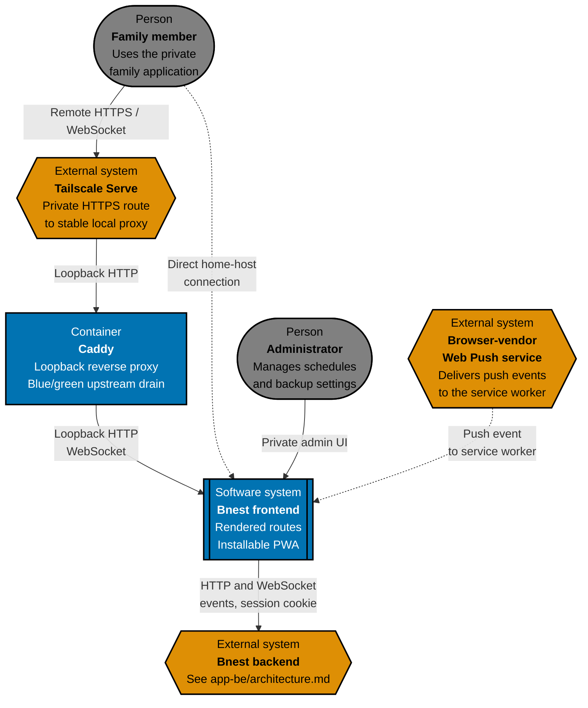
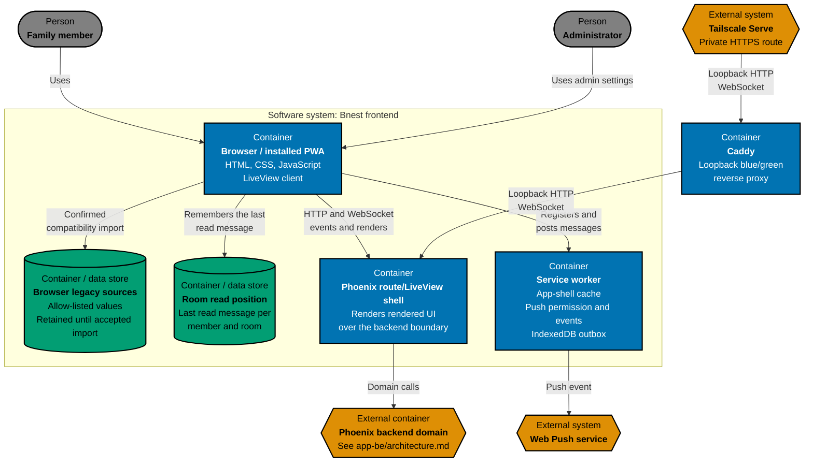

# Bnest Frontend Architecture

This is the canonical as-built C4 model for Bnest's frontend surface: routes and rendered UI, the installable PWA,
browser-owned compatibility storage, and responsive/accessible presentation. Maintain it under the repository
[architecture specification standard](../../../../repo-governance/development/architecture-specifications.md). The
backend surface is documented separately at [`app-be/architecture.md`](../app-be/architecture.md); both surfaces are
delivered by the one running `bnest-app` process and are aggregated by [`specs/apps/bnest/README.md`](../README.md).

## System Context

```mermaid
flowchart TB
    accTitle: System Context
    accDescr: Flowchart with 7 nodes and 7 connections. Nodes: Person Family member Uses the private family application, Person Administrator Manages schedules and backup settings, External system Tailscale Serve Private HTTPS route to stable local proxy, Container Caddy Loopback reverse proxy Blue/green upstream drain, Software system Bnest frontend Rendered routes Installable PWA, External system Bnest backend See app-be/architecture.md, External system Browser-vendor Web Push service Delivers push events to the service worker. Connections: Person Family member Uses the private family application to External system Tailscale Serve Private HTTPS route to stable local proxy (Remote HTTPS / WebSocket), External system Tailscale Serve Private HTTPS route to stable local proxy to Container Caddy Loopback reverse proxy Blue/green upstream drain (Loopback HTTP), Container Caddy Loopback reverse proxy Blue/green upstream drain to Software system Bnest frontend Rendered routes Installable PWA (Loopback HTTP WebSocket), Person Family member Uses the private family application to Software system Bnest frontend Rendered routes Installable PWA (Direct home-host connection), Person Administrator Manages schedules and backup settings to Software system Bnest frontend Rendered routes Installable PWA (Private admin UI), Software system Bnest frontend Rendered routes Installable PWA to External system Bnest backend See app-be/architecture.md (HTTP and WebSocket events, session cookie), External system Browser-vendor Web Push service Delivers push events to the service worker to Software system Bnest frontend Rendered routes Installable PWA (Push event to service worker).
    visitor(["Person<br/><b>Family member</b><br/>Uses the private<br/>family application"])
    admin(["Person<br/><b>Administrator</b><br/>Manages schedules<br/>and backup settings"])
    tailscale{{"External system<br/><b>Tailscale Serve</b><br/>Private HTTPS route<br/>to stable local proxy"}}
    caddy["Container<br/><b>Caddy</b><br/>Loopback reverse proxy<br/>Blue/green upstream drain"]
    frontend[["Software system<br/><b>Bnest frontend</b><br/>Rendered routes<br/>Installable PWA"]]
    backend{{"External system<br/><b>Bnest backend</b><br/>See app-be/architecture.md"}}
    webpush{{"External system<br/><b>Browser-vendor<br/>Web Push service</b><br/>Delivers push events<br/>to the service worker"}}

    visitor -->|Remote HTTPS / WebSocket| tailscale
    tailscale -->|Loopback HTTP| caddy
    caddy -->|Loopback HTTP<br/>WebSocket| frontend
    visitor -.->|Direct home-host<br/>connection| frontend
    admin -->|Private admin UI| frontend
    frontend -->|HTTP and WebSocket<br/>events, session cookie| backend
    webpush -.->|Push event<br/>to service worker| frontend

    classDef person fill:#808080,stroke:#000000,color:#000000,stroke-width:2px
    classDef system fill:#0173B2,stroke:#000000,color:#FFFFFF,stroke-width:2px
    classDef external fill:#DE8F05,stroke:#000000,color:#000000,stroke-width:2px
    class visitor,admin person
    class frontend system
    class tailscale,backend,webpush external
    class caddy system
    classDef default fill:#FFFFFF,stroke:#000000,color:#000000
```

The frontend surface is the one place family members and administrators interact with Bnest: every rendered route,
LiveView, and browser asset. It renders through the same Phoenix process that hosts [`app-be`](../app-be/architecture.md);
the split here is by observable contract, not by a second deployed system. Elixir/Phoenix LiveView was selected so
server-rendered HTML and a persistent WebSocket connection stay authoritative without a separate client-side data
store. Caddy promotes a healthy blue or green Phoenix release with a bounded WebSocket drain; compatible LiveView
clients reconnect without a manual refresh. The compatibility revision adds a family chat room route that is
GraphQL-driven rather than LiveView-driven (see [Component View](#component-view)), and a service-worker push
subscription that, once granted, receives notifications directly from the browser vendor's Web Push service —
a delivery path that never crosses Tailscale Serve or Caddy. Both are implemented and tested behind the
`BNEST_FAMILY_CHAT_ENABLED` flag, which still defaults to off in this revision.

## Container View

```mermaid
flowchart TB
    accTitle: Container View
    accDescr: Flowchart with 11 nodes and 10 connections. Nodes: Person Family member, Person Administrator, External system Tailscale Serve Private HTTPS route, Container Caddy Loopback blue/green reverse proxy, External container Phoenix backend domain See app-be/architecture.md, External system Web Push service, Container Browser / installed PWA HTML, CSS, JavaScript LiveView client, Container / data store Browser legacy sources Allow-listed values Retained until accepted import, Container / data store Room read position Last read message per member and room, Container Phoenix route/LiveView shell Renders rendered UI over the backend boundary, Container Service worker App-shell cache Push permission and events IndexedDB outbox. Connections: Container Browser / installed PWA HTML, CSS, JavaScript LiveView client to Container Phoenix route/LiveView shell Renders rendered UI over the backend boundary (HTTP and WebSocket events and renders), Container Browser / installed PWA HTML, CSS, JavaScript LiveView client to Container / data store Browser legacy sources Allow-listed values Retained until accepted import (Confirmed compatibility import), Container Browser / installed PWA HTML, CSS, JavaScript LiveView client to Container / data store Room read position Last read message per member and room (Remembers the last read message), Container Browser / installed PWA HTML, CSS, JavaScript LiveView client to Container Service worker App-shell cache Push permission and events IndexedDB outbox (Registers and posts messages), Person Family member to Container Browser / installed PWA HTML, CSS, JavaScript LiveView client (Uses), Person Administrator to Container Browser / installed PWA HTML, CSS, JavaScript LiveView client (Uses admin settings), External system Tailscale Serve Private HTTPS route to Container Caddy Loopback blue/green reverse proxy (Loopback HTTP WebSocket), Container Caddy Loopback blue/green reverse proxy to Container Phoenix route/LiveView shell Renders rendered UI over the backend boundary (Loopback HTTP WebSocket), Container Phoenix route/LiveView shell Renders rendered UI over the backend boundary to External container Phoenix backend domain See app-be/architecture.md (Domain calls), Container Service worker App-shell cache Push permission and events IndexedDB outbox to External system Web Push service (Push event).
    visitor(["Person<br/><b>Family member</b>"])
    admin(["Person<br/><b>Administrator</b>"])
    tailscale{{"External system<br/><b>Tailscale Serve</b><br/>Private HTTPS route"}}
    caddy["Container<br/><b>Caddy</b><br/>Loopback blue/green<br/>reverse proxy"]
    backend{{"External container<br/><b>Phoenix backend domain</b><br/>See app-be/architecture.md"}}
    webpush{{"External system<br/><b>Web Push service</b>"}}

    subgraph frontend["Software system: Bnest frontend"]
        direction TB
        browser["Container<br/><b>Browser / installed PWA</b><br/>HTML, CSS, JavaScript<br/>LiveView client"]
        legacy[("Container / data store<br/><b>Browser legacy sources</b><br/>Allow-listed values<br/>Retained until accepted import")]
        readmarker[("Container / data store<br/><b>Room read position</b><br/>Last read message per<br/>member and room")]
        routes["Container<br/><b>Phoenix route/LiveView shell</b><br/>Renders rendered UI<br/>over the backend boundary"]
        worker["Container<br/><b>Service worker</b><br/>App-shell cache<br/>Push permission and events<br/>IndexedDB outbox"]

        browser -->|HTTP and WebSocket<br/>events and renders| routes
        browser -->|Confirmed<br/>compatibility import| legacy
        browser -->|Remembers the last<br/>read message| readmarker
        browser -->|Registers and<br/>posts messages| worker
    end

    visitor -->|Uses| browser
    admin -->|Uses admin settings| browser
    tailscale -->|Loopback HTTP<br/>WebSocket| caddy
    caddy -->|Loopback HTTP<br/>WebSocket| routes
    routes -->|Domain calls| backend
    worker -->|Push event| webpush

    classDef person fill:#808080,stroke:#000000,color:#000000,stroke-width:2px
    classDef container fill:#0173B2,stroke:#000000,color:#FFFFFF,stroke-width:2px
    classDef data fill:#029E73,stroke:#000000,color:#000000,stroke-width:2px
    classDef external fill:#DE8F05,stroke:#000000,color:#000000,stroke-width:2px
    class visitor,admin person
    class browser,routes,worker container
    class legacy,readmarker data
    class tailscale,backend,webpush external
    class caddy container
    classDef default fill:#FFFFFF,stroke:#000000,color:#000000
```

The route/LiveView shell runs inside the same Phoenix OTP application as the backend domain; it is drawn as its own
container here because it is this surface's canonical observable boundary, not because it is a separately deployed
process. Phoenix binds to blue/green loopback endpoints; Caddy owns the stable loopback route and Tailscale Serve
forwards only to Caddy. The service worker (`service-worker.js` and `assets/js/family_chat/*`) is a distinct
browser-owned container: it keeps the offline app-shell cache, holds the bounded per-room IndexedDB send outbox with
backoff/seven-day-expiry, and owns the push-permission prompt and incoming `push` event handling, independent of
whether the family chat route is currently open. The room read position is a separate, page-owned browser data
store (Web Storage, one entry per member and room) holding only the id of the newest message that member has
reached the bottom of; the room reads it when it opens to decide where to place the visitor, and no server record
mirrors it.

## Component View

```mermaid
flowchart TB
    accTitle: Component View
    accDescr: Flowchart with 10 nodes and 16 connections. Nodes: External container Browser / installed PWA, External container Service worker, External data store Allow-listed browser sources, External container Phoenix backend domain, Component Chat LiveView BnestAppWeb.ChatLive, Component Sifat Allah LiveView BnestAppWeb.SifatAllahLive, Component Home/auth routes Login, setup, redirects, Component Admin settings UI Storage, schedules, Component Browser import UI data-migration route, Component Family chat route FamilyChatController, not a LiveView. Connections: Component Chat LiveView BnestAppWeb.ChatLive to External container Phoenix backend domain (Chat/learning events), Component Sifat Allah LiveView BnestAppWeb.SifatAllahLive to External container Phoenix backend domain (Chat/learning events), Component Home/auth routes Login, setup, redirects to External container Phoenix backend domain (Auth events), Component Admin settings UI Storage, schedules to External container Phoenix backend domain (Admin events), Component Browser import UI data-migration route to External container Phoenix backend domain (Confirmed source values), Component Family chat route FamilyChatController, not a LiveView to External container Phoenix backend domain (Renders shell, then browser owns it), External container Browser / installed PWA to Component Chat LiveView BnestAppWeb.ChatLive (Chat events and renders), External container Browser / installed PWA to Component Sifat Allah LiveView BnestAppWeb.SifatAllahLive (Learning events renders), External container Browser / installed PWA to Component Home/auth routes Login, setup, redirects (Protected events), External container Browser / installed PWA to Component Admin settings UI Storage, schedules (Admin-only events), External container Browser / installed PWA to Component Browser import UI data-migration route (Confirmed source values), External container Browser / installed PWA to External data store Allow-listed browser sources (Web Storage API until accepted import), and 4 more.
    browser(["External container<br/><b>Browser / installed PWA</b>"])
    worker(["External container<br/><b>Service worker</b>"])
    legacy[("External data store<br/><b>Allow-listed browser sources</b>")]
    backend{{"External container<br/><b>Phoenix backend domain</b>"}}

    subgraph routes["Container: Phoenix<br/>route/LiveView shell"]
        direction LR
        chat_live["Component<br/><b>Chat LiveView</b><br/>BnestAppWeb.ChatLive"]
        sifat_live["Component<br/><b>Sifat Allah LiveView</b><br/>BnestAppWeb.SifatAllahLive"]
        home["Component<br/><b>Home/auth routes</b><br/>Login, setup, redirects"]
        admin_ui["Component<br/><b>Admin settings UI</b><br/>Storage, schedules"]
        importer["Component<br/><b>Browser import UI</b><br/>data-migration route"]
        family_chat["Component<br/><b>Family chat route</b><br/>FamilyChatController,<br/>not a LiveView"]

        chat_live -->|Chat/learning events| backend
        sifat_live -->|Chat/learning events| backend
        home -->|Auth events| backend
        admin_ui -->|Admin events| backend
        importer -->|Confirmed source values| backend
        family_chat -->|Renders shell,<br/>then browser owns it| backend
    end

    browser -->|Chat events and renders| chat_live
    browser -->|Learning events<br/>renders| sifat_live
    browser -->|Protected events| home
    browser -->|Admin-only events| admin_ui
    browser -->|Confirmed source values| importer
    browser -->|Web Storage API<br/>until accepted import| legacy
    browser -->|Initial page load| family_chat
    browser -->|GraphQL ops<br/>over UserSocket| backend
    browser <-->|Outbox, cache,<br/>push permission| worker
    worker -->|Displays notification| browser

    classDef external fill:#808080,stroke:#000000,color:#000000,stroke-width:2px
    classDef component fill:#0173B2,stroke:#000000,color:#FFFFFF,stroke-width:2px
    classDef data fill:#029E73,stroke:#000000,color:#000000,stroke-width:2px
    class browser,worker external
    class chat_live,sifat_live,home,admin_ui,importer,family_chat component
    class legacy data
    class backend external
    classDef default fill:#FFFFFF,stroke:#000000,color:#000000
```

The family chat route renders only the initial page shell (room list/composer scaffold); once loaded, the browser
decides for itself where in the conversation to place the visitor — reading its own stored room read position and
paging around it — and drives every subsequent read, send, and live update over GraphQL directly against
[`app-be`](../app-be/architecture.md)'s schema and `UserSocket`, bypassing the LiveView event pattern the other
routes use. That browser-owned module set under `assets/js/family_chat/*` includes the per-message action menu, the
reply-target state the composer and outbox share, and the bounded jump that walks older pages to reach a quoted
message; the route's shell also passes the browser a reply-enabled flag, which gates the requested GraphQL fields,
the menu, and the composer strip together. The service worker is drawn as a second external container here (not a
`routes` component) because it runs independently of any open route: it can display a push notification, extend the
offline app-shell cache, or retry a queued outbox entry while no family chat tab is open.

The Admin settings UI component includes the Schedules page's integrity label, drawn inside it rather than as a
component of its own. On the connected mount, and again after every successful schedule or backup-folder save, the
LiveView starts one check that runs off the render path: it asks the backend for the ledger's verified runs and reconciles
them against the configured backup folder inside a task the check owns, and a ceiling (five seconds by default) cancels
that task and turns the label into its could-not-be-checked state, so the page and both forms never wait on it. The first,
disconnected render shows the checking state and reads neither the ledger nor the folder. The label prints the structured
result through the one wording function the backend serves to its log, telemetry and Mix task, so the page formats no
word or date of its own.

## Architectural Constraints

- Chat runners default to read-only, retain approval policy `never` and disabled network and web search, and accept
  only server-derived `read-only` or `workspace-write`. Only an account containing `admin` without `children` can
  explicitly enable writes; any `children` role wins, parent-only accounts remain read-only, and reconnect or clear
  resets read-only.
- The chat runner forwards only public reasoning summaries and generic activity status with stable item IDs; raw
  private reasoning and tool input remain outside the transcript. Chat retains these progress entries beside the
  final assistant answer across reconnects.
- Committed transcript, learning progress, and theme are never authoritative in browser storage; they are rendered
  from the backend's SQLite records after accepted import.
- Browser keys are immutable compatibility sources until envelope, normalization, and normal read-back pass; only
  the accepted key is then cleared from the browser.
- A logged-out request to `/` redirects to `/login`, so protected home actions never render without a session.
  One-time `/setup` creates every initial account and permanently closes; `/login` then protects family data. There
  is no public registration or password-recovery flow.
- The root layout links a standalone PWA manifest and Beaver Nest icon sizes for Android, desktop Chromium browsers,
  and Apple home-screen use. The service worker keeps a cached application shell as an offline fallback while
  preferring the live app whenever the home host is reachable, and never caches authenticated data.
- Every Bnest interface uses the Nest workshop visual language defined by the `--bnest-*` tokens in
  [`assets/css/app.css`](../../../../apps/bnest-app/assets/css/app.css); reuse those tokens rather than adding
  page-local colors, fonts, corner treatments, or shadows.
- Current chat continuity combines durable server records with LiveView form auto-recovery: a compatible transport
  reconnect restores the same route, completed or in-progress conversation, and unsent composer draft without
  calling `page.reload()`.
- Family chat never caches authenticated room or message content in the service worker; only the static app shell is
  cached offline. A dropped GraphQL subscription reconnects with capped backoff, catches up through
  `family_chat_messages`, and survives a Caddy blue/green promotion the same way LiveView clients do.
  Session/authentication expiry pauses the connection instead of retrying against an unauthenticated socket, and a
  logout in one tab never affects another tab's independent session.
- A reply's quote is always derived from the referenced message at read time and is never cached in the browser or
  the service worker. It is part of the message payload the room already fetches, not a second thing to store, so
  the no-authenticated-caching rule above applies to it unchanged.
- Family chat's message history exposes exactly one tab stop: a roving `tabindex` keeps one message focusable at a
  time, the arrow keys move between messages and move that stop with them, and Tab enters and leaves the history
  once regardless of how many messages are loaded.
- The IndexedDB send outbox is bounded per room and expires unsent entries after seven days, resuming delivery on
  reconnect/online transitions; Web Push permission is requested only from an explicit user gesture, never on page
  load, and the browser can revoke it at any time without breaking the room.
- Family chat's message list keeps a scroll anchor on new arrivals and announces new messages through a live region,
  and its layout, like every Bnest surface, is responsive and accessible at the viewports this repository tests.
- A family chat room opens at the reading position that member's device last reached, never at the oldest loaded
  message: it loads the messages committed after that position, one bounded page of earlier context above them, and
  marks the boundary between the two. A member with nothing unread, or no stored position, opens at the newest
  message instead. The stored position is browser-local convenience state, never authoritative and never synced
  between devices; losing it degrades only to opening at the newest message.
- The composer keeps keyboard focus across a send, so a member can keep typing without reopening the on-screen
  keyboard; `Enter` sends and `Shift`+`Enter` continues the same message.
- Sending brings the sender to their own message. A member writing from an older reading position is returned to the
  end of the loaded window, where their message appears; the new-messages indicator stays up only while the window
  still stops short of the newest committed message.
- The message history, not the document, is the room's scrolling region at every tested viewport. Every position the
  room chooses — the resumed reading position, the newest message, following a live arrival — is expressed as a
  scroll offset inside that one container, so a layout that let the page scroll instead would silently disable all
  of them.
- The Schedules page integrity label is read-only and stores nothing: it writes no file, table, flat file or cache, adds
  no route and no authorization path (the existing admin-only guard runs before the check starts), and shows no
  filesystem path, digest, destination identifier or run ID. It never delays the page, announces the change from
  checking to a result politely without moving focus, conveys every state by words and a marker as well as colour, and
  wraps its problem lines at every supported width without horizontal scrolling.

## Behaviour Traceability

Executable frontend behaviour is specified in [`behaviours/`](behaviours/). `bnest-app`'s unit and local-only
integration adapters, aggregated with [`app-be`](../app-be/architecture.md)'s root, must implement that exact
recursive corpus; `bnest-app-fe-e2e` implements this root's E2E adapter alone.

The Schedules page integrity label is specified by the backup-integrity scenarios of
[`scheduled_backups.feature`](behaviours/scheduled_backups.feature): the all-present, missing-or-changed,
could-not-be-checked and nothing-to-check states, the check after a save, the read-only, path-free and time-boxed
properties, the non-administrator denial, and the width and keyboard scenarios. The scenarios that need a forced
failure, a controlled store that outlasts the ceiling, an empty ledger, a filesystem comparison or a server-side process observation carry
`@e2e-exempt` with their integration alternative; the rest run in the browser at every supported viewport.
