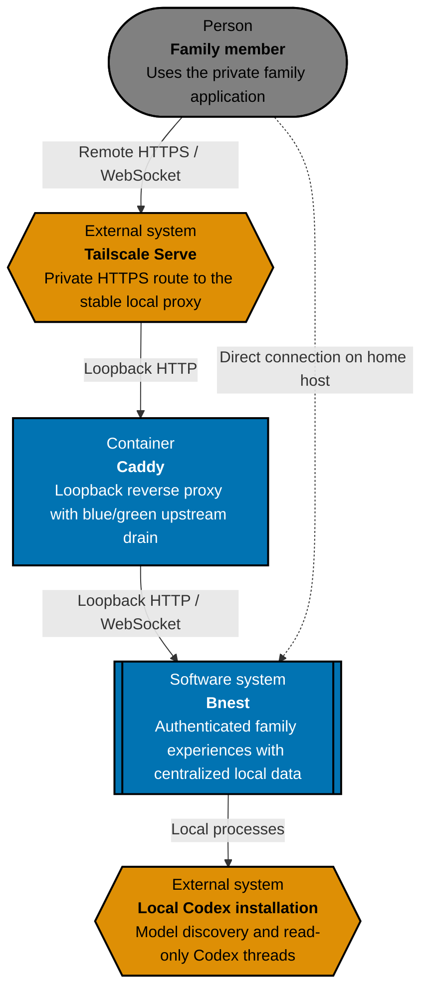
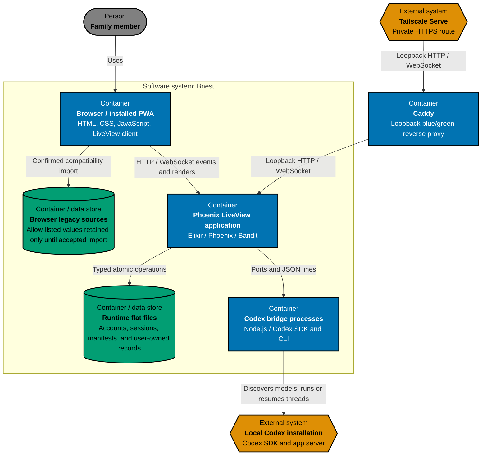
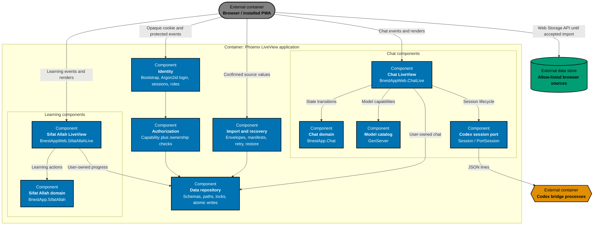

# Bnest Architecture

This is the canonical as-built C4 model for Bnest. Maintain it under the repository [architecture specification standard](../../../../repo-governance/development/architecture-specifications.md).

## System Context

Bnest is a 24/7 family service, private to the local host and family devices routed through Tailscale Serve and a stable loopback Caddy proxy. Caddy promotes a healthy blue or green Phoenix release with a bounded WebSocket drain; compatible LiveView clients reconnect without a manual refresh. Elixir/OTP and Phoenix were selected for supervision, process isolation, and concurrent long-lived LiveView sessions. Approved users authenticate before protected access. Bnest keeps user-owned state in a server-managed flat-file runtime root; it has no public registration, cloud database, or uploads.

## Container View

The Phoenix server, runtime repository, and Node bridges run on the home host. Caddy is a separate loopback container between Tailscale and blue/green Phoenix releases. OTP supervision recovers failed child processes inside one running application; replacement starts and proves the alternate release before Caddy promotes it. Production resolves `data/prod/` once before supervision; filesystem tests use one marked mirror below `data/test/runs/`.

## Component View

## Architectural Constraints

- Phoenix binds to blue/green loopback endpoints; Caddy owns the stable loopback route and Tailscale Serve forwards only to Caddy.
- Chat runners use read-only sandbox access, approval policy `never`, and disabled network and web search.
- Every protected route and data operation resolves an unrevoked opaque-cookie session and current user before repository access.
- Roles may contain `children`, `parents`, and `admin`; capabilities still default-deny cross-user access.
- Durable chat, Sifat Allah progress, and explicit theme state live only below the authenticated user's runtime path after accepted import.
- Browser keys are immutable compatibility sources until envelope, normalization, and normal read-back pass; only the accepted key is then cleared.
- Mutable records use revision checks, one path lock coordinated across connected local BEAM release nodes, atomic replacement, and read-back. Sessions have no time expiry and remain independent per browser.
- Test adapters use only synthetic `test-user-` identities and marked mirrored runtime roots; production structural audit is read-only.

## Behaviour Traceability

Executable behavior is specified in [`behaviours/`](behaviours/). Unit, local-only integration, and browser E2E adapters must implement that exact recursive corpus.
