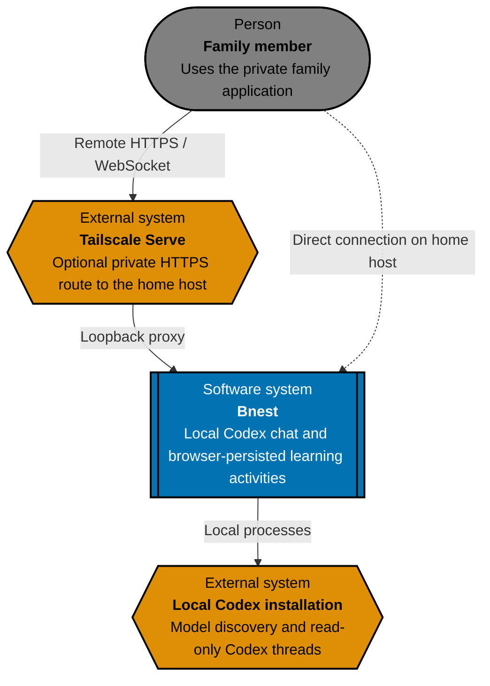
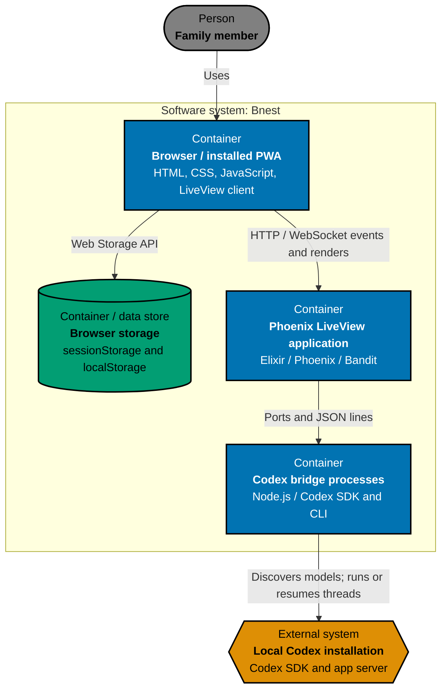
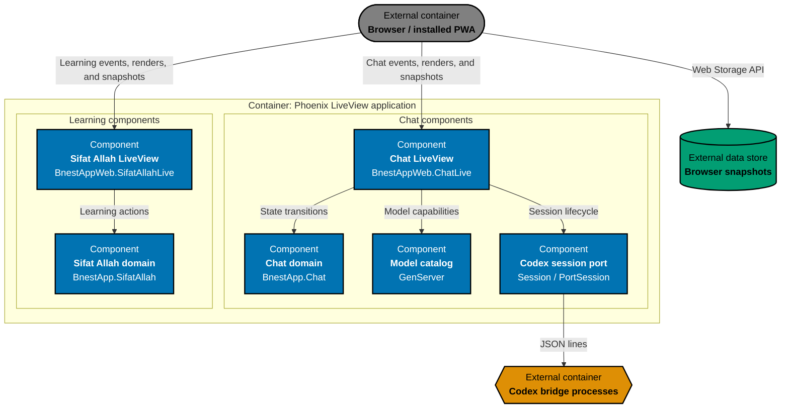

# Bnest Architecture

This is the canonical as-built C4 model for Bnest. Maintain it under the repository [architecture specification standard](../../../../repo-governance/development/architecture-specifications.md).

## System Context

Bnest is private to the local host and family devices routed through the independently managed Tailscale proxy. It has no application database, authentication, uploads, or server-side user-data store.

## Container View

The Phoenix server and Node bridges run on the home host. Tailscale Serve may proxy the browser connection but has an independent lifecycle. Each connected chat LiveView owns one bridge process; a supervised catalog performs model discovery at application startup.

## Component View

## Architectural Constraints

- Phoenix binds to the local endpoint lifecycle; Tailscale Serve is optional and managed independently.
- Chat runners use read-only sandbox access, approval policy `never`, and disabled network and web search.
- Completed chat state stays in the current browser tab's `sessionStorage`; Sifat Allah progress stays in browser `localStorage`.
- The application owns no database, authentication, cross-device history, uploads, or server-side user-data persistence.
- Test adapters replace live Codex discovery and chat sessions with deterministic local fixtures.

## Behaviour Traceability

Executable behavior is specified in [`behaviours/`](behaviours/). Unit, local-only integration, and browser E2E adapters must implement that exact recursive corpus.
