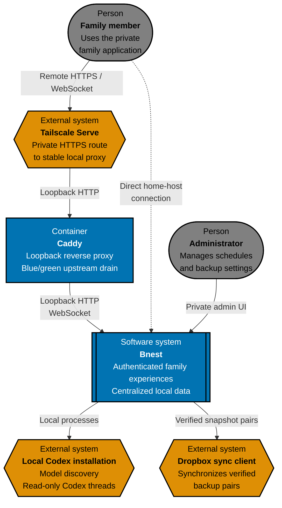
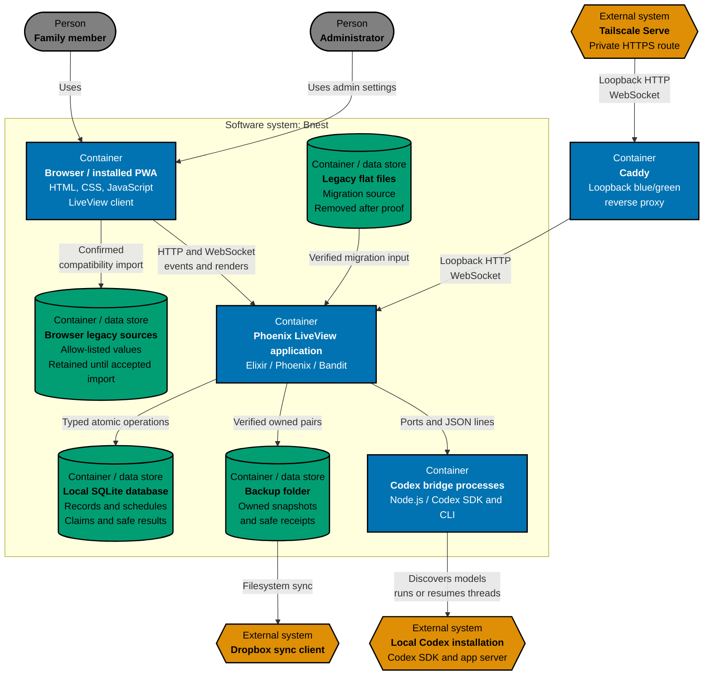
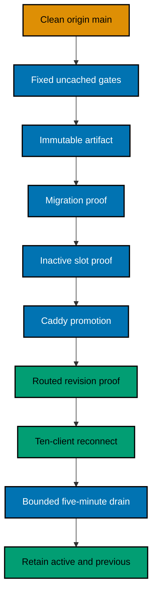
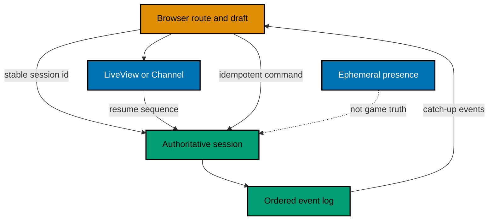
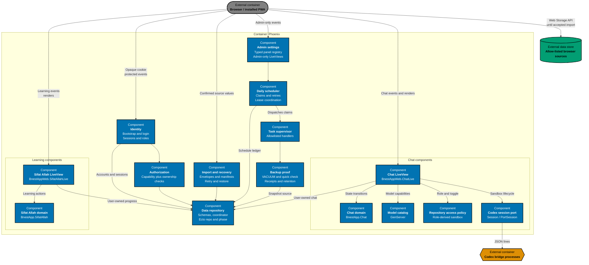

# Bnest Architecture

This is the canonical as-built C4 model for Bnest. Maintain it under the repository [architecture specification standard](../../../../repo-governance/development/architecture-specifications.md).

## System Context

Bnest is a 24/7 family service, private to the local host and family devices routed through Tailscale Serve and a stable loopback Caddy proxy. Caddy promotes a healthy blue or green Phoenix release with a bounded WebSocket drain; compatible LiveView clients reconnect without a manual refresh. Elixir/OTP and Phoenix were selected for supervision, process isolation, and concurrent long-lived LiveView sessions. Approved users authenticate before protected access, and only administrators reach schedule or backup configuration. Bnest keeps user-owned state and durable schedule claims in a server-managed local SQLite database; verified legacy flat files are retired after cutover instead of remaining as an unbounded rollback copy. It publishes independently verified snapshot pairs to an ignored folder observed by Dropbox, but the sync client is neither authoritative storage nor complete disaster recovery. It has no public registration, cloud database, or uploads.

## Container View

The Phoenix server, SQLite storage, temporary flat-file migration source, backup folder, and Node bridges run on the home host. Caddy is a separate loopback container between Tailscale and blue/green Phoenix releases. OTP supervision recovers failed child processes inside one running application; replacement starts and proves the alternate release before Caddy promotes it. The stable storage pointer remains at `~/.config/bnest/storage.json`, while the default production database lives at `~/bnest/data/prod/bnest.sqlite3`. A separate private pointer optionally overrides the exact ignored `data/backup/` default. Verified flat sources under `data/prod/` are removed after routed storage proof. Filesystem test fixtures remain in a marked Dropbox run below `data/test/runs/`, while the paired SQLite database uses the same run identifier below `~/bnest/data/test/runs/`; both roots are cleaned after the run.

## Release and Resumable State

The managed release controller serializes each clean `origin/main` revision through one fail-closed transaction. Production slots own `4000` and `4001`, Caddy owns `4100`, isolated E2E leases `4010`–`4019`, and development leases `4020`–`4029`. Every managed slot enables secure cookies and account identity cutover, so a logged-out root request follows the login boundary instead of receiving a synthetic legacy user. The controller creates no artifact until every fixed gate passes, refuses an undeclared migration adapter, and leaves the proven route active when only final cleanup needs retrying. A private release-overlap monitor follows the logged-out root-to-login journey while sampling local Caddy health and the exact routed user surface from preflight through drain; schema-v4 evidence rejects any routed failure, p95 latency above 500 ms, or individual sample above 2 seconds without persisting the private origin.

Current chat continuity combines durable server records with LiveView form auto-recovery: a compatible transport reconnect restores the same route, completed or in-progress conversation, Codex session identity, and unsent composer draft without calling `page.reload()`. An in-progress restored turn retains its pending continuation while policy-driven model normalization remains valid; it is never treated as a user model-selection event. Future multiplayer must use the executable continuity contract below; the contract exists now as a tested release fixture, but no multiplayer product is implemented.

## Component View

## Architectural Constraints

- Phoenix binds to blue/green loopback endpoints; Caddy owns the stable loopback route and Tailscale Serve forwards only to Caddy.
- Chat runners default to read-only, retain approval policy `never` and disabled network and web search, and accept only server-derived `read-only` or `workspace-write`. Only an account containing `admin` without `children` can explicitly enable writes; any `children` role wins, parent-only accounts remain read-only, and reconnect or clear resets read-only.
- The chat runner forwards only public reasoning summaries and generic activity status with stable item IDs; raw private reasoning and tool input remain outside the transcript. Chat retains these progress entries beside the final assistant answer across reconnects.
- Every protected route and data operation resolves an unrevoked opaque-cookie session and current user before repository access.
- Bootstrap, username indexes, accounts, and browser sessions use the phase-aware repository; SQLite authority never reads a retired flat identity source.
- Roles may contain `children`, `parents`, and `admin`; capabilities still default-deny cross-user access.
- Codex model access is role-scoped server-side: admins receive the discovered catalog, parents use Terra at medium effort, and children use Luna at medium effort. A missing required model disables that role's chat instead of substituting another model.
- Durable chat, Sifat Allah progress, and explicit theme state live in the authenticated user's SQLite records after accepted import.
- Daily definitions, unique claims, retry state, leases, occurrence expiry, and safe results live in SQLite. One generic coordinator dispatches code-allowlisted handlers from both schedule contexts and never trusts executable names from stored data.
- The production SQLite backup schedule never expires. It verifies a `VACUUM INTO` snapshot through an independent read-only connection, checks the attempt fence before atomic publication, and retains only owned receipt-backed pairs for the latest seven WIB dates.
- Only the exact Git-ignored `data/backup/` path may be used inside the repository. External overrides reject symbolic links, live-source/config overlap, and unsafe repository paths; no route downloads or exposes backup paths or payloads.
- Browser keys are immutable compatibility sources until envelope, normalization, and normal read-back pass; only the accepted key is then cleared.
- Mutable records use revision checks, one path lock coordinated across connected local BEAM release nodes, atomic replacement, and read-back. Sessions have no time expiry and remain independent per browser.
- Test adapters use only synthetic `test-user-` identities and paired marked flat-file and SQLite run roots; production structural audit is read-only.
- Routine releases are clean-revision transactions owning release and resource locks, with fixed uncached gates, capacity and port admission, immutable artifact and migration manifests, revision proofs, rollback, bounded drain, and two-artifact retention. Pre-mutation admission requires normal exported memory pressure, at least 9 GiB available non-compressed estimate, compressor availability, and interval CPU headroom for four release plus two safety units. Final overlap proof requires normal pressure, compressor availability, at least 2 GiB estimated availability, two p95 CPU units, zero local or routed health failures, routed p95 at or below 500 ms, and every routed sample at or below 2 seconds; swap-in or swap-out is pressure only below 4 GiB. Compressor payload remains evidence rather than a fullness ratio. Repository-owned development uses the same collector, a private heavy-work lease, bounded warning/critical shedding, and never signals production, Caddy, or unrelated processes.
- A future multiplayer connection resumes authoritative versioned state by stable session identity, catches up ordered events after its acknowledged sequence, and retries commands by idempotency identity. Server time orders durable actions; presence remains ephemeral.

## Behaviour Traceability

Executable behavior is specified in [`behaviours/`](behaviours/). Unit, local-only integration, and browser E2E adapters must implement that exact recursive corpus.
